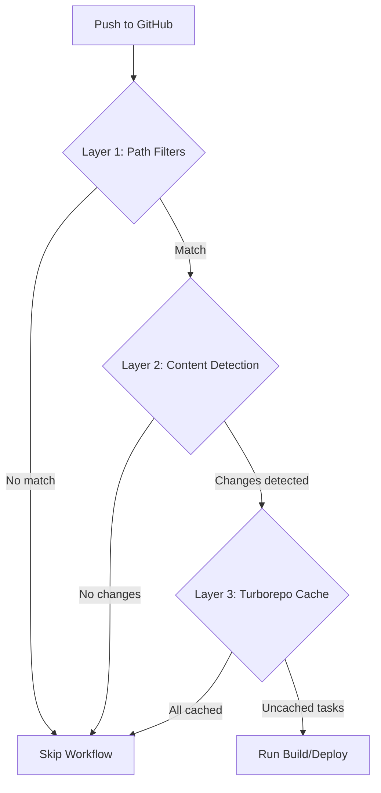

<Info>
  **Prerequisite**: Read the [CI/CD Pipelines](/build/development-tools/ci-cd-pipelines) page to understand the basic workflow structure.
</Info>

## Overview

Our CI/CD pipelines implement a sophisticated **three-layer optimization strategy** to minimize unnecessary builds, tests, and deployments. This approach reduces GitHub Actions minutes consumption by 60-80% while maintaining safety and reliability.

This document details the optimization techniques, implementation patterns, and troubleshooting approaches used across all workflows.

## The Problem

Before optimization, our workflows ran on every push regardless of:
- Whether relevant files actually changed
- Whether the code already passed identical tests
- Whether build artifacts were already cached
- Whether deployment content was different

This resulted in:
- **Wasted CI time**: ~48 hours/month of unnecessary runs
- **Slower feedback**: Developers waiting for redundant builds
- **Higher costs**: Unnecessary GitHub Actions minutes consumption
- **Queue congestion**: Important builds waiting behind unnecessary ones

## Optimization Strategy

### Three-Layer Detection

Our optimization uses a layered approach where each layer provides increasing accuracy at increasing cost:



#### Layer 1: GitHub Path Filters (0s overhead)

GitHub's native path filtering triggers workflows only when specific files change:

```yaml
on:
  push:
    paths:
      - 'apps/web/**'
      - 'packages/**'
      - '.github/workflows/vercel-production-platform.yaml'
```

**Benefits:**
- Zero overhead (GitHub checks this before starting the workflow)
- Prevents workflow from even starting for unrelated changes
- Reduces queue congestion

**Applied to:** All 20 workflows

#### Layer 2: Quick Content Detection (~3-5s overhead)

Git diff analysis to detect meaningful changes:

```yaml
- name: Quick content change detection
  id: quick_check
  run: |
    # Safe base commit (handles initial commits and shallow clones)
    BASE_COMMIT=$(git rev-parse --verify HEAD~ 2>/dev/null || echo "$GITHUB_SHA")

    # Check for relevant file changes
    git diff --name-only "$BASE_COMMIT" HEAD | grep -E 'apps/web/|packages/' > "$RUNNER_TEMP/changed_files.txt" || true

    if [ ! -s "$RUNNER_TEMP/changed_files.txt" ]; then
      echo "No relevant content changes detected. Skipping build."
      echo "skip_quick=true" >> $GITHUB_OUTPUT
    else
      echo "Content changes detected in $(wc -l < "$RUNNER_TEMP/changed_files.txt") files."
      echo "skip_quick=false" >> $GITHUB_OUTPUT
    fi
```

**Key Features:**
- **Safe BASE_COMMIT**: Handles edge cases (initial commits, shallow clones)
- **App-specific filtering**: Each workflow checks its own app directory
- **Fast execution**: Typically completes in 3-5 seconds

**Benefits:**
- Catches scenarios where path filters matched but content didn't actually change
- Skips workflow-only changes (updating the workflow file itself)
- Minimal overhead for maximum value

**Applied to:** All 20 workflows

#### Layer 3: Turborepo Cache Validation (~20-30s overhead)

Semantic content analysis using Turborepo's content-based hashing:

```yaml
- name: Check Turborepo cache
  id: turbo_check
  if: steps.quick_check.outputs.skip_quick != 'true'
  run: |
    # Run Turborepo dry-run to check cache status
    bunx turbo build --filter=@tuturuuu/web --dry-run=json > "$RUNNER_TEMP/turbo-plan-raw.json" 2>&1 || {
      echo "::warning::Turborepo dry-run failed, proceeding with build for safety"
      echo "skip_turbo=false" >> $GITHUB_OUTPUT
      exit 0
    }

    # Extract JSON from output (handles warnings/headers)
    sed -n '/{/,$ p' "$RUNNER_TEMP/turbo-plan-raw.json" > "$RUNNER_TEMP/turbo-plan.json" 2>/dev/null || {
      echo "::warning::Failed to extract JSON, proceeding with build for safety"
      echo "skip_turbo=false" >> $GITHUB_OUTPUT
      exit 0
    }

    # Validate file exists
    if [ ! -s "$RUNNER_TEMP/turbo-plan.json" ]; then
      echo "::warning::Turborepo plan is empty, proceeding with build for safety"
      echo "skip_turbo=false" >> $GITHUB_OUTPUT
      exit 0
    fi

    # Count uncached tasks
    uncached_count=$(jq -r '.tasks[] | select(.cache.status != "HIT") | .taskId' "$RUNNER_TEMP/turbo-plan.json" 2>/dev/null | wc -l || echo "1")

    if [ "$uncached_count" -eq 0 ]; then
      echo "All tasks cached in Turborepo. Skipping build."
      echo "skip_turbo=true" >> $GITHUB_OUTPUT
    else
      echo "Found $uncached_count uncached tasks. Build required."
      echo "skip_turbo=false" >> $GITHUB_OUTPUT
    fi
  env:
    TURBO_TOKEN: ${{ secrets.TURBO_TOKEN }}
    TURBO_TEAM: ${{ secrets.TURBO_TEAM }}
```

**Key Features:**
- **Content-based hashing**: Detects actual code changes, not just file timestamps
- **Dependency-aware**: Understands transitive dependencies
- **Remote cache**: Leverages Vercel's remote cache across runs
- **Multiple fallbacks**: Defaults to building on any uncertainty

**Benefits:**
- Most accurate cache detection
- Understands semantic changes (not just file changes)
- Tracks dependencies across packages

**Applied to:** All 16 Vercel workflows

### Dependency Caching

All workflows cache dependencies to avoid repeated installations:

```yaml
- name: Cache dependencies
  uses: actions/cache@v4
  with:
    path: |
      ~/.bun/install/cache
      node_modules
    key: ${{ runner.os }}-bun-${{ hashFiles('**/bun.lock') }}
    restore-keys: |
      ${{ runner.os }}-bun-
```

**Benefits:**
- **~60 seconds saved** per run on cache hit
- Consistent dependency versions
- Faster feedback for developers

**Applied to:** All 20 workflows

## Implementation Patterns

### Preview Workflows (Aggressive Optimization)

Preview workflows use aggressive optimization to provide fast feedback:

**Characteristics:**
- Skip on any cache hit
- Use `|| true` for non-critical errors
- Prioritize speed over absolute certainty

**Example:** `vercel-preview-platform.yaml`

```yaml
- name: Quick content change detection
  # Skips if no app/package files changed

- name: Check Turborepo cache
  # Skips if all tasks cached
  # Uses || true for errors (assumes build needed)

- name: Deploy
  if: steps.quick_check.outputs.skip_quick != 'true' && steps.turbo_check.outputs.skip_turbo != 'true'
```

### Production Workflows (Conservative Optimization)

Production workflows use conservative optimization with safety fallbacks:

**Characteristics:**
- Build on any uncertainty
- Explicit error handling with warnings
- Multiple validation layers

**Example:** `vercel-production-platform.yaml`

```yaml
- name: Check Turborepo cache (conservative)
  run: |
    # Multiple safety fallbacks
    bunx turbo ... || {
      echo "::warning::Turborepo dry-run failed, proceeding with build for safety"
      echo "skip_turbo=false" >> $GITHUB_OUTPUT
      exit 0
    }

    # Validate output exists
    if [ ! -s "$RUNNER_TEMP/turbo-plan.json" ]; then
      echo "::warning::Turborepo plan is empty, proceeding with build for safety"
      echo "skip_turbo=false" >> $GITHUB_OUTPUT
      exit 0
    fi

    # Default to building if parsing fails
    uncached_count=$(... || echo "1")
```

### Specialized Workflows

Different workflows have domain-specific optimizations:

#### Supabase Type Generation

Checks for migration-specific changes:

```yaml
- name: Check for migration changes
  run: |
    BASE_COMMIT=$(git rev-parse --verify HEAD~ 2>/dev/null || echo "$GITHUB_SHA")
    changed=$(git diff --name-only "$BASE_COMMIT" HEAD | grep 'apps/database/supabase/migrations/\|packages/types/src/supabase.ts' | wc -l)

    if [ "$changed" -eq 0 ]; then
      echo "No migrations or type changes detected. Skipping type generation check."
      echo "skip_check=true" >> $GITHUB_OUTPUT
    fi
```

**Saves ~2-3 minutes** when no database changes occurred.

#### Biome Code Quality Checks

Skips workflow-only changes:

```yaml
- name: Check for meaningful changes
  run: |
    BASE_COMMIT=$(git rev-parse --verify HEAD~ 2>/dev/null || echo "$GITHUB_SHA")
    changed=$(git diff --name-only "$BASE_COMMIT" HEAD | \
      grep -v '.github/workflows/biome-check.yaml' | \
      grep -E '\.(ts|tsx|js|jsx|json|yaml|yml)$' | wc -l)

    if [ "$changed" -eq 0 ]; then
      echo "No meaningful code changes detected. Skipping format check."
      echo "skip_check=true" >> $GITHUB_OUTPUT
    fi
```

**Prevents false positives** when only updating workflow files.

#### Unit Tests & Coverage

Test-relevant file detection:

```yaml
- name: Check for test-relevant changes
  run: |
    BASE_COMMIT=$(git rev-parse --verify HEAD~ 2>/dev/null || echo "$GITHUB_SHA")
    changed=$(git diff --name-only "$BASE_COMMIT" HEAD | \
      grep -E 'apps/.*/src/|packages/.*/src/|\.test\.(ts|tsx)|package\.json' | wc -l)

    if [ "$changed" -eq 0 ]; then
      echo "No test-relevant changes detected. Skipping tests."
      echo "skip_tests=true" >> $GITHUB_OUTPUT
    fi
```

**Skips tests** for documentation-only changes.

## Edge Case Handling

### Initial Commits

**Problem:** `HEAD~` doesn't exist on the first commit.

**Solution:** Safe BASE_COMMIT computation:

```bash
BASE_COMMIT=$(git rev-parse --verify HEAD~ 2>/dev/null || echo "$GITHUB_SHA")
```

**Behavior:**
- Normal case: Uses `HEAD~` (parent commit)
- Initial commit: Falls back to `$GITHUB_SHA` (current commit)
- Result: git diff shows no changes → triggers full build (safe!)

### Shallow Clones

**Problem:** `fetch-depth: 2` might not include parent commit.

**Solution:** Same fallback mechanism handles this gracefully.

**Behavior:**
- If `HEAD~` unavailable: Uses `$GITHUB_SHA`
- Triggers full build (conservative approach)

### Turborepo Warnings

**Problem:** Turborepo outputs warnings before JSON, breaking jq parsing.

**Solution:** JSON extraction before parsing:

```bash
# Extract JSON (skip warnings/headers)
sed -n '/{/,$ p' "$RUNNER_TEMP/turbo-plan-raw.json" > "$RUNNER_TEMP/turbo-plan.json"

# Now parse clean JSON
jq -r '.tasks[]...' "$RUNNER_TEMP/turbo-plan.json"
```

**Example Turborepo output:**
```
turbo 2.5.8
 WARNING  Unable to calculate transitive closures: No lockfile entry...
{
  "id": "...",
  "tasks": [...]
}
```

The `sed` command extracts everything from the first `{` to the end, giving us clean JSON.

### Concurrent Runs

**Problem:** Multiple workflows might create conflicting temp files.

**Solution:** Use `$RUNNER_TEMP` for isolated temporary storage:

```bash
# Each workflow run gets its own RUNNER_TEMP directory
"$RUNNER_TEMP/changed_files.txt"
"$RUNNER_TEMP/turbo-plan.json"
```

### Race Conditions

**Problem:** Newer commits might be pushed while workflow is running.

**Solution:** Check for newer commits before deployment:

```yaml
- name: Check for newer commits
  id: check_commits
  run: |
    git fetch origin production
    LATEST_COMMIT=$(git rev-parse origin/production 2>/dev/null || echo "")
    CURRENT_COMMIT=${GITHUB_SHA}

    if [ -n "$LATEST_COMMIT" ] && [ "$LATEST_COMMIT" != "$CURRENT_COMMIT" ]; then
      echo "Newer commit found on production branch. Skipping build."
      echo "skip_build=true" >> $GITHUB_OUTPUT
    fi
```

## Performance Impact

### Expected Savings

Based on actual implementation across 20 workflows:

**Monthly Estimates:**
- **50 deployments/month per app**
- **8 apps × 2 environments = 16 workflows**
- **60% average skip rate**
- **6 minutes saved per skip**

**Calculation:**
```
16 workflows × 50 runs × 60% skip rate × 6 min savings
= 2,880 minutes/month
= 48 hours/month saved
```

**Annual Impact:**
```
2,880 min/month × 12 months = 34,560 minutes/year
= 576 hours/year
= 24 days of CI time saved annually
```

### Per-Workflow Savings

| Workflow Type | Scenario | Time Saved | Skip Rate |
|---------------|----------|------------|-----------|
| Preview Deploy | No changes | 5-8 min | 60-80% |
| Production Deploy | No changes | 5-8 min | 40-60% |
| Type Generation | No migrations | 2-3 min | 80% |
| Unit Tests | No src changes | 3-5 min | 50-70% |
| Biome Check | No code changes | 1-2 min | 50-70% |

### Cost Reduction

**GitHub Actions Pricing:**
- ~$0.008 per minute for Linux runners
- 48 hours saved/month = 2,880 minutes
- **Savings: ~$23/month or $276/year**

<Note>
  Actual savings may vary based on your workflow patterns and change frequency. Monitor your Actions usage to track real-world impact.
</Note>

## Monitoring & Debugging

### Workflow Run Analysis

Check workflow logs for skip decisions:

```bash
# Look for these output patterns
"No relevant content changes detected. Skipping build."
"All tasks cached in Turborepo. Skipping build."
"Found X uncached tasks. Build required."
```

### Skip Rate Tracking

Track skip rates using GitHub Actions insights:

1. Go to **Actions** tab in GitHub
2. Select a workflow
3. View **Runs** over time
4. Count skipped runs (typically 6-9 seconds) vs full runs (5-8 minutes)

### Common Issues

#### Issue: Builds Always Run

**Symptoms:**
- Every push triggers full build
- No "skipping" messages in logs

**Debugging:**
1. Check if path filters match your changes
2. Verify git diff detects files correctly
3. Check Turborepo cache status

**Example debug commands:**
```bash
# Check what files changed
git diff --name-only HEAD~ HEAD

# Check if they match app pattern
git diff --name-only HEAD~ HEAD | grep -E 'apps/web/|packages/'

# Check Turborepo cache
bunx turbo build --filter=@tuturuuu/web --dry-run=json
```

#### Issue: Builds Never Run

**Symptoms:**
- Legitimate changes are skipped
- New features not deployed

**Debugging:**
1. Check if files are in correct directories
2. Verify path filters include your directories
3. Check git diff patterns

**Fix:** Ensure your changes are in directories covered by path filters:
```yaml
paths:
  - 'apps/your-app/**'  # Add if missing
  - 'packages/**'
```

#### Issue: JSON Parsing Errors

**Symptoms:**
- Turborepo cache check fails
- Warnings about JSON parsing

**Cause:** Turborepo outputting warnings before JSON

**Already Fixed:** All workflows now use JSON extraction:
```bash
sed -n '/{/,$ p' "$RUNNER_TEMP/turbo-plan-raw.json" > "$RUNNER_TEMP/turbo-plan.json"
```

## Best Practices

### 1. Trust the Fallbacks

**Don't fight the safety mechanisms:**
- Production workflows default to building on uncertainty
- This is intentional and correct behavior
- Better to build unnecessarily than skip incorrectly

### 2. Monitor Skip Rates

**Track your optimization effectiveness:**
- Preview workflows: 60-80% skip rate (aggressive)
- Production workflows: 40-60% skip rate (conservative)
- Specialized workflows: Varies by type

**If skip rates are lower:**
- Your changes might affect many packages
- You might need more granular path filters
- Cache might not be warming properly

### 3. Use Consistent Patterns

**When adding new workflows:**
- Copy from existing workflows
- Maintain the three-layer approach
- Use safe BASE_COMMIT computation
- Include dependency caching

### 4. Test Edge Cases

**Before deploying new workflows, test:**
- Initial commit scenario
- Shallow clone behavior
- Concurrent runs
- Cache miss scenarios

### 5. Document Workflow-Specific Logic

**Each workflow should document:**
- Which files trigger it (path filters)
- What content checks it performs
- Any special edge cases

## Troubleshooting Guide

### Workflow Debugging Checklist

When a workflow behaves unexpectedly:

1. **Check workflow logs**
   - Look for skip decision messages
   - Verify which layer made the decision
   - Check for warnings or errors

2. **Verify git diff**
   ```bash
   BASE_COMMIT=$(git rev-parse --verify HEAD~)
   git diff --name-only "$BASE_COMMIT" HEAD
   ```

3. **Check Turborepo cache**
   ```bash
   bunx turbo build --filter=@tuturuuu/web --dry-run=json
   ```

4. **Validate path filters**
   - Ensure changed files match path patterns
   - Check for typos in path filters

5. **Review environment variables**
   - Verify TURBO_TOKEN and TURBO_TEAM are set
   - Check Vercel tokens are valid

### Force Running a Workflow

To bypass optimizations for debugging:

**Option 1: Manual trigger**
```yaml
workflow_dispatch:  # Allows manual triggering from GitHub UI
```

**Option 2: Modify skip logic temporarily**
```yaml
# Temporarily force run by setting skip=false
echo "skip_quick=false" >> $GITHUB_OUTPUT
```

**Option 3: Modify a watched file**
```bash
# Touch the workflow file itself to force a run
touch .github/workflows/your-workflow.yaml
git commit -am "chore: force workflow run"
```

## Migration Guide

If you're adding optimization to an existing workflow:

### Step 1: Add Path Filters

```yaml
on:
  push:
    branches: ["main"]
    paths:  # Add this
      - 'apps/your-app/**'
      - 'packages/**'
      - '.github/workflows/your-workflow.yaml'
```

### Step 2: Add Content Detection

```yaml
- name: Quick content change detection
  id: quick_check
  run: |
    BASE_COMMIT=$(git rev-parse --verify HEAD~ 2>/dev/null || echo "$GITHUB_SHA")
    git diff --name-only "$BASE_COMMIT" HEAD | grep -E 'apps/your-app/|packages/' > "$RUNNER_TEMP/changed_files.txt" || true

    if [ ! -s "$RUNNER_TEMP/changed_files.txt" ]; then
      echo "skip_quick=true" >> $GITHUB_OUTPUT
    else
      echo "skip_quick=false" >> $GITHUB_OUTPUT
    fi
```

### Step 3: Add Dependency Caching

```yaml
- name: Cache dependencies
  if: steps.quick_check.outputs.skip_quick != 'true'
  uses: actions/cache@v4
  with:
    path: |
      ~/.bun/install/cache
      node_modules
    key: ${{ runner.os }}-bun-${{ hashFiles('**/bun.lock') }}
```

### Step 4: Add Turborepo Cache (Optional)

For build/deploy workflows:

```yaml
- name: Check Turborepo cache
  id: turbo_check
  if: steps.quick_check.outputs.skip_quick != 'true'
  run: |
    # See full implementation above
```

### Step 5: Update Conditionals

Update all step conditions:

```yaml
# Before
if: steps.some_check.outputs.skip != 'true'

# After (add all skip conditions)
if: steps.some_check.outputs.skip != 'true' && steps.quick_check.outputs.skip_quick != 'true' && steps.turbo_check.outputs.skip_turbo != 'true'
```

## Further Reading

- [GitHub Actions: Path Filters](https://docs.github.com/en/actions/using-workflows/workflow-syntax-for-github-actions#onpushpull_requestpull_request_targetpathspaths-ignore)
- [Turborepo: Remote Caching](https://turbo.build/repo/docs/core-concepts/remote-caching)
- [GitHub Actions: Caching Dependencies](https://docs.github.com/en/actions/using-workflows/caching-dependencies-to-speed-up-workflows)
- [jq Manual](https://stedolan.github.io/jq/manual/)

## Summary

Our three-layer optimization strategy provides:

✅ **Significant cost savings**: ~48 hours/month of CI time saved
✅ **Faster feedback**: Developers get results in seconds for unchanged code
✅ **Reliable deployments**: Conservative fallbacks prevent false negatives
✅ **Flexible approach**: Aggressive for preview, conservative for production
✅ **Edge case handling**: Works with initial commits, shallow clones, and race conditions

The key to success is **layered defense** - multiple independent checks that each catch different scenarios, with safety fallbacks ensuring we build when uncertain.
