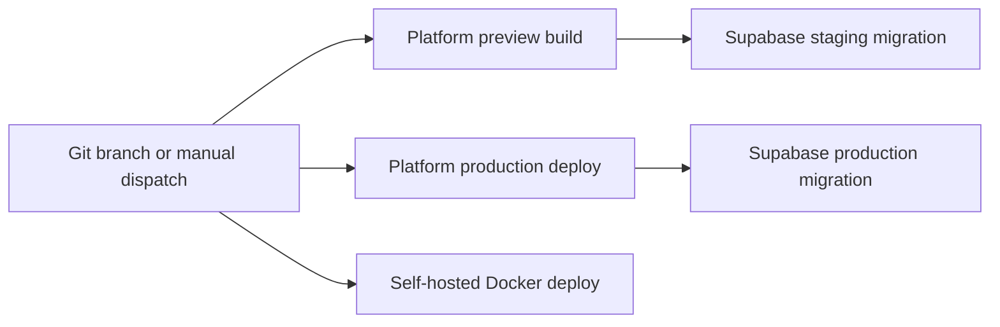

This section is the runbook for shipping and operating Tuturuuu. It documents the
deployment surfaces that exist in this repository today, the workflows that own
them, and the commands the team should use when something needs to be built,
released, or recovered.

## Deployment Surfaces

| Surface                                                                                                                                                                               | Source of truth                                                                                         | Delivery target                                         |
| ------------------------------------------------------------------------------------------------------------------------------------------------------------------------------------- | ------------------------------------------------------------------------------------------------------- | ------------------------------------------------------- |
| Platform web app (`apps/web`)                                                                                                                                                         | `.github/workflows/vercel-preview-platform.yaml`, `.github/workflows/vercel-production-platform.yaml`   | Vercel preview build validation and production deploy   |
| Satellite web apps (every app under `apps/*` with a `vercel-preview-<app>.yaml` / `vercel-production-<app>.yaml` pair: `apps`, `nova`, `rewise`, `calendar`, `finance`, `inventory`, `infrastructure`, `meet`, `tasks`, `track`, `shortener`, `qr`, `cms`, `mail`, `learn`, `teach`, `chat`, `drive`, `mind`, `storefront`) | `.github/workflows/vercel-preview-*.yaml`, `.github/workflows/vercel-production-*.yaml`                                          | Vercel preview and production deployments               |
| Database schema (`apps/database`)                                                                                                                                                     | `.github/workflows/supabase-staging.yaml`, `.github/workflows/supabase-production.yaml`                 | Supabase staging and production projects                |
| Self-hosted web runtime (`apps/web`)                                                                                                                                                  | `apps/web/Dockerfile`, `docker-compose.web.yml`, `docker-compose.web.prod.yml`, `scripts/docker-web.js` | Docker dev stacks and production blue/green deployments |
| Migration web runtime (`apps/tanstack-web`)                                                                                                                                           | `apps/tanstack-web/Dockerfile`, `apps/tanstack-web/wrangler.jsonc`, `.github/workflows/rust-backend.yml`, `.github/workflows/vercel-*-tanstack-web.yaml` | Docker sidecar + Cloudflare Worker (`tuturuuu-tanstack-web`) + opt-in Vercel build validation - see [TanStack/Rust Local And Deployment](/build/devops/tanstack-rust-local-deploy) |
| Rust backend (`apps/backend`)                                                                                                                                                         | `apps/backend/Dockerfile`, `apps/backend/wrangler.jsonc`, `.github/workflows/rust-backend.yml`          | Docker sidecar on port `7820` + manually dispatched Cloudflare Worker (`tuturuuu-backend`) with preflighted secrets — see [GitHub Actions Runbook](/build/devops/github-actions-runbook) |
| Discord utilities (`apps/discord`)                                                                                                                                                    | `.github/workflows/discord-modal-deploy.yml`                                                            | Modal                                                   |
| Mobile artifacts (`apps/mobile`)                                                                                                                                                      | `.github/workflows/mobile-build-*.yaml`                                                                 | Build artifacts for Android, iOS, macOS, Windows        |
| Shared packages (`packages/*`)                                                                                                                                                        | `.github/workflows/release-*.yaml`                                                                      | npm                                                     |

## Read This In Order

1. [Environments & Release Flow](/build/devops/environments-release-flow)
2. [Web Docker Deployment](/build/devops/web-docker-deployment)
3. [TanStack/Rust Local And Deployment](/build/devops/tanstack-rust-local-deploy)
4. [GitHub Actions Runbook](/build/devops/github-actions-runbook)
5. [Secrets & Configuration](/build/devops/secrets-and-configuration)

## Core Principles

- GitHub Actions is the canonical automation layer for hosted deployments, platform build validation, and database migrations.
- `tuturuuu.ts` can disable individual workflows; `ci-check.yml` enforces that toggle before a job does real work.
- `bun check` includes path-sensitive Discord Python validation when the local
  diff touches `apps/discord/**` or `.github/workflows/discord-python-ci.yml`.
  That path runs the same blocking checks as Discord Python CI through
  `scripts/check-discord-python.js`.
- Vercel handles hosted satellite web deployments, opt-in TanStack frontend build validation, platform preview build validation, and the hosted platform production deploy. Supabase migrations run as separate workflows; `main` drives staging schema promotion and `production` drives production schema promotion.
- Self-hosted web deployment is Docker-based, and blue/green rollout is the supported rebuild-before-restart path.
- The TanStack/Rust migration runs in parallel with `apps/web`: `apps/tanstack-web` (TanStack Start) and `apps/backend` (Rust, port `7820`) ship as Docker sidecars and Cloudflare Workers, and the TanStack frontend has Vercel build validation when it points at an HTTPS backend origin. See [TanStack/Rust Local And Deployment](/build/devops/tanstack-rust-local-deploy), [Web Docker Deployment](/build/devops/web-docker-deployment), and the [TanStack/Rust migration](/platform/architecture/tanstack-rust-migration) plan.
- Secrets live in GitHub Actions secrets/variables or local env files such as `apps/web/.env.local`. They do not belong in the repo.

## Operational Flow

## What Changed Recently

- The TanStack/Rust migration runtimes are now first-class deployment surfaces: `apps/backend` (Rust) builds a native binary, a Docker image, and a Cloudflare Worker bundle via `.github/workflows/rust-backend.yml`; `apps/tanstack-web` validates type-checks/tests, deploys as a Cloudflare Worker (`tuturuuu-tanstack-web`) bound to the backend Worker (`tuturuuu-backend`), and has Vercel preview/production build workflows for frontend compatibility against a separate HTTPS backend origin. Cloudflare uploads are manual-dispatch only and preflight `CLOUDFLARE_API_TOKEN`, `CLOUDFLARE_ACCOUNT_ID`, and Worker runtime secret names before deploying.
- `apps/web` now supports both in-place Docker production deploys and blue/green deploys.
- `docker-setup-check.yaml` validates Docker parity, renders both compose files, and builds both the dev and production web images.
- Production Redis in Docker now requires a token, but `scripts/docker-web.js`
  satisfies that automatically by generating and injecting the value unless you
  explicitly opt out with `--without-redis`. Watcher-managed Infrastructure
  projects do not inherit that platform Redis token; they start with Redis
  disabled and require project-scoped `MANAGED_PROJECT_<PROJECT_ID>_UPSTASH_*`
  credentials when Redis is intentionally enabled.

If you are changing deployment behavior, update this section and add any new
page to `apps/docs/docs.json`.
