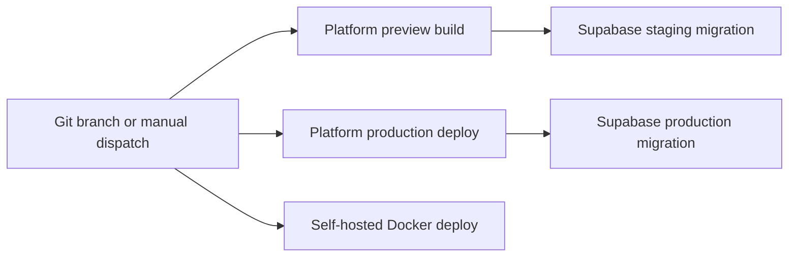

This section is the runbook for shipping and operating Tuturuuu. It documents the
deployment surfaces that exist in this repository today, the workflows that own
them, and the commands the team should use when something needs to be built,
released, or recovered.

## Deployment Surfaces

| Surface                                                                                                                                                                               | Source of truth                                                                                         | Delivery target                                         |
| ------------------------------------------------------------------------------------------------------------------------------------------------------------------------------------- | ------------------------------------------------------------------------------------------------------- | ------------------------------------------------------- |
| Platform web app (`apps/web`)                                                                                                                                                         | `.github/workflows/vercel-preview-platform.yaml`, `.github/workflows/vercel-production-platform.yaml`   | Vercel preview build validation and production deploy   |
| Satellite web apps (every app under `apps/*` with a `vercel-preview-<app>.yaml` / `vercel-production-<app>.yaml` pair: `apps`, `nova`, `rewise`, `calendar`, `finance`, `inventory`, `infrastructure`, `meet`, `tasks`, `track`, `shortener`, `qr`, `cms`, `mail`, `learn`, `teach`, `chat`, `drive`, `mind`, `storefront`) | `.github/workflows/vercel-preview-*.yaml`, `.github/workflows/vercel-production-*.yaml`                                          | Vercel preview and production deployments               |
| Database schema (`apps/database`)                                                                                                                                                     | `.github/workflows/supabase-staging.yaml`, `.github/workflows/supabase-production.yaml`                 | Supabase staging and production projects                |
| Self-hosted web runtime (`apps/web`)                                                                                                                                                  | `apps/web/Dockerfile`, `docker-compose.web.yml`, `docker-compose.web.prod.yml`, `scripts/docker-web.js` | Docker dev stacks and production blue/green deployments |
| Paused migration web runtime (`apps/tanstack-web`)                                                                                                                                    | `apps/tanstack-web/Dockerfile`, `apps/tanstack-web/wrangler.jsonc`, `.github/workflows/rust-backend.yml`, `.github/workflows/vercel-*-tanstack-web.yaml` | Local/manual use only; automatic CI and production builds are disabled in `tuturuuu.ts` |
| Paused Rust backend (`apps/backend`)                                                                                                                                                  | `apps/backend/Dockerfile`, `apps/backend/wrangler.jsonc`, `.github/workflows/rust-backend.yml`          | Local/manual use only; it is not deployed and its combined migration CI is disabled |
| Discord utilities (`apps/discord`)                                                                                                                                                    | `.github/workflows/discord-modal-deploy.yml`                                                            | Modal                                                   |
| Mobile artifacts (`apps/mobile`)                                                                                                                                                      | `.github/workflows/mobile-build-*.yaml`                                                                 | Build artifacts for Android, iOS, macOS, Windows        |
| Shared packages (`packages/*`)                                                                                                                                                        | `.github/workflows/release-*.yaml`                                                                      | npm                                                     |

## Read This In Order

1. [Environments & Release Flow](/build/devops/environments-release-flow)
2. [Web Docker Deployment](/build/devops/web-docker-deployment)
3. [TanStack/Rust Local And Deployment](/build/devops/tanstack-rust-local-deploy)
4. [GitHub Actions Runbook](/build/devops/github-actions-runbook)
5. [Secrets & Configuration](/build/devops/secrets-and-configuration)

## Core Principles

- GitHub Actions is the canonical automation layer for hosted deployments, platform build validation, and database migrations.
- `tuturuuu.ts` can disable individual workflows; `ci-check.yml` enforces that toggle before a job does real work.
- `bun check` includes path-sensitive Discord Python validation when the local
  diff touches `apps/discord/**` or `.github/workflows/discord-python-ci.yml`.
  That path runs the same blocking checks as Discord Python CI through
  `scripts/check-discord-python.js`.
- Vercel handles hosted satellite web deployments, platform preview build validation, and the hosted platform production deploy. Automatic TanStack production builds are disabled while that migration is paused. Supabase migrations run as separate workflows; `main` drives staging schema promotion and `production` drives production schema promotion.
- Self-hosted web deployment is Docker-based, and blue/green rollout is the supported rebuild-before-restart path.
- The TanStack/Rust migration is paused. Its source remains available for local or explicitly approved manual work, but automatic Rust/TanStack CI, Cloudflare workflow jobs, TanStack production builds, and the migration E2E matrix stay disabled until maintenance resumes. The shared E2E bundle now builds only the maintained Next.js frontend, and `apps/web` remains the production source of truth.
- Secrets live in GitHub Actions secrets/variables or local env files such as `apps/web/.env.local`. They do not belong in the repo.

## Vercel Cost Controls

Start with measured usage instead of applying cache directives globally. The
following commands identify the expensive projects and inspect a bounded sample
of production traffic without enabling a paid observability add-on:

```bash
vercel usage --scope tuturuuu --group-by project --format json
vercel logs --project <app> --scope tuturuuu --environment production --since 1h --json --no-branch
```

`vercel metrics` requires Observability Plus. A `payment_required` response is
an expected limitation when the add-on is disabled; do not enable it solely for
routine cost diagnosis.

Apply these controls in order:

1. Reduce request count and response size before adding cache writes. Prefer
   direct-to-storage signed uploads for large payloads and avoid routing public
   assets through application functions when a stable CDN URL is available.
2. Cache only public or safely scoped data. Never apply shared CDN caching to
   authenticated, user-specific, or workspace-private responses.
3. Shared Satellite and Nova React Query clients use a 30-second stale window
   and one retry. Override this only when a surface has a documented freshness
   or reliability requirement.
   Realtime-backed notification counts use a 15-minute fallback poll and a
   5-minute stale window. Active timers render elapsed time locally and use
   1-minute running / 5-minute idle reconciliation. Keep mutations and realtime
   events invalidating their query keys immediately instead of shortening these
   safety-net intervals.
   Versioned external-project asset reads return early from the global API proxy
   and rely on the asset route's publication/access checks, avoiding the global
   guard's cookie validation, suspicious-request checks, and rate-limit work per
   cache-busted media redirect. Mutations, unversioned reads, and WebGL delivery
   remain behind the global guard.
4. Dashboard sidebar links disable viewport prefetch and prefetch on hover or
   keyboard focus. This preserves responsive navigation without invoking every
   visible destination merely because the sidebar rendered.
5. After deployment, compare the same billing window and project grouping.
   Confirm error rates and latency remain healthy before keeping a cost change.

## Operational Flow


```mermaid
flowchart LR
    Branch["Git branch or manual dispatch"]
    Preview["Platform preview build"]
    Staging["Supabase staging migration"]
    Production["Platform production deploy"]
    ProdDb["Supabase production migration"]
    Docker["Self-hosted Docker deploy"]

    Branch --> Preview
    Preview --> Staging
    Branch --> Production
    Production --> ProdDb
    Branch --> Docker
```

## What Changed Recently

- TanStack/Rust migration maintenance is paused. `rust-backend.yml` and automatic TanStack production builds are switchboard-disabled; the retained source and runbooks are for local or explicitly approved future resumption work.
- `apps/web` now supports both in-place Docker production deploys and blue/green deploys.
- `docker-setup-check.yaml` validates Docker parity, renders both compose files, and builds both the dev and production web images.
- Production Redis in Docker now requires a token, but `scripts/docker-web.js`
  satisfies that automatically by generating and injecting the value unless you
  explicitly opt out with `--without-redis`. Watcher-managed Infrastructure
  projects do not inherit that platform Redis token; they start with Redis
  disabled and require project-scoped `MANAGED_PROJECT_<PROJECT_ID>_UPSTASH_*`
  credentials when Redis is intentionally enabled.

If you are changing deployment behavior, update this section and add any new
page to `apps/docs/docs.json`.
