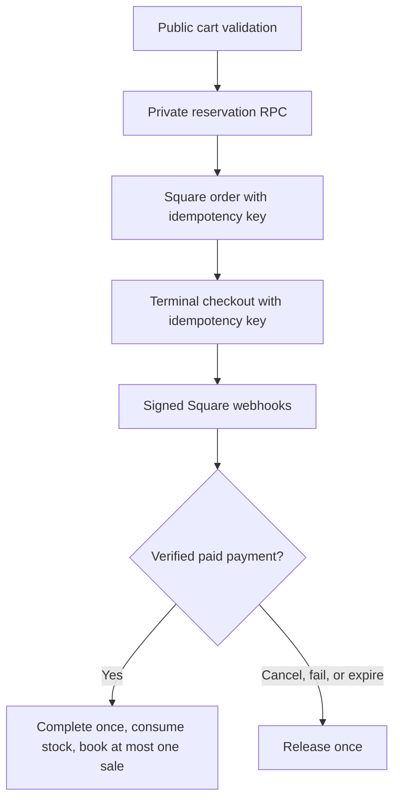

This runbook covers the Inventory and Storefront integration with
[Square Terminal](https://developer.squareup.com/docs/terminal-api/overview).
Use Square Terminal API for countertop terminal payments; the
[Square POS API](https://developer.squareup.com/docs/pos-api/what-it-does)
opens the mobile Square Point of Sale app and is not the right integration for
driving physical terminals from Tuturuuu.

For a store-owner-friendly walkthrough, use
[Set up a physical Square POS](/platform/applications/inventory-square-pos).

<Warning>
  Never paste Square access tokens, OAuth secrets, webhook signature keys, or
  device identifiers into source, docs, or chat. Store workspace credentials
  only through the Inventory Square settings panel, which encrypts them before
  private-schema storage.
</Warning>

## Customer guide map

<CardGroup cols={2}>
  <Card
    title="Account and counter setup"
    icon="plug"
    href="/platform/applications/inventory-square-pos/customer-setup"
  >
    Roles, credentials, OAuth, webhooks, location, and device setup.
  </Card>
  <Card
    title="Sandbox test plan"
    icon="flask"
    href="/platform/applications/inventory-square-pos/sandbox-testing"
  >
    Success, cancel, timeout, offline, expiry, duplicate event, and stock tests.
  </Card>
  <Card
    title="Catalog synchronization"
    icon="arrows-rotate"
    href="/platform/applications/inventory-square-pos/catalog-sync"
  >
    Direction selection, links, conflicts, prices, counts, and no-delete rules.
  </Card>
  <Card
    title="Production launch"
    icon="shield-check"
    href="/platform/applications/inventory-square-pos/production-launch"
  >
    Physical pairing, first live sale, go/no-go gate, and customer handoff.
  </Card>
  <Card
    title="Operations"
    icon="chart-line"
    href="/platform/applications/inventory-square-pos/operations"
  >
    Payments hub observability, lifecycle, reconciliation, and daily checks.
  </Card>
  <Card
    title="Troubleshooting"
    icon="life-ring"
    href="/platform/applications/inventory-square-pos/troubleshooting"
  >
    Safe symptom-based recovery and escalation packets.
  </Card>
</CardGroup>

## How the flow works

1. A shopper checks out on a `checkoutMode: 'square_terminal'` storefront.
   Tuturuuu validates Square readiness, creates a local checkout reservation,
   stores the provider as `square_terminal`, and returns the buyer to the local
   order reference page.
2. A Square Terminal Storefront dispatches the reserved checkout immediately;
   an eligible reserved row can also be sent or canceled from the Inventory
   Commerce workflow. Tuturuuu creates a Square order, then creates a Terminal
   checkout for the selected location and device with the Square order id and
   itemized cart display enabled.
3. Square sends terminal checkout and payment webhooks. Tuturuuu verifies the
   raw webhook body signature before parsing, reconciles duplicate deliveries
   idempotently, and completes the checkout only after a verified paid payment.
4. On Square create failure, cancellation, expiry, or failed terminal checkout,
   Tuturuuu releases the local reservation so stock returns to availability. A
   five-minute expiry sweep materializes abandoned 15-minute reservations as
   `expired`; checkout reads and new checkout creation also reconcile stale rows.

Catalog sync supports Square to Tuturuuu, Tuturuuu to Square, and two-way
comparison. It is intentionally non-destructive on Square: Tuturuuu uses
Catalog Batch Upsert and physical inventory counts, never calls a Square catalog
delete endpoint, preserves Square-only variations when updating an item, and
turns simultaneous edits into conflicts for operator review. A Square deletion
marks the local link for review without deleting local product or stock data.
Inventory base prices use exact decimal major units, so Square Money amounts
round-trip at the currency exponent without rounding to whole dollars. Legacy
fractional-price holds clear on the next Square-to-Tuturuuu import after the
cent-level schema migration is applied.

## Workspace credentials

Square credentials are self-serve per workspace, like Inventory Polar settings.
Do not configure Square app credentials, access tokens, or webhook signature
keys as deployment secrets. Workspace admins save these values in **Inventory →
Payments → Connect & set up → Square POS**, where Tuturuuu encrypts secret
values before private-schema storage.

The Square REST client pins `Square-Version: 2026-05-20` and uses native
`fetch`. OAuth is the recommended connection method because Tuturuuu can refresh
tokens and validate granted scopes. Manual access-token configuration remains
available for controlled deployments and does not require saved Square OAuth app
credentials.

## Configure Square

1. Create or open a Square application in the Square Developer Dashboard.
2. Configure the OAuth redirect URL:

   ```
   https://<your-tuturuuu-domain>/api/v1/inventory/square/oauth/callback
   ```

3. Grant these OAuth scopes:

   - `MERCHANT_PROFILE_READ`
   - `ORDERS_READ`
   - `ORDERS_WRITE`
   - `PAYMENTS_READ`
   - `PAYMENTS_WRITE`
   - `DEVICE_CREDENTIAL_MANAGEMENT`
   - `ITEMS_READ`
   - `ITEMS_WRITE`
   - `INVENTORY_READ`
   - `INVENTORY_WRITE`

4. Create a webhook subscription for the Inventory Square endpoint:

   ```
   https://<your-tuturuuu-domain>/api/v1/inventory/square/webhook/<workspace-id>
   ```

   Subscribe to these required events:

   - `device.code.paired`
   - `terminal.checkout.created`
   - `terminal.checkout.updated`
   - `payment.updated`
   - `oauth.authorization.revoked`
   - `catalog.version.updated`
   - `inventory.count.updated`

   `payment.created` can be added for additional delivery visibility, but
   `payment.updated` is the required payment-state signal in the customer setup
   checklist.

5. Copy the webhook signature key into **Inventory → Payments → Connect & set
   up → Square POS** for the matching environment.

For local development, expose `apps/web` with an HTTPS tunnel and either use the
tunnel URL in Square or save that exact URL as the workspace webhook
notification URL so signature validation uses the same value.

## Connect a workspace

1. Open **Inventory → Payments → Connect & set up → Square POS**. Configuration
   changes open in a three-tab dialog; incomplete checklist steps deep-link to
   the required tab.
2. Choose `Sandbox` or `Production`.
3. Save the Square Application ID and Application Secret for that environment.
   If Square is configured with a tunnel or canonical URL that differs from the
   actual request URL, also save the exact webhook notification URL so HMAC
   validation uses the same URL Square signed.
4. Prefer **Connect OAuth**. For manual setup, paste an access token and save it
   with the matching environment.
5. Save the webhook signature key for the same environment.
6. Select a Square location.
7. Pair or select a terminal:
   - Production: create a device pairing code, enter it on the physical Square
     Terminal within five minutes, then select the paired device. The pairing
     request uses Square's `TERMINAL_API` product type. Create this code inside
     Tuturuuu; device codes from Square Dashboard are not compatible with
     Terminal API pairing.
   - Sandbox: use Square's sandbox terminal device id when device listing is not
     available.
8. Set a storefront's checkout mode to `Square Terminal`.
9. In **Catalog and stock sync**, import from Square first in Sandbox. Review
   counts and conflicts, then rehearse publish and two-way sync. Repeat in
   Production only after confirming the selected seller and location.

Readiness fails closed until the connection, required scopes, webhook signature
key, location, device, and environment all match. OAuth-backed connections also
require saved workspace Square app credentials so refresh can continue without
deployment secrets. Storefront checkout returns a configuration error instead of
reserving stock when Square is not ready.

The verified Tuturuuu launch path requires reliable connectivity. Square lists
Terminal API offline payments as an opt-in beta capability, but Tuturuuu does
not currently certify or depend on that flow. Operators should restore the
network and reconcile any uncertain checkout before retrying.

## Runtime ownership and endpoints

The Inventory satellite owns the customer-facing Square routes and delegates
provider orchestration to `@tuturuuu/inventory-core`. Client components use
`@tuturuuu/internal-api`; they must not call provider APIs or private database
tables directly.

| Method and route | Purpose |
| --- | --- |
| `GET/PUT /api/v1/workspaces/:wsId/inventory/square-settings` | Read masked readiness state or save the workspace Square configuration |
| `GET /api/v1/workspaces/:wsId/inventory/square/oauth/start` | Start environment-bound OAuth |
| `GET /api/v1/inventory/square/oauth/callback` | Exchange the authorization and return to Inventory |
| `GET /api/v1/workspaces/:wsId/inventory/square/locations` | List locations for the connected seller |
| `GET /api/v1/workspaces/:wsId/inventory/square/devices` | List paired Production Terminal API devices |
| `POST /api/v1/workspaces/:wsId/inventory/square/device-codes` | Create a five-minute `TERMINAL_API` pairing code |
| `GET/POST /api/v1/workspaces/:wsId/inventory/square/catalog-sync` | Inspect links or run import, publish, or two-way sync |
| `POST /api/v1/workspaces/:wsId/inventory/square/terminal-checkouts` | Dispatch one reserved checkout to Square |
| `POST /api/v1/workspaces/:wsId/inventory/square/terminal-checkouts/:checkoutId/cancel` | Cancel the same Square Terminal checkout and reconcile release |
| `POST /api/v1/inventory/square/webhook/:wsId` | Verify and process workspace-scoped Square events |
| `POST /api/v1/inventory/storefronts/:slug/checkouts` | Reserve the cart and dispatch provider checkout when the Storefront uses Square Terminal |

The environment, workspace, seller connection, location, and device are checked
again server-side. A client-visible control is not an authorization boundary.

## State and idempotency boundaries



Provider IDs have unique database indexes, webhook events carry Square event
IDs, and reconciliation routines are safe to call repeatedly. Never weaken
those constraints to make a duplicate test pass.

The local checkout is reserved for 15 minutes. The database expiry function is
service-role only, concurrency-safe, and invoked by a five-minute cron plus lazy
reconciliation on reads and new checkout creation. Terminal cancellation and
Square final-state webhooks use the same release/complete boundaries.

## Focused verification commands

Run the narrow Square contract suites before the wider repository gate:

```bash
bun --filter @tuturuuu/inventory-core test

bun x vitest run \
  'apps/inventory/src/app/api/v1/inventory/square/webhook/[wsId]/route.test.ts' \
  'apps/inventory/src/app/api/v1/inventory/storefronts/[slug]/checkouts/route.test.ts' \
  'apps/inventory/src/app/api/v1/workspaces/[wsId]/inventory/square-settings/route.test.ts' \
  'apps/inventory/src/app/api/v1/workspaces/[wsId]/inventory/square/catalog-sync/route.test.ts' \
  'apps/inventory/src/app/api/v1/workspaces/[wsId]/inventory/square/terminal-checkouts/route.test.ts' \
  'apps/inventory/src/app/api/v1/workspaces/[wsId]/inventory/square/terminal-checkouts/[checkoutId]/cancel/route.test.ts' \
  'apps/inventory/src/app/api/cron/inventory/checkout-expiry/route.test.ts' \
  apps/inventory/src/components/operator/payments-readiness.test.ts \
  apps/inventory/src/components/operator/square-setup-progress.test.ts

bun --filter @tuturuuu/inventory type-check
bun check
```

When implementation routes or app dependencies change, also run the real
Inventory build as required by the repository operating manual:

```bash
cd apps/inventory
bun run build
```

Do not treat a passing build as physical hardware certification. The customer
must still complete the Production smoke test below.

## Hardware-free verification

No mocked test can prove that a specific production countertop terminal is
online, paired to the right Square seller account, assigned to the selected
location, has a working network path, and can complete a real card-present
payment. Without hardware, treat the automated suite as Square contract and
reconciliation verification, not physical-device certification.

The no-hardware suite must cover these Square contracts before release:

- OAuth authorization URL, token exchange, refresh, scope parsing, encrypted
  storage, and secret redaction.
- REST base URLs for sandbox and production, `Square-Version`, bearer auth,
  sanitized upstream errors, and idempotency keys.
- Catalog search, additive Batch Upsert, unknown-variation preservation,
  two-sided hash conflict detection, deleted-object preservation, and physical
  inventory count payloads that never contain a delete instruction.
- Orders API payloads before Terminal checkout creation.
- Terminal checkout payloads with `order_id`,
  `device_options.device_id`, and `device_options.show_itemized_cart`.
- Device Code creation with `product_type: TERMINAL_API` and paired-device
  webhook reconciliation.
- Raw-body webhook HMAC validation against the exact Square notification URL
  before JSON parsing.
- Terminal checkout, payment, OAuth revocation, cancellation, expiry, failure,
  duplicate delivery, and event-id reconciliation behavior.
- Reservation-first lifecycle: create local reservation before Square calls,
  release on Square create/cancel/failure/expiry, and complete stock/ledger
  state only after verified Square payment success.
- Scheduled and lazy checkout-expiry reconciliation, including concurrent
  sweeper safety and service-role-only database access.

## Physical-terminal smoke checklist

Complete the simulator matrix in Sandbox first. Square does not pair real
hardware to Sandbox, so physical-device certification requires a separately
approved Production test with a low-value item and real card-present processing.
Do not promise that a refund also refunds every processing fee; the Square owner
must approve the store's refund plan.

1. Pair a terminal for the selected Square location.
2. Create a small Storefront order and confirm Inventory shows it as reserved.
3. Use Inventory commerce actions to send it to the terminal.
4. Complete the payment on the terminal.
5. Confirm Square webhook delivery succeeded and Tuturuuu marked the checkout
   completed with Square order, terminal checkout, payment, and receipt URL
   metadata.
6. Confirm stock reservations were consumed and the finance ledger sale was
   booked once.
7. Repeat cancel, expiry/failure, duplicate webhook delivery, and transient
   Square failure cases in Sandbox. Cancel/failure/expiry must release
   inventory. Do not repeat destructive Production failure tests unless the
   owner explicitly approves their real-money and operational effects.

Use the customer-facing
[Production launch gate](/platform/applications/inventory-square-pos/production-launch)
for the exact owner, operator, receipt, stock, and go/no-go checklist.
