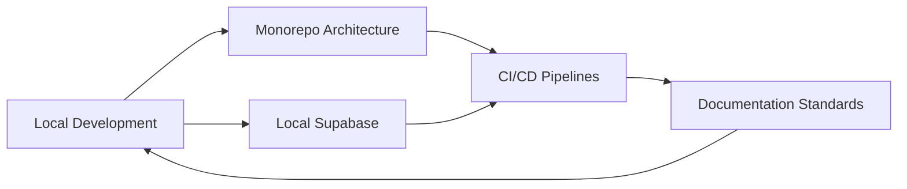

This section aggregates everything you need to contribute to Tuturuuu—from local setup to CI/CD.

## Start Here

1. **Environment Setup** – Follow the [Development Guide](/build/development-tools/development) to install Bun, Supabase, and required tooling.
2. **Understand the Monorepo** – Dive into our [Monorepo Architecture](/build/development-tools/monorepo-architecture) for workspace conventions and dependency flows.
3. **Automate with Confidence** – Review [CI/CD Pipelines](/build/development-tools/ci-cd-pipelines) and deployment practices.

## Build Toolkit

- **Clean Environments** – Use the [Cleaning Clone](/build/development-tools/cleaning-clone) guide when local builds misbehave.
- **Documenting** – Keep docs current with the [Documenting Workflow](/build/development-tools/documenting).

When you are ready to explore the product experience, head over to the [Platform section](/platform/overview). To sharpen AI and experimentation skills, continue to [Learn](/learn/overview).
