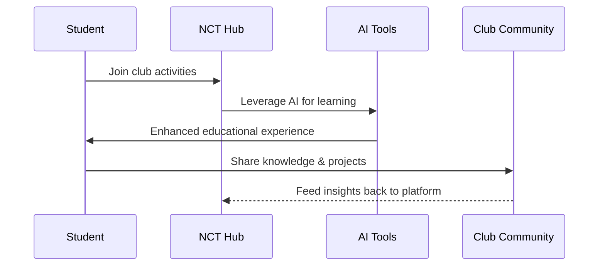

Level up your NCT Hub expertise through curated examples, experiments, and learning resources designed for club management, AI integration, and student development.

## Learning Paths

- **Examples** – Browse practical snippets and starter code in the [Examples Library](/learn/examples/index).

## NCT Hub Development Flow

## Key Learning Areas

### Club Management

- Member onboarding and role management
- Event planning and coordination
- Project tracking and collaboration
- Financial management and analytics

### AI Integration

- Chat-based assistance for students
- Automated content generation
- Smart scheduling and notifications
- Educational content personalization

### Student Development

- Skill-building through hands-on projects
- Peer collaboration and mentorship
- Real-world project experience
- Industry-relevant technology exposure

Stay curious—share findings, improve docs, and help us expand what the NCT Hub ecosystem can do. For detailed platform architecture, visit the [Hub section](/platform/index). Need development help? Check out [Development](/development).
