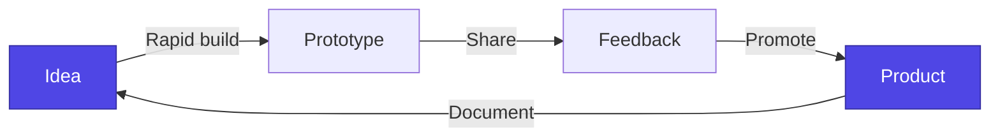

Level up your Tuturuuu expertise through curated examples, experiments, and prompt engineering playbooks.

## Learning Paths

- **Examples** – Browse practical snippets and starter code in the [Examples Library](/learn/examples/overview).
- **Experiments** – Explore in-progress ideas in [Experiments](/learn/experiments/form-builder) to understand what is coming next.
- **Prompt Engineering** – Master AI collaboration with the [Prompt Engineering Guides](/learn/guides/prompt-engineering/introduction).

## Experimentation Flow

Stay curious—share findings, improve docs, and help us expand what the Tuturuuu ecosystem can do. For detailed platform architecture, visit the [Platform section](/platform/overview). Need local tooling help? Return to [Build](/build/overview).
