<Info>
  ⏱️ **Duration**: 15 minutes | This section covers the absolute basics of web development.
</Info>

## What is a Website?

Every website you visit—from Netflix to TikTok to your university portal—is built with just **three technologies**:

```mermaid
graph LR
    A["🦴 HTML"] --> D["🌐 Website"]
    B["🎨 CSS"] --> D
    C["🧠 JavaScript"] --> D

    style A fill:#e34c26,color:#fff
    style B fill:#264de4,color:#fff
    style C fill:#f7df1e,color:#000
    style D fill:#22c55e,color:#fff
```



**Think of a website like a human body:**

| Technology | What it does | Human analogy |
|------------|-------------|---------------|
| 🦴 **HTML** | Structure & content | Skeleton + organs |
| 🎨 **CSS** | Appearance & style | Skin, hair, clothes |
| 🧠 **JavaScript** | Behavior & logic | Brain + muscles |

<Note>
  **🤯 Did you know?** The first website ever created is still online! Visit [info.cern.ch](http://info.cern.ch/hypertext/WWW/TheProject.html)—it was made in 1991 by Tim Berners-Lee. No CSS, no JavaScript, just pure HTML!
</Note>

---

## HTML: The Structure

HTML (HyperText Markup Language) defines the content and structure of web pages.

### Your First HTML Page

```html
<!DOCTYPE html>
<html>
  <head>
    <title>My First Page</title>
  </head>
  <body>
    <h1>Hello, World!</h1>
    <p>Welcome to web development!</p>
  </body>
</html>
```

<Tip>
  **Beginner Tip**: Every HTML element has an opening tag `<tag>` and a closing tag `</tag>`. The content goes between them.
</Tip>

### Common HTML Elements

| Element | Purpose | Example |
|---------|---------|---------|
| `<h1>` to `<h6>` | Headings | `<h1>Title</h1>` |
| `<p>` | Paragraph | `<p>Some text</p>` |
| `<a>` | Link | `<a href="url">Click me</a>` |
| `` | Image | `` |
| `<div>` | Container | `<div>Group of elements</div>` |
| `<button>` | Button | `<button>Click</button>` |

---

## CSS: The Style

CSS (Cascading Style Sheets) controls how HTML elements look.

### Adding Styles

```html
<style>
  h1 {
    color: blue;
    font-size: 32px;
  }

  p {
    color: gray;
    line-height: 1.5;
  }
</style>
```

### CSS Selectors

```css
/* Select by element */
h1 { color: blue; }

/* Select by class */
.card { background: white; }

/* Select by ID */
#header { height: 60px; }
```

<Tip>
  **Beginner Tip**: Use **classes** (`.classname`) for styles you'll reuse. Use **IDs** (`#idname`) for unique elements.
</Tip>

### The Box Model

Every HTML element is a box with **4 layers**. Think of it like a package:

```mermaid
graph LR
    subgraph Box["📦 The Box Model"]
        direction LR
        M["Margin"] --> B["Border"] --> P["Padding"] --> C["Content"]
    end

    style M fill:#fef3c7,stroke:#f59e0b,color:#000
    style B fill:#dbeafe,stroke:#3b82f6,color:#000
    style P fill:#dcfce7,stroke:#22c55e,color:#000
    style C fill:#fce7f3,stroke:#ec4899,color:#000
```




| Layer | What it is | CSS Example |
|-------|-----------|-------------|
| 📝 **Content** | Your text, images, etc. | `width: 200px` |
| 🧸 **Padding** | Space inside the border | `padding: 20px` |
| 🖼️ **Border** | The visible edge | `border: 2px solid black` |
| 📦 **Margin** | Space outside the border | `margin: 10px` |

**Real-world analogy:**
- 📝 **Content** = The gift inside the box
- 🧸 **Padding** = Bubble wrap protecting the gift
- 🖼️ **Border** = The cardboard box itself
- 📦 **Margin** = Space between boxes on the shelf

---

## JavaScript: The Behavior

JavaScript makes websites interactive.

### Your First Script

```html
<button onclick="sayHello()">Click Me!</button>

<script>
  function sayHello() {
    alert('Hello, World!');
  }
</script>
```

### JavaScript Basics

```javascript
// Variables
let name = 'Alice';
const age = 20;

// Functions
function greet(person) {
  return `Hello, ${person}!`;
}

// Calling a function
console.log(greet(name)); // "Hello, Alice!"
```

<Tip>
  **Beginner Tip**: Use `const` for values that don't change, and `let` for values that might change. Avoid using `var`.
</Tip>

### DOM Manipulation

JavaScript can change HTML elements:

```javascript
// Find an element
const heading = document.querySelector('h1');

// Change its content
heading.textContent = 'New Title!';

// Change its style
heading.style.color = 'red';
```

---

## Putting It All Together

```html
<!DOCTYPE html>
<html>
  <head>
    <title>My Interactive Page</title>
    <style>
      .highlight {
        background-color: yellow;
        padding: 10px;
      }
    </style>
  </head>
  <body>
    <h1>Welcome!</h1>
    <p id="message">Click the button below.</p>
    <button onclick="changeMessage()">Click Me</button>

    <script>
      function changeMessage() {
        const message = document.getElementById('message');
        message.textContent = 'You clicked the button!';
        message.classList.add('highlight');
      }
    </script>
  </body>
</html>
```

---

## Key Takeaways

<CardGroup cols={3}>
  <Card title="HTML = Structure" icon="code">
    Defines what content appears on the page
  </Card>
  <Card title="CSS = Style" icon="palette">
    Controls how content looks
  </Card>
  <Card title="JS = Behavior" icon="bolt">
    Makes content interactive
  </Card>
</CardGroup>

---

## Learn More

<CardGroup cols={3}>
  <Card title="HTML Tutorial" icon="code" href="https://www.w3schools.com/html/">
    W3Schools HTML Guide
  </Card>
  <Card title="CSS Tutorial" icon="palette" href="https://www.w3schools.com/css/">
    W3Schools CSS Guide
  </Card>
  <Card title="JavaScript Tutorial" icon="bolt" href="https://www.w3schools.com/Js/">
    W3Schools JS Guide
  </Card>
</CardGroup>

---

**Next up**: [Tailwind CSS →](/learn/workshops/nextjs-workshop/02-tailwind-css)

