<Info>
  ⏱️ **Duration**: 15 minutes | Learn how to build beautiful UIs without writing custom CSS.
</Info>

## What is Tailwind CSS?

Tailwind CSS is a **utility-first CSS framework**. Instead of writing custom CSS, you apply pre-built classes directly in your HTML.

**It's like building with LEGO instead of carving from scratch! 🧱**

```mermaid
graph LR
    A["😫 Traditional CSS"] --> B["Write .card class"]
    B --> C["Switch to CSS file"]
    C --> D["Write styles"]
    D --> E["Back to HTML"]
    E --> F["Repeat forever..."]

    G["😎 Tailwind"] --> H["Write classes inline"]
    H --> I["Done! ✅"]

    style A fill:#fee2e2,stroke:#ef4444,color:#000
    style G fill:#dcfce7,stroke:#22c55e,color:#000
```



### Traditional CSS vs Tailwind

<CodeGroup>
```css Traditional CSS
.card {
  background-color: white;
  border-radius: 8px;
  padding: 24px;
  box-shadow: 0 4px 6px rgba(0, 0, 0, 0.1);
}

.card-title {
  font-size: 20px;
  font-weight: bold;
  color: #1f2937;
}
```

```html Tailwind CSS
<div class="bg-white rounded-lg p-6 shadow-md">
  <h2 class="text-xl font-bold text-gray-800">
    Card Title
  </h2>
</div>
```
</CodeGroup>

<Tip>
  **Why do developers love Tailwind?** You never leave your HTML file. No more context-switching, no more inventing class names like `.card-wrapper-container-inner-box` 😅
</Tip>

<Note>
  **🤯 Did you know?** Tailwind CSS has over **80,000+ GitHub stars** and is used by Netflix, OpenAI, Shopify, and NASA!
</Note>

---

## Core Utilities

### Spacing (Padding & Margin)

Tailwind uses a simple numbering system for spacing:

| Class | Size | Example |
|-------|------|---------|
| `p-1` | 4px | `<div class="p-1">` |
| `p-2` | 8px | `<div class="p-2">` |
| `p-4` | 16px | `<div class="p-4">` |
| `p-6` | 24px | `<div class="p-6">` |
| `p-8` | 32px | `<div class="p-8">` |

**Variants:**
- `p-4` = padding on all sides
- `px-4` = padding left and right
- `py-4` = padding top and bottom
- `pt-4` = padding top only
- `m-4` = margin (same pattern)

### Colors

Tailwind provides a beautiful color palette:

```html
<!-- Text colors -->
<p class="text-gray-500">Gray text</p>
<p class="text-blue-600">Blue text</p>
<p class="text-red-500">Red text</p>

<!-- Background colors -->
<div class="bg-white">White background</div>
<div class="bg-gray-100">Light gray</div>
<div class="bg-blue-500">Blue background</div>
```

export const TailwindPlayground = () => {
  const [bgColor, setBgColor] = useState('');
  const [textSize, setTextSize] = useState('');
  const [fontWeight, setFontWeight] = useState('');
  const [textAlign, setTextAlign] = useState('');
  const [rounded, setRounded] = useState('');
  const [padding, setPadding] = useState(4);
  const [margin, setMargin] = useState(0);
  const [borderWidth, setBorderWidth] = useState(0);
  const [borderColor, setBorderColor] = useState('zinc-300');
  
  const colors = [
    { name: '', bg: 'transparent', label: 'none' },
    { name: 'red-500', bg: '#ef4444' },
    { name: 'orange-500', bg: '#f97316' },
    { name: 'yellow-500', bg: '#eab308' },
    { name: 'green-500', bg: '#22c55e' },
    { name: 'blue-500', bg: '#3b82f6' },
    { name: 'purple-500', bg: '#a855f7' },
    { name: 'pink-500', bg: '#ec4899' },
  ];
  
  const borderColors = [
    { name: 'zinc-300', bg: '#d4d4d8' },
    { name: 'red-500', bg: '#ef4444' },
    { name: 'green-500', bg: '#22c55e' },
    { name: 'blue-500', bg: '#3b82f6' },
    { name: 'purple-500', bg: '#a855f7' },
  ];
  
  const textSizes = [
    { value: '', label: 'base' },
    { value: 'text-xs', label: 'xs' },
    { value: 'text-sm', label: 'sm' },
    { value: 'text-lg', label: 'lg' },
    { value: 'text-xl', label: 'xl' },
    { value: 'text-2xl', label: '2xl' },
  ];
  
  const fontWeights = [
    { value: '', label: 'normal' },
    { value: 'font-medium', label: 'medium' },
    { value: 'font-semibold', label: 'semibold' },
    { value: 'font-bold', label: 'bold' },
  ];
  
  const textAligns = [
    { value: '', label: 'start' },
    { value: 'text-center', label: 'center' },
    { value: 'text-end', label: 'end' },
  ];
  
  const roundedOptions = [
    { value: '', label: 'none' },
    { value: 'rounded', label: 'sm' },
    { value: 'rounded-lg', label: 'lg' },
    { value: 'rounded-xl', label: 'xl' },
    { value: 'rounded-full', label: 'full' },
  ];
  
  const paddingClass = padding > 0 ? `p-${padding}` : '';
  const marginClass = margin > 0 ? `m-${margin}` : '';
  const borderClass = borderWidth > 0 ? (borderWidth === 1 ? 'border' : `border-${borderWidth}`) : '';
  const borderColorClass = borderWidth > 0 ? `border-${borderColor}` : '';
  
  const classes = [bgColor && `bg-${bgColor}`, textSize, fontWeight, textAlign, rounded, paddingClass, marginClass, borderClass, borderColorClass].filter(Boolean).join(' ') || '(no classes)';
  
  return <div className="p-5 border border-zinc-200 dark:border-zinc-700 rounded-2xl not-prose my-4 bg-zinc-50 dark:bg-zinc-900">
    <div className="grid grid-cols-2 gap-4 mb-5">
      <div>
        <span className="text-xs font-medium text-zinc-500 dark:text-zinc-400 uppercase tracking-wide">Background</span>
        <div className="flex gap-2 mt-2 flex-wrap">
          {colors.map((c) => (
            <div key={c.name} onClick={() => setBgColor(c.name)} className={`h-7 w-7 rounded-md cursor-pointer transition-all hover:scale-110 border ${bgColor === c.name ? 'ring-2 ring-offset-1 ring-zinc-950 dark:ring-white' : 'border-zinc-300 dark:border-zinc-600'} ${c.name === '' ? 'border-dashed' : ''}`} style={{ backgroundColor: c.name ? c.bg : 'transparent' }} />
          ))}
        </div>
      </div>
      <div>
        <span className="text-xs font-medium text-zinc-500 dark:text-zinc-400 uppercase tracking-wide">Border Color</span>
        <div className="flex gap-2 mt-2 flex-wrap items-center">
          {borderColors.map((c) => (
            <div key={c.name} onClick={() => setBorderColor(c.name)} className={`h-7 w-7 rounded-md cursor-pointer transition-all hover:scale-110 border ${borderColor === c.name ? 'ring-2 ring-offset-1 ring-zinc-950 dark:ring-white' : 'border-zinc-300 dark:border-zinc-600'}`} style={{ backgroundColor: c.bg }} />
          ))}
        </div>
      </div>
      <div>
        <span className="text-xs font-medium text-zinc-500 dark:text-zinc-400 uppercase tracking-wide">Text Size</span>
        <div className="flex gap-1 mt-2 flex-wrap">
          {textSizes.map((s) => (
            <button key={s.label} onClick={() => setTextSize(s.value)} className={`px-2 py-1 text-xs rounded-md border ${textSize === s.value ? 'bg-white dark:bg-zinc-700 border-zinc-300 dark:border-zinc-600' : 'border-transparent hover:bg-zinc-200 dark:hover:bg-zinc-800'}`}>{s.label}</button>
          ))}
        </div>
      </div>
      <div>
        <span className="text-xs font-medium text-zinc-500 dark:text-zinc-400 uppercase tracking-wide">Font Weight</span>
        <div className="flex gap-1 mt-2 flex-wrap">
          {fontWeights.map((w) => (
            <button key={w.label} onClick={() => setFontWeight(w.value)} className={`px-2 py-1 text-xs rounded-md border ${fontWeight === w.value ? 'bg-white dark:bg-zinc-700 border-zinc-300 dark:border-zinc-600' : 'border-transparent hover:bg-zinc-200 dark:hover:bg-zinc-800'}`}>{w.label}</button>
          ))}
        </div>
      </div>
      <div>
        <span className="text-xs font-medium text-zinc-500 dark:text-zinc-400 uppercase tracking-wide">Text Align</span>
        <div className="flex gap-1 mt-2 flex-wrap">
          {textAligns.map((a) => (
            <button key={a.label} onClick={() => setTextAlign(a.value)} className={`px-2 py-1 text-xs rounded-md border ${textAlign === a.value ? 'bg-white dark:bg-zinc-700 border-zinc-300 dark:border-zinc-600' : 'border-transparent hover:bg-zinc-200 dark:hover:bg-zinc-800'}`}>{a.label}</button>
          ))}
        </div>
      </div>
      <div>
        <span className="text-xs font-medium text-zinc-500 dark:text-zinc-400 uppercase tracking-wide">Rounded</span>
        <div className="flex gap-1 mt-2 flex-wrap">
          {roundedOptions.map((r) => (
            <button key={r.label} onClick={() => setRounded(r.value)} className={`px-2 py-1 text-xs rounded-md border ${rounded === r.value ? 'bg-white dark:bg-zinc-700 border-zinc-300 dark:border-zinc-600' : 'border-transparent hover:bg-zinc-200 dark:hover:bg-zinc-800'}`}>{r.label}</button>
          ))}
        </div>
      </div>
      <div>
        <span className="text-xs font-medium text-zinc-500 dark:text-zinc-400 uppercase tracking-wide">Padding: {padding}</span>
        <input type="range" min="0" max="8" value={padding} onChange={(e) => setPadding(Number(e.target.value))} className="w-full mt-2 h-2 bg-zinc-200 dark:bg-zinc-700 rounded-lg appearance-none cursor-pointer" />
      </div>
      <div>
        <span className="text-xs font-medium text-zinc-500 dark:text-zinc-400 uppercase tracking-wide">Margin: {margin}</span>
        <input type="range" min="0" max="8" value={margin} onChange={(e) => setMargin(Number(e.target.value))} className="w-full mt-2 h-2 bg-zinc-200 dark:bg-zinc-700 rounded-lg appearance-none cursor-pointer" />
      </div>
      <div className="col-span-2">
        <span className="text-xs font-medium text-zinc-500 dark:text-zinc-400 uppercase tracking-wide">Border Width: {borderWidth}</span>
        <input type="range" min="0" max="4" value={borderWidth} onChange={(e) => setBorderWidth(Number(e.target.value))} className="w-full mt-2 h-2 bg-zinc-200 dark:bg-zinc-700 rounded-lg appearance-none cursor-pointer" />
      </div>
    </div>
    <div className="p-4 bg-white dark:bg-zinc-800 rounded-xl border border-zinc-200 dark:border-zinc-700 overflow-hidden">
      <div className={`${rounded} ${textSize} ${fontWeight} ${textAlign} ${bgColor ? 'text-white' : 'text-zinc-900 dark:text-white'} transition-all`} style={{ backgroundColor: bgColor ? colors.find(c => c.name === bgColor)?.bg : 'transparent', padding: `${padding * 4}px`, margin: `${margin * 4}px`, borderWidth: `${borderWidth}px`, borderColor: borderColors.find(c => c.name === borderColor)?.bg, borderStyle: borderWidth > 0 ? 'solid' : 'none' }}>
        Hello, Tailwind!
      </div>
    </div>
    <div className="mt-3 text-center">
      <code className="text-xs bg-white dark:bg-zinc-800 px-3 py-2 rounded-lg border border-zinc-200 dark:border-zinc-700 break-all inline-block max-w-full">
        {classes}
      </code>
    </div>
  </div>;
};

**Try it! 👇** Mix and match Tailwind classes:

<TailwindPlayground />

### Typography

```html
<!-- Font sizes -->
<p class="text-sm">Small</p>
<p class="text-base">Base (default)</p>
<p class="text-lg">Large</p>
<p class="text-xl">Extra large</p>
<p class="text-2xl">2X large</p>

<!-- Font weight -->
<p class="font-normal">Normal</p>
<p class="font-medium">Medium</p>
<p class="font-semibold">Semibold</p>
<p class="font-bold">Bold</p>
```

---

## Layout with Flexbox

Flexbox is incredibly easy with Tailwind:

```html
<!-- Horizontal layout with gap -->
<div class="flex gap-4">
  <div>Item 1</div>
  <div>Item 2</div>
  <div>Item 3</div>
</div>

<!-- Centered content -->
<div class="flex items-center justify-center h-screen">
  <p>I'm centered!</p>
</div>

<!-- Space between items -->
<div class="flex justify-between">
  <div>Left</div>
  <div>Right</div>
</div>
```

---

## Building a Card Component

Let's build a beautiful card step by step:

```html
<div class="max-w-sm rounded-xl bg-white p-6 shadow-lg">
  <!-- Image -->
  

  <!-- Content -->
  <div class="mt-4">
    <h3 class="text-xl font-semibold text-gray-900">
      Card Title
    </h3>
    <p class="mt-2 text-gray-600">
      This is a beautiful card built with Tailwind CSS.
      No custom CSS needed!
    </p>
  </div>

  <!-- Button -->
  <button class="mt-4 w-full rounded-lg bg-blue-600 px-4 py-2 font-medium text-white hover:bg-blue-700">
    Learn More
  </button>
</div>
```

export const LiveCard = () => {
  const [likes, setLikes] = useState(42);
  const [liked, setLiked] = useState(false);
  const toggleLike = () => {
    setLiked(!liked);
    setLikes(liked ? likes - 1 : likes + 1);
  };
  return <div className="max-w-sm mx-auto rounded-2xl bg-white dark:bg-zinc-800 overflow-hidden shadow-xl my-4 not-prose border border-zinc-200 dark:border-zinc-700">
    <div className="relative">
      
      <div className="absolute inset-0 bg-gradient-to-t from-black/50 to-transparent" />
    </div>
    <div className="p-5">
      <h3 className="text-lg font-bold text-zinc-900 dark:text-white">Interactive Card</h3>
      <p className="mt-2 text-sm text-zinc-600 dark:text-zinc-400">This card is built with Tailwind CSS. Try the like button below!</p>
      <button onClick={toggleLike} className={`mt-4 w-full rounded-xl px-4 py-3 font-semibold transition-all duration-200 flex items-center justify-center gap-2 ${liked ? 'bg-gradient-to-r from-pink-500 to-rose-500 text-white shadow-lg shadow-pink-500/25' : 'bg-zinc-100 dark:bg-zinc-700 text-zinc-700 dark:text-zinc-200 hover:bg-zinc-200 dark:hover:bg-zinc-600'}`}>
        <span className="text-lg">{liked ? '❤️' : '🤍'}</span>
        <span>{likes} likes</span>
      </button>
    </div>
  </div>;
};

**Try it! 👇** Click the like button:

<LiveCard />

---

## Responsive Design

Add breakpoint prefixes for responsive styles:

| Prefix | Screen Width |
|--------|-------------|
| `sm:` | 640px+ |
| `md:` | 768px+ |
| `lg:` | 1024px+ |
| `xl:` | 1280px+ |

```html
<div class="grid grid-cols-1 md:grid-cols-2 lg:grid-cols-3 gap-4">
  <!-- 1 column on mobile, 2 on tablet, 3 on desktop -->
  <div class="bg-white p-4 rounded-lg">Card 1</div>
  <div class="bg-white p-4 rounded-lg">Card 2</div>
  <div class="bg-white p-4 rounded-lg">Card 3</div>
</div>
```

<Tip>
  **Beginner Tip**: Tailwind is "mobile-first". Write styles for mobile, then add `md:` or `lg:` for larger screens.
</Tip>

---

## Hover and Focus States

Add interactivity with state prefixes:

```html
<!-- Hover effects -->
<button class="bg-blue-500 hover:bg-blue-600 transition-colors">
  Hover me
</button>

<!-- Focus states -->
<input
  class="border border-gray-300 focus:border-blue-500 focus:ring-2 focus:ring-blue-200 rounded-lg px-4 py-2"
  placeholder="Focus me"
/>
```

---

## Quick Reference

| What you want | Tailwind class |
|---------------|----------------|
| Rounded corners | `rounded-lg` |
| Shadow | `shadow-md` |
| Flex row | `flex` |
| Flex column | `flex flex-col` |
| Center items | `items-center justify-center` |
| Full width | `w-full` |
| Fixed height | `h-64` (256px) |
| Hide on mobile | `hidden md:block` |
| Show only on mobile | `block md:hidden` |

---

## Learn More

<Card title="Tailwind CSS Docs" icon="book" href="https://tailwindcss.com">
  The official Tailwind CSS documentation with all utilities.
</Card>

---

**Next up**: [TypeScript →](/learn/workshops/nextjs-workshop/03-typescript)
