<Info>
  ⏱️ **Duration**: 15 minutes | Learn how TypeScript helps you write safer, more reliable code.
</Info>

## Why TypeScript?

TypeScript is **JavaScript with types**. It helps you catch errors before running your code.

**Think of it as spell-check for your code! 📝✅**

```mermaid
graph LR
    A["You write code"] --> B{"TypeScript checks it"}
    B -->|"❌ Error found"| C["Fix before running"]
    B -->|"✅ All good"| D["Run with confidence!"]

    style B fill:#4f46e5,stroke:#3730a3,color:#fff
    style C fill:#fef3c7,stroke:#f59e0b,color:#000
    style D fill:#dcfce7,stroke:#22c55e,color:#000
```



<Note>
  **Fun Facts**: 
  - TypeScript was created by **Microsoft** and is used by Google, Airbnb, and Slack
  - TypeScript is **built with TypeScript** (it compiles itself! 🤯)
  - **TypeScript Native v7** is coming soon—rewritten in **Golang** for ~10x faster performance!
</Note>

### The Problem with JavaScript

```javascript
// JavaScript - no error until runtime! 💥
function greet(user) {
  return "Hello, " + user.name;
}

greet("Alice"); // Runtime error: user.name is undefined
```

### The TypeScript Solution

```typescript
// TypeScript - error caught immediately! ✅
function greet(user: { name: string }) {
  return "Hello, " + user.name;
}

greet("Alice"); // ❌ Error: string is not assignable to { name: string }
greet({ name: "Alice" }); // ✅ Works!
```

<Tip>
  **Beginner Tip**: TypeScript acts like a spell-checker for your code. It catches mistakes as you type!
</Tip>

---

## Basic Types

### Primitive Types

```typescript
// String
let name: string = "Alice";

// Number
let age: number = 20;

// Boolean
let isStudent: boolean = true;

// Array of strings
let hobbies: string[] = ["coding", "gaming", "reading"];

// Array of numbers
let scores: number[] = [95, 87, 92];
```

### Type Inference

TypeScript is smart! It can often figure out types automatically:

```typescript
// TypeScript knows these types automatically
let name = "Alice"; // string
let age = 20; // number
let isActive = true; // boolean

// But you can still add types for clarity
let email: string = "alice@example.com";
```

---

## Objects and Interfaces

### Typing Objects

```typescript
// Inline object type
let user: { name: string; age: number } = {
  name: "Alice",
  age: 20,
};
```

### Using Interfaces (Recommended)

```typescript
// Define a reusable type
interface User {
  name: string;
  age: number;
  email: string;
}

// Use it
const alice: User = {
  name: "Alice",
  age: 20,
  email: "alice@example.com",
};

const bob: User = {
  name: "Bob",
  age: 22,
  email: "bob@example.com",
};
```

### Optional Properties

```typescript
interface User {
  name: string;
  age: number;
  email?: string; // Optional (the ? makes it optional)
}

// Valid - email is optional
const user: User = {
  name: "Alice",
  age: 20,
};
```

---

## Functions

### Typed Parameters and Return Values

```typescript
// Parameters and return type
function add(a: number, b: number): number {
  return a + b;
}

// Arrow function
const multiply = (a: number, b: number): number => {
  return a * b;
};

// Usage
add(5, 3); // ✅ Returns 8
add("5", 3); // ❌ Error: string is not a number
```

### Functions with Objects

```typescript
interface Product {
  name: string;
  price: number;
}

function getTotal(products: Product[]): number {
  return products.reduce((sum, p) => sum + p.price, 0);
}

const cart = [
  { name: "Book", price: 15 },
  { name: "Pen", price: 2 },
];

console.log(getTotal(cart)); // 17
```

---

## Union Types

A variable can be one of several types:

```typescript
// Can be string or number
let id: string | number;
id = "abc123"; // ✅
id = 123; // ✅
id = true; // ❌ Error

// Useful for optional values
let username: string | null = null;
username = "alice"; // ✅
```

---

## Type Aliases

Create custom type names:

```typescript
// Simple alias
type ID = string | number;

// Object alias
type Point = {
  x: number;
  y: number;
};

// Usage
const userId: ID = "user_123";
const location: Point = { x: 10, y: 20 };
```

<Note>
  **Interface vs Type**: Both can define object shapes. Use `interface` for objects you might extend later, `type` for everything else.
</Note>

---

## Real-World Example

```typescript
// Define types for a todo app
interface Todo {
  id: number;
  title: string;
  completed: boolean;
  dueDate?: string;
}

// Type-safe function
function toggleTodo(todo: Todo): Todo {
  return {
    ...todo,
    completed: !todo.completed,
  };
}

// Type-safe array operations
function getCompletedTodos(todos: Todo[]): Todo[] {
  return todos.filter((todo) => todo.completed);
}

// Usage
const myTodos: Todo[] = [
  { id: 1, title: "Learn TypeScript", completed: true },
  { id: 2, title: "Build an app", completed: false },
];

const completed = getCompletedTodos(myTodos);
console.log(completed); // [{ id: 1, title: "Learn TypeScript", completed: true }]
```

---

## TypeScript in 60 Seconds

| Concept | Syntax | Example |
|---------|--------|---------|
| Basic type | `: type` | `let x: number = 5` |
| Array | `type[]` | `let arr: string[]` |
| Object | `interface` | `interface User { name: string }` |
| Optional | `?` | `email?: string` |
| Union | `\|` | `string \| number` |
| Function | `(params): return` | `(x: number): number` |

---

## Key Takeaways

<CardGroup cols={2}>
  <Card title="Catch Bugs Early" icon="bug">
    TypeScript finds errors before you run your code
  </Card>
  <Card title="Better Autocomplete" icon="keyboard">
    Your editor knows what properties and methods are available
  </Card>
  <Card title="Self-Documenting" icon="book">
    Types act as documentation for your code
  </Card>
  <Card title="Refactor Safely" icon="shield">
    Change code confidently - TypeScript tells you what breaks
  </Card>
</CardGroup>

---

## ☕ Break Time!

Great job making it this far! Take a 5-minute break before we dive into React.

---

**Next up**: [React Basics →](/learn/workshops/nextjs-workshop/04-react)
