<Info>
  ⏱️ **Duration**: 20 minutes | Learn how React revolutionizes UI development.
</Info>

## What is React?

React is a JavaScript library for building user interfaces. It lets you create **reusable components** that manage their own state.

**Ever noticed how Netflix updates smoothly without reloading the whole page?** That's React! 🎬

<Note>
  **Fun Fact**: React was created by **Meta (Facebook)** in 2013 and now powers billions of users on Facebook, Instagram, and WhatsApp! The engineer who created it, Jordan Walke, built the first version in just a few weeks!
</Note>

### Why React?

```mermaid
graph LR
    subgraph Traditional["❌ Traditional"]
        direction TB
        A[Write HTML] --> B[Write JS]
        B --> C[Manually Sync]
        C --> D[🐛 Bugs!]
    end
    
    subgraph React["✅ React"]
        direction TB
        E[Write Component] --> F[State Changes]
        F --> G[Auto Update!]
        G --> H[🎉 It Works!]
    end

    Traditional ~~~ React

    style Traditional fill:#fee2e2,stroke:#ef4444,color:#000
    style React fill:#dcfce7,stroke:#22c55e,color:#000
```



| Traditional Approach | React Approach |
|---------------------|----------------|
| Manually update HTML | Components update automatically |
| Copy-paste code | Reusable components |
| Hard to track state | Clear state management |
| DOM manipulation | Declarative UI |

<Card title="React Official Tutorial" icon="graduation-cap" href="https://react.dev/learn">
  Learn React step-by-step with the official interactive tutorial
</Card>

---

## Components

Components are the building blocks of React apps. Think of them as custom HTML elements.

### Your First Component

```tsx
// A simple component
function Greeting() {
  return <h1>Hello, World!</h1>;
}

// Using the component
function App() {
  return (
    <div>
      <Greeting />
      <Greeting />
      <Greeting />
    </div>
  );
}
```

<Tip>
  **Beginner Tip**: Component names must start with a capital letter! `Greeting` not `greeting`.
</Tip>

---

## JSX: HTML in JavaScript

JSX lets you write HTML-like code in JavaScript:

```tsx
function WelcomeCard() {
  const name = "Alice";
  const isStudent = true;

  return (
    <div className="card">
      <h2>Welcome, {name}!</h2>
      {isStudent && <p>Student discount available!</p>}
    </div>
  );
}
```

### JSX Rules

| HTML | JSX |
|------|-----|
| `class` | `className` |
| `for` | `htmlFor` |
| `style="color: red"` | `style={{ color: 'red' }}` |
| Self-closing: `` | Must close: `` |

---

## Props: Passing Data

Props let you pass data to components:

```tsx
// Component that accepts props
interface UserCardProps {
  name: string;
  age: number;
  isActive?: boolean;
}

function UserCard({ name, age, isActive = false }: UserCardProps) {
  return (
    <div className="p-4 bg-white rounded-lg shadow">
      <h3 className="font-bold">{name}</h3>
      <p>Age: {age}</p>
      {isActive && <span className="text-green-500">● Online</span>}
    </div>
  );
}

// Using the component with props
function App() {
  return (
    <div className="space-y-4">
      <UserCard name="Alice" age={20} isActive />
      <UserCard name="Bob" age={22} />
      <UserCard name="Charlie" age={19} isActive />
    </div>
  );
}
```

---

## State: Making Things Interactive

State is data that changes over time. Use `useState` to add state:

```tsx
import { useState } from 'react';

function Counter() {
  // Declare state: [value, setterFunction]
  const [count, setCount] = useState(0);

  return (
    <div className="text-center">
      <p className="text-4xl font-bold">{count}</p>
      <div className="flex gap-2 justify-center mt-4">
        <button
          onClick={() => setCount(count - 1)}
          className="px-4 py-2 bg-red-500 text-white rounded"
        >
          -1
        </button>
        <button
          onClick={() => setCount(count + 1)}
          className="px-4 py-2 bg-green-500 text-white rounded"
        >
          +1
        </button>
      </div>
    </div>
  );
}
```

export const Counter = () => {
  const [count, setCount] = useState(0);
  const increment = () => setCount(count + 1);
  const decrement = () => setCount(count - 1);
  return <div className="p-5 border border-zinc-200 dark:border-zinc-700 rounded-2xl not-prose my-4 bg-zinc-50 dark:bg-zinc-900">
    <div className="flex items-center justify-center">
      <div className="flex items-center rounded-xl overflow-hidden border border-zinc-200 dark:border-zinc-700 bg-white dark:bg-zinc-800 shadow-sm">
        <button onClick={decrement} className="flex items-center justify-center h-12 w-12 text-zinc-700 dark:text-zinc-300 border-r border-zinc-200 dark:border-zinc-700 hover:bg-zinc-100 dark:hover:bg-zinc-700 transition-colors text-xl font-medium" aria-label="Decrease">
          −
        </button>
        <div className="flex text-2xl items-center justify-center h-12 px-8 text-zinc-900 dark:text-white font-bold min-w-[6rem] text-center">
          {count}
        </div>
        <button onClick={increment} className="flex items-center justify-center h-12 w-12 text-zinc-700 dark:text-zinc-300 border-l border-zinc-200 dark:border-zinc-700 hover:bg-zinc-100 dark:hover:bg-zinc-700 transition-colors text-xl font-medium" aria-label="Increase">
          +
        </button>
      </div>
    </div>
  </div>;
};

**Try it yourself! 👇**

<Counter />

<Warning>
  **Important**: Never modify state directly! Always use the setter function.

  ```tsx
  // ❌ Wrong
  count = count + 1;

  // ✅ Correct
  setCount(count + 1);
  ```
</Warning>

---

## Handling Events

React makes event handling easy:

```tsx
function LoginForm() {
  const [email, setEmail] = useState('');
  const [password, setPassword] = useState('');

  const handleSubmit = (e: React.FormEvent) => {
    e.preventDefault(); // Prevent page refresh
    console.log('Logging in:', email);
  };

  return (
    <form onSubmit={handleSubmit} className="space-y-4">
      <input
        type="email"
        value={email}
        onChange={(e) => setEmail(e.target.value)}
        placeholder="Email"
        className="w-full p-2 border rounded"
      />
      <input
        type="password"
        value={password}
        onChange={(e) => setPassword(e.target.value)}
        placeholder="Password"
        className="w-full p-2 border rounded"
      />
      <button
        type="submit"
        className="w-full p-2 bg-blue-500 text-white rounded"
      >
        Login
      </button>
    </form>
  );
}
```

---

## Rendering Lists

Use `.map()` to render arrays of components:

```tsx
interface Todo {
  id: number;
  title: string;
  completed: boolean;
}

function TodoList() {
  const [todos, setTodos] = useState<Todo[]>([
    { id: 1, title: 'Learn React', completed: true },
    { id: 2, title: 'Build an app', completed: false },
    { id: 3, title: 'Deploy to Vercel', completed: false },
  ]);

  return (
    <ul className="space-y-2">
      {todos.map((todo) => (
        <li
          key={todo.id}
          className={`p-3 rounded ${
            todo.completed ? 'bg-green-100' : 'bg-gray-100'
          }`}
        >
          {todo.completed ? '✅' : '⬜'} {todo.title}
        </li>
      ))}
    </ul>
  );
}
```

<Tip>
  **Beginner Tip**: Always add a unique `key` prop when rendering lists. Use IDs, not array indices.
</Tip>

---

## Conditional Rendering

Show different content based on conditions:

```tsx
function UserStatus({ isLoggedIn }: { isLoggedIn: boolean }) {
  // Method 1: Ternary operator
  return (
    <div>
      {isLoggedIn ? (
        <p>Welcome back!</p>
      ) : (
        <p>Please log in.</p>
      )}
    </div>
  );
}

function Notification({ count }: { count: number }) {
  // Method 2: && operator (render if true)
  return (
    <div>
      {count > 0 && (
        <span className="bg-red-500 text-white px-2 rounded-full">
          {count}
        </span>
      )}
    </div>
  );
}
```

export const LoginToggle = () => {
  const [isLoggedIn, setIsLoggedIn] = useState(false);
  return <div className="p-5 border border-zinc-200 dark:border-zinc-700 rounded-2xl not-prose my-4 bg-zinc-50 dark:bg-zinc-900">
    <div className="flex flex-col items-center gap-4">
      <div className={`text-4xl transition-all duration-300 ${isLoggedIn ? 'scale-110' : ''}`}>
        {isLoggedIn ? '👋' : '🔒'}
      </div>
      <p className="text-lg font-medium text-zinc-700 dark:text-zinc-300">
        {isLoggedIn ? 'Welcome back!' : 'Please log in'}
      </p>
      <button onClick={() => setIsLoggedIn(!isLoggedIn)} className={`px-6 py-3 rounded-xl font-semibold transition-all duration-200 shadow-sm ${isLoggedIn ? 'bg-zinc-200 dark:bg-zinc-700 text-zinc-700 dark:text-zinc-300 hover:bg-zinc-300 dark:hover:bg-zinc-600' : 'bg-gradient-to-r from-green-500 to-emerald-500 text-white shadow-lg shadow-green-500/25 hover:shadow-green-500/40'}`}>
        {isLoggedIn ? 'Log out' : 'Log in'}
      </button>
    </div>
  </div>;
};

**Try it! 👇** Toggle login state:

<LoginToggle />

---

## Complete Example: Task Manager

```tsx
import { useState } from 'react';

interface Task {
  id: number;
  text: string;
  done: boolean;
}

function TaskManager() {
  const [tasks, setTasks] = useState<Task[]>([]);
  const [input, setInput] = useState('');

  const addTask = () => {
    if (!input.trim()) return;
    setTasks([
      ...tasks,
      { id: Date.now(), text: input, done: false }
    ]);
    setInput('');
  };

  const toggleTask = (id: number) => {
    setTasks(tasks.map(task =>
      task.id === id ? { ...task, done: !task.done } : task
    ));
  };

  return (
    <div className="max-w-md mx-auto p-6">
      <h1 className="text-2xl font-bold mb-4">Tasks</h1>

      {/* Add task */}
      <div className="flex gap-2 mb-4">
        <input
          value={input}
          onChange={(e) => setInput(e.target.value)}
          onKeyDown={(e) => e.key === 'Enter' && addTask()}
          placeholder="New task..."
          className="flex-1 p-2 border rounded"
        />
        <button
          onClick={addTask}
          className="px-4 py-2 bg-blue-500 text-white rounded"
        >
          Add
        </button>
      </div>

      {/* Task list */}
      <ul className="space-y-2">
        {tasks.map((task) => (
          <li
            key={task.id}
            onClick={() => toggleTask(task.id)}
            className={`p-3 rounded cursor-pointer ${
              task.done
                ? 'bg-green-100 line-through text-gray-500'
                : 'bg-gray-100'
            }`}
          >
            {task.text}
          </li>
        ))}
      </ul>
    </div>
  );
}
```

export const MiniTaskManager = () => {
  const [tasks, setTasks] = useState([
    { id: 1, text: 'Learn React', done: true },
    { id: 2, text: 'Build a project', done: false },
    { id: 3, text: 'Deploy to Vercel', done: false },
  ]);
  const [input, setInput] = useState('');
  const addTask = () => {
    if (input.trim()) {
      setTasks([...tasks, { id: Date.now(), text: input, done: false }]);
      setInput('');
    }
  };
  const toggleTask = (id) => setTasks(tasks.map(t => t.id === id ? { ...t, done: !t.done } : t));
  return <div className="p-5 border border-zinc-200 dark:border-zinc-700 rounded-2xl not-prose my-4 bg-zinc-50 dark:bg-zinc-900">
    <div className="flex gap-2 mb-4">
      <input value={input} onChange={(e) => setInput(e.target.value)} onKeyDown={(e) => e.key === 'Enter' && addTask()} placeholder="Add a task..." className="flex-1 px-4 py-3 border border-zinc-200 dark:border-zinc-700 rounded-xl bg-white dark:bg-zinc-800 text-zinc-900 dark:text-white placeholder-zinc-400 focus:outline-none focus:ring-2 focus:ring-blue-500/50" />
      <button onClick={addTask} className="px-5 py-3 bg-gradient-to-r from-blue-500 to-indigo-500 text-white rounded-xl font-semibold shadow-lg shadow-blue-500/25 hover:shadow-blue-500/40 transition-all">Add</button>
    </div>
    <ul className="space-y-2">
      {tasks.map((task) => (
        <li key={task.id} onClick={() => toggleTask(task.id)} className={`p-4 rounded-xl cursor-pointer transition-all duration-200 flex items-center gap-3 border ${task.done ? 'bg-green-50 dark:bg-green-900/20 border-green-300 dark:border-green-700 text-zinc-500 dark:text-zinc-400' : 'bg-white dark:bg-zinc-800 border-zinc-200 dark:border-zinc-700 text-zinc-900 dark:text-white shadow-sm hover:shadow-md'}`}>
          <span className="text-lg">{task.done ? '✅' : '⬜'}</span>
          <span className={task.done ? 'line-through' : ''}>{task.text}</span>
        </li>
      ))}
    </ul>
    <p className="text-center text-sm text-zinc-500 dark:text-zinc-400 mt-4">Click a task to toggle completion</p>
  </div>;
};

**Try it! 👇** Add tasks and click to toggle:

<MiniTaskManager />

---

## React Cheat Sheet

| Concept | Syntax |
|---------|--------|
| Component | `function Name() { return <div>...</div> }` |
| Props | `function Card({ title }: { title: string })` |
| State | `const [value, setValue] = useState(initial)` |
| Event | `onClick={() => doSomething()}` |
| List | `{items.map(item => <li key={item.id}>...</li>)}` |
| Conditional | `{condition && <Component />}` |

---

**Next up**: [Next.js →](/learn/workshops/nextjs-workshop/05-nextjs)
