<Info>
  ⏱️ **Duration**: 10 minutes | Add AI superpowers to your Next.js apps!
</Info>

## What is Vercel AI SDK?

The **Vercel AI SDK** is a TypeScript library for building AI-powered applications. It works with multiple AI providers and makes it easy to integrate AI into your apps.

<Card title="AI SDK Documentation" icon="robot" href="https://ai-sdk.dev">
  Official documentation for the Vercel AI SDK
</Card>

---

## The Journey of AI: From Games to Gemini

Before we dive into code, let's understand how AI got here. It's a fascinating story!

```mermaid
graph LR
    A["🎮 1980s: Pacman AI"] --> B["♟️ 1997: Deep Blue"]
    B --> C["🎯 2016: AlphaGo"]
    C --> D["💬 2022: ChatGPT"]
    D --> E["✨ 2024: Gemini"]

    style A fill:#fef3c7,stroke:#f59e0b,color:#000
    style B fill:#dbeafe,stroke:#3b82f6,color:#000
    style C fill:#dcfce7,stroke:#22c55e,color:#000
    style D fill:#fce7f3,stroke:#ec4899,color:#000
    style E fill:#4285f4,stroke:#2d6bce,color:#fff
```



**The foundation of AI is search.** Think about it:
- 🎮 **Pacman ghosts** search for the best path to catch you
- ♟️ **Chess AI** searches millions of moves to find the best one
- 💬 **ChatGPT** searches through patterns in language
- ✨ **Gemini** searches across text, images, video, and code

<Note>
  **Why Google leads AI**: Google is the world's best at **search**—the foundation of AI. This is why they're state-of-the-art across text generation, math reasoning, image generation, video generation, and more. When you use Gemini, you're using decades of search innovation!
</Note>

### 🎬 Want to Learn More? Watch These!

<CardGroup cols={2}>
  <Card title="AlphaGo - The Movie" icon="play" href="https://youtu.be/WXuK6gekU1Y">
    The documentary that shows how AI beat the world's best Go player
  </Card>
  <Card title="The Thinking Game" icon="brain" href="https://youtu.be/d95J8yzvjbQ">
    Google DeepMind's journey to create AI that thinks
  </Card>
  <Card title="Hacking Google" icon="shield" href="https://youtu.be/aOGFY1R4QQ4">
    How Google protects billions of users (cybersecurity series)
  </Card>
  <Card title="Google Gemini History" icon="book" href="https://en.wikipedia.org/wiki/Google_Gemini">
    The full story of Gemini's development
  </Card>
</CardGroup>

### AI Providers Today


---

## Getting Started

### Install Dependencies

```bash
bun add ai @ai-sdk/google zod
```

### Get Your API Key (Free!)

<Card title="Google AI Studio" icon="key" href="https://aistudio.google.com/apikey">
  Get a free API key with generous usage limits
</Card>

### Environment Variables

Create `.env.local` in your project root:

```bash
GOOGLE_GENERATIVE_AI_API_KEY=your-api-key-here
```

<Warning>
  **Never commit API keys!** Add `.env.local` to your `.gitignore` file.
</Warning>

---

## Text Generation

The simplest way to use AI is generating text. Let's start here!

```mermaid
graph LR
    A["📝 Prompt"] --> B["🤖 AI Model"]
    B --> C["💬 Text Response"]

    style A fill:#dbeafe,stroke:#3b82f6,color:#000
    style B fill:#4f46e5,stroke:#3730a3,color:#fff
    style C fill:#dcfce7,stroke:#22c55e,color:#000
```



### Your First AI Call

```typescript
import { generateText } from 'ai';
import { google } from "@ai-sdk/google";

const { text } = await generateText({
  model: google("gemini-2.5-flash"),
  system:
    'You are a professional writer. ' +
    'You write simple, clear, and concise content.',
  prompt: `Summarize the following article in 3-5 sentences: ${article}`,
});

console.log(text);
```

<Tip>
  **Why Gemini?** Google offers **free API access** with generous limits—perfect for learning and prototyping!
</Tip>

<Card title="Text Generation Docs" icon="book" href="https://ai-sdk.dev/docs/ai-sdk-core/generating-text">
  Learn more about text generation options
</Card>

---

## Structured Data Generation

Text is great, but what if you need **data** you can use programmatically?

### The Problem with Plain Text

```mermaid
graph LR
    A["Ask AI for recipe"] --> B["Get text blob"]
    B --> C["Parse manually? 😰"]
    C --> D["Regex nightmares 💀"]

    style A fill:#dbeafe,stroke:#3b82f6,color:#000
    style B fill:#fef3c7,stroke:#f59e0b,color:#000
    style C fill:#fee2e2,stroke:#ef4444,color:#000
    style D fill:#fee2e2,stroke:#ef4444,color:#000
```



```typescript
// ❌ Unstructured text - hard to use programmatically
const response = "Here's a recipe: Lasagna. You'll need pasta, cheese, sauce...";

// How do you extract the ingredients? The steps? 🤔
```

### The Solution: Structured Output

```mermaid
graph LR
    A["Ask AI for recipe"] --> B["Define schema"]
    B --> C["Get typed data ✨"]
    C --> D["Use directly! 🎉"]

    style A fill:#dbeafe,stroke:#3b82f6,color:#000
    style B fill:#fef3c7,stroke:#f59e0b,color:#000
    style C fill:#dcfce7,stroke:#22c55e,color:#000
    style D fill:#dcfce7,stroke:#22c55e,color:#000
```



```typescript
// ✅ Structured data - easy to use!
const recipe = {
  name: "Lasagna",
  ingredients: [
    { name: "pasta sheets", amount: "12 sheets" },
    { name: "ricotta cheese", amount: "2 cups" },
    { name: "tomato sauce", amount: "3 cups" },
  ],
  steps: [
    "Preheat oven to 375°F",
    "Layer sauce, pasta, and cheese",
    "Bake for 45 minutes",
  ],
};
```

---

## Using `generateObject`

The `generateObject` function generates structured data from a prompt:

```typescript
import { generateObject } from 'ai';
import { google } from '@ai-sdk/google';
import { z } from 'zod';

// Define the shape of your data with Zod
const recipeSchema = z.object({
  name: z.string(),
  ingredients: z.array(
    z.object({
      name: z.string(),
      amount: z.string(),
    })
  ),
  steps: z.array(z.string()),
  prepTime: z.string(),
});

// Generate structured data
const { object: recipe } = await generateObject({
  model: google('gemini-2.5-flash'),
  schema: recipeSchema,
  prompt: 'Generate a recipe for chocolate chip cookies.',
});

// TypeScript knows the exact shape!
console.log(recipe.name); // "Chocolate Chip Cookies"
console.log(recipe.ingredients[0].name); // "flour"
```

---

## Zod Schemas

[Zod](https://zod.dev) defines the shape of your data with TypeScript-first validation.


### Common Schema Types

```typescript
import { z } from 'zod';

// Basic types
const stringSchema = z.string();
const numberSchema = z.number();
const booleanSchema = z.boolean();

// Arrays
const arraySchema = z.array(z.string());

// Objects
const userSchema = z.object({
  name: z.string(),
  age: z.number(),
  email: z.string().email(),
});
```

### Adding Descriptions (Important!)

Descriptions help the AI understand what you want:

```typescript
const flashcardSchema = z.object({
  flashcards: z.array(
    z.object({
      front: z.string().describe('The question on the flashcard'),
      back: z.string().describe('The answer on the flashcard'),
    })
  ).describe('Array of 10 flashcards'),
});
```

---

## Complete Example: AI Flashcard Generator

### API Route: `app/api/flashcards/route.ts`

```typescript
import { generateObject } from 'ai';
import { google } from '@ai-sdk/google';
import { z } from 'zod';
import { NextResponse } from 'next/server';

const flashcardSchema = z.object({
  flashcards: z.array(
    z.object({
      front: z.string().describe('Question'),
      back: z.string().describe('Answer'),
    })
  ),
});

export async function POST(request: Request) {
  const { topic } = await request.json();

  const { object } = await generateObject({
    model: google('gemini-2.5-flash'),
    schema: flashcardSchema,
    prompt: `Generate 5 flashcards about: ${topic}`,
  });

  return NextResponse.json(object);
}
```

### Frontend Component

```tsx
'use client';

import { useState } from 'react';

export default function FlashcardGenerator() {
  const [topic, setTopic] = useState('');
  const [flashcards, setFlashcards] = useState([]);
  const [loading, setLoading] = useState(false);

  const generate = async () => {
    setLoading(true);
    const res = await fetch('/api/flashcards', {
      method: 'POST',
      headers: { 'Content-Type': 'application/json' },
      body: JSON.stringify({ topic }),
    });
    const data = await res.json();
    setFlashcards(data.flashcards);
    setLoading(false);
  };

  return (
    <div className="p-8 max-w-2xl mx-auto">
      <h1 className="text-2xl font-bold mb-4">AI Flashcard Generator</h1>

      <div className="flex gap-2 mb-6">
        <input
          value={topic}
          onChange={(e) => setTopic(e.target.value)}
          placeholder="Enter a topic..."
          className="flex-1 p-2 border rounded"
        />
        <button
          onClick={generate}
          disabled={loading}
          className="px-4 py-2 bg-blue-500 text-white rounded"
        >
          {loading ? 'Generating...' : 'Generate'}
        </button>
      </div>

      <div className="grid gap-4">
        {flashcards.map((card, i) => (
          <div key={i} className="p-4 bg-white rounded-lg shadow">
            <p className="font-semibold">{card.front}</p>
            <p className="text-gray-600 mt-2">{card.back}</p>
          </div>
        ))}
      </div>
    </div>
  );
}
```

---

## Key Takeaways

<CardGroup cols={2}>
  <Card title="Start with Text" icon="message">
    Use `generateText` for simple AI responses
  </Card>
  <Card title="Level Up with Schemas" icon="shapes">
    Use `generateObject` for structured data
  </Card>
  <Card title="Google Gemini" icon="google">
    Free API access for learning and prototyping
  </Card>
  <Card title="Type-Safe AI" icon="shield">
    Zod schemas give you TypeScript types automatically
  </Card>
</CardGroup>

---

## Learn More

<CardGroup cols={2}>
  <Card title="Text Generation" icon="message" href="https://ai-sdk.dev/docs/ai-sdk-core/generating-text">
    Complete text generation guide
  </Card>
  <Card title="Structured Data" icon="shapes" href="https://ai-sdk.dev/docs/ai-sdk-core/generating-structured-data">
    Complete structured data guide
  </Card>
</CardGroup>

---

**Next up**: [Next Steps & Resources →](/learn/workshops/nextjs-workshop/07-next-steps)
