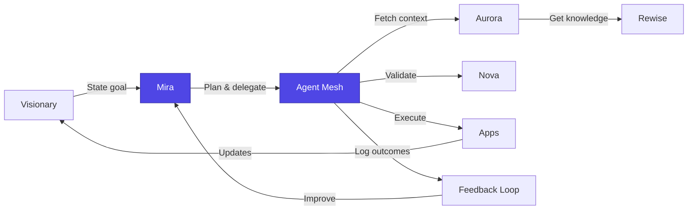
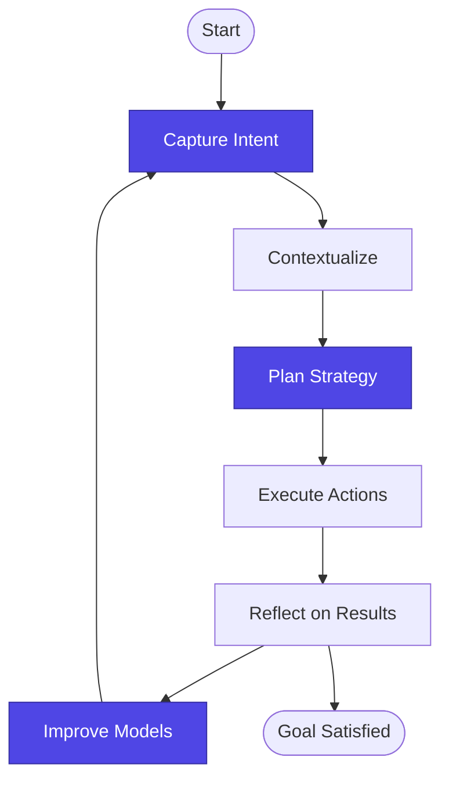
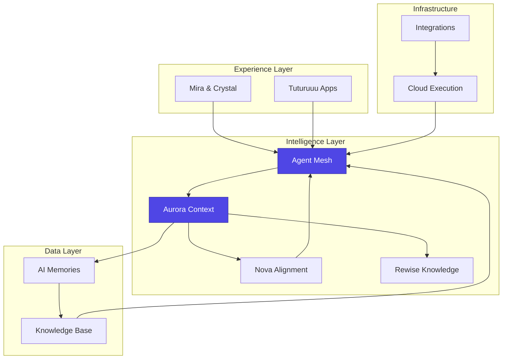

# Tuturuuu: Official Company & Product Documentation

### Executive Summary: The Third Era of Technology

Tuturuuu is not merely another productivity startup; it is our answer to a fundamental question: **What if technology existed to serve human potential instead of harvesting attention?** We are building the world's first intelligent, open-source operating system for modern work and life, with the ambition to become the "Google" of Vietnam and a global benchmark for transformative technology. Powered by Mira—our proactive AI companion and the JARVIS we envisioned—the Tuturuuu platform unifies calendars, tasks, communications, and knowledge to eliminate digital friction and return focus to the people doing the work. This is the dawn of the **Third Era of technology: the Age of Partners**, where the impossible becomes possible for everyone, everywhere.

- **Vision Slogan:** Unlocking Human Potential.
- **User-Benefit Slogan:** Your Life, In Sync.
- **Product Category Slogan:** The Intelligent OS for Modern Work.

### Our Manifesto: Core Beliefs Driving Tuturuuu

- **Focus is the new superpower.** In a world engineered for distraction, the ability to sustain deep work is the defining competitive advantage.
- **Technology must be an extension of human will, not a cage for our attention.** Engagement-driven platforms erode our best selves; we build software to reverse that trend.
- **Radical transparency and open communities win.** Foundational technology should never be a black box. Our open-source philosophy creates trust, improves security, and accelerates innovation.
- **Impact over activity.** Productivity is not about doing more; it is about creating more value. Tuturuuu exists to give people the mental space for their next breakthrough idea.
- **Potential has no postcode.** We champion a future in which brilliant ideas can emerge from any street, village, or classroom—because access to world-class tools should never be limited by geography or status.

### Mission and Vision

- **Mission (What):** Wage war on digital noise by building an intelligent, unified, and open platform that automates administrative work and eliminates context-switching friction.
- **Vision (Why):** Create a future where technology unlocks humanity's potential—liberating our collective focus so we can solve the world's most important challenges while making world-class innovation accessible to everyone, everywhere.

### The Problem We Solve: The Costs of Digital Friction

Modern professionals are hired for their minds but trapped in low-value administrative work—a silent epidemic we call the Great Betrayal of Modern Work. Digital friction exacts three distinct costs:

1. **Financial Cost:** Over **21 hours per knowledge worker each week** vanish into "work about work"—a trillion-dollar drag on global productivity.
2. **Cognitive Cost:** Fragmented tools force constant context-switching, imposing a mental tax that slashes productive output by **up to 40%** and fuels burnout.
3. **Innovation Cost:** The next breakthrough is suffocated by inboxes, status meetings, and spreadsheets. Our collective future is lost to noise.

### The Tuturuuu Solution: Entering the Age of Partners

The First Era produced passive tools; the Second Era birthed attention-harvesting platforms. Tuturuuu inaugurates the Third Era: proactive ecosystems that amplify human potential. In this paradigm the user becomes the **Visionary**, and AI acts as the intelligent **Partner**—anticipating needs, automating busywork, and protecting focus.

### Competitive Landscape: A Category of One

|  | **Fragmented & Reactive (Era 2)** | **Integrated & Proactive (Era 3)** |
| :-- | :-- | :-- |
| **Description** | A "Frankenstein stack" of separate apps requiring manual stitching and constant commands. | A unified nervous system where AI anticipates needs and orchestrates workflows. |
| **Examples** | Slack + Asana + Google Drive + Notion | **Tuturuuu** |
| **User Experience** | High cognitive load, relentless context-switching. | Seamless flow state with preserved focus. |
| **Our Moat** | Point solutions compete feature-by-feature. | We deliver a 10× integrated experience anchored by Aurora's growing context graph. |

### Product & AI Ecosystem: How We Deliver the Future

#### Application Layer — Tools for Flow

A cohesive suite that behaves like one organism:

- **Tuturuuu Calendar (Smart Calendar):** AI auto-scheduling that allocates time by deadlines, priorities, and personal work rhythms.
- **Tuturuuu Tasks (Smart Tasks):** Centralized task hub capturing actions from email, chat, and meetings, then scheduling them in Tuturuuu Calendar.
- **Tuturuuu Meet (Smart Meetings):** End-to-end meeting solution featuring collaborative planning (Tuturuuu Meet Plans), location intelligence (Where TuMeet), and AI-generated summaries with tracked actions.
- **TuMail & TuChat (Smart Communications):** Integrated communications hub where AI surfaces commitments and routes them to Tuturuuu Tasks and Tuturuuu Calendar.
- **TuDrive (Unified Storage):** Secure cloud storage woven through tasks, documents, and conversations for effortless knowledge flow.
- **TuTrack (Mindful Time Tracking):** Lightweight tracking with Pomodoro rhythms to encourage focused work and healthy breaks.

For a deep dive into our GTD-aligned daily experience, explore the [Command Center Dashboard](/platform/features/command-center-dashboard).

#### AI Core — Architecture of Intelligence

- **Mira (Soul & Voice):** The empathetic conversational interface—translating complex capabilities into a warm, trustworthy partner.
- **Aurora (Nervous System):** The contextual engine that links related emails, tasks, files, and events, creating our primary data moat.
- **Rewise (Collective Mind):** Aggregator of leading AI models (OpenAI, Gemini, Anthropic, and more) to ensure Mira always draws from the best knowledge.
- **Nova (Conscience & Forge):** Our prompt-engineering and alignment platform, shaping how Mira reasons and guarantees safety.
- **Crystal (Bridge to Humanity):** Multi-modal embodiment of Mira enabling real-time collaboration via voice, video, and screen sharing.

### Long-Term Vision: The Tuturuuu Ecosystem

Our roadmap stretches far beyond productivity checklists. We are assembling an ecosystem where every component—people, agents, data, and services—cooperates to help anyone transform ambition into reality.

#### Mira (Codename Jarvis): The Life Operating System

- **Mira** is the next-generation companion we envisioned as JARVIS—an autonomous guardian that plans, reasons, and acts on your behalf so you can simplify life and accomplish more.
- Mira synchronizes calendars, goals, finances, communications, and personal knowledge, surfacing proactive recommendations instead of passive reminders.
- She learns from context, understands intent, and orchestrates the right Tuturuuu tools—or external services—without requiring manual hand-offs.

#### Multi-Agent Intelligence Fabric

- Specialized agents (planning, finance, research, wellness, creative) collaborate through Mira to deliver end-to-end outcomes.
- Agents talk to each other via shared context graphs, ensuring that insights collected in one domain (e.g., research) immediately inform actions in another (e.g., scheduling or budgeting).
- The ecosystem adapts dynamically, deploying the minimal number of agents necessary to solve a problem while maintaining full user oversight.

#### Learning Loops & Continuous Improvement

- **AI memories** capture outcomes, preferences, and feedback, allowing the system to anticipate needs with greater precision over time.
- A **data crawler** and **internal knowledge base** ingest documents, conversations, and educational content, grounding every action in trusted information.
- **Reinforcement learning playgrounds** and Nova's prompt-engineering workflows close the loop between customer challenges and product enhancements, turning every interaction into a learning opportunity.
- Metrics, scoring, and feedback dashboards quantify impact, guiding both automated improvements and human-crafted iteration.

#### Execution & Automation Layer

- **Aurora** coordinates cloud code execution, Cron jobs, and real-time integrations so agents can take decisive, auditable actions.
- External APIs, partner platforms, and even physical devices connect through unified orchestration, ensuring Mira (our Jarvis) can reach beyond Tuturuuu when a task demands it.
- Guardrails keep automation transparent and reversible, reinforcing trust while delivering tangible outcomes.

#### Democratizing Breakthroughs

- Educational pathways and community programs share the system's capabilities with schools, startups, and enterprises, nurturing the next generation of builders.
- By lowering the barrier to world-class technology, Tuturuuu enables creators everywhere—from Ho Chi Minh City to remote villages—to solve local problems with global-grade tools.
- This long-term vision is how we intend to make the impossible possible for everyone, everywhere.

### Visualizing the Tuturuuu Ecosystem

#### End-to-End Interaction Lifecycle

#### Continuous Learning Loop

#### Layered Architecture Overview

### Technology Stack & Architecture

- **Frontend:** Next.js, React, TypeScript, Tailwind CSS.
- **Backend & Database:** Postgres, Supabase.
- **Infrastructure & Deployment:** Vercel.
- **Architecture:** Turborepo + Bun monorepo that accelerates collaboration, code sharing, and deterministic deployments. Browse the source at [https://github.com/tutur3u/platform](https://github.com/tutur3u/platform).

### Business Model & Growth Strategy: The Community Flywheel

1. **Open-Source Core:** Publishing our codebase invites global contributors, builds trust, and establishes transparent security practices.
2. **Bottom-Up Adoption (Free Tier):** A generous individual plan seeds Tuturuuu organically inside thousands of organizations.
3. **Product-Led Expansion (Pro & Business Tiers):** Teams upgrade to unlock pooled resources, expanded AI usage, and advanced controls.
4. **Top-Down Value (Enterprise & Platform API):** Broad adoption paves the way for enterprise engagements and a high-margin API exposing Nova, Rewise, and future services.

Plan tiers at a glance:

- **Free:** Mass adoption and community growth.
- **Pro:** Power users and freelancers with increased AI allowances and storage.
- **Business:** Team-centric controls, pooled usage, and enhanced security.
- **Platform API (Future):** B2B access for companies building on Tuturuuu's AI primitives.

### Team & Culture: Building for the Third Era

- **Builders, not employees.** Each teammate acts like a founder within their domain.
- **Pragmatic optimism.** We pair bold ambition with rigorous execution.
- **Relentless ownership.** Decisions come with accountability for outcomes.
- **Transparency by default.** Internal operations mirror our open-source ethos.
- **Vietnam-rooted, globally ambitious.** We build from Southeast Asia with the conviction that world-class technology can originate anywhere.

### Company Information

- **Legal Name:** CÔNG TY CỔ PHẦN TUTURUUU (TUTURUUU JOINT STOCK COMPANY).
- **Abbreviated Name:** TUTURUUU JSC.
- **Tax Code:** 0318898402.
- **Date of Operation:** 02 April 2025.
- **Registered Address:** Tầng 14, Tòa Nhà HM Town, 412 Nguyễn Thị Minh Khai, Phường 05, Quận 3, Thành phố Hồ Chí Minh, Việt Nam.
- **Tax Address:** Tầng 14, Tòa Nhà HM Town, 412 Nguyễn Thị Minh Khai, Phường Bàn Cờ, TP Hồ Chí Minh, Việt Nam.
- **Founder, CEO & Chairman:** Võ Hoàng Phúc.
- **Website:** [https://tuturuuu.com](https://tuturuuu.com).
- **Contact:** [contact@tuturuuu.com](mailto:contact@tuturuuu.com).
- **GitHub:** [https://github.com/tutur3u/platform](https://github.com/tutur3u/platform).

## Setting up

The first step to getting started with Tuturuuu is to set up your development environment.

<CardGroup cols={1}>
  <Card title="Development Setup" icon="gear" href="/build/development-tools/development">
    Learn how to set up your development environment.
  </Card>
</CardGroup>
