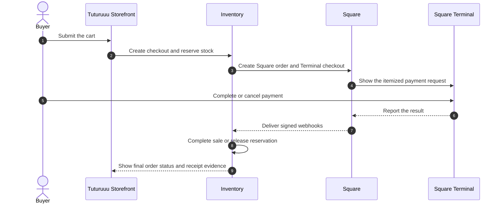
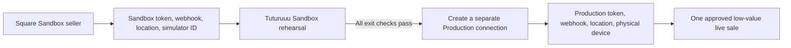

Tuturuuu connects a Storefront order to a physical **Square Terminal** through
Square's Terminal API. Customers shop in the Tuturuuu Storefront, Inventory
reserves the stock, and the Square checkout is dispatched to the selected
Terminal. An authorized operator can also send or cancel an eligible reserved
checkout from Commerce. Square processes the card-present payment and reports
the result back to Tuturuuu.

<Info>
  This integration uses Square Terminal in Connected Mode. It does not launch
  the Square Point of Sale mobile app, and connecting an account never creates
  a charge by itself.
</Info>

## Choose your guide

<CardGroup cols={2}>
  <Card
    title="Set up the account and counter"
    icon="plug"
    href="/platform/applications/inventory-square-pos/customer-setup"
  >
    A non-technical walkthrough for the Square owner, Inventory admin, and
    counter operator.
  </Card>
  <Card
    title="Rehearse in Sandbox"
    icon="flask"
    href="/platform/applications/inventory-square-pos/sandbox-testing"
  >
    Test success, cancellation, timeout, offline behavior, stock release, and
    duplicate webhooks without moving real money.
  </Card>
  <Card
    title="Synchronize catalog and stock"
    icon="arrows-rotate"
    href="/platform/applications/inventory-square-pos/catalog-sync"
  >
    Import from Square, publish from Tuturuuu, compare both sides, and resolve
    conflicts without deleting Square objects.
  </Card>
  <Card
    title="Launch Production safely"
    icon="shield-check"
    href="/platform/applications/inventory-square-pos/production-launch"
  >
    Pair the physical Terminal, run one owner-approved live sale, and apply the
    go/no-go gate.
  </Card>
  <Card
    title="Operate and verify payments"
    icon="chart-line"
    href="/platform/applications/inventory-square-pos/operations"
  >
    Read the Payments hub, reconcile transactions, and understand reservation
    and webhook behavior.
  </Card>
  <Card
    title="Troubleshoot safely"
    icon="life-ring"
    href="/platform/applications/inventory-square-pos/troubleshooting"
  >
    Follow symptom-based recovery steps without double-charging or corrupting
    stock.
  </Card>
</CardGroup>

## How one payment travels



Tuturuuu finishes a sale only after it can reconcile a verified Square payment.
If checkout creation fails, the buyer cancels, Square reports failure or expiry,
or the local reservation expires, Tuturuuu releases the reserved stock.

## The Payments control center

Open:

```text
https://inventory.tuturuuu.com/<workspace-id>/payments
```

The page is read-only by default. Use the compact edit control only when you
intend to change settings or start a catalog synchronization.

| Payments section | What it answers |
| --- | --- |
| **Connect & set up** | Is the selected Square environment connected, signed, located, and routed to a device? |
| **Catalog sync** | Which products and variations are linked, where they originated, and which conflicts need review? |
| **Test & verify** | Did a provider checkout create one transaction with the expected amount, status, and evidence? |

## Sandbox and Production stay separate



| Sandbox | Production |
| --- | --- |
| Test seller, credentials, objects, and simulator device IDs | Real seller, credentials, catalog, location, and physical Terminal |
| No real card or Square hardware | Real card-present processing and possible fees |
| Safe place for demo CRUD, retries, cancellations, and timeouts | Change only approved records and run only approved payments |
| No physical receipt | Verify the actual Terminal and printed or digital receipt |

<Warning>
  Never copy a Sandbox token, object ID, location ID, webhook signature key, or
  simulator device ID into Production. Square keeps the environments isolated,
  and Tuturuuu checks that the saved connection matches the selected
  environment.
</Warning>

## Safety contract

Tuturuuu provides these protections:

- Square settings and synchronization controls start in read-only mode.
- Checkout readiness fails closed when the connection, webhook key, location,
  or device is missing.
- Square catalog synchronization is additive and never deletes or archives
  Square catalog objects.
- Duplicate and out-of-order Square webhooks are reconciled idempotently.
- A reserved checkout expires after 15 minutes; cancellation, failure, and
  expiry release its stock.
- A Production charge requires a person to send a real order and a buyer to
  finish payment on the Terminal.

People still own these decisions:

- which Square seller, location, catalog records, and device belong to the
  workspace;
- whether a Production sync or payment is authorized;
- the amount, card, refund policy, and staff member for the first live test;
- business, banking, tax, tip, receipt, and hardware configuration in Square.

## Definition of fully working

Call the integration ready only when all of these are true:

1. Sandbox connection shows all five setup checks complete.
2. The Sandbox test matrix passes for success, cancel, timeout, and offline
   simulation, with stock changing exactly once in every path.
3. Catalog links are visible and have no unexplained conflict or error state.
4. Production uses its own OAuth connection, webhook subscription, location,
   and paired Terminal.
5. One owner-approved low-value Production sale matches in Tuturuuu, Square,
   the Terminal receipt, stock, and finance exactly once.
6. Counter staff know the stop-and-reconcile procedure for an uncertain payment.

For implementation details and automated coverage, use the
[Square Terminal engineering runbook](/build/devops/square-terminal-integration).
