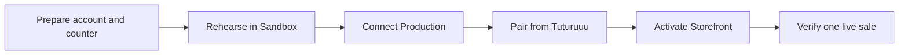

This guide takes a store owner or manager from a prepared Square account to a
physical Square Terminal that can receive orders from Tuturuuu Inventory.
Complete the steps in order from **Inventory → Payments → Setup → Square**.

<Info>
  Tuturuuu never creates a production charge just because you connect Square,
  save credentials, synchronize products, or pair a Terminal. A charge starts
  only when an authorized operator sends a real order to the paired device and
  the buyer completes payment.
</Info>

<CardGroup cols={2}>
  <Card
    title="Open Inventory Payments"
    icon="credit-card"
    href="https://inventory.tuturuuu.com"
  >
    Select the workspace, then open Payments and the Square Production tab.
  </Card>
  <Card
    title="Square Terminal setup"
    icon="tablet"
    href="https://squareup.com/help/us/en/article/6535-set-up-square-terminal"
  >
    Follow Square's hardware, power, network, update, and receipt-paper guide.
  </Card>
</CardGroup>

## The launch path

The Payments page detects the connection, webhook key, location, and paired
device automatically. Hardware readiness and the first live payment require a
person at the counter.

## Before you start

Have these people and items available:

| Owner | Counter operator | Hardware |
| --- | --- | --- |
| Square account owner login and approval | Permission to manage Inventory Payments | Square Terminal and power supply |
| Confirmed bank, business, tax, tip, and receipt settings | A clearly named low-value test item | Reliable Wi-Fi or Ethernet |
| Approval for one real test payment and refund owner | Access to Tuturuuu and Square Dashboard | Receipt paper and a supported payment card |

<Warning>
  Production moves real money and can incur processing fees. Do not run the
  live check until the store owner approves the exact item, amount, card, and
  person responsible for the test and any refund.
</Warning>

## Set up the counter

<Steps>
  <Step title="Prepare Square and the physical Terminal">
    Confirm the Production Square seller and location. Power and charge the
    Terminal, install its updates, load receipt paper, and connect it to stable
    Wi-Fi or Ethernet. Networks that require a browser sign-in page are not
    suitable. Review Square's
    [hardware setup](https://squareup.com/help/us/en/article/6535-set-up-square-terminal)
    and [network requirements](https://squareup.com/help/us/en/article/8348-set-up-network-requirements-for-square-hardware).
  </Step>
  <Step title="Finish the Sandbox rehearsal">
    In Inventory Payments, select **Sandbox** and complete every detected check.
    Square Sandbox uses simulator device IDs rather than pairing a physical
    Terminal through the Devices API. Rehearse success, cancellation, failure,
    and expiry without moving money. Confirm canceled, failed, and expired
    orders release reserved stock.
  </Step>
  <Step title="Connect the Production seller">
    Switch to **Production**, enable the compact edit control, and save the
    Production application credentials. Use **Connect OAuth** to authorize the
    correct Square seller, then confirm the merchant and environment shown in
    the read-only summary. Never reuse Sandbox credentials in Production.
  </Step>
  <Step title="Select the location and verify webhooks">
    Select the Square location that owns this counter, currency, reporting, and
    receipts. In Square Developer Console, subscribe the Production webhook URL
    shown by Tuturuuu to the required Terminal, payment, device, catalog,
    inventory, and authorization events. Save its matching signature key and
    send a Square test event. Square should report an HTTP 200 response.
  </Step>
  <Step title="Create the pairing code inside Tuturuuu">
    In the Terminal settings card, name the counter and choose **Create pairing
    code**. Enter that code on the physical Terminal within five minutes. If it
    expires, create a new Tuturuuu code. Wait for pairing, refresh the devices,
    select the paired Terminal as the default, and save.

    <Warning>
      Do not create the code in Square Dashboard. Dashboard device codes are not
      compatible with Terminal API. The code must come from Tuturuuu, which uses
      Square's Devices API with the `TERMINAL_API` product type.
    </Warning>
  </Step>
  <Step title="Activate the Storefront and catalog">
    Confirm the intended Storefront belongs to the same Inventory workspace and
    uses **Square Terminal** checkout. Review catalog links and stock before
    opening sales. Square synchronization from Tuturuuu is additive and must not
    delete Square-side objects; review conflicts instead of overwriting
    uncertain changes.
  </Step>
  <Step title="Run one controlled live payment">
    With the owner present, create one order for the approved low-value item.
    Send it to the Terminal once and complete payment. Do not double-click or
    retry while the checkout is pending. Keep Tuturuuu Payments and Square
    Dashboard open together until every verification below passes.
  </Step>
</Steps>

## First-payment verification

Do not call the counter live until every row matches:

| Evidence | Expected result |
| --- | --- |
| Tuturuuu checkout | Completed, with one Square order, Terminal checkout, payment ID, and receipt reference |
| Square Payments | One completed payment at the intended location for the exact amount and currency |
| Terminal and receipt | One approval and a matching printed or digital receipt |
| Inventory | The reservation is consumed and stock changes exactly once |
| Finance | The sale is recorded exactly once |
| Webhooks | Square delivery succeeds and Tuturuuu shows no unresolved payment state |

If the owner wants the test reversed, use the store's approved refund process
and verify the refund in both systems. Do not create a second payment to
"balance" an uncertain first payment.

## Safe troubleshooting

<AccordionGroup>
  <Accordion title="The pairing code expired">
    Create a new code from Tuturuuu and enter it promptly. Do not replace it with
    a code from Square Dashboard.
  </Accordion>
  <Accordion title="The Terminal does not show the payment">
    Confirm the Terminal is online, paired to the selected Production seller and
    location, and saved as the workspace's default device. Then check the
    transaction status before sending anything again.
  </Accordion>
  <Accordion title="The checkout is pending or the result is uncertain">
    Stop retrying. Compare Tuturuuu transaction evidence, Square Payments, and
    webhook delivery. Reconcile the existing checkout before accepting another
    payment for the same order.
  </Accordion>
  <Accordion title="The Terminal loses its network">
    Restore Wi-Fi or Ethernet and re-check the existing checkout. Tuturuuu's
    verified launch path requires connected checkout. Square documents offline
    processing as an opt-in beta capability; do not rely on it unless Tuturuuu
    explicitly adds and verifies that workflow for the workspace.
  </Accordion>
</AccordionGroup>

## Official references

- [Pair a POS application with Square Terminal](https://developer.squareup.com/docs/terminal-api/pos-integration)
- [Connect a Square Terminal to a POS application](https://developer.squareup.com/docs/terminal-api/integrate-square-terminal)
- [Square webhook overview](https://developer.squareup.com/docs/webhooks/overview)
- [Square hardware network requirements](https://squareup.com/help/us/en/article/8348-set-up-network-requirements-for-square-hardware)
- [Tuturuuu operator and engineering runbook](/build/devops/square-terminal-integration)
