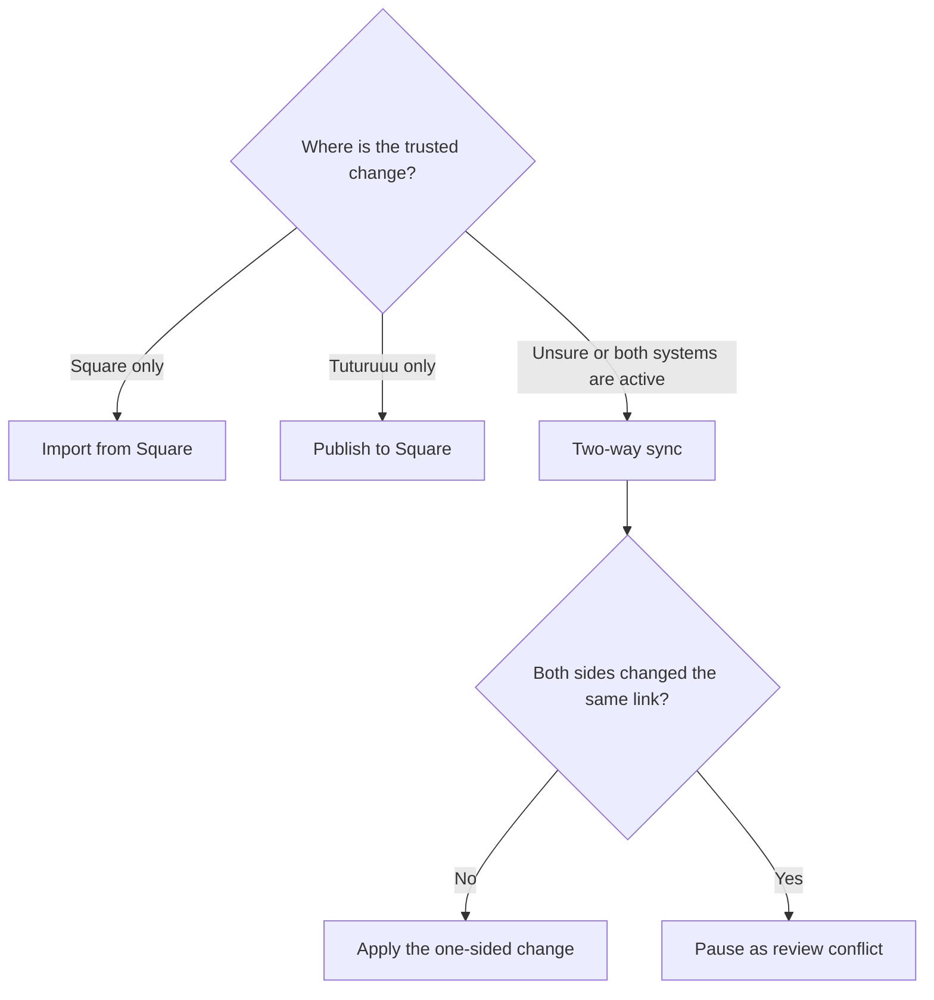
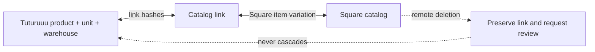

Tuturuuu links an Inventory product/unit/warehouse combination to a Square item
variation at the selected Square location. The link stores both sides' last
known state so two-way sync can distinguish a safe one-sided change from a
conflict.

<Info>
  Synchronization controls are locked by default. Open **Payments → Catalog
  sync**, review the selected environment and linked records, then use the
  compact edit control to enable an intentional sync action.
</Info>

## Choose the right direction



| Action | Use it when | Result |
| --- | --- | --- |
| **Import from Square** | Square is the current source of truth or this is the first Sandbox discovery | Imports items, variations, prices, and physical counts; creates or updates local links |
| **Publish to Square** | The approved change was made in Tuturuuu | Batch-upserts Tuturuuu items and variations, then writes physical counts at the selected location |
| **Two-way sync** | Staff use both systems or the source is uncertain | Applies safe one-sided changes and marks simultaneous edits for review |

<Warning>
  Confirm **Sandbox** or **Production** before every sync. A Production catalog
  sync changes the real seller catalog and inventory counts even though it does
  not charge a card.
</Warning>

## Non-destructive Square behavior

Tuturuuu deliberately does not call a Square catalog delete endpoint and does
not archive Square catalog objects as part of sync.

- Square-only variations remain attached when Tuturuuu updates a known item.
- A Square-side deletion marks the local link as **Square deletion preserved**
  for review; it does not delete the local product or stock.
- A simultaneous local and remote edit becomes **Review conflict**.
- A failed row stays visible as **Sync error** with its last error.
- Only records that the operator explicitly synchronizes are created or
  updated.



## What is synchronized

| Tuturuuu | Square | Notes |
| --- | --- | --- |
| Product name and description | Catalog item name and description | Trimmed display data; review branding before Production publish |
| Unit or sellable variant | Item variation | One product can have several variation links |
| SKU | Variation SKU | Use stable, unique SKUs where possible |
| Price and currency | Square Money amount and currency | Currency-aware integer conversion happens at the integration boundary |
| Warehouse stock row | Physical inventory count at selected location | The chosen Square location is part of the routing context; Tuturuuu Inventory stores whole-unit counts |
| Link origin and last hashes | Link metadata in Tuturuuu | Supports conflict detection and observability |

Do not manually multiply or divide prices before sync. Enter and review the
human-readable amount in Tuturuuu; the integration converts it to Square's
currency-aware integer Money representation. If USD 10.00 appears as USD 0.10
or USD 1,000.00, stop and investigate before another sync.

<Warning>
  Square can report fractional physical counts, while Tuturuuu Inventory
  currently stores whole units. Import still creates the product and variation
  link, but it preserves an existing local count or initializes a new row at
  zero and marks that link **Sync error** for review. Tuturuuu does not round the
  Square quantity or write anything back to Square automatically.
</Warning>

## Safe first synchronization

<Steps>
  <Step title="Verify the environment and location">
    Open **Payments → Connect & set up** and read the Square summary. Confirm the
    environment, seller connection, and location. Return to **Catalog sync** and
    confirm the same environment badge.
  </Step>
  <Step title="Start with one clearly labeled demo item">
    In Sandbox, use a unique demo name and SKU. In Production, use an owner-
    approved item and review its current Square record before any action.
  </Step>
  <Step title="Import from Square first">
    For a seller with an existing Square catalog, choose **Import from Square**.
    Review the summary and linked record list before publishing anything back.
  </Step>
  <Step title="Inspect every linked row">
    Match the Tuturuuu product, Square item and variation name, SKU, shortened
    variation ID, origin, status, and last synchronized date. A processed count
    is not proof; the visible linked row is the evidence.
  </Step>
  <Step title="Publish a controlled Tuturuuu change">
    Change one field on the demo record, then choose **Publish to Square**.
    Verify the exact field and physical count in the Square Dashboard.
  </Step>
  <Step title="Run two-way comparison">
    After both one-way directions work, choose **Two-way sync**. Review any
    conflict rather than repeatedly syncing until it disappears.
  </Step>
</Steps>

## Read the sync summary

| Metric | Meaning |
| --- | --- |
| Products processed | Item-level records inspected or changed in the run |
| Products created | New Tuturuuu products created from Square |
| Variations changed | Variation links imported or published |
| Stock rows changed | Physical inventory counts imported or published |
| Needs review | Simultaneous edits or records that require an operator decision |
| Square deletions preserved | Remote deletions detected without local deletion |

Counts describe operations, not unique products. One imported product can update
both its variation and its physical stock row, so five linked products can
legitimately produce ten imported changes. Use the linked-record list to count
actual relationships.

## Link statuses

| Status | Meaning | Safe next action |
| --- | --- | --- |
| **Linked** | The last known states agree | No action unless a new business change is approved |
| **Review conflict** | Both sides changed since the last shared state | Compare Square and Tuturuuu, choose the authoritative value, then run one directional sync |
| **Sync error** | A Square or validation request failed | Read the row error, fix credentials/data, and retry only that intended direction |
| **Square deletion preserved** | The linked Square object is absent or deleted | Ask the owner whether to recreate/publish or intentionally leave it disconnected; do not delete the local product |

## Webhook-driven updates

The webhook subscription includes:

- `catalog.version.updated`, which asks Tuturuuu to reconcile catalog changes;
- `inventory.count.updated`, which asks Tuturuuu to reconcile physical counts.

Square might not emit an inventory event when a count is written to the same
value it already had. To verify this path in Sandbox, change a demo count to a
different value and then restore it intentionally.

Webhooks can be duplicated or delivered out of order. A duplicate event should
not create a duplicate product, link, stock change, or checkout.

## Conflict-resolution worksheet

For each conflict, record:

```text
Tuturuuu product and unit:
Square item and variation ID:
Environment and location:
Last synchronized at:
Tuturuuu name / SKU / price / count:
Square name / SKU / price / count:
Approved source of truth:
Approver:
One-way sync selected:
Final values verified in both systems:
```

Never solve a price or stock conflict by deleting the Square object. Preserve
the audit trail and apply one approved direction.

## Production catalog gate

Before enabling Production sync actions:

- the Square owner confirms the seller and location;
- Sandbox import, publish, two-way, and conflict tests pass;
- all demo names and SKUs are unmistakable;
- the visible price and currency match exactly on both sides;
- the physical count belongs to the selected location;
- every linked row is **Linked** or has a documented review decision;
- the operator understands that Production sync changes real catalog and stock
  data but never deletes Square objects.
