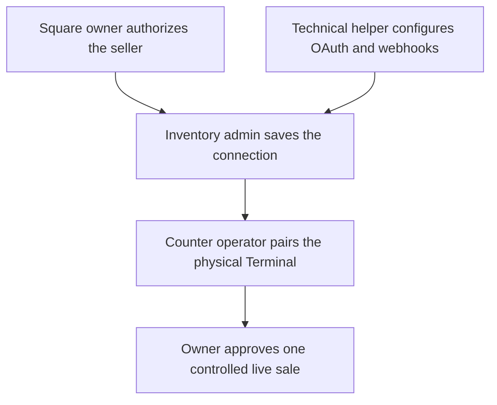
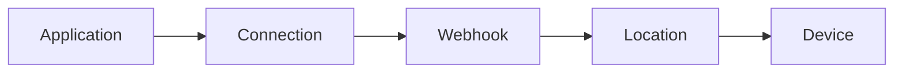

This guide prepares the Square account, Tuturuuu workspace, webhook, location,
and device route. Start in Sandbox even when the store already owns a Square
Terminal.

<Warning>
  Do not paste credentials, tokens, application secrets, or webhook signature
  keys into chat, tickets, or documents. Enter them only in the Square settings
  editor inside the intended Inventory workspace.
</Warning>

## Who should be present

| Role | Owns | Does not need |
| --- | --- | --- |
| **Square account owner** | Seller authorization, business settings, locations, banking, taxes, tips, receipts, and approval for a live test | Tuturuuu engineering access |
| **Inventory workspace admin** | Payments setup, environment selection, catalog links, Storefront checkout mode, and transaction verification | The owner's Square password after OAuth is approved |
| **Counter operator** | Terminal power, network, paper, pairing code entry, and the controlled first sale | Developer Console access |
| **Technical helper** | Square application, OAuth redirect, webhook subscription, and diagnosing rejected events | Permission to run a live charge |

One person can hold several roles, but the Square owner should explicitly approve
the Production seller, location, item, amount, and payment card.

## Prepare the account and hardware

Have these items ready before opening the setup editor:

- a Square seller in a country and currency supported by Square;
- owner access to the [Square Developer Console](https://developer.squareup.com/apps);
- an Inventory workspace where you can manage Payments and Storefronts;
- a Square location dedicated to or clearly associated with this counter;
- a Square Terminal, power supply, current software, and receipt paper for
  Production;
- reliable Wi-Fi or Ethernet without a browser-based captive portal;
- a clearly named Sandbox demo product with known price and stock;
- a clearly named, low-value Production test item for the later go-live check.

Review Square's official
[Terminal setup guide](https://squareup.com/help/us/en/article/6535-set-up-square-terminal)
and
[hardware network requirements](https://squareup.com/help/us/en/article/8348-set-up-network-requirements-for-square-hardware)
before the launch day.

## Open the correct Tuturuuu workspace

1. Sign in to [Inventory](https://inventory.tuturuuu.com).
2. Select the customer's workspace.
3. Open **Payments** in the sidebar.
4. Stay on **Connect & set up**.
5. Choose **Square POS**.
6. Confirm the environment badge before changing anything.

The page shows five detected checks:

Use the compact **Edit Square settings** button only when you are ready to
complete the next check. Stop editing afterward so accidental changes are less
likely.

## Fast handoff when Production is preconfigured

If a technical helper already prepared Production, do not paste or rotate the
credentials again. Keep the page read-only and verify these visible facts with
the Square account owner:

- the environment is **Production**;
- the masked connection and webhook checks are complete;
- the location is the real owner-approved selling location;
- **Catalog sync** shows the expected Production links and no unexplained
  conflicts;
- the only incomplete check is **Device**.

The customer can then skip credential entry and continue directly to
[pairing the physical Terminal](/platform/applications/inventory-square-pos/production-launch#pair-the-physical-terminal).
The owner still needs to confirm business, bank, tax, tip, and receipt settings
inside Square. Tuturuuu cannot safely choose those business settings on the
customer's behalf.

## Part 1: configure Sandbox

<Steps>
  <Step title="Create or select the Square application">
    Open the [Square Developer Console](https://developer.squareup.com/apps),
    create an application for the Tuturuuu integration, and keep the environment
    toggle on **Sandbox**. Use a recognizable name such as `Tuturuuu Sandbox`.

    In Inventory, choose **Sandbox**, enable editing, and copy the Sandbox
    Application ID and Application secret into **Square app credentials**.
    Save them before starting OAuth.
  </Step>
  <Step title="Register the OAuth redirect URL">
    Copy the **OAuth redirect URL** displayed by Inventory. In the Square
    application's Sandbox OAuth settings, add that exact HTTPS URL as an
    authorized redirect.

    Do not type the URL from memory. The scheme, domain, path, and trailing
    characters must match what Inventory displays.
  </Step>
  <Step title="Authorize the Sandbox seller">
    Choose **Connect OAuth** in Inventory. Sign in to or select the intended
    Sandbox test seller and approve the requested permissions. Return to
    Inventory and confirm the read-only connection summary shows a token ending
    in four characters.

    OAuth is preferred because the connection can refresh and the seller can
    revoke it. A manual Sandbox token is available for a controlled rehearsal,
    but it must still belong to the same application and environment.
  </Step>
  <Step title="Create the Sandbox webhook subscription">
    Copy the **Webhook notification URL** shown in Inventory. In the Square
    application's **Webhooks** section, create a Sandbox subscription with that
    exact URL and these seven events:

    - `device.code.paired`
    - `terminal.checkout.created`
    - `terminal.checkout.updated`
    - `payment.updated`
    - `oauth.authorization.revoked`
    - `catalog.version.updated`
    - `inventory.count.updated`

    Copy the subscription's signature key into Inventory and save. Send a Square
    test event and confirm its delivery returns a `2xx` response. Square can
    deliver the same event more than once, so duplicate delivery is expected and
    handled idempotently.
  </Step>
  <Step title="Select the Sandbox location">
    Refresh locations in Inventory and choose the test location owned by the
    Sandbox seller. Confirm its country and currency match the rehearsal.
    Catalog stock counts are associated with this selected Square location.
  </Step>
  <Step title="Select a Sandbox simulator device">
    Square Sandbox cannot pair real hardware through the Devices API. Paste a
    supported Terminal simulator device ID into the Sandbox device field and
    save it as the default. Start with the success simulator from Square's
    [current Sandbox test values](https://developer.squareup.com/docs/devtools/sandbox/testing#terminal-api-checkouts).
  </Step>
</Steps>

<Check>
  The Sandbox guide should now show **5/5 checks complete**. Continue with the
  [Sandbox test plan](/platform/applications/inventory-square-pos/sandbox-testing)
  before creating any Production connection.
</Check>

## OAuth permissions

Tuturuuu requests only the permissions needed for the Terminal, orders,
payments, catalog, and inventory workflows:

| Workflow | Square permissions |
| --- | --- |
| Seller and Terminal | `MERCHANT_PROFILE_READ`, `DEVICE_CREDENTIAL_MANAGEMENT` |
| Orders | `ORDERS_READ`, `ORDERS_WRITE` |
| Payments | `PAYMENTS_READ`, `PAYMENTS_WRITE` |
| Catalog | `ITEMS_READ`, `ITEMS_WRITE` |
| Inventory counts | `INVENTORY_READ`, `INVENTORY_WRITE` |

If the customer declines a required permission, the corresponding readiness
check or API action fails closed. Re-authorize the correct seller instead of
adding a second unrelated token.

## Part 2: create a separate Production connection

Do this only after Sandbox exit criteria pass.

<Steps>
  <Step title="Switch both systems to Production">
    In Square Developer Console, switch the application to **Production**. In
    Inventory, switch the Square setup guide to **Production**. Verify both
    environment labels before copying anything.
  </Step>
  <Step title="Repeat credentials, OAuth, and webhook setup">
    Save the Production Application ID and secret, register the Production OAuth
    redirect URL, authorize the real seller, and create a separate Production
    webhook subscription using the URL shown in Inventory. Save the Production
    signature key. Never reuse a Sandbox credential or key.
  </Step>
  <Step title="Choose the real selling location">
    Select the Square location that owns the counter, currency, receipts, tax,
    and reporting. Ask the Square owner to verify the location name before
    saving.
  </Step>
  <Step title="Prepare the physical Terminal">
    Power the Terminal, install updates, load paper, and connect to the final
    counter network. The physical pairing happens in the Production launch
    guide, not in Sandbox.
  </Step>
</Steps>

## Connection review

Before pairing, the read-only Production summary should show:

| Field | Expected |
| --- | --- |
| Environment | Production |
| Connection | Token ending in four characters |
| Square application | The Production Application ID |
| Location | The owner-approved counter location |
| Default terminal | Not configured until physical pairing |
| Webhook verification | Signature key ending in four characters |

If any row is unexpected, stop and correct it before creating a device code.
Continue with the
[Production launch guide](/platform/applications/inventory-square-pos/production-launch).

## Official Square references

- [Square Sandbox overview](https://developer.squareup.com/docs/devtools/sandbox/overview)
- [OAuth API overview](https://developer.squareup.com/docs/oauth-api/overview)
- [Square webhooks overview](https://developer.squareup.com/docs/webhooks/overview)
- [Connect Square Terminal to a POS application](https://developer.squareup.com/docs/terminal-api/integrate-square-terminal)
- [Square hardware network requirements](https://squareup.com/help/us/en/article/8348-set-up-network-requirements-for-square-hardware)
