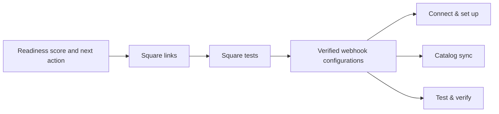
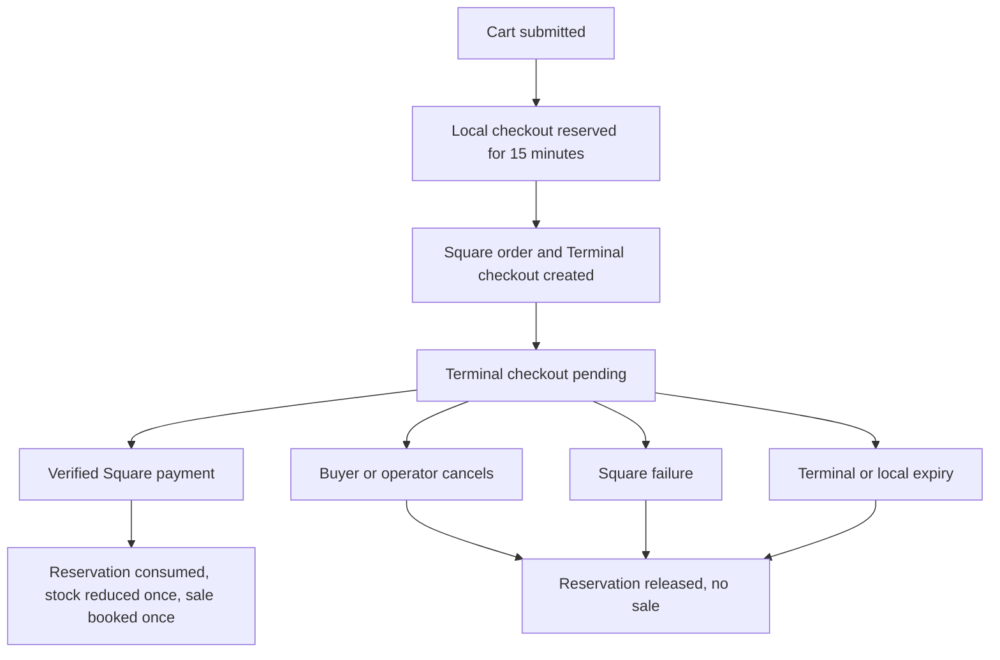

The Payments hub is the customer's control center for Square and Polar. It
combines provider readiness, catalog-link observability, and recent transaction
evidence without exposing secret values.

Open:

```text
https://inventory.tuturuuu.com/<workspace-id>/payments
```

## Read the overview first



| Overview signal | What it means | What it does not mean |
| --- | --- | --- |
| Square links | Visible Tuturuuu-to-Square variation links | Every linked value is correct; inspect status and values |
| Square tests | Recent checkouts have Square status evidence | The physical Production Terminal is certified |
| Verified webhooks | A Square connection has a saved signature key | Every Square delivery succeeded; check Square delivery history during incidents |
| Readiness score | The detected setup and test prerequisites are progressing | The owner has approved a Production charge |

## Connect & set up

The settings summary is intentionally read-only. It displays the environment,
masked connection, application, location, default device, and masked webhook
signature state.

Use **Edit Square settings** only to perform an approved change. Tuturuuu opens
a focused dialog with **App & OAuth**, **Connection & webhook**, and **Location
& terminal** tabs. Before saving, read the environment label again. Close the
dialog and verify the read-only summary after every change. Each incomplete
setup accordion also opens the exact tab required for that step.

The five setup checks are:

1. Square application credentials, or a ready manual connection.
2. A ready OAuth or manual token connection.
3. A saved webhook signature key.
4. A selected Square location.
5. A Sandbox simulator ID or Production paired device.

Readiness fails closed when a required check is missing.

## Catalog sync

The catalog panel shows:

- selected Square environment;
- last run status and time;
- products, variations, stock, conflict, and preservation metrics;
- every visible linked variation, including its Tuturuuu product, Square item,
  variation, SKU, shortened variation ID, origin, state, and last sync date;
- row-specific errors when a link cannot synchronize.

Sync actions remain locked until an operator chooses **Enable sync actions**.
See [Catalog and stock synchronization](/platform/applications/inventory-square-pos/catalog-sync)
before running a Production action.

## Test & verify

Each recent provider row shows the customer or public order reference, provider,
environment, provider status, observed time, amount, failure reason when
available, and a receipt link when Square supplies one.

The transaction view intentionally mixes Square and Polar evidence so a seller
can verify all payment providers in one place. Use the provider badge and
environment label before interpreting a status.

## Checkout and stock lifecycle



| State | Operator interpretation | Stock behavior |
| --- | --- | --- |
| Reserved | Tuturuuu is holding sellable quantity while checkout starts | Available stock is temporarily reduced |
| Pending | Square has not produced a final result | Keep the reservation; do not create a replacement order |
| Cancel requested | Square accepted cancellation but a final webhook may still be arriving | Wait and reconcile the same checkout |
| Completed / paid | A verified Square payment completed | Reservation is consumed and stock changes once |
| Canceled / failed / expired | No successful sale should be booked | Reservation releases and stock returns once |

Checkout reads, new checkout creation, and the scheduled expiry sweep reconcile
stale 15-minute reservations. Operators can also cancel an eligible Square
checkout from the Inventory Commerce surface.

## Transaction reconciliation

Use this procedure whenever the customer or operator is unsure whether a payment
finished:

<Steps>
  <Step title="Stop new attempts">
    Do not resend, reload into a new order, accept a second card, or manually
    restore stock. Preserve the current checkout for investigation.
  </Step>
  <Step title="Read Tuturuuu evidence">
    Note the public order reference, provider, environment, status, observed
    time, total, failure reason, and receipt link. Record the current stock and
    reservation state.
  </Step>
  <Step title="Read Square evidence">
    In the matching Sandbox or Production Square Dashboard, search the same
    time, location, amount, and receipt. Determine whether a payment was
    completed, canceled, or absent.
  </Step>
  <Step title="Check webhook delivery">
    In Square Developer Console, inspect the matching environment's webhook
    delivery. A successful delivery receives `2xx`. A duplicate delivery is
    acceptable; different final business state is not.
  </Step>
  <Step title="Choose one final path">
    If Square shows a completed payment, reconcile that payment and do not retry.
    If Square proves no payment and the checkout is pending, cancel it or allow
    it to expire. Verify stock after the final status arrives.
  </Step>
</Steps>

## Duplicate and out-of-order webhooks

Square may deliver the same webhook more than once and may deliver related
events out of order. Tuturuuu verifies the signature against the exact webhook
URL and raw request body, stores provider identifiers, and reconciles the event
idempotently.

A healthy duplicate-delivery result looks like this:

| Evidence | Expected count |
| --- | --- |
| Square webhook delivery rows | One or more |
| Tuturuuu checkout | One |
| Square order / Terminal checkout / payment linked to it | One each |
| Completion transition | One |
| Stock consumption or release | One |
| Finance sale | At most one |

## Opening, daily, and weekly checks

### Before opening the counter

- Terminal is online, charged, updated, and has paper.
- Payments shows the intended Production seller, location, and default device.
- The latest Production webhook test or recent delivery is healthy.
- No prior checkout is pending or uncertain.
- High-risk catalog links have no conflict, error, or remote-deleted state.
- The operator knows who owns refunds and incident escalation.

### During the day

- Submit each order once.
- Match the Terminal amount before the buyer taps a card.
- Stop after any uncertain result; reconcile before another attempt.
- Use Square's normal receipt and refund process.
- Never change Production environment, location, or device during an active
  checkout.

### End of day

- Compare completed Tuturuuu Square rows with Square Payments for the location.
- Investigate pending, canceled, failed, and expired rows.
- Compare sold quantities with Inventory stock and reservations.
- Confirm finance entries are not duplicated.
- Record any refund or chargeback workflow separately.

### Weekly

- Review OAuth connection health and Square authorization status.
- Check webhook delivery failures and retries.
- Review catalog conflict, error, and remote-deleted links.
- Confirm the selected Terminal and location still match the counter.
- Re-run Sandbox regression tests after material app, catalog, or workflow
  changes.

## Escalation packet

Send support this information without secrets:

```text
Workspace name and ID:
Sandbox or Production:
Square seller and location name:
Terminal name:
Tuturuuu order reference:
Date, time, and timezone:
Amount and currency:
Tuturuuu status and failure reason:
Square payment status and receipt URL, if present:
Webhook event type, event ID, response code, and retry number:
Stock before and after:
Actions already taken:
Screenshot with tokens and customer PII redacted:
```

For symptom-specific recovery, continue to
[Troubleshooting Square POS](/platform/applications/inventory-square-pos/troubleshooting).
