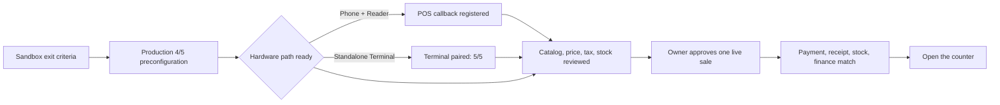
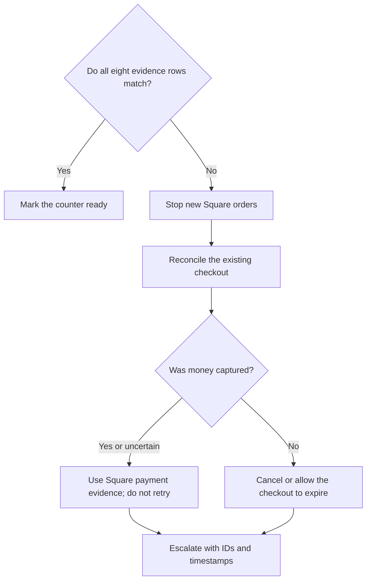

Production launch is the only part of this guide that can move real money. It
requires the Square account owner, an Inventory workspace admin, the intended
Square hardware, and the counter operator to work through the same checklist.

<Warning>
  A Production payment can incur Square processing fees. Get explicit approval
  for the seller, location, item, amount, card, operator, and refund owner before
  creating the checkout. Tuturuuu never runs this test automatically.
</Warning>

## Launch gates



Do not skip a gate because the Sandbox test passed. Sandbox cannot prove the
real seller, physical device, counter network, or receipt behavior.

## Preflight checklist

### Square owner

- [ ] Legal business and bank details are complete in Square.
- [ ] The intended selling location, currency, taxes, tips, and receipt settings
  are correct.
- [ ] The Square application is in Production and authorizes this seller.
- [ ] The owner approves one clearly named low-value test item and exact amount.
- [ ] The owner decides whether and how the test will be refunded afterward.

### Inventory admin

- [ ] The Payments page shows **Production**.
- [ ] Application, connection, webhook, and location checks are complete.
- [ ] The selected location matches the owner's intended counter.
- [ ] The Production webhook has the required seven events and its test delivery
  returns `2xx`.
- [ ] Catalog links, price, currency, tax, and stock are reviewed.
- [ ] The intended Storefront uses **Square POS app + Reader** or **Square Terminal**, matching the physical hardware.

### Counter operator

- [ ] The phone/Reader or standalone Terminal is powered, charged, updated, and ready for receipts.
- [ ] Wi-Fi or Ethernet is stable and does not require a browser sign-in page.
- [ ] A backup connection and Square login are available if the network fails.
- [ ] The operator knows not to retry an uncertain payment.

## Choose the Production hardware path

<Tabs>
  <Tab title="Phone or tablet + Reader">
    Use this path for the customer's Square POS app, Bluetooth/contactless and
    chip Reader, or Tap to Pay. The phone never appears in **Refresh terminals**.

    <Steps>
      <Step title="Select Phone or tablet with Reader">
        Open **Payments → Connect & set up → Square POS → Edit Square settings →
        Hardware & POS**, choose **Production**, then select **Phone or tablet
        with Reader**.
      </Step>
      <Step title="Save the selling location">
        Select the same Production location currently signed in on Square POS.
        A location mismatch is rejected by Square and by Tuturuuu verification.
      </Step>
      <Step title="Register the exact callback URL">
        Copy the read-only callback URL from Inventory. In
        [Square Developer Console](https://developer.squareup.com/apps), open the
        Production application, choose **Point of Sale API**, paste it into
        **Web Callback URL**, and save. Do not add, remove, or infer a trailing
        slash.
      </Step>
      <Step title="Prepare Square POS">
        Install or update Square POS on the phone, sign in to the saved location,
        and connect the Reader or enable Tap to Pay. The displayed phone name and
        Square device ID are only support evidence; they are not entered into
        Tuturuuu Terminal routing.
      </Step>
      <Step title="Enable the Storefront">
        Set the Storefront checkout mode to **Square POS app + Reader**. Open the
        Storefront on that same phone. When submitted, Tuturuuu opens Square POS
        with the exact minor-unit amount and card tender selected.
      </Step>
    </Steps>

    Tuturuuu accepts the callback only when its random request state matches the
    reserved order. It then retrieves the returned Square Order and Payment and
    verifies completed status, card tender, location, currency, and exact amount
    before consuming stock. Cancellation releases the reservation. A missing or
    unverifiable online transaction ID stays in review and never reduces stock.
  </Tab>
  <Tab title="Standalone Square Terminal">
    Use this path only for a Terminal or Handheld that receives a remote
    Terminal API checkout prompt.

## Pair the physical Terminal

<Steps>
  <Step title="Open the Production setup">
    In the correct workspace, open **Payments → Connect & set up → Square POS**
    and select **Production**. Choose **Edit Square settings**, then open
    **Location & terminal**. The dialog separates physical Production pairing
    from the Sandbox simulator route and presents the four pairing steps in
    order.
  </Step>
  <Step title="Choose the location and name the counter">
    In step 1, choose the Square location that will receive this counter's
    in-person payments. In step 2, use a durable name such as `Front counter`,
    `Convention booth A`, or `Warehouse pickup`.

    The name should tell support which physical Terminal is receiving an order.
  </Step>
  <Step title="Create the pairing code in Tuturuuu">
    Choose **Create pairing code**. Tuturuuu asks Square's Devices API for a code
    with product type `TERMINAL_API` at the selected location.

    <Warning>
      Do not create a generic device code in Square Dashboard. Dashboard codes
      are not compatible with Terminal API Connected Mode.
    </Warning>
  </Step>
  <Step title="Enter the code on the Terminal">
    Tuturuuu displays the code and its exact expiry. On the physical Terminal
    sign-in screen, choose **Use a device code**, then enter the code before it
    expires. If it expires, generate a new code in Tuturuuu; do not keep
    retrying the old one.
  </Step>
  <Step title="Wait for paired status">
    Square sends `device.code.paired`. In step 4, choose **Refresh terminals**,
    select the newly paired Terminal, and choose **Save as default terminal**.
    The Production setup should now show **5/5 checks complete**.
  </Step>
</Steps>

  </Tab>
</Tabs>

Square's official pairing sequence is documented in
[Connect a Square Terminal to a POS application](https://developer.squareup.com/docs/terminal-api/integrate-square-terminal).

## Activate the selling path

1. In **Settings → Members & roles**, invite each counter volunteer as **POS
   operator — start payments only**. Confirm the one-time preservation of
   existing member Admin access before sending the first limited invitation.
2. Open **Storefronts** in Inventory and select the intended storefront.
3. Confirm it belongs to the same workspace as the Square connection.
4. Select the checkout mode matching the hardware: **Square POS app + Reader**
   on the same phone, or **Square Terminal** for the paired standalone device.
5. Publish only the approved listings and bundles.
6. Place one non-payment test cart and verify the name, variant, quantity, tax,
   discount, currency, and total.
7. Keep **Payments → Test & verify**, Square Payments, and the physical Terminal
   visible during the first sale.

For standalone Terminal, the signed-in operator chooses the intended payment
station and Tuturuuu verifies its pairing and location before reserving stock
and dispatching a Square Order and Terminal checkout. For POS app + Reader,
Tuturuuu reserves stock, opens the Square POS app on the same compatible device,
and verifies the returned provider records before completion.
Never create a replacement order until the existing one is reconciled.

## Run one controlled live sale

<Steps>
  <Step title="Read the approval aloud">
    Confirm the seller, location, item, quantity, amount, currency, card owner,
    operator, and refund decision. Stop if any detail differs from the owner's
    approval.
  </Step>
  <Step title="Record the starting evidence">
    Write down the product's available stock, the Tuturuuu time, and the
    intended total. Open Square Payments before submitting the checkout.
  </Step>
  <Step title="Submit exactly once">
    Submit the Storefront checkout once. Wait for the itemized request on the
    selected Terminal. Do not double-click, reload into another order, or send a
    second request while the status is pending.
  </Step>
  <Step title="Complete the card-present payment">
    Use the owner-approved card and follow the Terminal prompts. Capture the
    printed or digital receipt according to the store's policy.
  </Step>
  <Step title="Match both systems">
    Compare the amount, currency, location, status, Square order ID, Terminal
    checkout ID, payment ID, and receipt evidence in Tuturuuu and Square.
  </Step>
  <Step title="Verify stock and finance exactly once">
    The checkout should be completed, its reservation consumed, available stock
    reduced once, and the finance sale recorded at most once. A duplicate
    webhook delivery must not repeat any of those changes.
  </Step>
  <Step title="Apply the approved refund decision">
    If the owner planned to reverse the test, use the store's normal approved
    Square refund process and reconcile the refund in both systems. Do not make
    a second charge to offset an uncertain first charge.
  </Step>
</Steps>

## First-sale evidence

| Evidence | Pass condition |
| --- | --- |
| Tuturuuu checkout | One completed checkout for the approved cart |
| Square order | One order with the matching items, tax, currency, and total |
| Hardware evidence | One completed POS app order/payment, or one completed Terminal checkout, for the approved location |
| Square payment | One completed payment for the exact amount |
| Receipt | Printed or digital receipt matches the payment and location |
| Inventory | Reservation consumed and on-hand changed once |
| Finance | One sale entry when finance booking is configured |
| Webhooks | Signed deliveries accepted; duplicates cause no duplicate state |

## Go/no-go decision



The counter is **no-go** when any of these are true:

- the Production environment or seller is uncertain;
- the location, device, price, currency, or tax is wrong;
- the webhook test is not accepted;
- the Terminal is offline or shows a different account;
- the prior checkout is still pending or its payment result is unknown;
- stock or finance changed more than once;
- staff do not know who owns reconciliation and refunds.

Follow the
[troubleshooting guide](/platform/applications/inventory-square-pos/troubleshooting)
before accepting another order.

## Counter handoff message

Copy this into the customer's Discord channel and replace the brackets:

```text
Square Terminal launch handoff

Workspace: [workspace name]
Square seller and location: [seller / location]
Physical Terminal: [counter name]
Launch owner: [name]
Counter operator: [name]

Completed:
- Sandbox 5/5 setup checks
- Success, cancel, timeout, offline, expiry, and duplicate-webhook tests
- Catalog links and stock reviewed with no unexplained conflicts
- Production OAuth, webhook, location, and Terminal pairing

Customer action:
1. Confirm business, bank, tax, tip, receipt, and location settings in Square.
2. Approve one low-value item, exact amount, card, operator, and refund plan.
3. Keep Tuturuuu Payments and Square Payments open.
4. Submit the checkout once and complete it on the paired Terminal.
5. Reply with the Tuturuuu checkout ID, Square payment ID, amount, status, receipt result, stock result, and any error.

Safety rule: if the status is pending or uncertain, do not retry. Stop and reconcile the existing checkout first.
```

After launch, give counter staff the
[operations and verification guide](/platform/applications/inventory-square-pos/operations).
