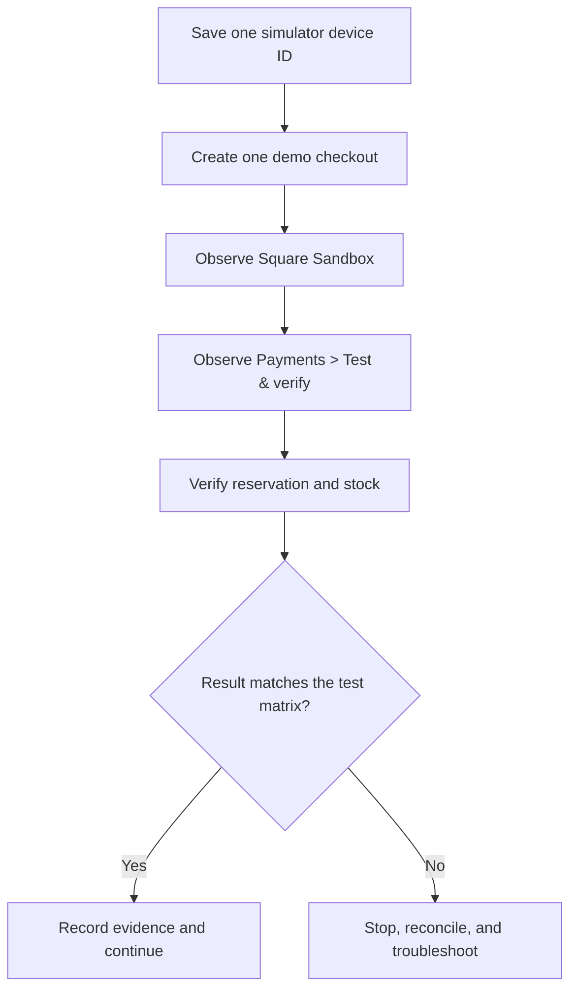

Square Sandbox simulates Terminal API checkouts without a physical Terminal or
real card. Use it to prove the workflow and failure recovery before any
Production credential is saved.

<Info>
  Square hardware cannot be paired to Sandbox. Tuturuuu uses Square's special
  Sandbox Terminal device IDs to produce deterministic results. Sandbox
  payments do not reach a bank and do not incur processing fees.
</Info>

## What Sandbox can and cannot prove

| Sandbox proves | Sandbox does not prove |
| --- | --- |
| Credentials, scopes, environment routing, Orders API, Terminal checkout payloads, webhook signatures, idempotency, catalog links, and stock transitions | The customer's physical Terminal, counter network, receipt printer, real seller configuration, or card-present approval |
| Success, buyer cancellation, Square timeout, and an unresponsive Terminal simulation | A live refund, physical receipt, or bank settlement |
| Isolation from Production data and money | That Production credentials or object IDs are correct |

## Create isolated demo data

Use records that are unmistakably temporary and owned by the test:

```text
Product: [Tuturuuu Sandbox] Terminal checkout test YYYY-MM-DD
SKU: TTR-SBX-YYYYMMDD
Price: USD 1.00
Opening stock: 4
```

Use a fictional customer name and email, or omit customer details. Square warns
against storing personal information in Sandbox. Do not reuse a real customer's
name, phone number, address, or card data.

<Warning>
  Do not delete or archive pre-existing Square records. Import or modify only
  the clearly labeled demo item. Tuturuuu catalog sync never deletes Square
  objects; any later manual cleanup in Square requires the account owner's
  separate approval.
</Warning>

## Simulator device IDs

Copy these from Square's current
[Terminal API Sandbox test values](https://developer.squareup.com/docs/devtools/sandbox/testing#terminal-api-checkouts)
into the **Sandbox device ID** field one scenario at a time:

| Scenario | Device ID | Square result |
| --- | --- | --- |
| Approved card | `9fa747a2-25ff-48ee-b078-04381f7c828f` | Completes a card payment up to USD 25 |
| Buyer cancels | `841100b9-ee60-4537-9bcf-e30b2ba5e215` | Reports a canceled checkout |
| Square timeout | `0a956d49-619a-4530-8e5e-8eac603ffc5e` | Immediately simulates checkout timeout |
| Terminal unavailable | `da40d603-c2ea-4a65-8cfd-f42e36dab0c7` | Leaves the request unclaimed so it can be canceled or expire |

Keep the test total at or below USD 25 for the standard success simulator.
Square deliberately leaves larger attempts pending rather than treating them as
an ordinary approval.

## Test flow



For every scenario:

1. Open **Payments → Connect & set up → Square POS → Sandbox** and save the
   intended simulator ID.
2. Confirm all five Sandbox checks are complete.
3. Confirm the demo Storefront uses **Square Terminal** checkout.
4. Open **Payments → Test & verify** in one tab and the Sandbox Square Dashboard
   in another.
5. Submit one checkout only. Do not double-click or start a second checkout
   while the first is pending.
6. Match the checkout ID, amount, currency, status, and timestamps across both
   systems.
7. Record the final stock and reservation result before changing the simulator.

## Required checkout matrix

| Test | Expected Square evidence | Expected Tuturuuu evidence | Expected stock |
| --- | --- | --- | --- |
| **Approved card** | One completed Terminal checkout and payment | One completed checkout with Square order, Terminal checkout, payment, and receipt reference when available | Reservation consumed once; on-hand decreases once |
| **Buyer cancels** | Terminal checkout becomes canceled | Checkout becomes canceled or released with the Square result recorded | Reservation released; available stock returns once |
| **Square timeout** | Terminal checkout reports timed out | Checkout becomes expired/failed and is not recorded as paid | Reservation released; no sale ledger entry |
| **Terminal unavailable** | Checkout stays pending until canceled or timed out | The same checkout remains traceable; operator can cancel rather than resend | Stock stays reserved while pending, then releases once |

<Warning>
  A pending result is not permission to send the order again. First cancel or
  reconcile the existing Terminal checkout. Re-sending an uncertain order can
  create a second payment request.
</Warning>

## Reservation expiry test

Tuturuuu checkout reservations expire 15 minutes after creation. Expiry is
materialized by the scheduled sweep and also reconciled during checkout reads
and new checkout creation.

1. Use the unavailable Terminal simulator.
2. Create one checkout and verify the item becomes reserved.
3. Do not create a replacement checkout.
4. Cancel it through the Inventory Commerce action for a fast test, or allow the
   reservation to expire for the full expiry-path test.
5. Verify the checkout is no longer sellable as pending, the reservation is
   released, and stock returns exactly once.

## Duplicate webhook test

Square can retry webhooks and does not guarantee delivery order. Tuturuuu uses
Square event IDs and provider identifiers to reconcile duplicates safely.

<Steps>
  <Step title="Complete one successful Sandbox checkout">
    Record its Tuturuuu checkout ID, Square Terminal checkout ID, payment ID,
    stock before and after, and finance transaction if the workspace records
    one.
  </Step>
  <Step title="Resend a Square webhook delivery">
    In the Square Developer Console, open the relevant Sandbox webhook delivery
    and resend it once. Use the same event; do not create a second payment.
  </Step>
  <Step title="Verify idempotency">
    The webhook may appear twice in delivery history, but Tuturuuu must still
    show one checkout, one payment link, one completion transition, one stock
    change, and at most one finance sale.
  </Step>
</Steps>

## Catalog and stock rehearsal

Run this after the checkout matrix so the payment flow and catalog flow can be
diagnosed separately.

1. Open **Payments → Catalog sync**.
2. Enable sync actions with the compact edit control.
3. Choose **Import from Square** and verify the demo item appears as one linked
   Square variation.
4. Change only the demo item's name, price, or physical count on one side.
5. Run the matching one-way sync and verify the other side once.
6. Make different changes on both sides, run **Two-way sync**, and confirm the
   item becomes a review conflict instead of silently overwriting either side.
7. Restore the demo item through an intentional one-way sync after deciding
   which side is authoritative.

An unchanged Square inventory count might not emit an
`inventory.count.updated` event. Use an actual demo count change when validating
that webhook, then restore the count deliberately.

For the full data model and conflict rules, see
[Catalog and stock synchronization](/platform/applications/inventory-square-pos/catalog-sync).

## Exit criteria

Sandbox is complete only when:

- all five connection checks are ready;
- the seven webhook events are subscribed and a test delivery returns `2xx`;
- approved, canceled, timed-out, and unavailable-device scenarios match the
  matrix;
- duplicate webhook delivery does not duplicate payment, stock, or finance;
- a 15-minute or explicitly canceled reservation releases correctly;
- the demo catalog item is visible as a linked variation;
- a two-sided edit becomes a review conflict;
- no Production token, object, device, or payment was touched.

## Test evidence template

```text
Workspace:
Square application and Sandbox seller:
Square location:
Tuturuuu demo product and SKU:
Test date and operator:

Approved checkout ID / payment ID / result:
Canceled checkout ID / result:
Timed-out checkout ID / result:
Unavailable checkout ID / cancel-or-expiry result:
Duplicate webhook event ID / final record count:

Stock before:
Stock after successful payment:
Stock after cancel, timeout, and expiry:
Catalog link count:
Conflicts requiring review:
Unexpected errors:
```

When every exit criterion passes, continue with
[Production launch](/platform/applications/inventory-square-pos/production-launch).
