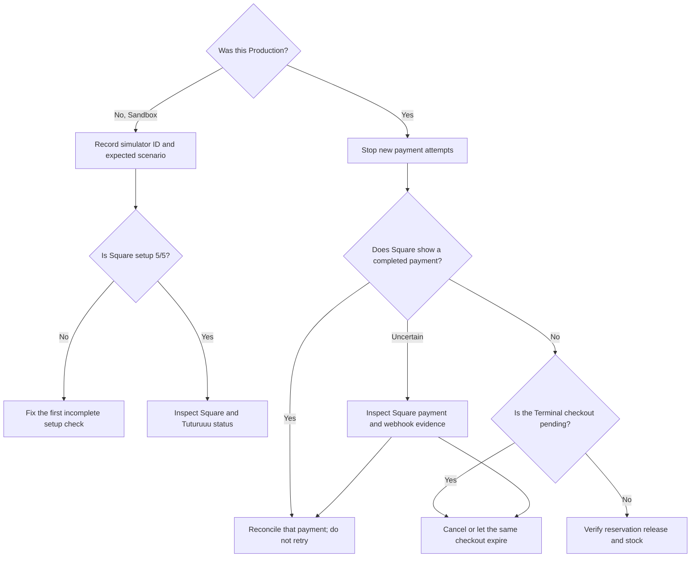

The first rule is simple: if a Production payment is pending or uncertain, do
not send it again. Reconcile the existing checkout before changing settings,
stock, device, or Storefront configuration.

## Start here

## Five-minute operator triage

1. Record the workspace, environment, location, Terminal name, order reference,
   time, timezone, amount, currency, and visible status.
2. Stop submitting new checkouts for the affected order.
3. Compare **Payments → Test & verify** with the matching Square Dashboard.
4. If Square shows a completed payment, treat it as paid and reconcile it.
5. If Square proves no payment and the Terminal checkout is pending, cancel the
   same checkout or allow it to expire.
6. Verify the reservation and stock after the final event.
7. Escalate with IDs, timestamps, and redacted screenshots if the systems still
   disagree.

## Connection and readiness

<AccordionGroup>
  <Accordion title="Production shows 0/5 or 'No Square token saved'">
    This is expected for an unconfigured environment. Select Production, enable
    editing, save the Production application credentials, connect the real
    seller through OAuth, add the Production webhook signature key, choose the
    location, and pair the Terminal. Do not copy the Sandbox token.
  </Accordion>
  <Accordion title="Connect OAuth is unavailable or fails before Square opens">
    Save the Square Application ID and Application secret for the selected
    environment first. Copy the OAuth redirect URL from Inventory into that
    environment's Square application settings. Confirm the URL matches exactly.
  </Accordion>
  <Accordion title="Square returns Unauthorized">
    The access token commonly belongs to the other environment, was revoked, or
    lacks a required scope. Confirm the environment badge, seller, and
    application. Re-authorize the intended seller instead of adding unrelated
    manual tokens.
  </Accordion>
  <Accordion title="Locations are empty or the wrong business appears">
    Verify the OAuth seller and `MERCHANT_PROFILE_READ` permission. A location
    cannot be borrowed from another seller or from Sandbox. Reconnect the
    correct account, refresh locations, and ask the Square owner to confirm the
    location name.
  </Accordion>
  <Accordion title="The connection was revoked">
    Square sends `oauth.authorization.revoked`, and Tuturuuu marks the
    connection unavailable. Stop checkouts, ask the owner why access was
    revoked, then re-authorize only if the owner approves it.
  </Accordion>
</AccordionGroup>

## Webhooks

<AccordionGroup>
  <Accordion title="Square test delivery is rejected">
    Confirm the subscription environment, notification URL, signature key, and
    event type. Copy the workspace webhook URL from Inventory; do not rebuild it
    manually. The exact URL used by Square is part of signature verification.
  </Accordion>
  <Accordion title="Signature verification fails after a domain or tunnel change">
    Square signs the configured notification URL plus the raw body. Update the
    Square subscription and Inventory's advanced notification URL to the same
    exact HTTPS value, then replace the matching environment's signature key.
  </Accordion>
  <Accordion title="Square sent the same event more than once">
    Duplicate delivery is normal when an acknowledgement is delayed or Square
    retries. Compare the `event_id`. Tuturuuu should keep one checkout, payment,
    stock transition, and finance entry. Escalate only if business state is
    duplicated.
  </Accordion>
  <Accordion title="Events arrive in an unexpected order">
    Square does not guarantee delivery order. Reconcile by provider object and
    final payment status rather than arrival time. Do not edit checkout state
    manually to match the first event you saw.
  </Accordion>
  <Accordion title="Inventory count webhook did not appear">
    Square may not emit `inventory.count.updated` when the written count equals
    the existing value. In Sandbox, change the demo count to a distinct value,
    verify the event, then restore it intentionally.
  </Accordion>
</AccordionGroup>

## Terminal and pairing

<Warning>
  A phone or tablet running Square POS with a connected Reader is not a
  Terminal API device. It will not appear after **Refresh terminals**. Select
  **Phone or tablet with Reader**, register the POS callback URL, and use the
  **Square POS app + Reader** Storefront mode instead.
</Warning>

| Symptom | Check | Safe action |
| --- | --- | --- |
| Pairing code expired | It was not entered within five minutes | Create a new code in Tuturuuu |
| Dashboard code does not pair | Generic Dashboard codes are not Terminal API codes | Discard it and create the code in Tuturuuu |
| Paired device does not appear | `device.code.paired` delivery, seller, environment, and location | Refresh devices after the webhook succeeds |
| Terminal shows no payment prompt | Device online state, selected default device, location, and existing pending checkout | Reconcile the current checkout; do not send a second one |
| Wrong Terminal receives the order | Saved default device and counter name | Stop checkouts, select the correct paired device, then test with an approved order |
| Terminal is offline | Network indicator, software updates, Wi-Fi/Ethernet, captive portal | Restore connectivity and reconcile the existing checkout |

## Square POS app and Reader

| Symptom | Check | Safe action |
| --- | --- | --- |
| Phone/Reader does not appear in terminal list | Hardware is connected inside Square POS, not Terminal API | Do not paste its device ID; switch to the phone/Reader setup path |
| Square POS does not open | Request is on Android/iOS, latest Square POS is installed, and browser permits app links | Return to the same reserved order; install/update Square POS before trying a new checkout |
| `UNAUTHORIZED_CLIENT_ID` or callback error | Production Application ID and exact Point of Sale API Web Callback URL | Copy the URL from Inventory and save it in the Production Square application |
| `ILLEGAL_LOCATION_ID` / user mismatch | Square POS is signed into the same location saved in Inventory | Sign in to the approved location; do not remove the location safeguard |
| Payment returns but order stays pending | Square Order/Payment may still be synchronizing, or amount/currency/location/card verification failed | Keep the order open and inspect its failure reason plus Square payment evidence; do not charge again |
| No server transaction ID | Payment was offline or no supported online card order was returned | Tuturuuu leaves stock unchanged for manual review; reconcile Square before any retry |

The Point of Sale API callback is not treated as payment proof by itself.
Tuturuuu uses the returned transaction ID as a Square Order ID, retrieves its
Payment, and verifies the exact reserved amount, currency, location, completed
status, and card tender. This is why cash and offline returns are not
automatically finalized.

Square Terminal cannot use browser-based captive-portal networks. Review
[Square's network requirements](https://squareup.com/help/us/en/article/8348-set-up-network-requirements-for-square-hardware)
and
[Terminal network troubleshooting](https://squareup.com/help/us/en/article/8350-troubleshoot-network-connection-on-square-terminal).

## Checkout, payment, and stock

<AccordionGroup>
  <Accordion title="The checkout is pending">
    Keep the same order. Check Square Payments and the Terminal checkout. If no
    payment completed, cancel that checkout from Inventory Commerce or let it
    expire. Tuturuuu reservations expire after 15 minutes and release stock when
    final reconciliation runs.
  </Accordion>
  <Accordion title="The buyer says they paid but Tuturuuu is not completed">
    Search Square by location, time, amount, and receipt. If Square shows a
    completed payment, do not retry. Record the Square evidence and inspect the
    `payment.updated` and `terminal.checkout.updated` webhook deliveries.
  </Accordion>
  <Accordion title="Tuturuuu says completed but Square evidence is missing">
    Confirm you are viewing the same Sandbox or Production seller and location.
    Record all evidence and stop new attempts. This mismatch requires support
    investigation; do not create a balancing payment or manual stock change.
  </Accordion>
  <Accordion title="Canceled or expired checkout still holds stock">
    Refresh the Commerce and Payments views after the final Square event. Allow
    the scheduled expiry reconciliation to run. If the reservation remains,
    escalate with the order reference, final Square status, timestamps, and
    stock values. Do not compensate by increasing on-hand stock manually.
  </Accordion>
  <Accordion title="Stock or finance changed twice">
    Stop processing the item, preserve the rows, and compare Square event IDs
    and provider IDs. Duplicate webhooks must be idempotent. Do not delete a
    duplicate-looking record before support confirms which row is authoritative.
  </Accordion>
  <Accordion title="No receipt link appears">
    Confirm the payment is completed and inspect the Square payment directly.
    Sandbox has receipt limitations, while Production receipt behavior depends
    on Square and the seller's receipt settings.
  </Accordion>
</AccordionGroup>

## Catalog and stock sync

<AccordionGroup>
  <Accordion title="The summary says products synchronized, but I cannot see them">
    Open the **Linked catalog records** list, clear any UI filter, and verify the
    environment. Metrics count item, variation, and stock operations, so the
    total can exceed the number of unique products. One visible link row is the
    reliable evidence for one Square variation relationship.
  </Accordion>
  <Accordion title="A price is 100 times too small or large">
    Stop all sync and checkout actions for that item. Record the human-readable
    amount and currency on both sides. Do not manually multiply or divide and
    sync again. Confirm the current Tuturuuu release, then correct the approved
    source once and verify a one-way sync with a demo item first.
  </Accordion>
  <Accordion title="Two-way sync reports a conflict">
    This is protective behavior. Compare the Tuturuuu and Square values, get an
    owner decision, and run one directional sync from the approved source. Do
    not alternate directions or delete the Square item.
  </Accordion>
  <Accordion title="A Square deletion is preserved">
    Tuturuuu intentionally keeps the local product and link for review. Ask the
    owner whether to republish the item or leave it disconnected. Synchronization
    never deletes Square objects or local product data to resolve this status.
  </Accordion>
  <Accordion title="A link shows Sync error">
    Read the row's error, then check environment, token scopes, location,
    currency, SKU, and Square object availability. Retry only the intended
    direction after fixing the cause.
  </Accordion>
</AccordionGroup>

## Storefront issues

| Symptom | Safe check |
| --- | --- |
| Storefront not found | Verify the published slug and use the Inventory Storefront URL generated by the workspace; do not infer a slug on another host |
| Square option is missing | Confirm the Storefront mode matches the hardware: **Square POS app + Reader** or **Square Terminal**, and the matching readiness check is complete |
| Checkout returns a readiness error | Open Payments and fix the named connection, webhook, location, or device check |
| Two checkout tabs or prompts appear | Stop and inspect whether two requests were submitted; reconcile both provider records before any new attempt |
| Cart reserves but no provider request appears | Inspect the same checkout in Commerce and Payments; cancel/release it if Square creation failed |

## Never do these during an incident

- Do not send the same Production order again while the first is pending or
  uncertain.
- Do not create a second charge to cancel out an uncertain charge.
- Do not copy Sandbox tokens, IDs, device simulators, or webhook keys into
  Production.
- Do not delete or archive Square catalog objects to force synchronization.
- Do not manually increase stock while an unresolved reservation exists.
- Do not paste secrets or customer personal data into an escalation message.
- Do not factory-reset a Terminal until the Square owner understands the impact
  and the current checkout has been reconciled.

## Escalate with evidence

Include the packet from the
[operations guide](/platform/applications/inventory-square-pos/operations#escalation-packet)
and check [Square system status](https://www.issquareup.com/) for provider-wide
incidents. Redact tokens, application secrets, signature keys, full card data,
and customer personal information.

For implementation-level failures, use the
[Square Terminal engineering runbook](/build/devops/square-terminal-integration).
