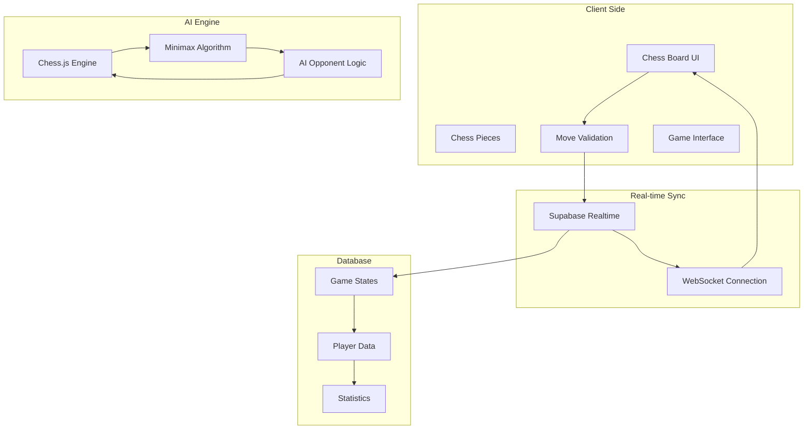

Neo Chess is NCT Hub's multiplayer chess game featuring real-time gameplay, AI opponents, and competitive features designed to engage club members in strategic thinking and friendly competition.

## Overview

Neo Chess provides an interactive chess experience that combines traditional chess gameplay with modern web technologies, real-time synchronization, and AI-powered opponents for solo play.

## Key Features

### **Multiplayer Gameplay**

- **Real-time Matches** – Play against other club members with live move synchronization
- **Matchmaking System** – Find opponents based on skill level and availability
- **Spectator Mode** – Watch ongoing matches between other players
- **Game History** – Track your matches and performance over time

### **AI Opponents**

- **Multiple Difficulty Levels** – Choose from beginner to expert AI opponents
- **Adaptive AI** – AI opponents that adjust to your playing style
- **Training Mode** – Practice against AI without affecting your rating
- **Puzzle Challenges** – Solve chess puzzles and tactical problems

### **Competitive Features**

- **Rating System** – Track your chess rating and improvement
- **Leaderboards** – See top players in the club
- **Tournaments** – Participate in club chess tournaments
- **Achievements** – Unlock badges for various accomplishments

### **Visual Design**

- **Custom Chess Pieces** – Beautiful, detailed chess piece designs
- **Dark/Light Themes** – Choose your preferred board theme
- **Animations** – Smooth piece movements and transitions
- **Responsive Design** – Play on desktop, tablet, or mobile devices

## Technical Implementation

### Game Architecture



### Chess Piece Assets

The game uses custom-designed chess pieces stored in the public folder:

#### White Pieces

- `w_king.png` - White King
- `w_queen.png` - White Queen
- `w_rook.png` - White Rook
- `w_bishop.png` - White Bishop
- `w_knight.png` - White Knight
- `w_pawn.png` - White Pawn

#### Black Pieces

- `b_king.png` - Black King
- `b_queen.png` - Black Queen
- `b_rook.png` - Black Rook
- `b_bishop.png` - Black Bishop
- `b_knight.png` - Black Knight
- `b_pawn.png` - Black Pawn

### Real-time Synchronization

```typescript
// Real-time game state updates
const channel = supabase
  .channel(`chess-game-${gameId}`)
  .on(
    'postgres_changes',
    {
      event: 'UPDATE',
      schema: 'public',
      table: 'chess_games',
      filter: `id=eq.${gameId}`,
    },
    (payload) => {
      updateGameState(payload.new);
    }
  )
  .subscribe();
```

### AI Implementation

```typescript
// AI move generation using minimax algorithm
function getBestMove(game: Chess, depth: number): string {
  const moves = game.moves();
  let bestMove = '';
  let bestScore = -Infinity;

  for (const move of moves) {
    game.move(move);
    const score = minimax(game, depth - 1, false);
    game.undo();

    if (score > bestScore) {
      bestScore = score;
      bestMove = move;
    }
  }

  return bestMove;
}
```

## Game Modes

### **Quick Match**

- **Random Opponent** – Get matched with an available player
- **Time Controls** – Choose from blitz, rapid, or classical time controls
- **Rating Range** – Play against opponents of similar skill level

### **AI Practice**

- **Difficulty Selection** – Choose from 5 difficulty levels
- **Analysis Mode** – Get hints and move suggestions
- **Puzzle Training** – Solve tactical puzzles and endgames

### **Club Tournaments**

- **Scheduled Events** – Participate in club-organized tournaments
- **Swiss System** – Fair tournament pairing system
- **Prizes** – Compete for club recognition and achievements

### **Analysis Mode**

- **Game Review** – Analyze your completed games
- **Move Evaluation** – See computer evaluation of moves
- **Learning Resources** – Access chess tutorials and guides

## User Interface

### Game Board

- **Drag & Drop** – Intuitive piece movement
- **Legal Move Highlighting** – Visual indicators for valid moves
- **Move History** – Track all moves in algebraic notation
- **Position Evaluation** – Real-time position assessment

### Game Controls

- **Timer Display** – Show remaining time for both players
- **Move Indicators** – Visual feedback for piece movements
- **Game Status** – Current game state and phase
- **Chat System** – Communicate with opponent (optional)

### Settings Panel

- **Theme Selection** – Choose board and piece colors
- **Sound Controls** – Enable/disable move sounds
- **Animation Speed** – Adjust piece movement speed
- **Difficulty Settings** – For AI opponents

## Database Schema

### Chess Games Table

```sql
CREATE TABLE chess_games (
  id UUID PRIMARY KEY DEFAULT gen_random_uuid(),
  white_player_id UUID REFERENCES users(id),
  black_player_id UUID REFERENCES users(id),
  game_state JSONB NOT NULL,
  moves TEXT[] DEFAULT '{}',
  status TEXT DEFAULT 'active',
  time_control JSONB,
  created_at TIMESTAMP DEFAULT NOW(),
  updated_at TIMESTAMP DEFAULT NOW()
);
```

### Player Statistics Table

```sql
CREATE TABLE chess_player_stats (
  user_id UUID PRIMARY KEY REFERENCES users(id),
  rating INTEGER DEFAULT 1200,
  games_played INTEGER DEFAULT 0,
  games_won INTEGER DEFAULT 0,
  games_lost INTEGER DEFAULT 0,
  games_drawn INTEGER DEFAULT 0,
  best_rating INTEGER DEFAULT 1200,
  last_played TIMESTAMP,
  created_at TIMESTAMP DEFAULT NOW()
);
```

## API Endpoints

### Game Management

```typescript
// Create new game
POST /api/chess/games
{
  "opponentId": "uuid",
  "timeControl": "blitz|rapid|classical",
  "color": "white|black|random"
}

// Make move
POST /api/chess/games/{gameId}/move
{
  "move": "e2e4",
  "timestamp": "2025-01-10T10:00:00Z"
}

// Get game state
GET /api/chess/games/{gameId}
```

### Player Statistics

```typescript
// Get player stats
GET /api/chess/stats/{userId}

// Get leaderboard
GET /api/chess/leaderboard?limit=10&timeframe=monthly
```

## Integration with NCT Hub

### Member System

- **Automatic Registration** – All NCT Hub members can play
- **Profile Integration** – Chess stats appear in member profiles
- **Achievement System** – Chess achievements integrate with club badges

### Club Events

- **Tournament Organization** – Club admins can organize chess tournaments
- **Event Integration** – Chess tournaments appear in club calendar
- **Member Engagement** – Track member participation in chess activities

### Analytics

- **Game Statistics** – Track club-wide chess engagement
- **Popular Time Slots** – Identify peak playing times
- **Member Retention** – Monitor chess player activity over time

## Future Enhancements

### Planned Features

- **Video Analysis** – Record and analyze games
- **Opening Explorer** – Database of chess openings
- **Endgame Trainer** – Practice endgame scenarios
- **Mobile App** – Native mobile application
- **Streaming Integration** – Stream games to club members

### Community Features

- **Chess Clubs** – Form sub-groups within NCT Hub
- **Mentorship Program** – Pair experienced players with beginners
- **Chess Lessons** – Structured learning program
- **Problem Solving** – Daily chess puzzles and challenges

## Related Resources

- [Platform Overview](/platform/index) – Understanding the complete platform architecture
- [Member Management](/platform/features/user-management) – Managing club members and roles
- [Analytics Dashboard](/platform/features/command-center-dashboard) – Tracking game analytics and engagement
- [Neo Crush](/platform/applications/neo-crush) – Another NCT Hub game application
