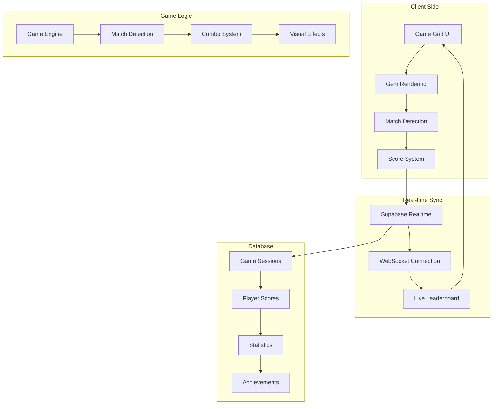

# Neo Crush

Neo Crush is NCT Hub's multiplayer puzzle game featuring colorful gems, strategic gameplay, and real-time competition. Players match gems to clear the board while competing against other club members in fast-paced, engaging rounds.

## Overview

Neo Crush combines the addictive gameplay of match-3 puzzle games with multiplayer competition, creating an engaging social gaming experience that brings NCT Hub members together through friendly competition and collaborative play.

## Key Features

### 🎮 **Multiplayer Gameplay**

- **Real-time Competition** – Play against other club members simultaneously
- **Live Leaderboards** – See rankings update in real-time during matches
- **Tournament Mode** – Participate in organized competitions
- **Spectator Support** – Watch other players' games in progress

### 💎 **Colorful Gem System**

- **Seven Gem Types** – Each with unique colors and properties:
  - 🔴 **Red** - Classic fire gems
  - 🟠 **Orange** - Energetic citrus gems
  - 🟡 **Yellow** - Bright sun gems
  - 🟢 **Green** - Natural forest gems
  - 🔵 **Blue** - Cool ocean gems
  - 🟣 **Purple** - Mystical royal gems
  - 🩷 **Pink** - Sweet candy gems

### 🏆 **Competitive Features**

- **Score Tracking** – Monitor your performance and improvement
- **Achievement System** – Unlock badges for various accomplishments
- **Seasonal Rankings** – Compete in monthly leaderboards
- **Club Championships** – Participate in NCT Hub tournaments

### ⚡ **Game Mechanics**

- **Match-3 Gameplay** – Classic puzzle mechanics with modern twists
- **Power-ups** – Special gems that create explosive effects
- **Combo System** – Chain matches for massive point multipliers
- **Time Pressure** – Strategic gameplay under time constraints

## Technical Implementation

### Game Architecture



### Gem Asset System

The game uses high-quality gem assets stored in the public folder:

#### Gem Colors

- `red.png` - Vibrant red fire gems
- `orange.png` - Bright orange citrus gems
- `yellow.png` - Glowing yellow sun gems
- `green.png` - Rich green forest gems
- `blue.png` - Deep blue ocean gems
- `purple.png` - Royal purple gems
- `pink.png` - Sweet pink candy gems

### Real-time Synchronization

```typescript
// Real-time score updates and leaderboard
const gameChannel = supabase
  .channel(`neo-crush-game-${gameId}`)
  .on(
    'postgres_changes',
    {
      event: 'INSERT',
      schema: 'public',
      table: 'game_scores',
    },
    (payload) => {
      updateLeaderboard(payload.new);
    }
  )
  .on(
    'postgres_changes',
    {
      event: 'UPDATE',
      schema: 'public',
      table: 'neo_crush_games',
      filter: `id=eq.${gameId}`,
    },
    (payload) => {
      updateGameState(payload.new);
    }
  )
  .subscribe();
```

### Match Detection Algorithm

```typescript
// Detect matches in the game grid
function findMatches(grid: Gem[][], minLength: number = 3): Match[] {
  const matches: Match[] = [];

  // Check horizontal matches
  for (let row = 0; row < grid.length; row++) {
    for (let col = 0; col < grid[row].length - minLength + 1; col++) {
      const color = grid[row][col].color;
      let matchLength = 1;

      while (
        col + matchLength < grid[row].length &&
        grid[row][col + matchLength].color === color
      ) {
        matchLength++;
      }

      if (matchLength >= minLength) {
        matches.push({
          type: 'horizontal',
          row,
          startCol: col,
          length: matchLength,
          color,
        });
      }
    }
  }

  // Check vertical matches (similar logic)
  // ...

  return matches;
}
```

## Game Modes

### 🎯 **Quick Play**

- **Solo Practice** – Play against yourself to improve skills
- **Daily Challenges** – Special puzzles with unique objectives
- **Tutorial Mode** – Learn game mechanics and strategies
- **Free Play** – Unlimited gameplay without competition

### 👥 **Multiplayer Modes**

- **Real-time Battles** – Compete against other players simultaneously
- **Turn-based Matches** – Take turns in strategic gameplay
- **Team Competitions** – Work together with other club members
- **Club Tournaments** – Organized competitions with prizes

### 🏅 **Competitive Play**

- **Ranked Matches** – Earn rating points through competitive play
- **Seasonal Leagues** – Compete in monthly ranking systems
- **Achievement Hunts** – Complete specific challenges for rewards
- **Speed Rounds** – Fast-paced matches with time pressure

### 🎓 **Learning Modes**

- **Strategy Guide** – Learn advanced techniques and combos
- **Pattern Recognition** – Practice identifying match opportunities
- **Combo Training** – Master chain reactions and multipliers
- **Power-up Tutorials** – Understand special gem effects

## User Interface

### Game Grid

- **Drag & Drop** – Intuitive gem swapping mechanics
- **Visual Feedback** – Highlighted valid moves and potential matches
- **Smooth Animations** – Polished gem movements and effects
- **Grid Indicators** – Show possible match locations

### Score Display

- **Current Score** – Real-time point tracking
- **Multiplier Display** – Show current combo multiplier
- **High Score** – Personal best and club records
- **Progress Bar** – Visual representation of game progress

### Leaderboard

- **Live Updates** – Real-time ranking changes
- **Player Avatars** – Visual identification of competitors
- **Score Tracking** – Current round scores and total points
- **Club Rankings** – NCT Hub member standings

### Game Controls

- **Pause/Resume** – Control game flow
- **Settings Panel** – Adjust graphics and audio
- **Help System** – Access tutorials and tips
- **Social Features** – Chat and emoji reactions

## Database Schema

### Game Sessions Table

```sql
CREATE TABLE neo_crush_games (
  id UUID PRIMARY KEY DEFAULT gen_random_uuid(),
  game_type TEXT NOT NULL, -- 'quick_play', 'multiplayer', 'tournament'
  status TEXT DEFAULT 'active', -- 'active', 'completed', 'paused'
  max_players INTEGER DEFAULT 1,
  time_limit INTEGER, -- seconds
  created_at TIMESTAMP DEFAULT NOW(),
  ended_at TIMESTAMP
);
```

### Player Scores Table

```sql
CREATE TABLE neo_crush_scores (
  id UUID PRIMARY KEY DEFAULT gen_random_uuid(),
  game_id UUID REFERENCES neo_crush_games(id),
  user_id UUID REFERENCES users(id),
  score INTEGER NOT NULL,
  gems_matched INTEGER DEFAULT 0,
  combos_created INTEGER DEFAULT 0,
  power_ups_used INTEGER DEFAULT 0,
  rank INTEGER,
  created_at TIMESTAMP DEFAULT NOW()
);
```

### Player Statistics Table

```sql
CREATE TABLE neo_crush_player_stats (
  user_id UUID PRIMARY KEY REFERENCES users(id),
  total_games INTEGER DEFAULT 0,
  total_score BIGINT DEFAULT 0,
  high_score INTEGER DEFAULT 0,
  average_score INTEGER DEFAULT 0,
  gems_matched BIGINT DEFAULT 0,
  combos_created INTEGER DEFAULT 0,
  win_streak INTEGER DEFAULT 0,
  best_win_streak INTEGER DEFAULT 0,
  rating INTEGER DEFAULT 1000,
  last_played TIMESTAMP,
  created_at TIMESTAMP DEFAULT NOW()
);
```

## API Endpoints

### Game Management

```typescript
// Create new game
POST /api/neo-crush/games
{
  "gameType": "multiplayer|quick_play|tournament",
  "maxPlayers": 4,
  "timeLimit": 300
}

// Submit score
POST /api/neo-crush/games/{gameId}/score
{
  "score": 1250,
  "gemsMatched": 45,
  "combosCreated": 3,
  "powerUpsUsed": 1
}

// Get leaderboard
GET /api/neo-crush/leaderboard?timeframe=daily|weekly|monthly&limit=50
```

### Player Statistics

```typescript
// Get player stats
GET /api/neo-crush/stats/{userId}

// Get game history
GET /api/neo-crush/games/history/{userId}?limit=20

// Update achievement progress
POST /api/neo-crush/achievements/progress
{
  "achievementId": "uuid",
  "progress": 75
}
```

## Game Mechanics

### Scoring System

- **Base Points** – Points for each gem matched
- **Combo Multipliers** – Increasing multipliers for chain reactions
- **Power-up Bonuses** – Extra points for special gem effects
- **Time Bonuses** – Additional points for quick matches
- **Perfect Games** – Bonus points for no-miss rounds

### Power-up System

- **Bomb Gems** – Clear surrounding gems in explosion
- **Lightning Gems** – Destroy entire rows or columns
- **Rainbow Gems** – Match any color gem
- **Time Extensions** – Add extra seconds to the timer
- **Score Multipliers** – Temporarily increase point values

### Combo Mechanics

- **Chain Reactions** – Cascading matches from falling gems
- **Multiplier Progression** – Increasing multipliers for longer chains
- **Special Combinations** – Unique patterns for massive scores
- **Power-up Synergy** – Combining power-ups for maximum effect

## Integration with NCT Hub

### Member Engagement

- **Daily Challenges** – Encourage regular club member participation
- **Social Features** – Share achievements and high scores
- **Club Events** – Organize NCT Hub gaming tournaments
- **Member Recognition** – Highlight top performers

### Analytics Integration

- **Engagement Metrics** – Track member participation in gaming
- **Performance Analytics** – Monitor game statistics and trends
- **Social Interaction** – Measure community engagement through gaming
- **Retention Tracking** – Monitor long-term member activity

### Achievement System

- **Club Badges** – Special achievements for NCT Hub members
- **Skill Progression** – Track improvement over time
- **Community Goals** – Collaborative achievements for the entire club
- **Event Participation** – Recognition for tournament participation

## Future Enhancements

### Planned Features

- **Mobile Optimization** – Enhanced touch controls for mobile devices
- **Voice Chat** – Real-time communication during multiplayer matches
- **Custom Themes** – NCT Hub branded gem designs and backgrounds
- **AI Opponents** – Practice against computer-controlled players

### Community Features

- **Guild System** – Form gaming teams within NCT Hub
- **Mentorship Program** – Experienced players help newcomers
- **Streaming Integration** – Broadcast matches to club members
- **Cross-platform Play** – Play across different devices

### Advanced Gameplay

- **Puzzle Mode** – Solve predetermined gem arrangements
- **Boss Battles** – Special challenging rounds with unique mechanics
- **Seasonal Events** – Limited-time content and special rewards
- **Custom Levels** – User-generated content and challenges

## Related Resources

- [Platform Overview](/platform/index) – Understanding the complete platform architecture
- [Member Management](/platform/features/user-management) – Managing club members and roles
- [Analytics Dashboard](/platform/features/command-center-dashboard) – Tracking game analytics and engagement
- [Neo Chess](/platform/applications/neo-chess) – Another NCT Hub game application
