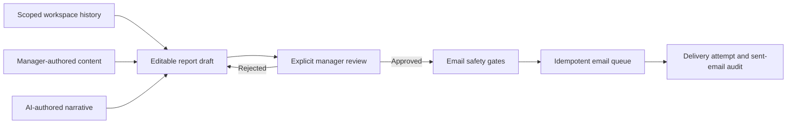

The Contacts Reports hub at `/{wsId}/reports` is the canonical workspace surface
for operational reporting. It keeps two established data models separate while
giving managers one consistent workflow:

- **Daily reports** are existing user-group posts. Their permissions and email
  behavior remain unchanged.
- **Periodic reports** extend the existing monthly-report records to weekly,
  monthly, quarterly, and yearly cadences. Monthly is the default.
- **Automations** configure workspace schedules, optional group overrides,
  generation runs, sender readiness, and delivery history.

Legacy `/posts` and `/users/reports` links redirect into the corresponding hub
tab and preserve their filters.

## Calendar periods

Periods are calculated in the workspace timezone:

| Cadence | Boundary | Scheduled draft behavior |
| --- | --- | --- |
| Weekly | Monday through Sunday | AI draft after Sunday closes |
| Monthly | Calendar month | Default cadence |
| Quarterly | Q1 through Q4 | Draft after the quarter closes |
| Yearly | Calendar year | Draft after December 31 closes |

Manual schedules create an editable draft at the start of the period. AI
schedules generate after the period closes. The default delivery target is
09:00 on the first day after close. Automation remains disabled until a valid
IANA timezone and an enabled schedule are saved.

## Generation and approval

Managers can create a periodic report at any time. An AI generation request is
scoped to the report subject and group, including configured metrics, relevant
history, profile notes, a previous report, and an editable manager instruction.
Unrelated workspace users and groups must never enter the prompt.

Deterministic scores and structured metrics are stored independently from the
generated narrative. Every AI-generated report starts in a reviewable state and
must be explicitly approved before delivery can be queued. Regeneration never
bypasses that approval boundary.

The principal permissions are:

- `view_user_groups_reports` — view daily and periodic reporting.
- `manage_user_report_automation` — configure schedules and initiate
  generation.
- `send_user_group_report_emails` — preview and control periodic email
  delivery.

Existing group-post permissions continue to govern Daily reports.

## Email safety

Periodic report email requires all of the following:

1. The report is approved.
2. The report subject has a workspace-profile email.
3. Workspace secret `ENABLE_EMAIL_SENDING=true`.
4. Workspace secret `ENABLE_REPORT_EMAIL_SENDING=true`.
5. A valid workspace sender is configured.
6. The actor has `send_user_group_report_emails`.

The dedicated report gate defaults to disabled and does not change Daily report
delivery. It is discoverable by platform admins in **Settings → Secrets**, where
the readiness card shows both gates and sender state and offers a prefilled
action for the periodic gate.

Delivery goes exclusively to the subject workspace-profile email. The system
does not infer an alternate address. Preview never queues an email. Test send,
send, retry, and cancel are explicit actions, and each transition remains
auditable.

## Automation processor

Vercel calls `/api/cron/process-report-automation` every 15 minutes. Private
Postgres RPCs claim due work idempotently. The processor uses:

- bounded concurrency;
- unique period/schedule claims;
- retry backoff and next-attempt timestamps;
- stale-lock recovery;
- permanent-failure diagnostics;
- separate generation-run and email-attempt histories.

The Next.js API remains the production source of truth. New reporting paths are
registered in the TanStack migration manifest until the Rust backend is ready
for an explicit cutover.

## Operating checklist

Before enabling a workspace:

1. Set a valid workspace timezone.
2. Confirm the intended managers have automation and delivery permissions.
3. Configure and verify the workspace email sender.
4. Enable the general email gate.
5. Create a manual schedule first and inspect its draft.
6. Enable the periodic-report gate.
7. Preview and test-send one approved report.
8. Confirm the recipient, sent-email record, and delivery-attempt history.
9. Enable AI generation only after the manual path is understood.

<Warning>
  Never enable either gate merely to make a readiness badge green. Confirm the
  workspace recipient data and sender first. AI-generated content must still be
  reviewed for accuracy and appropriateness.
</Warning>

## Troubleshooting

### A report cannot send

Open the Automations tab and inspect delivery readiness. Common blockers are a
pending approval, missing subject email, disabled gate, missing sender, or
insufficient permission. The report retains the last delivery error.

### A scheduled report did not appear

Verify the schedule is enabled, the timezone is valid, and the expected period
has closed for AI mode. Check recent generation runs for a failed or recovered
claim. Manual schedules create drafts at period start rather than after close.

### Delivery is queued for too long

Inspect the email queue attempt history and processor logs. A stale processing
claim is recoverable; repeated permanent failures preserve their error instead
of silently retrying forever. Confirm global email infrastructure, blacklist,
unsubscribe, rate-limit, and sender diagnostics.

### Recipient is unexpected

Cancel the queued delivery immediately. Periodic delivery must use only the
subject's workspace-profile email. Correct that profile, then preview again
before retrying.

### Daily and periodic totals differ

Daily reports count group-post completion and delivery. Periodic reports count
subject reports by cadence and approval/delivery state. They intentionally use
different underlying models and should not be summed as the same metric.

## Verification

Schema changes must be prepared as additive migrations and validated locally;
do not push production migrations from an agent session. Minimum release
validation includes:

- pgTAP coverage for the compatibility defaults, private tables, RLS, claims,
  and permissions;
- timezone boundary tests for every cadence;
- route/service tests for permission and email-gate combinations;
- component tests for hub tabs, mobile dialogs, filters, and error states;
- E2E coverage for manual and AI approval flows, blocked delivery, retry, audit
  history, and legacy redirects;
- Contacts and Web builds plus `bun check`.
