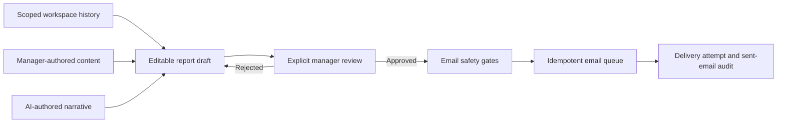

The Contacts Reports hub at `/{wsId}/reports` is the canonical workspace surface
for operational reporting. It keeps two established data models separate while
giving managers one consistent workflow:

- **Daily reports** are existing user-group posts. Their permissions and email
  behavior remain unchanged.
- **Periodic reports** extend the existing monthly-report records to weekly,
  monthly, quarterly, and yearly cadences. Monthly is the default.
- **Automations** configure workspace schedules, optional group overrides,
  generation runs, sender readiness, and delivery history.

Legacy `/posts` and `/users/reports` links redirect into the corresponding hub
tab and preserve their filters. The canonical hub opens **Daily** by default
when the actor can view daily reports; explicit Periodic and Automations links
still open their requested tab.

```mermaid
flowchart LR
  history["Scoped workspace history"] --> draft["Editable report draft"]
  manual["Manager-authored content"] --> draft
  ai["AI-authored narrative"] --> draft
  draft --> review["Explicit manager review"]
  review -->|Approved| gates["Email safety gates"]
  review -->|Rejected| draft
  gates --> queue["Idempotent email queue"]
  queue --> audit["Delivery attempt and sent-email audit"]
```

## Calendar periods

In a class report workspace, changing the workspace, class, student, or selected
report loads that selection before showing an editable report or choosing a
fallback. A previous student's saved report or empty report list must not be used
for the next student. Student search and background refresh for the same selection
retain the editor while loading. Failed requests show an error and leave the
selection intact; they do not establish that a report was deleted.
This preserves unsaved fields when a refresh returns unchanged saved content.
If the server returns changed title, content, or feedback, the existing editor
reset still applies; resolving concurrent edits is outside this selection rule.

Periods are calculated in the workspace timezone:

| Cadence | Boundary | Scheduled draft behavior |
| --- | --- | --- |
| Weekly | Monday through Sunday | AI draft after Sunday closes |
| Monthly | Calendar month | Default cadence |
| Quarterly | Q1 through Q4 | Draft after the quarter closes |
| Yearly | Calendar year | Draft after December 31 closes |

Manual schedules create an editable draft at the start of the period. AI
schedules generate after the period closes. The default delivery target is
09:00 on the first day after close. Automation remains disabled until a valid
IANA timezone and an enabled schedule are saved.

## Generation and approval

Managers can create a periodic report at any time. An AI generation request is
scoped to the report subject and group, including configured metrics, relevant
history, profile notes, a previous report, and an editable manager instruction.
Unrelated workspace users and groups must never enter the prompt.

Deterministic scores and structured metrics are stored independently from the
generated narrative. Every AI-generated report starts in a reviewable state and
must be explicitly approved before delivery can be queued. Regeneration never
bypasses that approval boundary.

In the Contacts monthly report editor, approval is available only while reviewing
saved current content. Unsaved title, narrative, or feedback changes, a pending
save, and a selected historical revision block approval with compact save or
return-to-current guidance. Failed saves retain human edits, including multiline
feedback and intentionally cleared fields. A matching authoritative refresh is
required before approving the edited report; an unrelated or stale refresh does
not acknowledge the draft. This is a frontend review safeguard, not an atomic
cross-client revision lock, and it does not queue or send email. Regression
coverage: `monthly-report-review-safety.test.tsx` exercises the actual editor,
form, save/approval hooks, and synthetic HTTP responses.

Ordinary manual report creation and edits through the shared report API remain
pending even when the legacy approval setting is disabled or the author can
approve reports. Contacts Save and score recalculation do not submit approval
markers; an explicit permitted approval action remains separate. Narrative,
feedback, title, score, cadence, period, manager instruction and generation changes invalidate the API
review state. Subject and group cannot be changed through this update API.
Approval timestamps and actor attribution are server-owned.

This API/client safeguard alone does not establish dispatch authorization:
legacy database approval triggers and configuration transitions can still produce
approved statuses without per-entry review. Existing status, approver and time
fields do not distinguish those paths from explicit human approval. Keep email
gates off until canonical revision-bound approval receipts, database mutation
closure and delivery consumers enforce explicit permitted review for each entry.
Do not infer consent for a backlog from its approved count. Coverage:
`explicit-approval.test.ts`, `report-review-transition.test.ts` and
`report-save-explicit-approval.test.tsx`; these source tests do not prove the
remaining database or provider boundaries.

The principal permissions are:

- `view_user_groups_reports` — view daily and periodic reporting.
- `manage_user_report_automation` — configure schedules and initiate
  generation.
- `send_user_group_report_emails` — preview and control periodic email
  delivery.

Existing group-post permissions continue to govern Daily reports.

The periodic hub's Approve action uses the same dedicated approval operation as
report details and Daily review. `approve_reports` permits review without
`update_user_groups_reports`; approving never grants content-edit authority.
Approval-only supervisor and workspace/actor isolation regressions cover this
boundary in `periodic-reports-approval.test.tsx` and the shared approval handler
`put.test.ts`.

## Email safety

Periodic report email requires all of the following:

1. The report is approved.
2. The report subject has a workspace-profile email.
3. Workspace secret `ENABLE_EMAIL_SENDING=true`.
4. Workspace secret `ENABLE_REPORT_EMAIL_SENDING=true`.
5. A valid workspace sender is configured.
6. The actor has `send_user_group_report_emails`.

The dedicated report gate defaults to disabled and does not change Daily report
delivery. It is discoverable by platform admins in **Settings → Secrets**, where
the readiness card shows both gates and sender state and offers a prefilled
action for the periodic gate.

Contacts Automations also offers an explicit, confirmed periodic-report gate
control to actors with **both** `manage_workspace_secrets` and
`send_user_group_report_emails` in that workspace. Its satellite-aware endpoint
accepts only the allowlisted report flag and literal boolean strings; it never
reads credentials, changes the global email gate, or grants access to platform
Secrets. The default remains disabled. Enabling allows explicitly queued reports
to pass this one safeguard, rather than queueing all approved or skipped reports.
Route admission and confirmation/cancellation regressions cover the control.
Actual parent-address mapping and provider/inbox delivery require runtime proof.

Contacts shows each missing global gate, periodic gate, and sender separately,
with an administrator action. Platform Secrets remains root-permission gated;
Contacts does not grant access to it or invent a sender setup route. Approved
counts are report stages, not delivery queue claims or evidence of parent receipt.
The legacy skipped stage remains excluded from automatic approval-triggered
sending; enabling gates does not resend historical reports.

Delivery goes exclusively to the subject workspace-profile email. The system
does not infer an alternate address. Preview never queues an email. Test send,
send, retry, and cancel are explicit actions, and each transition remains
auditable.

## Inert explicit-review provenance foundation

Report, daily-post and per-subject daily-check rows have server-controlled review
versions. Review content, creator attribution, generation inputs and approval provenance changes advance
the version; delivery bookkeeping does not. Caller-supplied versions are ignored,
and integer overflow rejects the mutation. Daily approval must eventually bind
both the parent post and its individual recipient check.

Private immutable receipt snapshots use canonical lowercase SHA-256 payload and
recipient digests. They store identifiers and digests, not raw report content or
recipient addresses. Snapshot identifiers intentionally have no live parent foreign
keys: authorized parent or workspace teardown preserves audit history without being
blocked by receipt immutability. Customers have no receipt access; trusted service
audit reads do not restore access or establish current permission. Product-managed
retention, export and deletion policy remains unfinished.

This foundation has no receipt-minting API, legacy approval backfill or delivery
caller activation. Its delivery-readiness function always returns false. The narrow
future admission predicate follows current application creator, MEMBER-role/default
and GUEST-default permissions, and requires an exact live workspace actor link.
Deleted or revoked actors cannot gain admission from retained history. Existing
legacy approval/configuration/dispatch paths still need complete closure before
email gates can be enabled. CI verifies the full historical schema, strict SQL/TAP
controls, two-connection version/lock behavior and actual generated types through
`report-review-receipts-contract.yaml`; source review or static tests alone do not
prove those database controls or customer delivery.

## Automation processor

Vercel calls `/api/cron/process-report-automation` every 15 minutes. Private
Postgres RPCs claim due work idempotently. The processor uses:

- bounded concurrency;
- unique period/schedule claims;
- retry backoff and next-attempt timestamps;
- stale-lock recovery;
- permanent-failure diagnostics;
- separate generation-run and email-attempt histories.

The Next.js API remains the production source of truth. New reporting paths are
registered in the TanStack migration manifest until the Rust backend is ready
for an explicit cutover.

## Operating checklist

Before enabling a workspace:

1. Set a valid workspace timezone.
2. Confirm the intended managers have automation and delivery permissions.
3. Configure and verify the workspace email sender.
4. Enable the general email gate.
5. Create a manual schedule first and inspect its draft.
6. Enable the periodic-report gate.
7. Preview and test-send one approved report.
8. Confirm the recipient, sent-email record, and delivery-attempt history.
9. Enable AI generation only after the manual path is understood.

<Warning>
  Never enable either gate merely to make a readiness badge green. Confirm the
  workspace recipient data and sender first. AI-generated content must still be
  reviewed for accuracy and appropriateness.
</Warning>

## Troubleshooting

### A report cannot send

Open the Automations tab and inspect delivery readiness. Common blockers are a
pending approval, missing subject email, disabled gate, missing sender, or
insufficient permission. The report retains the last delivery error.

### A scheduled report did not appear

Verify the schedule is enabled, the timezone is valid, and the expected period
has closed for AI mode. Check recent generation runs for a failed or recovered
claim. Manual schedules create drafts at period start rather than after close.

### Delivery is queued for too long

Inspect the email queue attempt history and processor logs. A stale processing
claim is recoverable; repeated permanent failures preserve their error instead
of silently retrying forever. Confirm global email infrastructure, blacklist,
unsubscribe, rate-limit, and sender diagnostics.

### Recipient is unexpected

Cancel the queued delivery immediately. Periodic delivery must use only the
subject's workspace-profile email. Correct that profile, then preview again
before retrying.

### Daily and periodic totals differ

Daily reports count group-post completion and delivery. Periodic reports count
subject reports by cadence and approval/delivery state. They intentionally use
different underlying models and should not be summed as the same metric.

Periodic summary cards use a private aggregate RPC rather than materializing
report rows in the application. This keeps totals exact beyond PostgREST's
default row limit. The report list remains independently paginated and can load
every matching record without using the summary result as a page.

## Verification

Schema changes must be prepared as additive migrations and validated locally;
do not push production migrations from an agent session. Minimum release
validation includes:

- pgTAP coverage for the compatibility defaults, private tables, RLS, claims,
  and permissions;
- timezone boundary tests for every cadence;
- route/service tests for permission and email-gate combinations;
- component tests for hub tabs, mobile dialogs, filters, and error states;
- E2E coverage for manual and AI approval flows, blocked delivery, retry, audit
  history, and legacy redirects;
- Contacts and Web builds plus `bun check`.

## Automatic delivery after approval

In **Reports → Automations**, enable **Send automatically after approval**.
Changing this setting requires both `manage_user_report_automation` and
`send_user_group_report_emails`. The setting applies to future approval transitions,
including approvals from the report editor and bulk approval flows. It does not
backfill previously approved reports or automatically resend delivered reports.

The `20260911100000_periodic_report_approval_delivery.sql` migration atomically
queues the report with its approval. Production migration CI applies it automatically
after integration into production. Enable the setting after that workflow succeeds. `AUTO_SEND_APPROVED_REPORTS` is a workspace config, defaulting to off.
The worker still checks both email gates, the workspace sender, approval, the
current workspace user email, and the unsubscribe/block list before sending.
Revoking approval cancels waiting or retrying deliveries. An email already being
processed or accepted by the provider cannot be recalled.

Open a periodic report's details to see its recipient, delivery status, attempt
count, next retry, and latest 20 attempts. The list refreshes every 15 seconds;
open delivery details refresh every 10 seconds. **Sent** means provider acceptance,
not confirmed inbox delivery or a read receipt. Test sends are labelled separately.
Missing email addresses and permanent failures require correction before retrying.

Worker logs use `periodic_report.delivery_sent`, `periodic_report.delivery_failed`,
`periodic_report.attempt_write_failed`, and `periodic_report.generation_failed`.
Correlate by `queueId`, `reportId`, `workspaceId`, and provider message ID; recipient
addresses and report content are omitted from these structured events. If the
provider accepted an email but tracking failed, the worker blocks automatic retry.
Check provider logs before requesting another delivery to avoid duplicates. SES dispatch uses one SDK attempt, while quota validation retains its existing retries. A delivery is accepted only with HTTP 200 and a valid provider message ID. Missing receipts, transport failures, and ambiguous server responses are blocked as unknown outcomes and require provider verification before a manual retry. Definitive rejection responses retain the existing retry policy. Both the historical worker-timeout and provider-unknown warnings survive reapproval and Send/Test requests; only an explicit Retry after provider verification can clear them, and a disabled gate preserves the warning. A service-only readiness probe stops claims during the app-before-migration window. Other providers without this optional classification retain their existing behavior. These source safeguards do not prove inbox receipt or exactly-once delivery; actual SES-adapter/worker regression tests cover the boundary.

Local verification: run the Contacts schedule tests, the web
`src/lib/user-report-automation` suite, the users-core report route tests, and the
isolated Supabase periodic-report tests. These checks do not send real email.

The isolated Supabase runner stages tracked files only. For an untracked migration
or pgTAP test, explicitly include both files in the disposable project's
`trackedFiles` list using `stageDisposableProject`; verify the staged migration
is present before accepting a reset result. No production schema push is needed
for this local validation.

Manual delivery requests lock the report before the queue and update both states in the same database transaction. Approval transitions use the same lock order; worker claims and stale claim recovery follow the same order. Workers check the original lease before sending; a service-only completion function checks its owner and timestamp and commits the queue and report states together. AI generation retries conditionally claim the previously observed generation state, so a report that became ready is not downgraded. Stale queue requests are rejected after approval is revoked. Provider-accepted deliveries retain their acceptance timestamp even if later tracking fails, preventing re-approval from automatically resending them. A processing lease older than 15 minutes is moved to blocked on the next worker pass, with an attempt diagnostic explaining that its outcome is unknown. Check provider logs before explicitly retrying; re-approval does not automatically resend an unknown outcome.

During the app-before-migration deployment window, delivery requests return a temporary 503 with `Retry-After`, and enabling automatic sending waits until the new database function is available. Disabling automatic sending remains available throughout rollout.

## Monthly email previews and delivery status

The Reports tab uses the same approval and email badge vocabulary as daily
reports. Click a status total to filter; use the delivery filters for queued,
processing, failed, blocked, and cancelled messages. Approval and sending remain
separate states: an approved report can still be **Not sent**. The compact email
settings banner shows whether the sender, delivery gates, and automatic sending
after approval are ready.

Opening a monthly report from this tab loads the actual email HTML. Both the
preview and the delivery worker use `loadReportEmailPreview` and
`renderReportEmail` in `packages/users-core/src/reports`. They read the
workspace's report template settings: logo, contact details, introduction,
section labels, conclusion, and closing. Student, group, and teacher variables
are escaped and resolved from the workspace-scoped report view. The score is the
saved representative score; save editor changes before previewing or sending.
Emails use a continuous responsive document rather than A4 page breaks. No PDF
is attached. The full report editor remains available from the preview.

`GET /api/v1/workspaces/:wsId/users/reports/:reportId/delivery?preview=true`
requires report view permission and returns private, uncached HTML without
queueing mail. Sending still requires send permission, approval, and enabled
workspace gates. Template-loading failures fail delivery rather than silently
sending a simplified report. Delivery diagnostics show the actual recipient,
acceptance timestamp, retries, and attempt history; successful test sends remain
explicitly labelled tests and do not mark the report as sent to its real audience.

Before rendering or sending a periodic report, the worker verifies that the current report subject matches the retained queue subject. A subject change while a delivery was waiting, including during a workspace-user merge, blocks that delivery instead of sending the current report to the previous subject's address. Request a new delivery after confirming the current subject profile; gates, approval, and workspace permissions still apply. The worker re-reads the matching subject's workspace profile email. This safeguard is covered by the actual-worker recipient boundary regressions.

An active delivery locks the report content and approval until the worker finishes. Edits, deletion, or approval changes during that window return a conflict; retry once delivery has finished. This prevents an approved report from changing between the final approval check and sending.

### Review filters and test delivery

Periodic reports open with Pending approval selected, excluding drafts, approved, rejected, and terminal delivery states. Periodic filters and sorting use separate URL parameters from daily reports. Date bounds select overlapping saved report periods; reports without a saved period are included under All periods. Status totals reflect the selected period before search and status filters narrow the list.

Report delivery and Test send are separate statuses. A successful test does not mark the report as delivered or prevent its regular send. Diagnostics show the latest send retry count separately from up to 20 recent delivery-history entries. Timestamps explicitly use the viewer device timezone. Provider references are available under each history entry.

## Periodic report stages

Weekly, monthly, quarterly, and yearly reports use ten exclusive stages: Drafts, Pending approval, Approved awaiting delivery, Undeliverable, Queued, Processing, Sent, Failed, Skipped, and Rejected. The default view shows Pending approval. Select a status to filter or Show all reports to include terminal states. Counts respect the cadence and period range. Skipped reports are preserved and do not send automatically after approval.

The September 12, 2026 cleanup marks Easy Center reports created strictly before `2026-09-11T17:00:00Z` as Skipped when their delivery status is still Not sent. It covers all periodic cadences and generation states, preserves content/approval/history, and excludes active queues, accepted real deliveries, and unknown delivery outcomes. Any stale retryable queue entry on a skipped report is cancelled. The migration logs the affected row count and is safe to rerun.

### Monthly report editor draft refresh

Contacts retains independently edited title, lesson observations, and next-step
feedback when the same report refreshes in the background. Untouched fields use
the latest saved values. An exact saved draft acknowledgment clears dirty state;
switching workspace, report, student, or group resets the prior draft. This is
in-memory draft protection, not cross-device conflict resolution or automatic
generation of teacher observations. It does not change approval or email gates.

Regression coverage: `use-report-draft-sync.test.tsx` exercises the real form
controller, conflicting refreshes, intentionally cleared fields, save
acknowledgments, and all four scope boundaries.

### Periodic delivery database contract

The `periodic-report-delivery-contract.yaml` CI workflow replays the complete historical schema in an isolated disposable database, runs the approval, stage and provider-outcome pgTAP fixtures with strict assertion accounting, generates actual schema types, and cleans up its owned database. The source-only runner and mocked adapter tests are not database or provider delivery proof. Require this workflow for the exact repair head before merging the migration. Production applies it through the gated migration workflow after authorized promotion; do not enable flags or send reports merely because source tests pass.

Explicit Retry for either uncertainty marker shows a localized possible-duplicate warning in Contacts, requiring provider-log and intended-recipient verification before confirmation. Ordinary definitive rejection retains its normal retry copy. Confirmation is invalidated across actor/workspace or send-capability changes and suppresses duplicate submissions while pending; this does not verify provider acceptance or inbox delivery.

The periodic delivery database contract also checks real two-connection claim
exclusion, approval revocation versus a waiting delivery request, and stale
completion versus a successor lease. Generated types are strictly compiled from
the complete historical schema after those checks. These checks cover database
lease behavior; they do not make legacy approvals canonical review receipts,
authorize provider dispatch, or prove recipient delivery.

### Unwired report presentation envelope

The shared server presentation helper constructs a normalized recipient, transport
subject, HTML and SHA-256 digest from one copied input snapshot. It uses the
existing email renderer, saved representative score, student/group/teacher names
and complete allowlisted branding/report configuration. Recipient normalization
matches the current periodic worker (`trim().toLowerCase()`). The transport title
and HTML heading share the renderer's configured or localized fallback. Configured
title parts are trimmed before joining; whitespace-only parts use the localized
fallback. Before rendering or hashing, the helper applies the shared transport
address and subject schemas, including the 254-character address and 200-character
subject limits. Invalid input fails without truncating reviewed human text. The
pure validation subpath imports no provider or service initialization. Explicit
null values and intentionally cleared feedback remain distinct from missing input;
missing fields, malformed revisions and incomplete configuration fail closed.

This unit is unwired: it does not read a database, store presentation content,
issue an approval receipt, change current preview or delivery callers, or authorize
an email. Its presentation digest is not a complete review certificate: full
reviewed fields, current permissions, canonical approval actions, revision locks
and dispatch validation remain separate requirements. Existing status-only
delivery and legacy approval paths must not be treated as covered by this helper.

Regression coverage: `reviewed-email-envelope.test.ts` uses the actual renderer
for names, score, branding, escaping, multiline and cleared text, immutable copies,
canonical key ordering, recipient normalization and missing-input rejection.
These synthetic source tests do not prove a consistent database snapshot, provider
acceptance or recipient delivery.

### Web periodic approval tenant boundary

Web's initial periodic-report approval and rejection checks require both the
report subject and group to belong to the requested workspace. Batch selection
uses the same two filters. Foreign-group reports cannot enter these mutations
through a subject that belongs to the workspace. Existing permission denials,
Web daily-post approval and email-enqueue behavior remain unchanged.

The live Web handler is first-class and split into focused GET, PUT and shared
validation modules. Its GET still enters request-time rendering and HEAD retains
status and headers without a body. Rust continues to implement GET only; PUT
falls through to Web. This source migration does not indicate a traffic cutover.

These initial checks are not an atomic permission or review certificate: linked
records can change after lookup. Canonical revision locks, explicit approval
receipts and delivery validation remain required before enabling status-only
report delivery. This change does not authorize approval, gate changes or email.

Regression coverage: Web's `tenant-boundary.test.ts` exercises foreign subject,
foreign group, single approval/rejection, batch selection and permission denials;
`route.test.ts` retains the original daily-post permission controls and
`facade.test.ts` checks request-time GET, bodyless HEAD and the original PUT
binding. These synthetic handlers do not prove database concurrency or delivery.

### Approval read consistency

Periodic approval lists and their exact pagination counts require both subject
and group workspace membership in Contacts and Web. Pending-summary counts and
latest approved-report history use the same boundary. Contacts' standalone
report page rejects foreign or missing groups and excludes those reports from
sibling history. Daily-post behavior, permission checks and saved history remain
unchanged. Existing Rust GET implementations carry the same query filters;
this is source parity, not a backend traffic cutover.

Coverage: `get-tenant-boundary.test.ts`, `review-reads-tenant-boundary.test.ts`
and the actual Contacts `page-tenant-boundary.test.tsx` exercise foreign subjects,
foreign/missing groups, own reports, pagination, counts, history and permission
denials. These checks remain initial reads, not atomic review or permission
certificates. Canonical approval and delivery closure are still required; no
gate or email is enabled by this consistency rule.
### Contacts periodic approval tenant admission

Contacts requires both the report subject and its group to belong to the current
workspace before single-entry approval or rejection. The existing batch selection
uses the same two workspace filters, excluding an entry whose subject belongs to
the workspace but whose group does not. Approval permission and the current actor
link remain required. The dedicated `put-tenant-boundary.test.ts` covers single
actions, mixed-tenant batches and permitted/denied controls.

This is an initial query admission check, not an atomic review certificate. A
later content or scope change can race the separate update. Observed revisions,
explicit selected-batch intent, canonical receipts and locked permission/tenant
validation remain required before enabling report emails. The independent Web
legacy mutation path is not changed by this Contacts packet; its faithful parity
move is a separate prerequisite. Daily-report behavior is unchanged here.

### Unwired explicit periodic approval protocol

The pure shared protocol accepts a nonempty selection of at most 50 unique
periodic report IDs with observed revisions as canonical positive decimal text.
It rejects filter-based blanket selectors, caller-supplied actor fields, daily
entries and numeric revisions. Decimal text preserves signed-bigint revisions
above JavaScript's safe integer limit. Returned request and result snapshots are
independent and frozen.

A complete result must match the explicit action, workspace, supplied actor
comparison context and every selected entry, with unique receipt identities and
advancing revisions. Original and replay results use the same validation; replay
still needs current permission and revision admission by the future backend.
Full review-input digest, presentation digest and renderer version remain separate
fields. Format validation does not prove either digest's canonical encoding,
rendered payload consistency or a receipt's authenticity.

This unit is unwired. Its comparison context is unauthenticated pure input;
future trusted backend admission, authoritative subject and group tenancy,
workspace provenance for both role and grant, atomic batch locks and canonical
receipt creation remain mandatory. It performs no SQL, RPC, queue mutation,
provider call or readiness activation. Legacy approvals remain insufficient for
canonical dispatch. `approval-protocol.test.ts` covers selection bounds, exact
large revisions, foreign identities, incomplete and replay results, distinct
digests, immutable snapshots and fail-closed malformed input.
