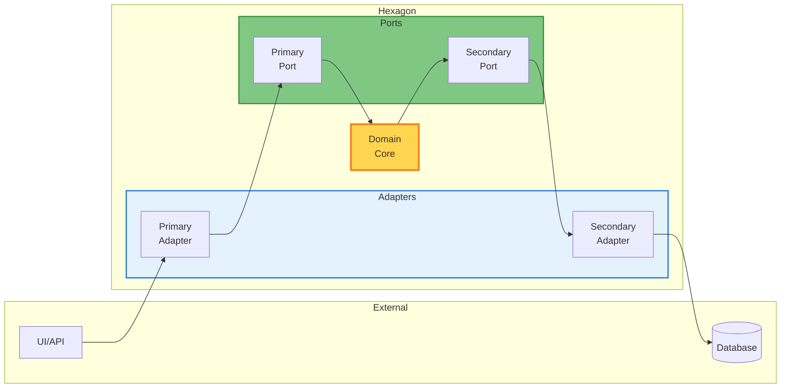
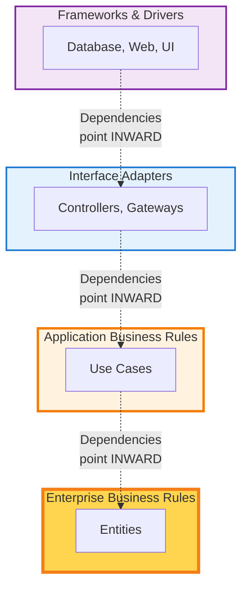
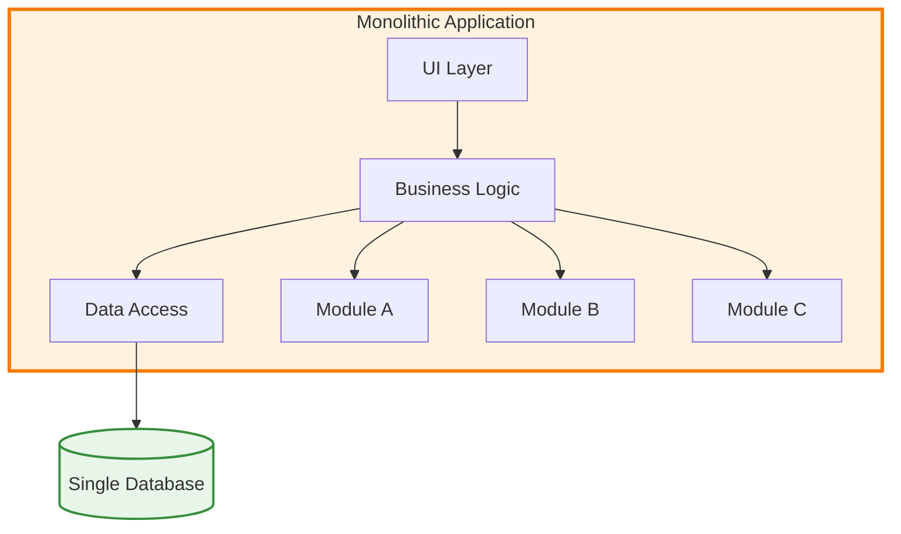
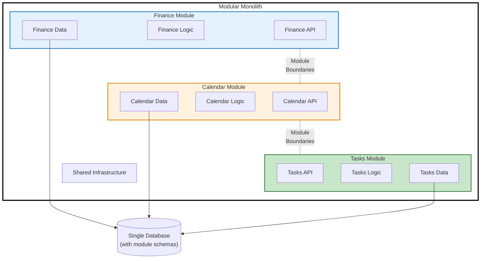
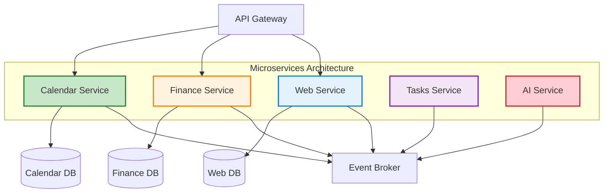
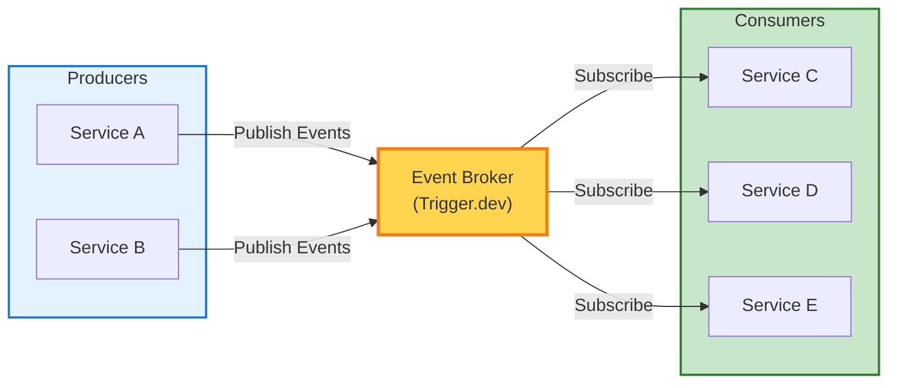
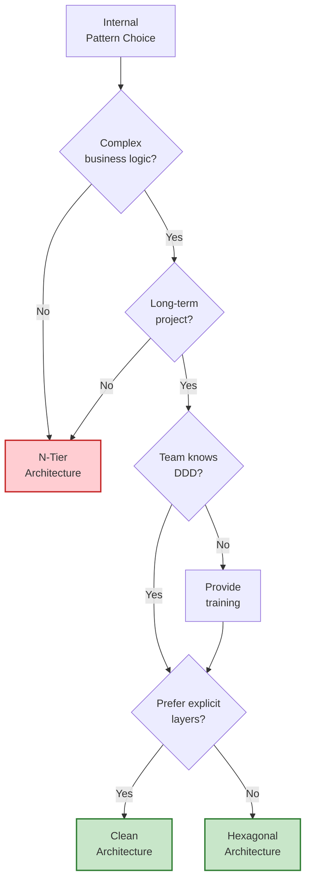
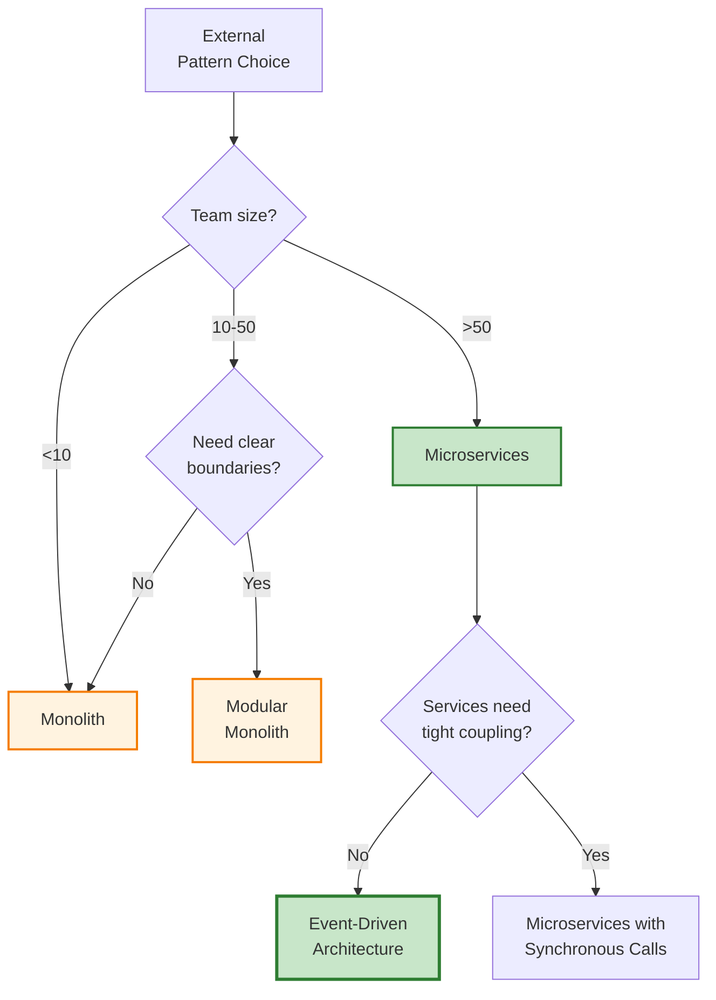

This document provides a comprehensive comparison of all major architectural patterns, including their design justifications, advantages, disadvantages, and practical guidance on when to use each pattern.

<Note>
**Key Insight**: Different architectural patterns solve different problems. Understanding the trade-offs is essential for making informed architectural decisions.
</Note>

## Pattern Categories

Architectural patterns can be categorized into two main types:

1. **Internal Patterns** - How code is organized within a service or application
   - N-Tier Architecture
   - Hexagonal Architecture (Ports & Adapters)
   - Clean Architecture
   - Onion Architecture

2. **External Patterns** - How services are distributed and communicate
   - Monolithic Architecture
   - Modular Monolith
   - Microservices Architecture
   - Event-Driven Architecture

---

## Internal Architectural Patterns

These patterns define how code is organized and structured within a single deployable unit (application or service).

### N-Tier Architecture

#### Design Justification

N-Tier architecture emerged from the need to separate concerns in applications by organizing code into horizontal layers based on technical responsibilities. Each tier handles a specific aspect of the application (presentation, business logic, data access), making it conceptually simple and straightforward to understand.

**Problem It Solves**: Provides basic separation of concerns in applications, making it easier to understand where different types of code should live.

#### Pros

**1. Simplicity and Familiarity**
- Extremely easy to understand and learn
- Most developers are already familiar with the pattern
- Minimal cognitive overhead for new team members
- Clear separation: UI code in presentation, business rules in BLL, database code in DAL

**2. Rapid Development for Simple Applications**
- Quick to set up and start building
- Minimal architectural overhead
- Straightforward data flow from top to bottom
- Works well for CRUD-heavy applications

**3. Tooling and Framework Support**
- Extensive tooling support (Visual Studio, IntelliJ, etc.)
- Many frameworks designed around this pattern (ASP.NET, Spring MVC)
- Large ecosystem of tutorials and examples
- Well-documented best practices

**4. Clear Technical Separation**
- Easy to assign work based on technical skills
- Frontend developers work in presentation tier
- Backend developers work in business logic tier
- Database specialists work in data access tier

#### Cons

**1. Tight Coupling to Infrastructure**
- Business logic directly depends on data access layer
- Changing databases requires modifying business logic
- Framework dependencies leak into business code
- Hard to test business rules in isolation

**Example:**
```typescript
// Business logic tightly coupled to Supabase
export class WorkspaceService {
  async createWorkspace(name: string) {
    // PROBLEM: Business logic knows about database implementation
    const { data } = await supabase.from('workspaces').insert({ name });
    return data;
  }
}
```

**2. Poor Testability**
- Business logic can't be tested without database
- Tests are slow (require database setup/teardown)
- Tests are fragile (break when database changes)
- Mocking is complex and brittle

**3. Technology Lock-In**
- Business logic married to specific ORM or framework
- Difficult to swap technologies
- Framework upgrades can require business logic changes
- Vendor lock-in becomes a serious risk

**4. Leaky Abstractions**
- Database concerns leak into business logic (SQL, transactions)
- Business logic becomes aware of persistence details
- Domain models often have framework annotations
- Violates Single Responsibility Principle

**5. Inflexible for Complex Business Logic**
- Business rules scattered across multiple layers
- Complex domain logic doesn't fit well in BLL tier
- Validation logic duplicated across layers
- No clear place for domain concepts

#### When to Use

✅ **Simple CRUD applications** with minimal business logic
✅ **Rapid prototyping** where speed matters more than quality
✅ **Small teams** unfamiliar with DDD or hexagonal concepts
✅ **Short-lived projects** that won't need long-term maintenance
✅ **Applications that will remain small** (&lt;10k LOC)

#### When to Avoid

❌ **Complex business logic** that needs to be protected
❌ **Long-term projects** requiring maintainability
❌ **Applications requiring high test coverage**
❌ **Systems that may need technology swaps**
❌ **Domain-driven design** implementations

---

### Hexagonal Architecture (Ports & Adapters)

#### Design Justification

Hexagonal Architecture (invented by Alistair Cockburn) solves the fundamental problem of tight coupling between business logic and infrastructure. By inverting dependencies and isolating the domain core, it ensures that business rules remain pure, testable, and independent of technology choices.

**Problem It Solves**: Protects business logic from infrastructure changes and framework dependencies, enabling true technology agnosticism and superior testability.



#### Pros

**1. Domain Logic is Pure and Technology-Agnostic**
- Business rules have zero infrastructure dependencies
- No database, no frameworks, no external services
- Core logic expresses business concepts directly
- Easy to understand business rules without technical noise

**Example:**
```typescript
// Pure domain entity - no infrastructure dependencies
export class Workspace {
  static create(name: string, ownerId: string): Workspace {
    if (name.length < 3 || name.length > 50) {
      throw new DomainError('Workspace name must be 3-50 characters');
    }
    return new Workspace(generateId(), name, ownerId, true, new Date());
  }

  archive(): void {
    if (!this._isActive) {
      throw new DomainError('Workspace is already archived');
    }
    this._isActive = false;
  }
}
```

**2. Superior Testability**
- Domain logic tested in isolation without infrastructure
- Tests run in milliseconds (no database, no network)
- Tests are reliable (no external dependencies)
- Easy to write comprehensive test suites

**Example:**
```typescript
// Test runs instantly, no infrastructure needed
describe('Workspace', () => {
  it('enforces name length business rule', () => {
    expect(() => Workspace.create('ab', 'owner-123'))
      .toThrow('Workspace name must be 3-50 characters');
  });
});
```

**3. Technology Can Be Swapped Easily**
- Infrastructure implemented as pluggable adapters
- Swap Supabase for Prisma without touching business logic
- Change from REST to GraphQL without domain changes
- Framework upgrades don't affect core business rules

**4. Clear Separation of Concerns**
- Domain core focuses purely on business rules
- Adapters handle technical concerns
- Ports define clear contracts
- Each layer has a single, well-defined responsibility

**5. Supports Test-Driven Development (TDD)**
- Easy to write tests before implementation
- Fast feedback loop encourages TDD practices
- Can develop business logic without infrastructure setup
- Reduces time to first working test

**6. Facilitates Domain-Driven Design (DDD)**
- Natural fit for DDD patterns (entities, value objects, aggregates)
- Business logic expressed in ubiquitous language
- Clear boundaries between domain and infrastructure
- Supports rich domain models

#### Cons

**1. Increased Complexity and Learning Curve**
- More moving parts than N-Tier
- Requires understanding of dependency inversion
- Team needs training on hexagonal concepts
- Harder for junior developers initially

**2. More Code and Boilerplate**
- Need to write ports (interfaces) and adapters
- Mapping between domain models and database models
- Dependency injection configuration
- More files and folders to manage

**Example:**
```typescript
// Domain model
class Workspace { ... }

// Port (interface)
interface WorkspaceRepository { ... }

// Adapter implementation
class SupabaseWorkspaceRepository implements WorkspaceRepository { ... }

// Mapping logic
private toDomain(row: any): Workspace { ... }
private toDatabase(workspace: Workspace): any { ... }

// More code than just `await supabase.from('workspaces').insert(...)`
```

**3. Overkill for Simple CRUD Applications**
- Unnecessary complexity for basic data management
- Slows down development of trivial features
- Mapping overhead adds no value for simple cases
- May frustrate team working on straightforward tasks

**4. Requires Architectural Discipline**
- Easy to bypass abstractions and couple to infrastructure
- Needs code reviews to enforce boundaries
- Developers may take shortcuts under pressure
- Degradation is gradual and hard to detect

#### When to Use

✅ **Complex business logic** that requires protection
✅ **Long-term projects** (multi-year lifespan)
✅ **Domain-driven design** implementations
✅ **High test coverage requirements** (>80%)
✅ **Systems that may need technology migration**
✅ **Projects with domain experts** involved

#### When to Avoid

❌ **Simple CRUD applications** with minimal logic
❌ **Rapid prototypes** that won't be maintained
❌ **Teams lacking DDD/hexagonal experience**
❌ **Projects with extreme time constraints**
❌ **Very small codebases** (&lt;5k LOC)

**In Tuturuuu**: Used within each microservice to protect business logic and enable comprehensive testing.

---

### Clean Architecture

#### Design Justification

Clean Architecture (by Robert C. Martin) extends hexagonal principles by explicitly defining concentric layers with strict dependency rules. Dependencies must always point inward toward the domain core, ensuring the most important business rules are completely isolated from volatile technical details.

**Problem It Solves**: Provides a systematic approach to dependency management, ensuring business logic remains stable while infrastructure changes freely.



#### Pros

**1. Explicit Layer Definitions**
- Four clearly defined layers with specific purposes
- Enterprise Business Rules (entities) - core domain
- Application Business Rules (use cases) - application workflows
- Interface Adapters (controllers) - translation layer
- Frameworks & Drivers (infrastructure) - external tools

**2. Strong Dependency Rule**
- Dependencies can only point inward, never outward
- Inner layers know nothing about outer layers
- Violations are easy to detect
- Architectural integrity is maintainable

**3. Use Cases as First-Class Citizens**
- Application workflows explicitly modeled
- Clear boundary between domain and application logic
- Use cases are testable application-level operations
- Business processes well-documented in code

**Example:**
```typescript
// Use case clearly expresses application workflow
export class CreateWorkspaceUseCase {
  constructor(
    private readonly repository: WorkspaceRepository,
    private readonly eventPublisher: EventPublisher
  ) {}

  async execute(command: CreateWorkspaceCommand): Promise<Workspace> {
    // 1. Create domain entity (domain logic)
    const workspace = Workspace.create(command.name, command.ownerId);

    // 2. Persist (infrastructure)
    await this.repository.save(workspace);

    // 3. Publish event (infrastructure)
    await this.eventPublisher.publish(new WorkspaceCreatedEvent(workspace));

    return workspace;
  }
}
```

**4. Framework Independence**
- Core business logic has zero framework dependencies
- Can upgrade frameworks without touching entities or use cases
- Frameworks become implementation details
- Reduces framework lock-in risks

#### Cons

**1. More Layers Than Hexagonal**
- Four layers vs hexagonal's simpler structure
- Can feel over-engineered for some applications
- More navigation between files and folders
- Steeper learning curve

**2. Distinction Between Entities and Use Cases Can Be Unclear**
- Developers may struggle with entity vs use case logic
- Business rules can end up in wrong layer
- Requires deep understanding of DDD concepts
- Guidelines needed to maintain clear boundaries

**3. Use Case Explosion**
- Each application workflow becomes a separate use case
- Can lead to many small, similar classes
- Folder structure can become overwhelming
- Feels like boilerplate for simple operations

#### When to Use

Same as Hexagonal Architecture, but especially when:

✅ **Clear separation of entities and use cases** is needed
✅ **Team values explicit architectural boundaries**
✅ **Application workflows are complex** and deserve first-class modeling
✅ **Robert C. Martin's principles** resonate with the team

#### When to Avoid

Same as Hexagonal Architecture, plus:

❌ **Team finds four layers unnecessarily complex**
❌ **Simple workflows don't justify use case classes**

**In Tuturuuu**: Not strictly followed; we prefer simpler hexagonal approach but adopt use case pattern where beneficial.

---

### Onion Architecture

#### Design Justification

Onion Architecture (by Jeffrey Palermo) visualizes layers as concentric circles, emphasizing that all dependencies point inward toward the core. It's similar to Clean Architecture but with slightly different layer names and emphasis on domain-centric design.

**Problem It Solves**: Same as Hexagonal and Clean, but with visual metaphor making dependency direction intuitive.

#### Pros & Cons

Onion Architecture shares the same pros and cons as Hexagonal and Clean Architecture. The main differences are:

**Unique Aspects:**
- Visual metaphor (onion layers) is intuitive
- Slightly simpler than Clean (fewer prescribed layers)
- Emphasizes domain services as a separate layer
- Popular in .NET community

**In Tuturuuu**: Not explicitly used, but principles align with our hexagonal approach.

---

## External Architectural Patterns

These patterns define how applications are deployed, distributed, and communicate with each other.

### Monolithic Architecture

#### Design Justification

A monolithic architecture packages the entire application as a single deployable unit. All features, modules, and layers exist within one codebase and deploy together. This is the traditional, default architecture for most applications.

**Problem It Solves**: Provides simplicity in deployment, development environment setup, and team coordination for small to medium applications.



#### Pros

**1. Simplicity**
- Single codebase, single repository
- Single deployment artifact
- Simple development environment setup
- Easy to reason about the entire system

**2. Easy Development Workflow**
- All code changes happen in one place
- No cross-service coordination needed
- Straightforward debugging (single process)
- IDE works well with single codebase

**3. Simple Deployment**
- Deploy one artifact to production
- Atomic deployments (all or nothing)
- No service orchestration needed
- Rollback is straightforward

**4. Performance**
- In-process function calls (fast)
- No network overhead between modules
- Single database connection pool
- No serialization/deserialization overhead

**5. Easier to Test End-to-End**
- Spin up entire application locally
- Integration tests are straightforward
- No need to mock external services
- Complete system available for testing

#### Cons

**1. Scaling Challenges**
- Must scale entire application as a unit
- Can't scale individual features independently
- Wasteful resource allocation
- Expensive at high scale

**Example:**
```typescript
// Problem: Even if only the reporting module needs more resources,
// we must scale the entire monolith

// Monolith running on server:
// - User authentication (low load)
// - CRUD operations (low load)
// - Report generation (HIGH load) ← Only this needs scaling
// - Admin panel (low load)

// Must scale everything to handle report generation load
// This scales authentication, CRUD, and admin unnecessarily
```

**2. Tight Coupling and Dependency Management**
- Modules easily become interdependent
- Changes ripple across the codebase
- Hard to isolate features
- Difficult to enforce module boundaries

**3. Slow Development at Scale**
- Large codebase slows down IDE
- Long build times
- Merge conflicts increase with team size
- Difficult to parallelize work across teams

**4. Deployment Risk**
- Any change requires deploying entire application
- Small bug fix carries high risk
- Downtime affects all features
- Rollback affects entire system

**5. Technology Lock-In**
- Entire application must use same technology stack
- Can't adopt new technologies incrementally
- Framework upgrades affect entire application
- Limited flexibility in technology choices

**6. Team Scaling Issues**
- Difficult to divide work across multiple teams
- High coordination overhead
- Merge conflicts increase
- Conway's Law: Organization mirrors monolith structure

#### When to Use

✅ **Small to medium applications**
✅ **Single, co-located team**
✅ **Limited operational complexity budget**
✅ **Predictable scaling requirements**
✅ **Startup MVP** or proof of concept
✅ **Low traffic applications**

#### When to Avoid

❌ **Large teams** (&gt;20 developers)
❌ **Need independent deployment** of features
❌ **Different scaling requirements** per feature
❌ **High availability requirements** (99.99%+)
❌ **Diverse technology needs** per domain

---

### Modular Monolith

#### Design Justification

A Modular Monolith combines monolithic deployment with modular organization. The application is still deployed as a single unit, but internally structured into well-defined, loosely-coupled modules with clear boundaries. This provides many benefits of microservices without operational complexity.

**Problem It Solves**: Enables team scalability and clear boundaries while avoiding distributed systems complexity.



#### Pros

**1. Combines Monolith Simplicity with Modular Benefits**
- Single deployment unit (simple operations)
- Clear module boundaries (organizational clarity)
- Shared infrastructure (reduced duplication)
- Easier than microservices to operate

**2. Team Scalability**
- Teams can own modules independently
- Reduced coordination overhead
- Clear ownership boundaries
- Parallel development possible

**3. Enforced Boundaries Without Distribution**
- Modules communicate through well-defined interfaces
- Can enforce boundaries programmatically
- No network overhead
- Easier to refactor than microservices

**4. Migration Path to Microservices**
- Modules can be extracted as services later
- Boundaries already defined
- Incremental migration possible
- Low-risk evolution strategy

**Example in Tuturuuu:**
```typescript
// apps/web/src/ - Modular organization
apps/web/src/
├── app/[locale]/(dashboard)/[wsId]/
│   ├── finance/           # Finance module
│   │   ├── transactions/
│   │   ├── reports/
│   │   └── _components/   # Finance-specific components
│   ├── calendar/          # Calendar module
│   │   ├── events/
│   │   └── _components/   # Calendar-specific components
│   └── tasks/             # Tasks module
│       ├── boards/
│       └── _components/   # Task-specific components
```

**5. Shared Infrastructure and Code**
- Reuse common utilities easily
- Shared authentication, logging, etc.
- No code duplication across modules
- Centralized configuration

#### Cons

**1. Requires Discipline to Maintain Boundaries**
- Easy to create cross-module dependencies
- Boundaries are convention-based, not enforced
- Gradual degradation without governance
- Need automated tools to detect violations

**2. Still Scales as a Unit**
- Can't scale individual modules
- All modules deployed together
- Resource allocation is coarse-grained
- Same scaling limitations as monolith

**3. Shared Database Can Become Bottleneck**
- All modules use same database
- Schema coupling between modules
- Difficult to optimize per-module data access
- Database becomes single point of contention

**4. Not True Isolation**
- Module failure can affect other modules
- Shared resources (memory, CPU) create contention
- Memory leak in one module affects all
- Less fault isolation than microservices

#### When to Use

✅ **Medium to large monoliths** needing better organization
✅ **Growing teams** (10-50 developers)
✅ **Clear domain boundaries** exist
✅ **Want microservices benefits** without operational complexity
✅ **Migration path** from monolith to microservices desired
✅ **Don't need independent deployment** yet

#### When to Avoid

❌ **Very small applications** (overhead not justified)
❌ **Need independent deployment** of modules
❌ **Different scaling requirements** per module
❌ **True fault isolation** is critical
❌ **Modules have very different technology needs**

**In Tuturuuu**: Used for frontend (web app) with clear module boundaries for Finance, Calendar, Tasks, etc.

---

### Microservices Architecture

#### Design Justification

Microservices architecture decomposes the system into small, independently deployable services, each focused on a specific business capability. Services communicate via lightweight protocols (HTTP, events) and can be developed, deployed, and scaled independently.

**Problem It Solves**: Enables organizational scalability, independent deployment, technology diversity, and granular scaling for complex, large-scale systems.



#### Pros

**1. Independent Deployment and Scalability**
- Deploy services independently without coordination
- Scale services based on individual needs
- Deploy multiple times per day per service
- Reduced deployment risk (only one service affected)

**Example:**
```typescript
// Different services scale independently
const scaling = {
  web: { min: 2, max: 100 },      // High traffic, needs scaling
  finance: { min: 1, max: 10 },   // Moderate traffic
  calendar: { min: 1, max: 5 },   // Low traffic
  admin: { min: 1, max: 2 }       // Very low traffic
};
```

**2. Organizational Scalability**
- Teams own services end-to-end ("you build it, you run it")
- Parallel development across teams
- Reduced coordination overhead
- Clear ownership and accountability

**3. Technology Diversity**
- Each service can use different technology stack
- Choose best tool for each job
- Experiment with new technologies in isolation
- Incremental technology adoption

**Example:**
```typescript
// Different services, different technologies
const services = {
  web: { language: 'TypeScript', framework: 'Next.js' },
  ml: { language: 'Python', framework: 'FastAPI' },
  realtime: { language: 'Go', framework: 'Gin' },
  batch: { language: 'Rust', framework: 'Actix' }
};
```

**4. Fault Isolation**
- Service failure doesn't bring down entire system
- Blast radius is limited to single service
- Other services continue operating
- System degrades gracefully

**5. Easier to Understand Individual Services**
- Each service is small and focused
- New developers can understand one service quickly
- Cognitive load is reduced
- Domain complexity is bounded

#### Cons

**1. Significant Operational Complexity**
- Need service discovery, API gateway, load balancers
- Distributed logging, tracing, and monitoring essential
- Complex deployment pipelines
- Requires mature DevOps practices

**2. Distributed System Challenges**
- Network latency and unreliability
- Debugging is harder (distributed tracing needed)
- Performance tuning is complex
- Testing end-to-end is difficult

**3. Data Management Complexity**
- Each service has its own database
- No distributed transactions (must use sagas)
- Eventual consistency instead of strong consistency
- Complex queries across services are difficult

**Example:**
```typescript
// Complex workflow spanning multiple services
async function createWorkspaceWithResources(data: WorkspaceData) {
  // 1. Create workspace (Web Service)
  const workspace = await webService.createWorkspace(data);

  // 2. Setup finance (Finance Service)
  // Problem: What if this fails? Need saga pattern
  await financeService.setupAccount(workspace.id);

  // 3. Create calendar (Calendar Service)
  // Problem: What if this fails? How to rollback?
  await calendarService.createCalendar(workspace.id);

  // Need complex saga orchestration for rollback
}
```

**4. Increased Infrastructure Costs**
- More servers/containers to run
- More databases to maintain
- More monitoring and logging infrastructure
- Higher cloud bills

**5. Requires Organizational Maturity**
- Teams must be autonomous and skilled
- Need strong DevOps culture
- Requires discipline to maintain service boundaries
- Not suitable for inexperienced teams

**6. Service Versioning and API Compatibility**
- Must maintain backward compatibility
- Breaking changes require careful coordination
- Versioning strategy is essential
- Contract testing is mandatory

#### When to Use

✅ **Large, complex systems** with multiple domains
✅ **Large teams** (&gt;50 developers)
✅ **Different scaling requirements** per feature
✅ **Need independent deployment** per domain
✅ **High availability requirements** (99.99%+)
✅ **Organization has DevOps maturity**
✅ **Different technology needs** per domain

#### When to Avoid

❌ **Small applications** (&lt;50k LOC)
❌ **Small teams** (&lt;10 developers)
❌ **Limited operational expertise**
❌ **Tight budget** constraints
❌ **Strong consistency requirements** dominate
❌ **Startup MVP** or proof of concept

**In Tuturuuu**: Each app (`web`, `finance`, `calendar`, `rewise`, `nova`) is an independent microservice with its own deployment, scaling, and technology choices.

---

### Event-Driven Architecture

#### Design Justification

Event-Driven Architecture (EDA) uses asynchronous events as the primary communication mechanism between services. Services publish events when state changes occur, and other services subscribe to relevant events, reacting accordingly. This creates ultimate decoupling between services.

**Problem It Solves**: Eliminates tight coupling between services, enables asynchronous processing, and provides natural extensibility for adding new functionality.



#### Pros

**1. Ultimate Decoupling**
- Producers don't know about consumers
- Consumers don't know about producers
- Services can be added/removed without changes
- Natural extensibility

**Example:**
```typescript
// Producer: Publishes event, unaware of consumers
await trigger.event({
  name: 'workspace.created',
  payload: { workspaceId, ownerId, name }
});

// Consumer 1: Sends welcome email (can add without changing producer)
client.defineJob({
  id: 'send-welcome-email',
  trigger: eventTrigger({ name: 'workspace.created' }),
  run: async (payload) => await sendEmail(payload.ownerId)
});

// Consumer 2: Setup analytics (added later, no producer change)
client.defineJob({
  id: 'setup-analytics',
  trigger: eventTrigger({ name: 'workspace.created' }),
  run: async (payload) => await trackWorkspace(payload.workspaceId)
});

// Consumer 3: AI onboarding (added even later, still no producer change)
client.defineJob({
  id: 'ai-onboarding',
  trigger: eventTrigger({ name: 'workspace.created' }),
  run: async (payload) => await setupAI(payload.workspaceId)
});
```

**2. Natural Resilience**
- Broker acts as buffer for failures
- If consumer is down, events are persisted
- Automatic retry mechanisms
- Temporal decoupling (producer doesn't wait)

**3. Asynchronous Processing**
- Producers don't block on consumers
- Fast response times for users
- Long-running operations don't slow down requests
- Better resource utilization

**4. Audit Trail and Debugging**
- Complete history of events
- Can replay events for debugging
- Natural audit log
- Time-travel debugging possible

**5. Extensibility**
- Add new features by adding new consumers
- No changes to existing services
- Supports A/B testing (run old and new consumers in parallel)
- Safe experimentation

#### Cons

**1. Eventual Consistency**
- No immediate consistency guarantees
- System state converges over time
- Complex to reason about for developers
- Debugging race conditions is hard

**Example:**
```typescript
// User creates workspace
await webService.createWorkspace(data);

// User immediately tries to access analytics
// Problem: Analytics consumer may not have processed event yet
const analytics = await analyticsService.getWorkspaceAnalytics(workspaceId);
// May return null because event hasn't been processed yet!
```

**2. Increased Complexity**
- Need to manage event broker infrastructure
- Event schema versioning is critical
- Debugging distributed event flows is difficult
- Monitoring and observability are essential

**3. Event Schema Management**
- Breaking changes to events affect all consumers
- Need careful versioning strategy
- Documentation of event schemas is critical
- Contract testing is mandatory

**4. No Immediate Responses**
- Can't return result from consumer to producer
- Must poll or use separate response events
- Complex request-response patterns
- Not suitable for all workflows

**5. Potential for Event Storms**
- Cascading events can amplify load
- Event loops are possible
- Need circuit breakers and rate limiting
- Monitoring for event accumulation essential

#### When to Use

✅ **Highly decoupled microservices** architecture
✅ **Asynchronous workflows** dominate
✅ **Need to add features** without modifying existing services
✅ **Audit trail** and event sourcing needed
✅ **Variable load** that benefits from buffering
✅ **Long-running operations** that can be async

#### When to Avoid

❌ **Strong consistency** is critical
❌ **Immediate responses** always needed
❌ **Simple request-response** patterns dominate
❌ **Team lacks event-driven experience**
❌ **Debugging complexity** is unacceptable
❌ **Real-time guarantees** are essential

**In Tuturuuu**: Primary communication pattern between microservices using Trigger.dev as event broker.

---

## Comprehensive Comparison Matrix

| Pattern | Scope | Complexity | Testability | Scalability | Team Size | Technology Flexibility | Best For |
|---------|-------|------------|-------------|-------------|-----------|----------------------|----------|
| **N-Tier** | Internal | Low | Poor | Limited | Small | Low | Simple CRUD apps |
| **Hexagonal** | Internal | Medium | Excellent | N/A | Any | High | Complex business logic |
| **Clean** | Internal | Medium-High | Excellent | N/A | Any | High | DDD applications |
| **Onion** | Internal | Medium | Excellent | N/A | Any | High | Domain-centric apps |
| **Monolith** | External | Low | Easy | Limited | Small | Low | Small applications |
| **Modular Monolith** | External | Medium | Easy | Limited | Medium | Low | Growing applications |
| **Microservices** | External | High | Moderate | Excellent | Large | Very High | Large, complex systems |
| **Event-Driven** | Communication | High | Moderate | Excellent | Large | High | Decoupled services |

---

## Decision Framework

### Choosing Internal Patterns



### Choosing External Patterns



---

## Tuturuuu's Architectural Decisions

Tuturuuu uses a **combination of patterns**, applying each where it provides the most value:

### External Architecture: Microservices + Event-Driven

**Decision**: Decompose system into independent microservices communicating via events

**Justification**:
- Multiple teams working on different domains (AI, Finance, Calendar)
- Need independent deployment and scaling
- Want technology flexibility per service
- High availability requirements

**Pattern Combination**:
- **Microservices** for organizational scalability and independent deployment
- **Event-Driven** for decoupling and resilience

### Internal Architecture: Hexagonal (Within Each Service)

**Decision**: Each microservice uses Hexagonal Architecture internally

**Justification**:
- Complex business logic needs protection
- High test coverage requirements
- Long-term maintainability is critical
- May need to swap infrastructure (Supabase → another provider)

### Frontend: Modular Monolith

**Decision**: Web frontend is a modular monolith with clear module boundaries

**Justification**:
- Single deployment simplifies frontend operations
- Clear module boundaries support team scalability
- Don't need independent frontend deployment yet
- Migration path to micro-frontends if needed

---

## Related Documentation

- [Layering Patterns](/platform/architecture/system-design/layering-patterns) - Detailed comparison of N-Tier vs Hexagonal
- [Architectural Decisions](/platform/architecture/system-design/architectural-decisions) - Core architectural choices in Tuturuuu
- [Hexagonal Architecture](/platform/architecture/system-design/hexagonal-architecture) - Implementation details
- [Microservices Patterns](/platform/architecture/system-design/microservices-patterns) - Service boundaries and communication
- [Event-Driven Architecture](/platform/architecture/system-design/event-driven-architecture) - Event streaming patterns
