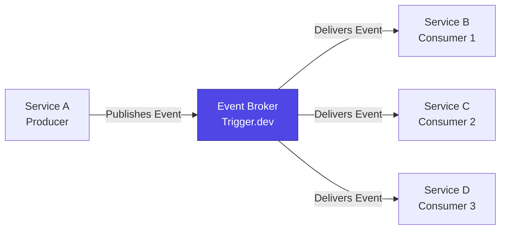

Event-Driven Architecture (EDA) is the backbone of Tuturuuu's inter-service communication strategy. This document explores the advantages, drawbacks, and practical implementation patterns using Trigger.dev.

## Overview

In an event-driven system, services communicate asynchronously through events published to a central event broker. Services are **producers** (publishing events) and **consumers** (subscribing to and processing events), with the broker handling delivery, persistence, and reliability.



## Advantages of Event-Driven Design

### 1. True Service Decoupling and Autonomy

**Architectural Principle:** Services are not aware of each other. A service publishes an event (e.g., `OrderPlaced`) to a central stream and its job is done. It does not know, nor care, which other services consume that event.

**Impact:** This provides the ultimate form of loose coupling. We can add, remove, or modify downstream consumer services (like `InventoryService` or `NotificationService`) without ever changing the upstream producer service. This enables unparalleled flexibility and independent team workflows.

**Example in Tuturuuu:**

```typescript
// apps/web/src/app/api/workspaces/create/route.ts
export async function POST(request: Request) {
  const workspace = await createWorkspace(data);

  // Fire event - producer doesn't know who consumes it
  await trigger.event({
    name: "workspace.created",
    payload: {
      workspaceId: workspace.id,
      ownerId: userId,
      createdAt: new Date(),
    }
  });

  return Response.json({ workspace });
}

// Multiple independent consumers:
// 1. OnboardingService - sends welcome emails
// 2. AnalyticsService - tracks workspace creation metrics
// 3. ProvisioningService - creates default resources
// 4. BillingService - initializes billing account
// ALL without the producer knowing they exist
```

**Benefits:**
- Add new features (e.g., compliance auditing) by deploying new consumers
- Remove features by undeploying consumers
- Modify consumer logic without touching producers
- Teams work independently on their services

---

### 2. Inherent Resilience and Fault Tolerance

**Architectural Principle:** The event broker acts as a durable, persistent intermediary. If a consuming service fails, the events are not lost; they remain safely in the event log.

**Impact:** This design creates a highly resilient system. If the `NotificationService` is down for maintenance, users can still place orders. Once the service comes back online, it processes the backlog of events, ensuring no data is lost and system availability is not compromised by a single service failure.

**Example in Tuturuuu:**

```typescript
// Trigger.dev job with automatic retry logic
client.defineJob({
  id: "send-workspace-invitation",
  name: "Send workspace invitation email",
  version: "1.0.0",
  trigger: eventTrigger({ name: "workspace.member.invited" }),
  run: async (payload, io) => {
    // If this fails, Trigger.dev automatically retries
    await io.sendEmail("send-invitation", {
      to: payload.email,
      template: "workspace-invitation",
      data: { workspaceId: payload.workspaceId }
    });
  }
});

// Key resilience features:
// - Automatic retries with exponential backoff
// - Event persisted until successfully processed
// - Dead-letter queue for permanently failed events
// - Producer service unaffected by consumer failures
```

**Benefits:**
- **No cascading failures**: Producer continues working even if consumers are down
- **Automatic recovery**: Consumers process backlogs when they come back online
- **Data durability**: Events are persisted and never lost
- **Graceful degradation**: System partially functional even with some services down

---

### 3. Superior Scalability and Elasticity

**Architectural Principle:** The architecture naturally supports parallel processing. Multiple instances of a consuming service can read from the same event stream, with the broker automatically distributing the workload among them.

**Impact:** If a surge of `UserActivity` events occurs during a peak traffic event, we can horizontally scale the number of consumer instances to handle the load. The event broker acts as a load-leveling buffer, absorbing spikes and feeding events to consumers at a sustainable pace.

**Example in Tuturuuu:**

```typescript
// Single job definition scales horizontally
client.defineJob({
  id: "process-user-analytics",
  name: "Process user analytics events",
  version: "1.0.0",
  trigger: eventTrigger({ name: "user.activity" }),
  run: async (payload, io) => {
    await io.runTask("aggregate-metrics", async () => {
      // Complex analytics processing
      return await aggregateUserMetrics(payload);
    });
  }
});

// Scaling scenarios:
// Normal traffic: 2 worker instances process ~100 events/min
// Traffic spike: Trigger.dev auto-scales to 20 workers, process 1000 events/min
// After spike: Auto-scales down to 2 workers
// No code changes required for scaling
```

**Benefits:**
- **Horizontal scaling**: Add more consumer instances to increase throughput
- **Load leveling**: Broker buffers spikes, consumers process at sustainable rate
- **Independent scaling**: Scale each consumer service based on its specific needs
- **Cost efficiency**: Auto-scaling means you only pay for what you use

---

### 4. Temporal Decoupling and Data-as-a-Stream

**Architectural Principle:** By using a persistent event log, events are stored and can be re-read. This decouples services in time.

**Impact:** This is a powerful capability. We can deploy a completely new `BusinessIntelligenceService` months after launch, and it can consume the entire history of events from the beginning to generate new insights. It allows the system's data to be repurposed for future use cases that are unknown today.

**Example in Tuturuuu:**

```typescript
// Events stored permanently in Trigger.dev
// New service deployed 6 months after launch
client.defineJob({
  id: "ml-user-behavior-analysis",
  name: "ML model for user behavior prediction",
  version: "1.0.0",
  // Replay ALL historical events to train model
  trigger: eventTrigger({
    name: ["user.registered", "user.activity", "workspace.created"],
    replay: { fromDate: "2024-01-01" } // Replay from launch date
  }),
  run: async (payload, io) => {
    await io.runTask("update-ml-model", async () => {
      // Train ML model on historical data
      return await updateUserBehaviorModel(payload);
    });
  }
});

// Use cases:
// - Train ML models on historical data
// - Rebuild read models from scratch
// - Audit trail and compliance reporting
// - Time-travel debugging (replay to specific point in time)
// - A/B testing new algorithms on historical data
```

**Benefits:**
- **Event sourcing**: Complete audit trail of all system changes
- **Replayability**: Rebuild state by replaying events
- **Future-proofing**: New use cases consume historical data
- **Debugging**: Replay events to reproduce bugs
- **Analytics**: Run new analyses on past data

---

## Drawbacks of Event-Driven Design

### 1. Complexity in Reasoning and Debugging

**Architectural Principle:** Business processes are not executed in a single, linear call stack. They are a series of asynchronous, choreographed events.

**Impact:** Tracing a single request (e.g., "why did this user's order fail?") becomes significantly more complex. It requires sophisticated distributed tracing tools to correlate events across multiple independent services, making debugging more challenging than in a synchronous system.

**Example in Tuturuuu:**

```typescript
// Synchronous flow (easy to debug):
function createWorkspace(data) {
  const workspace = db.createWorkspace(data);
  sendWelcomeEmail(workspace.owner);
  createDefaultResources(workspace.id);
  return workspace;
}
// Single stack trace, clear error location

// Event-driven flow (harder to debug):
async function createWorkspace(data) {
  const workspace = await db.createWorkspace(data);

  // Event 1: Triggers email service (separate process)
  await trigger.event({ name: "workspace.created", payload: { ... } });
  // Event 2: Triggers resource service (separate process)
  await trigger.event({ name: "workspace.resources.provision", payload: { ... } });

  return workspace;
}
// Error in email service doesn't show in this stack trace
// Need distributed tracing to see full flow
```

**Mitigation strategies:**
- Use **correlation IDs** to link related events
- Implement comprehensive **logging** with structured data
- Use **distributed tracing tools** (e.g., OpenTelemetry, Sentry)
- Build **observability dashboards** to visualize event flows
- Include **context** in events (userId, workspaceId, sessionId)

---

### 2. Eventual Consistency is a Prerequisite

**Architectural Principle:** Due to the asynchronous nature of event processing, there is an inherent delay between when an event is published and when it is processed by all consumers.

**Impact:** The system is "eventually consistent." For a brief period, a newly registered user may not yet appear in search results. The entire business logic and user experience must be designed to accommodate this non-instantaneous state.

**Example in Tuturuuu:**

```typescript
// User registers (Event 1)
const user = await createUser(data);
await trigger.event({ name: "user.registered", payload: { userId: user.id } });

// Search index service (Event Consumer)
client.defineJob({
  id: "update-user-search-index",
  trigger: eventTrigger({ name: "user.registered" }),
  run: async (payload, io) => {
    // This runs AFTER the user creation completes
    // There's a time gap (eventual consistency)
    await io.runTask("index-user", async () => {
      await searchIndex.addUser(payload.userId);
    });
  }
});

// Problem: User just registered but doesn't appear in search for 1-2 seconds
// Solution: UI shows "Indexing your profile..." message
// Or: Optimistic UI updates (show in UI immediately, sync in background)
```

**Mitigation strategies:**
- **Optimistic UI**: Show changes immediately in UI, sync in background
- **Loading states**: Communicate to users that processing is happening
- **Read-your-own-writes**: Critical data available immediately via different path
- **Acceptable delay**: Design UX to accommodate 1-5 second delays
- **Conflict resolution**: Handle rare cases where events arrive out of order

---

### 3. Data Management and Schema Governance

**Architectural Principle:** The structure of the events themselves becomes the public API contract between services.

**Impact:** Evolving these event schemas over time is a critical challenge. A change to the `UserUpdated` event could break downstream consumers if not managed carefully. This necessitates a formal schema governance strategy (often using a Schema Registry) to ensure compatibility.

**Example in Tuturuuu:**

```typescript
// Version 1: Original event schema
interface UserRegisteredV1 {
  userId: string;
  email: string;
}

// Version 2: Added optional fields (backward compatible)
interface UserRegisteredV2 {
  userId: string;
  email: string;
  firstName?: string;  // NEW: optional field (safe)
  lastName?: string;   // NEW: optional field (safe)
}

// Version 3: BREAKING CHANGE (breaks old consumers)
interface UserRegisteredV3 {
  userId: string;
  email: string;
  fullName: string;  // BREAKING: now required, old consumers will fail
}

// Solution: Version events and support multiple versions
await trigger.event({
  name: "user.registered.v2",  // Explicit versioning
  payload: { ... }
});

// Or use Zod schemas for validation
const UserRegisteredSchema = z.object({
  userId: z.string(),
  email: z.email(),
  firstName: z.string().optional(),
  lastName: z.string().optional()
});
```

**Mitigation strategies:**
- **Schema versioning**: Use explicit version numbers in event names
- **Additive changes only**: Add optional fields, never remove or change existing ones
- **Schema registry**: Centralize schema definitions (packages/types/src/events/)
- **Validation**: Use Zod to validate event payloads
- **Deprecation strategy**: Support old versions for 6-12 months before removal
- **Consumer testing**: Test consumers against schema changes before deployment

---

### 4. High Operational Overhead of the Event Broker

**Architectural Principle:** The event broker is not just a library; it is a complex, distributed system that becomes the backbone of the entire architecture.

**Impact:** It requires significant operational expertise to manage, tune, and monitor. Its availability is critical to the entire system's health, adding a substantial piece of infrastructure that must be maintained.

**In Tuturuuu:**

Trigger.dev (managed event platform) reduces this overhead significantly, but considerations remain:

```typescript
// Monitoring and observability required
client.defineJob({
  id: "critical-payment-processing",
  name: "Process payment events",
  version: "1.0.0",
  trigger: eventTrigger({ name: "payment.initiated" }),
  run: async (payload, io) => {
    // Must monitor:
    // - Event processing latency
    // - Error rates
    // - Queue depth
    // - Consumer lag
    // - Retry counts

    await io.runTask("process-payment", async () => {
      // Instrumentation for observability
      const startTime = Date.now();
      try {
        await processPayment(payload);
        await metrics.recordSuccess(Date.now() - startTime);
      } catch (error) {
        await metrics.recordFailure(error);
        throw error;
      }
    });
  }
});
```

**Operational concerns:**
- **Monitoring**: Track event throughput, latency, error rates
- **Alerting**: Set up alerts for queue backlog, high error rates
- **Capacity planning**: Ensure broker can handle peak load
- **Cost management**: Event processing costs scale with volume
- **Vendor lock-in**: Dependency on Trigger.dev (mitigated by standard patterns)

**Mitigation strategies:**
- Use **managed service** (Trigger.dev) to reduce operational burden
- Implement comprehensive **monitoring and alerting**
- Design **idempotent consumers** to safely retry failed events
- Set up **dead-letter queues** for permanently failed events
- Regular **capacity reviews** and load testing
- Document **runbooks** for common operational issues

---

## Implementation Patterns in Tuturuuu

### Event Publishing

```typescript
// packages/trigger/src/events.ts
import { client } from "./client";

export async function publishEvent<T>(
  name: string,
  payload: T,
  options?: { deduplicationKey?: string }
) {
  return await client.sendEvent({
    name,
    payload,
    id: options?.deduplicationKey // Prevents duplicate processing
  });
}

// Usage in application code
await publishEvent("workspace.member.added", {
  workspaceId,
  userId,
  role,
  addedBy
});
```

### Event Consumption

```typescript
// packages/trigger/src/jobs/workspace-events.ts
import { client } from "../client";
import { eventTrigger } from "@trigger.dev/sdk";

client.defineJob({
  id: "workspace-member-added",
  name: "Handle workspace member addition",
  version: "1.0.0",
  trigger: eventTrigger({ name: "workspace.member.added" }),
  run: async (payload, io) => {
    const { workspaceId, userId, role } = payload;

    // Idempotent operations (safe to retry)
    await io.runTask("send-welcome-email", async () => {
      return await sendWelcomeEmail(userId, workspaceId);
    });

    await io.runTask("grant-permissions", async () => {
      return await grantWorkspacePermissions(userId, workspaceId, role);
    });

    await io.runTask("log-audit-event", async () => {
      return await auditLog.record({
        action: "member-added",
        workspaceId,
        userId,
        timestamp: new Date()
      });
    });
  }
});
```

### Error Handling and Retries

```typescript
client.defineJob({
  id: "critical-data-sync",
  name: "Sync critical data",
  version: "1.0.0",
  trigger: eventTrigger({ name: "data.changed" }),
  run: async (payload, io) => {
    try {
      await io.runTask("sync-data", async () => {
        return await syncData(payload);
      }, {
        retry: {
          maxAttempts: 3,
          factor: 2,
          minTimeoutInMs: 1000,
          maxTimeoutInMs: 10000
        }
      });
    } catch (error) {
      // After all retries failed, send to dead-letter queue
      await io.sendEvent("send-to-dlq", {
        name: "data.sync.failed",
        payload: {
          originalEvent: payload,
          error: error.message,
          timestamp: new Date()
        }
      });
    }
  }
});
```

## When to Use Event-Driven Architecture

**Use EDA when:**
- ✅ Services should be decoupled and independently deployable
- ✅ Background processing is acceptable (non-critical path)
- ✅ Eventual consistency is acceptable for the use case
- ✅ You need high resilience and fault tolerance
- ✅ Future extensibility is important

**Don't use EDA when:**
- ❌ Immediate consistency is required (use synchronous calls)
- ❌ User is waiting for the result in real-time
- ❌ Simple CRUD operations without complex workflows
- ❌ Debugging complexity outweighs benefits (very simple apps)

## Related Documentation

- [Architectural Decisions](/platform/architecture/system-design/architectural-decisions) - Why we chose EDA
- [Extensibility, Resilience & Scalability](/platform/architecture/system-design/extensibility-resilience-scalability) - Benefits in detail
- [Trigger.dev Package](/reference/packages/trigger) - Implementation reference
- [Background Jobs](/build/development-tools/index#background-jobs) - How to create jobs
