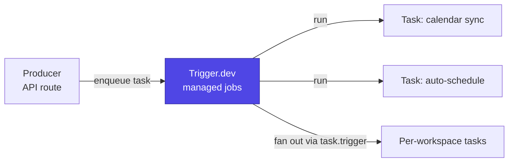

Event-Driven Architecture (EDA) is a useful lens for the asynchronous,
fire-and-forget work in Tuturuuu — calendar syncs, auto-scheduling, and other
background jobs that should not block a user request. This document explains the
general advantages and drawbacks of EDA, then grounds each idea in how Tuturuuu
**actually** runs background work today: [Trigger.dev](https://trigger.dev) v4
tasks.

<Note>
  **Read this as patterns, not literal architecture.** Tuturuuu is not built on a
  Kafka-style event bus with an immutable event log, replayable streams, or
  dead-letter queues. It runs conventional Next.js apps that enqueue
  background **tasks** on Trigger.dev (a managed jobs platform) and persist state
  in a shared Supabase Postgres database. Sections below are labelled
  **Concept** (general EDA theory) or **In Tuturuuu** (verified against real
  code). Treat any capability not shown in real code as illustrative.
</Note>

<Info>
  **Active migration.** `apps/web` (Next.js, port `7803`) is being replaced by
  `apps/tanstack-web` (TanStack Start) plus `apps/backend` (Rust, port `7820`).
  Background-job ownership may shift during this transition — some asynchronous
  work that runs as a Trigger.dev task today may move into the Rust backend. See
  [TanStack + Rust Migration](/platform/architecture/tanstack-rust-migration).
  Nothing in this page is a permanent architectural commitment.
</Info>

## Overview

**Concept.** In a fully event-driven system, services communicate asynchronously
through events published to a central broker. Services are **producers**
(publishing events) and **consumers** (subscribing to and processing events),
with the broker handling delivery, persistence, and reliability.


```mermaid
graph LR
    A[Producer<br/>API route] -->|enqueue task| B[Trigger.dev<br/>managed jobs]
    B -->|run| C[Task: calendar sync]
    B -->|run| D[Task: auto-schedule]
    B -->|fan out via task.trigger| E[Per-workspace tasks]

    style B fill:#4f46e5,stroke:#3730a3,color:#fff
```

**In Tuturuuu.** There is no central event bus. Instead:

- A request handler (an `apps/web` API route or a cron entrypoint) does its
  synchronous work and then **enqueues a Trigger.dev task** for follow-up work.
- Trigger.dev runs that task on its managed infrastructure, with retries,
  concurrency control, and queues.
- An "orchestrator" task can **fan out** by triggering one child task per
  workspace via `task.trigger(...)`.

The Trigger.dev tasks live in `packages/trigger/src` — for example
`google-calendar-sync.ts`, `google-calendar-full-sync.ts`,
`unified-schedule.ts`, and `schedule-tasks.ts`. They are defined with the
Trigger.dev v4 `task()` API (`@trigger.dev/sdk` `^4.4.5`), imported from the
`@trigger.dev/sdk/v3` entrypoint.

## Advantages of Event-Driven Design

### 1. Decoupling work from the request path

**Concept.** A producer publishes an event and is done; it does not know which
consumers react. This is the loosest possible coupling and lets you add or
remove downstream behavior without touching the producer.

**In Tuturuuu.** We get a pragmatic version of this: an API route finishes its
synchronous work, then **enqueues a task** instead of doing the slow work
inline. The route does not care how the task is implemented, and the task can
evolve independently.

```typescript
// Conceptual: an API route enqueues background work instead of blocking.
// Real task definitions live in packages/trigger/src.
import { googleCalendarFullSync } from '@tuturuuu/trigger/google-calendar-full-sync';

export async function POST(request: Request) {
  const workspace = await createWorkspace(data);

  // Hand off slow work to Trigger.dev; the response returns immediately.
  await googleCalendarFullSync.trigger({
    ws_id: workspace.id,
    access_token,
    refresh_token,
  });

  return Response.json({ workspace });
}
```

**Benefits:**

- Keep user-facing requests fast by moving slow work off the request path.
- Change a task's internals without changing its callers.
- Add new background behavior by adding a new task, not by editing the producer.

<Note>
  Tuturuuu does **not** broadcast a single event to many anonymous subscribers.
  Callers explicitly enqueue named tasks. There is no event-name pub/sub fan-in
  layer between producer and consumer.
</Note>

---

### 2. Resilience through retries

**Concept.** A durable broker keeps events until a consumer processes them, so a
consumer outage does not lose work — it just delays it.

**In Tuturuuu.** Trigger.dev persists each enqueued task run and retries failed
runs on its managed infrastructure, so a transient failure (an expired Google
token, a flaky network call) does not silently drop the work. Tasks are written
to return a structured `{ success, error }` result and to log failures rather
than crash the caller.

```typescript
// packages/trigger/src/schedule-tasks.ts (real task)
import { task } from '@trigger.dev/sdk/v3';
import { schedulableTasksHelper } from './schedule-tasks-helper';

export const scheduleTask = task({
  id: 'schedule-task',
  queue: {
    concurrencyLimit: 10,
  },
  run: async (payload: { ws_id: string }) => {
    try {
      const result = await schedulableTasksHelper(payload.ws_id);

      if (!result.success) {
        throw new Error(result.error || 'Schedule tasks failed');
      }

      return { ws_id: payload.ws_id, ...result, success: true };
    } catch (error) {
      console.error(`[${payload.ws_id}] Error in schedule task:`, error);
      return {
        ws_id: payload.ws_id,
        success: false,
        error: error instanceof Error ? error.message : 'Unknown error',
      };
    }
  },
});
```

**Benefits:**

- **No cascading failures**: the API route that enqueued the task is unaffected
  if the task fails.
- **Automatic retries**: Trigger.dev re-runs failed task runs.
- **Durability**: enqueued runs survive a worker restart.

<Note>
  **Concept, not implemented in Tuturuuu:** an immutable event log you can
  re-read from the beginning, plus dead-letter queues for permanently failed
  events. Trigger.dev retries and surfaces failed runs in its dashboard; our
  tasks additionally swallow errors into a structured result so an orchestrator
  can continue with the next workspace. There is no `*.dlq` wildcard trigger or
  DLQ topic in this repo.
</Note>

---

### 3. Scalability through concurrency control

**Concept.** Multiple consumer instances can process the same stream in
parallel, and the broker levels load by buffering spikes.

**In Tuturuuu.** Trigger.dev runs many task runs concurrently, and we cap that
concurrency per task with a `queue` so a burst of work cannot overwhelm shared
resources (Postgres, the Google Calendar API). An orchestrator fans out one
child run per workspace and gives each its own `concurrencyKey`.

```typescript
// packages/trigger/src/google-calendar-full-sync.ts (real orchestrator, abridged)
export const googleCalendarFullSyncOrchestrator = task({
  id: 'google-calendar-full-sync-orchestrator',
  run: async () => {
    const workspaces = await getWorkspacesForSync();
    const results: SyncOrchestratorResult[] = [];

    for (const workspace of workspaces) {
      try {
        // Fan out: one child run per workspace, isolated by concurrencyKey.
        const handle = await googleCalendarFullSync.trigger(workspace, {
          concurrencyKey: `google-calendar-full-sync-${workspace.ws_id}`,
        });
        results.push({ ws_id: workspace.ws_id, handle, status: 'triggered' });
      } catch (error) {
        results.push({
          ws_id: workspace.ws_id,
          error: error instanceof Error ? error.message : 'Unknown error',
          status: 'failed',
        });
      }
    }

    return results;
  },
});
```

**Benefits:**

- **Bounded throughput**: `queue.concurrencyLimit` (e.g. `10` for
  `scheduleTask`, `5` for `unifiedScheduleTask`) protects shared dependencies.
- **Per-key isolation**: `concurrencyKey` keeps each workspace's runs from
  stepping on each other.
- **Spike absorption**: Trigger.dev queues work it cannot run immediately.

---

### 4. Temporal decoupling

**Concept.** With a persistent, replayable event log, a brand-new consumer can
read the entire history of events to bootstrap itself — useful for rebuilding
read models, training models, or running new analyses on past data.

<Warning>
  **This is the part Tuturuuu does not have.** There is no event-sourcing store
  and no "replay all events from launch" capability. Trigger.dev tasks are
  fire-and-run jobs, not an append-only event log. State of record lives in the
  shared Supabase Postgres database; to re-derive something, you query Postgres,
  you do not replay an event stream. Treat this section as EDA theory only.
</Warning>

If you genuinely need history-as-a-stream in the future, you would build it
explicitly (e.g. an append-only Postgres table plus a job that reads it) — it is
not a free property of the current stack.

---

## Drawbacks of Event-Driven Design

### 1. Harder to reason about and debug

**Concept.** Asynchronous, choreographed work has no single linear call stack, so
tracing "why did this fail?" spans multiple independent runs.

**In Tuturuuu.** The same trade-off applies the moment work moves off the request
path. A failing calendar sync does not show up in the API route's stack trace;
you find it in the Trigger.dev run logs. We lean on:

- The Trigger.dev dashboard for per-run logs, retries, and status.
- Structured `console.log`/`console.error` inside tasks, keyed by `ws_id`, so
  runs are correlatable.
- Returning a structured `{ ws_id, success, error }` result from each task so an
  orchestrator can report per-workspace outcomes.

<Note>
  There is no `@tuturuuu/logging` or `@tuturuuu/observability` package and no
  cross-service distributed-tracing system wired into these tasks today.
  Inside `apps/web` runtime code, use the internal log-drain logger rather than
  raw `console.*`; the Trigger.dev tasks in `packages/trigger` log via
  `console.*` to the Trigger.dev run logs.
</Note>

---

### 2. Eventual consistency

**Concept.** Because processing is asynchronous, there is a delay between when
work is enqueued and when its effects are visible. The system is "eventually
consistent," and the UX must accommodate that.

**In Tuturuuu.** A calendar sync or auto-schedule run completes some time after
it is enqueued, so freshly triggered changes are not instantly reflected. Handle
this the way the rest of the platform does:

- **Optimistic UI** and **loading states** via TanStack Query while background
  work settles.
- Design flows so the user is not blocked waiting on a background task.

```typescript
// Conceptual: enqueue, then let the UI reconcile when the task lands.
await unifiedScheduleManualTrigger.trigger({ ws_id, forceReschedule: true });
// The schedule updates in Postgres once the task finishes; the client
// re-fetches (TanStack Query) rather than blocking on the task result.
```

**Mitigation strategies:**

- Optimistic UI updates with background reconciliation.
- Clear loading/processing states.
- Read-your-own-writes via a direct query path when a value must be immediate.

---

### 3. Payload/schema governance

**Concept.** Event payloads become a contract between producer and consumer, so
schema evolution must be backward compatible or versioned.

**In Tuturuuu.** Each task's `payload` type is its contract. Because callers and
tasks live in the same monorepo and TypeScript checks both sides, breaking a
payload shape surfaces at type-check time rather than silently at runtime. Keep
payload changes additive (new optional fields) and validate untrusted input with
`zod` where a payload crosses a trust boundary.

```typescript
// Real task payloads are plain typed objects, e.g.:
//   { ws_id: string }                                  // scheduleTask
//   { ws_id: string; windowDays?: number; forceReschedule?: boolean } // unifiedScheduleTask
//   { ws_id: string; access_token: string; refresh_token: string }    // full sync
//
// Prefer additive changes (new optional fields) so existing callers keep working.
```

**Mitigation strategies:**

- Additive payload changes only; avoid removing or retyping existing fields.
- Let the monorepo's shared types and `bun check` catch mismatches.
- Validate external/untrusted payloads with `zod`.

---

### 4. Operational dependency on the jobs platform

**Concept.** A central broker is critical infrastructure that must be operated,
tuned, and monitored.

**In Tuturuuu.** Using **managed Trigger.dev** removes most of that operational
burden — there is no broker to run. What remains is application-level care:

- Make task work **idempotent** where possible, since runs can retry.
- Set sane `queue.concurrencyLimit` values to protect Postgres and external APIs.
- Watch the Trigger.dev dashboard for failure rates and run latency.
- Keep secrets (e.g. `INTERNAL_TRIGGER_SECRET_KEY`,
  `GOOGLE_CLIENT_ID`/`GOOGLE_CLIENT_SECRET`) in environment variables, never in
  code.

**Mitigation strategies:**

- Managed platform (Trigger.dev) instead of self-hosting a broker.
- Idempotent, retry-safe task bodies.
- Concurrency limits and per-workspace `concurrencyKey`s.

---

## How Background Work Actually Runs in Tuturuuu

### Defining a task (Trigger.dev v4)

Tasks are defined with `task()` and exported from `packages/trigger/src`. The SDK
is `@trigger.dev/sdk` `^4.4.5`; tasks import `task` from `@trigger.dev/sdk/v3`.

```typescript
// packages/trigger/src/unified-schedule.ts (real task, abridged)
import { task } from '@trigger.dev/sdk/v3';
import { unifiedScheduleHelper } from './unified-schedule-helper';

export const unifiedScheduleTask = task({
  id: 'unified-schedule-task',
  queue: {
    concurrencyLimit: 5, // Limit concurrent workspace scheduling
  },
  run: async (payload: {
    ws_id: string;
    windowDays?: number;
    forceReschedule?: boolean;
  }) => {
    const result = await unifiedScheduleHelper(payload.ws_id, {
      windowDays: payload.windowDays,
      forceReschedule: payload.forceReschedule,
    });

    if (!result.success) {
      throw new Error(result.error || 'Unified schedule failed');
    }

    return { ws_id: payload.ws_id, success: true, ...result.data };
  },
});
```

### Enqueuing and fanning out

Other code triggers a task by calling `.trigger(payload, options?)` on the
exported task. An orchestrator triggers one child run per workspace, isolating
each with a `concurrencyKey` (see `googleCalendarFullSyncOrchestrator` above).

```typescript
const handle = await unifiedScheduleTask.trigger({ ws_id, forceReschedule: true });
```

### Scheduling

<Warning>
  Recurring **Calendar** scheduling does **not** live in `packages/trigger` as a
  `schedules.task` cron job. As documented in
  [the Trigger.dev package reference](/reference/packages/trigger), production
  Calendar scheduling runs through `apps/web` cron, which calls the internal
  `/api/<wsId>/calendar/auto-schedule` route (authenticated with
  `INTERNAL_TRIGGER_SECRET_KEY`). The `scheduleTask` /
  `unifiedScheduleTask` definitions here are wrappers kept for manual
  Trigger.dev runs and tests.
</Warning>

## When to Reach for Asynchronous (Event-Driven) Work

**Enqueue a background task when:**

- The work is slow and should not block the HTTP response (calendar sync, bulk
  processing, external-API fan-out).
- Eventual consistency is acceptable for the use case.
- Retries and bounded concurrency add real value.
- The work fans out across many workspaces or items.

**Do it synchronously instead when:**

- The caller needs the result immediately to return a response.
- The user is waiting in real time and cannot tolerate a delay.
- It is a simple CRUD operation with no slow side effects.
- The added indirection would only make debugging harder.

## Related Documentation

- [Architectural Decisions](/platform/architecture/system-design/architectural-decisions) — system-design trade-offs
- [Extensibility, Resilience & Scalability](/platform/architecture/system-design/extensibility-resilience-scalability) — these benefits in detail
- [Trigger.dev Package](/reference/packages/trigger) — the real task implementations and conventions
- [TanStack + Rust Migration](/platform/architecture/tanstack-rust-migration) — where background work is heading
- [Development Tools](/build/development-tools/overview) — local development and verification workflow
