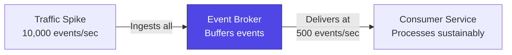

The event-driven architecture is fundamentally designed for evolution, stability, and growth. This document explores **15 key reasons** (5 for each property) why these qualities are prioritized in Tuturuuu's architecture.

## Extensibility (5 Reasons)

The event-driven architecture is fundamentally designed for evolution and the seamless addition of new functionality.

### 1. The "Add a Consumer" Pattern (Open/Closed Principle)

To introduce new business functionality, we simply deploy a new microservice that subscribes to existing event streams.

**Example:** To add a fraud detection capability, we can deploy a `FraudDetectionService` that subscribes to `PaymentAttempted` and `PaymentFailed` event streams, all without modifying the existing services.

```typescript
// NEW service - zero changes to existing payment service
client.defineJob({
  id: "fraud-detection",
  name: "Detect fraudulent payments",
  version: "1.0.0",
  trigger: eventTrigger({
    name: ["payment.attempted", "payment.failed"]
  }),
  run: async (payload, io) => {
    const riskScore = await io.runTask("analyze-risk", async () => {
      return await analyzeFraudRisk(payload);
    });

    if (riskScore > 0.8) {
      await io.sendEvent("alert-fraud-team", {
        name: "fraud.suspected",
        payload: { ...payload, riskScore }
      });
    }
  }
});
```

**Benefits:**
- **Zero modification** to payment service
- **Independent deployment** of fraud detection
- **No regression risk** to existing functionality
- **Team autonomy** - fraud team works independently

**Clarifying Additions:** This ensures growth does not disrupt existing areas. New capabilities arrive as new components rather than modifications to old ones. This avoids large, risky refactors as the system expands.

---

### 2. Introduction of New, Non-Breaking Events

When a new data source is introduced, like a new type of IoT sensor, we can introduce new event types (e.g., `SensorReadingRecorded`). Existing services will simply ignore these new events, ensuring they are not impacted. New, specialized services can then be built to handle this new stream, allowing the system to grow organically.

**Example:**

```typescript
// New IoT feature - add new event type
await trigger.event({
  name: "iot.sensor.reading",  // NEW event type
  payload: {
    sensorId,
    reading,
    timestamp,
    location
  }
});

// Existing services ignore this event - no impact
// New service handles it
client.defineJob({
  id: "iot-data-processor",
  name: "Process IoT sensor data",
  version: "1.0.0",
  trigger: eventTrigger({ name: "iot.sensor.reading" }),
  run: async (payload, io) => {
    await io.runTask("store-reading", async () => {
      return await storeIoTReading(payload);
    });
  }
});
```

**Benefits:**
- **Non-breaking changes** to system
- **Gradual adoption** of new features
- **Backward compatibility** maintained
- **Experimentation** with low risk

**Clarifying Additions:** Teams are not forced into a single technology path. Different services evolve using the most suitable tools for their domain. This architectural freedom supports innovation over time.

---

### 3. Compatible Schema Evolution

The architecture utilizes schema validation (Zod) to govern event structures. This allows us to evolve event payloads in a compatible manner, such as adding a new, optional `correlationId` field to an existing event without breaking any older consumer services that are not yet aware of the new field.

**Example:**

```typescript
// Version 1: Original schema
const WorkspaceCreatedV1 = z.object({
  workspaceId: z.string(),
  ownerId: z.string(),
  createdAt: z.date()
});

// Version 2: Add optional fields (backward compatible)
const WorkspaceCreatedV2 = z.object({
  workspaceId: z.string(),
  ownerId: z.string(),
  createdAt: z.date(),
  correlationId: z.string().optional(),  // NEW: optional
  source: z.string().optional()           // NEW: optional
});

// Old consumers still work (ignore new fields)
// New consumers can use new fields
```

**Benefits:**
- **Gradual migration** of consumers
- **No breaking changes** for existing services
- **Type safety** with Zod validation
- **Clear documentation** of event structure

**Clarifying Additions:** Infrastructure changes stay isolated from business logic. Adapters act as interchangeable layers without affecting the core. This keeps the system adaptable to new technical requirements.

---

### 4. Decoupled Data Ownership

Each microservice manages its own database. To support a new feature requiring geospatial data, a `GeolocationService` can be created with a specialized PostGIS database, avoiding a complex migration of a central database and allowing data stores to evolve independently.

**Example:**

```typescript
// apps/geolocation/ - NEW service with specialized DB
// Uses PostGIS extension for geospatial queries
client.defineJob({
  id: "update-user-location",
  name: "Update user geolocation data",
  version: "1.0.0",
  trigger: eventTrigger({ name: "user.location.updated" }),
  run: async (payload, io) => {
    await io.runTask("store-location", async () => {
      // Stores in separate PostGIS database
      return await postgis.insert({
        userId: payload.userId,
        location: postgis.point(payload.lat, payload.lng),
        timestamp: new Date()
      });
    });
  }
});

// Other services still use Supabase PostgreSQL
// No need to migrate entire system to PostGIS
```

**Benefits:**
- **Right tool for the job** - choose optimal database per service
- **Independent evolution** of data models
- **No monolithic database** bottleneck
- **Service isolation** - database failures contained

**Clarifying Additions:** Each module grows independently while remaining part of a cohesive whole. UI changes become safer because the blast radius stays limited. This supports consistent long-term UI development.

---

### 5. Frontend Composability

The modular frontend can be extended with new components that generate new types of interactions. A new `DashboardWidgetComponent` can be added to the UI, which communicates with the API Gateway to translate its requests into new Kafka events, cleanly integrating the feature into the backend.

**Example:**

```typescript
// apps/web/src/components/dashboard/NewWidget.tsx
'use client';

import { useState } from 'react';
import { api } from '@/lib/api';

export function NewDashboardWidget() {
  const [data, setData] = useState(null);

  const handleAction = async () => {
    // Triggers new event in backend
    await api.widgets.performAction.mutate({
      widgetId: 'new-widget',
      action: 'refresh'
    });
  };

  return (
    <div className="widget">
      <button onClick={handleAction}>Refresh Data</button>
      {/* Widget UI */}
    </div>
  );
}

// Backend: apps/web/src/app/api/widgets/action/route.ts
export async function POST(request: Request) {
  const { widgetId, action } = await request.json();

  // Publish NEW event type
  await trigger.event({
    name: "dashboard.widget.action",  // NEW event
    payload: { widgetId, action, userId, timestamp: new Date() }
  });

  return Response.json({ success: true });
}

// Consumers can now process this new event
```

**Benefits:**
- **Frontend-driven innovation** - UI team can add features
- **Clean integration** via events
- **Backend extensibility** without tight coupling
- **Feature experimentation** with low risk

**Clarifying Additions:** Frontends stay insulated from backend restructuring. The gateway becomes the stable interface even as internal services change. This continuity simplifies client-side development.

---

## Resilience (5 Reasons)

Resilience is an intrinsic property of this loosely coupled, asynchronous architecture.

### 1. The Broker as a Stability Buffer (Temporal Decoupling)

If a consuming service (e.g., `ReportingService`) goes offline, producer services are unaffected and continue publishing events. The broker safely stores these events until the consumer comes back online and can resume processing, guaranteeing no data loss and isolating failures.

**Example:**

```typescript
// Producer continues working even if consumer is down
await trigger.event({
  name: "report.generated",
  payload: { reportId, data }
});
// Returns immediately - doesn't wait for consumer

// Consumer comes back online after 2 hours of downtime
client.defineJob({
  id: "process-reports",
  trigger: eventTrigger({ name: "report.generated" }),
  run: async (payload, io) => {
    // Processes all 120 reports that accumulated during downtime
    await io.runTask("process-report", async () => {
      return await processReport(payload);
    });
  }
});
```

**Benefits:**
- **Zero data loss** during outages
- **Automatic recovery** when service restarts
- **Producer isolation** from consumer failures
- **System resilience** to partial failures

**Clarifying Additions:** Failures stay local rather than affecting the entire system. The architecture encourages designing for graceful degradation. This improves overall system continuity.

---

### 2. Asynchronous, Non-Blocking Communication

Producers "fire and forget" events without waiting for a response. This prevents cascading failures, where a slow consumer would otherwise block an upstream service and cause a system-wide slowdown.

**Example:**

```typescript
// SYNCHRONOUS (problematic):
async function createWorkspace(data) {
  const workspace = await db.createWorkspace(data);

  // Blocks if email service is slow (5 seconds)
  await sendWelcomeEmail(workspace.ownerId);  // BLOCKS HERE

  // Blocks if provisioning is slow (10 seconds)
  await provisionResources(workspace.id);      // BLOCKS HERE

  return workspace;  // User waits 15+ seconds
}

// EVENT-DRIVEN (resilient):
async function createWorkspace(data) {
  const workspace = await db.createWorkspace(data);

  // Non-blocking - returns immediately
  await trigger.event({ name: "workspace.created", payload: { ... } });

  return workspace;  // User gets response in <1 second
}

// Consumers process asynchronously
// If email service is slow, it doesn't affect user experience
```

**Benefits:**
- **Fast user responses** - no blocking on background work
- **Isolation from slow consumers**
- **Better resource utilization**
- **Improved user experience**

**Clarifying Additions:** Resilience logic becomes consistent for all services. The system handles temporary failures automatically without client-side complexity. This stabilizes user experience during partial outages.

---

### 3. Idempotent Consumer Design

A core resilience pattern is to design consumers to be idempotent. This means they can safely process the same event multiple times without duplicate side effects. If a consumer crashes after processing an event but before acknowledging it, the broker will redeliver it; idempotency ensures this does not corrupt the system's state.

**Example:**

```typescript
client.defineJob({
  id: "send-welcome-email",
  trigger: eventTrigger({ name: "user.registered" }),
  run: async (payload, io) => {
    const { userId, email } = payload;

    // Idempotent: Check if already sent before sending
    await io.runTask("send-email-idempotently", async () => {
      const existingEmail = await db.sentEmails.findOne({
        userId,
        type: 'welcome'
      });

      if (existingEmail) {
        // Already sent - skip (idempotent behavior)
        return { skipped: true };
      }

      // Send email
      await sendEmail({ to: email, template: 'welcome' });

      // Record that we sent it
      await db.sentEmails.insert({
        userId,
        type: 'welcome',
        sentAt: new Date()
      });

      return { sent: true };
    });
  }
});

// If this job crashes and retries, user doesn't get duplicate emails
```

**Benefits:**
- **Safe retries** without side effects
- **Data consistency** even with failures
- **Simple error recovery** - just retry
- **Reliable processing** guarantees

**Clarifying Additions:** Availability remains high because traffic avoids unhealthy components. Failover happens without requiring operator involvement. This supports seamless recovery.

---

### 4. Dead-Letter Queue (DLQ) for Error Handling

For events that consistently fail processing (e.g., due to malformed data), a DLQ pattern is used. After a few retries, the problematic event is moved to a separate "dead-letter" topic for offline analysis, preventing a single "poison pill" message from halting the entire event stream.

**Example:**

```typescript
client.defineJob({
  id: "process-payment",
  trigger: eventTrigger({ name: "payment.initiated" }),
  run: async (payload, io) => {
    try {
      await io.runTask("charge-customer", async () => {
        return await chargePaymentMethod(payload);
      }, {
        retry: { maxAttempts: 3 }  // Try 3 times
      });
    } catch (error) {
      // After 3 failures, send to DLQ
      await io.sendEvent("send-to-dlq", {
        name: "payment.failed.dlq",
        payload: {
          originalEvent: payload,
          error: error.message,
          attempts: 3,
          timestamp: new Date()
        }
      });

      // Alert team for manual investigation
      await io.sendEvent("alert-team", {
        name: "payment.requires.manual.review",
        payload: { paymentId: payload.id }
      });
    }
  }
});

// Separate job monitors DLQ for patterns
client.defineJob({
  id: "analyze-dlq-patterns",
  trigger: eventTrigger({ name: "*.dlq" }),
  run: async (payload, io) => {
    // Analyze common failure patterns for alerts/fixes
  }
});
```

**Benefits:**
- **Poison pill isolation** - one bad message doesn't stop queue
- **Automatic retry** for transient errors
- **Manual review** for persistent errors
- **Pattern detection** for systemic issues

**Clarifying Additions:** Workloads continue flowing even when some services are unavailable. Components operate at different speeds without blocking each other. This improves stability in distributed workflows.

---

### 5. Replayability for Disaster Recovery

Because the event broker maintains an immutable log, it enables powerful recovery scenarios. If a service's database is corrupted due to a bug, we can deploy a fix, discard the corrupted state, and "replay" the event stream from a known good point in time to perfectly rebuild the service's state.

**Example:**

```typescript
// DISASTER: User profile service database corrupted
// 1. Stop the corrupted service
// 2. Deploy fixed version
// 3. Drop corrupted database
// 4. Replay events to rebuild state

client.defineJob({
  id: "rebuild-user-profiles",
  name: "Rebuild user profile database",
  version: "2.0.0",  // Fixed version
  trigger: eventTrigger({
    name: ["user.registered", "user.updated", "user.deleted"],
    replay: {
      fromDate: "2025-01-01",  // Replay from known good date
      toDate: "2025-11-16"
    }
  }),
  run: async (payload, io) => {
    await io.runTask("rebuild-profile", async () => {
      // Process events to rebuild database state
      if (payload.name === "user.registered") {
        await db.users.insert(payload);
      } else if (payload.name === "user.updated") {
        await db.users.update(payload.userId, payload);
      } else if (payload.name === "user.deleted") {
        await db.users.delete(payload.userId);
      }
    });
  }
});

// Database perfectly reconstructed from event history
```

**Benefits:**
- **Disaster recovery** without backups
- **Perfect state reconstruction**
- **Bug fix validation** by replaying
- **Audit trail** for compliance

**Clarifying Additions:** The architecture expects components to fail and designs for automatic recovery. Redundant instances reduce the risk of total service loss. The system maintains health without manual intervention.

---

## Scalability (5 Reasons)

The event-driven model is inherently designed for high-throughput and elastic scaling.

### 1. Parallel Consumption with Consumer Groups

To increase processing throughput, we simply add more instances of a consuming microservice. The broker's consumer group protocol automatically balances the workload across all available instances, allowing for massive, near-linear scaling.

**Example:**

```typescript
// Single job definition
client.defineJob({
  id: "process-analytics",
  trigger: eventTrigger({ name: "user.activity" }),
  run: async (payload, io) => {
    await io.runTask("aggregate-metrics", async () => {
      return await aggregateMetrics(payload);
    });
  }
});

// Scaling configuration:
// 1 instance: 100 events/min
// 10 instances: 1,000 events/min (linear scaling)
// 50 instances: 5,000 events/min
// Trigger.dev automatically distributes events across instances
```

**Benefits:**
- **Linear scaling** - 10x instances = 10x throughput
- **Automatic load balancing**
- **No code changes** required
- **Cost-effective** - scale up/down as needed

**Clarifying Additions:** Each service grows according to its actual demand rather than the needs of the system as a whole. This leads to better resource distribution. It prevents unnecessary scaling of unrelated components.

---

### 2. Data Partitioning for Parallelism

Topics can be partitioned using a business key (e.g., `customerId` or `regionId`). This ensures events for a given entity are processed in order, while events for different entities can be processed fully in parallel.

**Example:**

```typescript
// Partition by workspaceId for parallel processing
await trigger.event({
  name: "workspace.updated",
  payload: { workspaceId, data },
  // Events for same workspace go to same partition (ordered)
  // Events for different workspaces go to different partitions (parallel)
  id: workspaceId  // Partition key
});

// Result:
// Workspace A events: Partition 1 (processed in order)
// Workspace B events: Partition 2 (processed in order, parallel to A)
// Workspace C events: Partition 3 (processed in order, parallel to A & B)
```

**Benefits:**
- **Ordering guarantees** per partition key
- **Maximum parallelism** across partition keys
- **Optimal throughput** with consistency
- **Scalable architecture**

**Clarifying Additions:** Stateless components are easy to duplicate and coordinate. Scaling becomes predictable and controllable. Traffic fluctuations can be handled efficiently.

---

### 3. Independent Service Scaling

Each microservice is a separate application. We can scale the `OrderProcessingService` to 50 pods during a sales event while the `UserProfileService` remains at 2 pods, leading to highly efficient and cost-effective resource utilization.

**Example:**

```typescript
// Vercel/infrastructure configuration
const scalingConfig = {
  "analytics-service": { min: 10, max: 100 },  // High traffic
  "email-service": { min: 2, max: 20 },        // Moderate traffic
  "reporting-service": { min: 1, max: 5 },     // Low traffic
  "admin-service": { min: 1, max: 2 }          // Minimal traffic
};

// Each service scales independently based on load
// No need to scale entire monolith
```

**Benefits:**
- **Granular scaling** per service
- **Cost optimization** - only scale what's needed
- **Resource efficiency**
- **Performance optimization** per workload

**Clarifying Additions:** Uniform request handling promotes system stability. Load is shared automatically without service-specific logic. This ensures consistent performance at scale.

---

### 4. The Broker as a Load Absorber

The event broker can ingest sudden, massive bursts of events. This smooths out the load, allowing consumer services to process the events at their own sustainable pace without being overwhelmed.

**Example:**



**Benefits:**
- **Spike protection** - absorbs bursts
- **Sustainable processing** rates
- **No service overload**
- **Improved reliability**

**Clarifying Additions:** Separating reads from writes avoids resource contention. High-traffic paths get dedicated scaling strategies. This improves responsiveness and throughput.

---

### 5. CQRS for Optimized Read Performance

The architecture is a natural fit for Command Query Responsibility Segregation (CQRS). "Command" services produce events, and separate "Query" services consume them to build read-optimized data models (in caches like Redis), allowing read-heavy parts of the system to scale independently and deliver low latency.

**Example:**

```typescript
// COMMAND: Write to database, publish event
async function updateWorkspace(id, data) {
  await db.workspaces.update(id, data);

  await trigger.event({
    name: "workspace.updated",
    payload: { workspaceId: id, data }
  });
}

// QUERY: Maintain read-optimized cache
client.defineJob({
  id: "update-workspace-cache",
  trigger: eventTrigger({ name: "workspace.updated" }),
  run: async (payload, io) => {
    await io.runTask("update-redis-cache", async () => {
      // Denormalized, optimized for reads
      await redis.set(
        `workspace:${payload.workspaceId}`,
        JSON.stringify({
          ...payload.data,
          // Pre-computed fields for fast reads
          memberCount: await getMemberCount(payload.workspaceId),
          lastActivity: new Date()
        })
      );
    });
  }
});

// Reads hit Redis (fast), writes go to Postgres (consistent)
```

**Benefits:**
- **Read/write optimization** separately
- **Low-latency reads** from cache
- **Consistent writes** to database
- **Independent scaling** of read vs write paths

**Clarifying Additions:** The system adapts naturally to changes in workload. Instances come and go without manual reconfiguration. This makes scaling continuous and flexible.

---

## Summary Matrix

| Property | Key Benefit | Primary Pattern | Example Use Case |
|----------|-------------|-----------------|------------------|
| **Extensibility** | Add features without changes | Add Consumer | Fraud detection on existing payments |
| **Resilience** | Graceful failure handling | Temporal Decoupling | Email service down, users still register |
| **Scalability** | Linear throughput growth | Parallel Consumption | Black Friday traffic spike handling |

## Related Documentation

- [Event-Driven Architecture](/platform/architecture/system-design/event-driven-architecture) - Detailed advantages and drawbacks
- [Architectural Decisions](/platform/architecture/system-design/architectural-decisions) - Why we chose this architecture
- [Trigger.dev Package](/reference/packages/trigger) - Implementation reference
