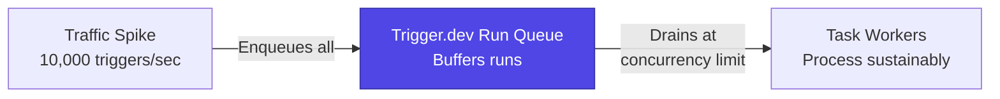

Event-driven architecture is fundamentally designed for evolution, stability, and growth. This document explores **15 key reasons** (5 for each property) why these qualities matter, and shows how Tuturuuu applies the practical subset of these patterns today.

<Info>
To understand how different architectural patterns compare in terms of these quality attributes, see [Architectural Patterns Comparison](/platform/architecture/system-design/architectural-patterns-comparison).
</Info>

<Warning>
**How to read this page.** The patterns below are general event-driven concepts. Tuturuuu is not a Kafka-style microservice mesh: the apps under `apps/` are conventional applications that share a single Supabase Postgres project, and asynchronous/background work runs on **[Trigger.dev v4](/reference/packages/trigger)** (`@trigger.dev/sdk` v4) using the `task()` API, not a self-managed broker with consumer groups or topic partitions. Code samples that use Trigger.dev show the real v4 `task()` shape; samples that describe broker primitives (partitions, DLQ topics, replay windows) are **conceptual pseudo-code** that illustrate the pattern rather than implemented Tuturuuu behavior. Each section calls out which is which.
</Warning>

<Note>
**Active migration.** The legacy Next.js app (`apps/web`, port `7803`) is being replaced by `apps/tanstack-web` (TanStack Start) plus `apps/backend` (Rust, port `7820`). See [TanStack Start And Rust Migration](/platform/architecture/tanstack-rust-migration). The quality attributes below survive the migration; only the runtimes hosting them change.
</Note>

## Extensibility (5 Reasons)

The event-driven architecture is fundamentally designed for evolution and the seamless addition of new functionality.

### 1. The "Add a Consumer" Pattern (Open/Closed Principle)

To introduce new business functionality, you add a new handler that reacts to existing work rather than editing the existing code path. In Tuturuuu that handler is a new Trigger.dev task (and, conceptually in a broker-based system, a new consumer subscribed to an event stream).

**Example:** To add a fraud-detection capability, we can introduce a new Trigger.dev task that runs whenever a payment is attempted or fails, without modifying the code that initiates payments. In Trigger.dev v4, a task is a plain `task()` export; an upstream handler triggers it by name (`yourTask.trigger(payload)` / `tasks.trigger(...)`).

```typescript
// NEW task - zero changes to the code that initiates payments
import { task, tasks } from '@trigger.dev/sdk/v3';

export const fraudDetection = task({
  id: 'fraud-detection',
  queue: { concurrencyLimit: 10 },
  run: async (payload: { paymentId: string; amount: number }) => {
    const riskScore = await analyzeFraudRisk(payload);

    if (riskScore > 0.8) {
      // Fan out to a follow-up task instead of a broker "sendEvent"
      await tasks.trigger('alert-fraud-team', { ...payload, riskScore });
    }

    return { paymentId: payload.paymentId, riskScore };
  },
});
```

The payment flow only adds a single `fraudDetection.trigger(...)` call (or none, if a shared dispatcher already fans out payment events). The existing charge logic is untouched.

**Benefits:**
- **Zero modification** to the payment logic
- **Independent deployment** of the fraud-detection task
- **No regression risk** to existing functionality
- **Team autonomy** - the fraud team works independently

**Clarifying Additions:** This ensures growth does not disrupt existing areas. New capabilities arrive as new components rather than modifications to old ones. This avoids large, risky refactors as the system expands.

---

### 2. Introduction of New, Non-Breaking Events

When a new data source is introduced, like a new type of IoT sensor, we can introduce new event types (e.g., `SensorReadingRecorded`). Existing services will simply ignore these new events, ensuring they are not impacted. New, specialized services can then be built to handle this new stream, allowing the system to grow organically.

**Example:** in a Trigger.dev v4 model, a "new event type" becomes a new task plus the call site that triggers it. Existing tasks never see the new payload, so they are unaffected.

```typescript
// New IoT feature - add a NEW task; nothing existing changes
import { task } from '@trigger.dev/sdk/v3';

export const iotDataProcessor = task({
  id: 'iot-data-processor',
  run: async (payload: {
    sensorId: string;
    reading: number;
    timestamp: string;
    location: string;
  }) => {
    return await storeIoTReading(payload);
  },
});

// The producer adds one line to fan the new work out:
//   await iotDataProcessor.trigger({ sensorId, reading, timestamp, location });
// Existing tasks are never invoked with this payload - no impact.
```

**Benefits:**
- **Non-breaking changes** to system
- **Gradual adoption** of new features
- **Backward compatibility** maintained
- **Experimentation** with low risk

**Clarifying Additions:** Teams are not forced into a single technology path. Different services evolve using the most suitable tools for their domain. This architectural freedom supports innovation over time.

---

### 3. Compatible Schema Evolution

The architecture utilizes schema validation (Zod) to govern event structures. This allows us to evolve event payloads in a compatible manner, such as adding a new, optional `correlationId` field to an existing event without breaking any older consumer services that are not yet aware of the new field.

**Example:**

```typescript
// Version 1: Original schema
const WorkspaceCreatedV1 = z.object({
  workspaceId: z.string(),
  ownerId: z.string(),
  createdAt: z.date()
});

// Version 2: Add optional fields (backward compatible)
const WorkspaceCreatedV2 = z.object({
  workspaceId: z.string(),
  ownerId: z.string(),
  createdAt: z.date(),
  correlationId: z.string().optional(),  // NEW: optional
  source: z.string().optional()           // NEW: optional
});

// Old consumers still work (ignore new fields)
// New consumers can use new fields
```

**Benefits:**
- **Gradual migration** of consumers
- **No breaking changes** for existing services
- **Type safety** with Zod validation
- **Clear documentation** of event structure

**Clarifying Additions:** Infrastructure changes stay isolated from business logic. Adapters act as interchangeable layers without affecting the core. This keeps the system adaptable to new technical requirements.

---

### 4. Modular Data Ownership

> **Conceptual pattern.** In a full microservice mesh each service owns a private database. **Tuturuuu does not do this today** - all apps share a single Supabase Postgres project, and per-feature isolation is enforced through schema boundaries, table ownership conventions, and RLS rather than separate physical databases. The pattern below shows how decoupled ownership *would* look and is useful when reasoning about future extraction; it is not the current deployment.

To support a new feature requiring geospatial queries, you can isolate the new data shape behind a dedicated module (its own tables, or its own database extension such as PostGIS) so it evolves independently of unrelated tables.

```typescript
// Conceptual: a feature-owned task that writes to its own geospatial tables.
import { task } from '@trigger.dev/sdk/v3';

export const updateUserLocation = task({
  id: 'update-user-location',
  run: async (payload: { userId: string; lat: number; lng: number }) => {
    // Writes to geolocation-owned tables (e.g. a PostGIS extension),
    // without touching unrelated schemas.
    return await storeUserLocation(payload);
  },
});

// In Tuturuuu today this lives in the shared Supabase project; isolation is
// schema/RLS-based rather than a physically separate database.
```

**Benefits (of the pattern):**
- **Right tool for the job** - choose the optimal storage for each feature
- **Independent evolution** of data models
- **Bounded blast radius** for schema changes
- **Module isolation** - feature data evolves without cross-feature migrations

**Clarifying Additions:** Each module grows independently while remaining part of a cohesive whole. UI changes become safer because the blast radius stays limited. This supports consistent long-term UI development.

---

### 5. Frontend Composability

The modular frontend can be extended with new components that drive new interactions. A new dashboard widget can call a REST route (`/api/v1/...` in `apps/web`, or a Rust `apps/backend` endpoint in the migrated stack), and that route either responds directly or kicks off background work by triggering a Trigger.dev task. The widget never talks to a broker; it talks to an HTTP endpoint that owns the side effects.

**Example:**

```typescript
// apps/web/src/components/dashboard/NewWidget.tsx
'use client';

import { useMutation } from '@tanstack/react-query';

export function NewDashboardWidget() {
  // Use TanStack Query for client mutations - never fetch in useEffect.
  const refresh = useMutation({
    mutationFn: () =>
      fetch('/api/v1/widgets/refresh', {
        method: 'POST',
        body: JSON.stringify({ widgetId: 'new-widget' }),
      }),
  });

  return (
    <div className="widget">
      <button onClick={() => refresh.mutate()}>Refresh Data</button>
      {/* Widget UI */}
    </div>
  );
}

// Backend route: apps/web/src/app/api/v1/widgets/refresh/route.ts
import { tasks } from '@trigger.dev/sdk/v3';

export async function POST(request: Request) {
  const { widgetId } = await request.json();

  // Kick off background work by triggering a task (no broker publish).
  await tasks.trigger('refresh-widget', { widgetId });

  return Response.json({ success: true });
}
```

**Benefits:**
- **Frontend-driven innovation** - the UI team can add features
- **Clean integration** via stable HTTP routes that own the side effects
- **Backend extensibility** without tight coupling to the client
- **Feature experimentation** with low risk

**Clarifying Additions:** Frontends stay insulated from backend restructuring. The HTTP route is the stable interface even as the work behind it moves between an inline handler and a background task. This continuity simplifies client-side development and survives the `apps/web` to `apps/tanstack-web` + `apps/backend` migration.

---

## Resilience (5 Reasons)

Resilience is an intrinsic property of this loosely coupled, asynchronous architecture.

### 1. The Queue as a Stability Buffer (Temporal Decoupling)

If downstream processing is slow or temporarily unavailable, the code that triggers it is unaffected: triggering a Trigger.dev task enqueues a run and returns immediately. Trigger.dev persists and retries runs, so work is not lost while a task's worker capacity catches up. The same buffering property holds in a full broker too; in Tuturuuu it is provided by Trigger.dev's managed run queue rather than a self-hosted broker.

**Example:**

```typescript
import { task, tasks } from '@trigger.dev/sdk/v3';

// The caller continues working even if processing is backed up.
await tasks.trigger('process-report', { reportId, data });
// Returns immediately - it does not wait for the run to complete.

// The task drains its backlog at its own sustainable pace.
export const processReport = task({
  id: 'process-report',
  queue: { concurrencyLimit: 5 },
  run: async (payload: { reportId: string; data: unknown }) => {
    return await generateReport(payload);
  },
});
```

**Benefits:**
- **Zero data loss** during outages
- **Automatic recovery** when service restarts
- **Producer isolation** from consumer failures
- **System resilience** to partial failures

**Clarifying Additions:** Failures stay local rather than affecting the entire system. The architecture encourages designing for graceful degradation. This improves overall system continuity.

---

### 2. Asynchronous, Non-Blocking Communication

Producers "fire and forget" events without waiting for a response. This prevents cascading failures, where a slow consumer would otherwise block an upstream service and cause a system-wide slowdown.

**Example:**

```typescript
// SYNCHRONOUS (problematic):
async function createWorkspace(data) {
  const workspace = await db.createWorkspace(data);

  // Blocks if email service is slow (5 seconds)
  await sendWelcomeEmail(workspace.ownerId);  // BLOCKS HERE

  // Blocks if provisioning is slow (10 seconds)
  await provisionResources(workspace.id);      // BLOCKS HERE

  return workspace;  // User waits 15+ seconds
}

// EVENT-DRIVEN (resilient):
import { tasks } from '@trigger.dev/sdk/v3';

async function createWorkspace(data) {
  const workspace = await db.createWorkspace(data);

  // Non-blocking - enqueues background work and returns immediately
  await tasks.trigger('workspace-created-followups', { workspaceId: workspace.id });

  return workspace;  // User gets a response in <1 second
}

// Tasks run asynchronously.
// If the email step is slow, it does not affect the user-facing response.
```

**Benefits:**
- **Fast user responses** - no blocking on background work
- **Isolation from slow consumers**
- **Better resource utilization**
- **Improved user experience**

**Clarifying Additions:** Resilience logic becomes consistent for all services. The system handles temporary failures automatically without client-side complexity. This stabilizes user experience during partial outages.

---

### 3. Idempotent Consumer Design

A core resilience pattern is to make task handlers idempotent so they can safely run on the same payload more than once without duplicate side effects. Trigger.dev retries failed runs (and supports an `idempotencyKey` on trigger), so a task that crashes after sending an email but before recording it may run again; idempotency ensures that retry does not corrupt state.

**Example:**

```typescript
import { task } from '@trigger.dev/sdk/v3';

export const sendWelcomeEmail = task({
  id: 'send-welcome-email',
  run: async (payload: { userId: string; email: string }) => {
    const { userId, email } = payload;

    // Idempotent: check if already sent before sending.
    const existingEmail = await db.sentEmails.findOne({
      userId,
      type: 'welcome',
    });

    if (existingEmail) {
      // Already sent - skip (idempotent behavior).
      return { skipped: true };
    }

    await sendEmail({ to: email, template: 'welcome' });

    await db.sentEmails.insert({ userId, type: 'welcome', sentAt: new Date() });

    return { sent: true };
  },
});

// If this run is retried, the user does not get a duplicate email.
// Triggering with an idempotencyKey also deduplicates the run itself:
//   sendWelcomeEmail.trigger(payload, { idempotencyKey: `welcome-${userId}` });
```

**Benefits:**
- **Safe retries** without side effects
- **Data consistency** even with failures
- **Simple error recovery** - just retry
- **Reliable processing** guarantees

**Clarifying Additions:** Availability remains high because traffic avoids unhealthy components. Failover happens without requiring operator involvement. This supports seamless recovery.

---

### 4. Retries and a Dead-Letter Path for Error Handling

> **Conceptual + partial.** A true dead-letter *queue* (a separate topic the broker auto-routes poison messages to) is a broker primitive Tuturuuu does not run. Trigger.dev v4 *does* provide the durable building blocks: per-task `retry` policies and the ability to hand a permanently failing payload off to a dedicated "dead-letter" follow-up task for offline analysis. The example below uses real v4 `retry` config and models the dead-letter step as an explicit follow-up trigger.

For payloads that consistently fail (e.g., malformed data), configure bounded retries and route the still-failing payload to a dedicated task instead of letting it block the rest of the workload.

```typescript
import { task, tasks } from '@trigger.dev/sdk/v3';

export const processPayment = task({
  id: 'process-payment',
  // Real v4 retry policy: bounded, exponential backoff.
  retry: { maxAttempts: 3, factor: 2, minTimeoutInMs: 1000 },
  run: async (payload: { id: string }) => {
    return await chargePaymentMethod(payload);
  },
  // Runs after all retries are exhausted - the "dead-letter" hand-off.
  handleError: async (payload, error) => {
    await tasks.trigger('payment-dead-letter', {
      originalPayload: payload,
      error: error instanceof Error ? error.message : 'Unknown error',
    });
  },
});

// Dedicated task that records failures and alerts for manual review.
export const paymentDeadLetter = task({
  id: 'payment-dead-letter',
  run: async (payload: { originalPayload: { id: string }; error: string }) => {
    await recordFailedPayment(payload);
    await alertOnCallTeam(payload.originalPayload.id);
  },
});
```

<Note>
Confirm the exact `retry` / `handleError` field names against the installed `@trigger.dev/sdk` v4 types before copying this verbatim; the shape above illustrates the pattern, and Tuturuuu's own tasks in `packages/trigger/src` favor catching errors inside `run` and returning a `{ success: false }` result.
</Note>

**Benefits:**
- **Poison pill isolation** - one bad message doesn't stop queue
- **Automatic retry** for transient errors
- **Manual review** for persistent errors
- **Pattern detection** for systemic issues

**Clarifying Additions:** Workloads continue flowing even when some services are unavailable. Components operate at different speeds without blocking each other. This improves stability in distributed workflows.

---

### 5. Replayability for Disaster Recovery

> **Conceptual - not implemented in Tuturuuu.** This is a classic *event-sourcing* property: when an immutable, ordered log of domain events is the source of truth, you can rebuild any derived state by replaying that log from a known-good point. **Tuturuuu is not event-sourced** - state lives in Supabase Postgres tables, recovery relies on Postgres backups/PITR, and Trigger.dev v4 has no "replay this date range of events" trigger like the one previous versions of this page implied. Keep this section as a mental model for derived/cached state, not as an operational runbook.

**How it would work (event-sourcing concept):**

```text
DISASTER: a derived read model (e.g. a cache or projection) is corrupted by a bug.
1. Stop the consumer that builds the read model.
2. Deploy the fixed projection logic.
3. Discard the corrupted derived state.
4. Re-process the durable source events in order to rebuild the read model.
```

```typescript
// Conceptual rebuild loop - a plain task that re-applies events you have
// stored durably. There is no built-in Trigger.dev "replay by date" trigger;
// you supply the events yourself (e.g. from an append-only table).
import { task } from '@trigger.dev/sdk/v3';

export const rebuildUserProjection = task({
  id: 'rebuild-user-projection',
  run: async (payload: { event: UserEvent }) => {
    const { event } = payload;
    if (event.type === 'user.registered') await db.users.insert(event);
    else if (event.type === 'user.updated') await db.users.update(event.userId, event);
    else if (event.type === 'user.deleted') await db.users.delete(event.userId);
  },
});
```

**Why Tuturuuu relies on backups instead:** without an append-only event log as the system of record, the durable truth is the Postgres tables themselves. Disaster recovery uses Supabase backups and point-in-time recovery rather than log replay.

**Benefits (of the event-sourcing pattern, where adopted):**
- **State reconstruction** from a durable event log
- **Bug-fix validation** by re-deriving projections
- **Audit trail** for compliance

**Clarifying Additions:** Treat derived/cached data as rebuildable from a durable source. For Tuturuuu that durable source is Postgres plus its backups; for a true event-sourced subsystem it would be the event log.

---

## Scalability (5 Reasons)

The event-driven model is inherently designed for high-throughput and elastic scaling.

### 1. Parallel Processing via Concurrency

To increase throughput, you raise the task's allowed concurrency and let more runs execute in parallel. In a Kafka-style system this is done with consumer groups; in Tuturuuu it is Trigger.dev's managed concurrency - you define the task once and set a `queue.concurrencyLimit` (and queue-level controls) rather than running and balancing your own consumer instances.

**Example:**

```typescript
import { task } from '@trigger.dev/sdk/v3';

export const processAnalytics = task({
  id: 'process-analytics',
  // Higher concurrency = more parallel runs = more throughput.
  queue: { concurrencyLimit: 50 },
  run: async (payload: { userId: string; activity: unknown }) => {
    return await aggregateMetrics(payload);
  },
});

// Trigger.dev schedules many runs of this task in parallel up to the limit,
// so raising the concurrency limit raises throughput without code changes.
```

**Benefits:**
- **Throughput scales with concurrency** - raise the limit, process more in parallel
- **Managed scheduling** - no consumer instances to run or balance yourself
- **No code changes** required to scale
- **Cost-effective** - tune concurrency up or down as needed

**Clarifying Additions:** Each service grows according to its actual demand rather than the needs of the system as a whole. This leads to better resource distribution. It prevents unnecessary scaling of unrelated components.

---

### 2. Per-Entity Ordering with Parallelism Across Entities

A common scaling goal is: process work for a single entity (e.g. one workspace) in order, while processing different entities fully in parallel. Kafka achieves this with topic partitions keyed by a business key; Tuturuuu does not run Kafka topics. The closest Trigger.dev mechanism is a **concurrency key** plus per-queue concurrency limits, which serialize runs that share a key while letting different keys run in parallel.

**Example:**

```typescript
import { task } from '@trigger.dev/sdk/v3';

export const updateWorkspace = task({
  id: 'update-workspace',
  // Serialize runs per workspace (one in flight per concurrencyKey),
  // while different workspaces run in parallel.
  queue: { concurrencyLimit: 25 },
  run: async (payload: { workspaceId: string; data: unknown }) => {
    return await applyWorkspaceUpdate(payload);
  },
});

// Trigger per workspace so same-workspace runs are ordered:
//   updateWorkspace.trigger(payload, { concurrencyKey: payload.workspaceId });
//
// Workspace A runs: serialized (ordered)
// Workspace B runs: serialized (ordered), in parallel with A
// Workspace C runs: serialized (ordered), in parallel with A & B
```

<Note>
This maps the partitioning *concept* onto Trigger.dev v4. Verify the `concurrencyKey` option name against the installed SDK before relying on it; there are no Kafka topics, partitions, or broker ACLs in Tuturuuu.
</Note>

**Benefits:**
- **Ordering guarantees** per entity (per concurrency key)
- **Maximum parallelism** across distinct entities
- **Optimal throughput** with consistency
- **Scalable architecture**

**Clarifying Additions:** Stateless components are easy to duplicate and coordinate. Scaling becomes predictable and controllable. Traffic fluctuations can be handled efficiently.

---

### 3. Independent Scaling per Workload

Different workloads scale on their own axis. In Tuturuuu this shows up two ways: the deployable apps (`apps/web`, the migration target `apps/tanstack-web`, and the Rust `apps/backend`) scale at the deployment layer, and each Trigger.dev task carries its own concurrency budget so a heavy task can run wide while a light one stays narrow - without coupling either to a single shared scale knob.

**Example:**

```typescript
import { task } from '@trigger.dev/sdk/v3';

// Heavy, high-volume work: allow many parallel runs.
export const processAnalytics = task({
  id: 'process-analytics',
  queue: { concurrencyLimit: 100 },
  run: async (payload) => aggregateMetrics(payload),
});

// Low-volume, rate-sensitive work: keep it narrow.
export const sendReport = task({
  id: 'send-report',
  queue: { concurrencyLimit: 2 },
  run: async (payload) => deliverReport(payload),
});

// Each task scales independently via its own concurrency limit -
// no need to scale the whole app to speed up one workload.
```

**Benefits:**
- **Granular scaling** per service
- **Cost optimization** - only scale what's needed
- **Resource efficiency**
- **Performance optimization** per workload

**Clarifying Additions:** Uniform request handling promotes system stability. Load is shared automatically without service-specific logic. This ensures consistent performance at scale.

---

### 4. The Run Queue as a Load Absorber

A managed run queue can absorb sudden bursts of triggered work. It smooths out load so tasks process at their own sustainable pace (bounded by concurrency) without being overwhelmed. In Tuturuuu this absorber is the Trigger.dev run queue; the same role would be played by a broker in a Kafka-style system.

**Example:**


```mermaid
graph LR
    A[Traffic Spike<br/>10,000 triggers/sec] -->|Enqueues all| B[Trigger.dev Run Queue<br/>Buffers runs]
    B -->|Drains at<br/>concurrency limit| C[Task Workers<br/>Process sustainably]

    style B fill:#4f46e5,stroke:#3730a3,color:#fff
```

**Benefits:**
- **Spike protection** - absorbs bursts
- **Sustainable processing** rates
- **No service overload**
- **Improved reliability**

**Clarifying Additions:** Separating reads from writes avoids resource contention. High-traffic paths get dedicated scaling strategies. This improves responsiveness and throughput.

---

### 5. CQRS for Optimized Read Performance

An asynchronous, task-based flow is a natural fit for Command Query Responsibility Segregation (CQRS). A "command" writes the authoritative record and then triggers a background task; that task maintains a read-optimized model (for example a denormalized cache), letting read-heavy paths scale independently and deliver low latency.

> **Conceptual.** Tuturuuu does not run a formal CQRS split today; this shows how the pattern maps onto the real `task()` API if you adopt it for a read-heavy surface.

**Example:**

```typescript
import { task, tasks } from '@trigger.dev/sdk/v3';

// COMMAND: write the authoritative record, then trigger the projection.
async function updateWorkspace(id: string, data: unknown) {
  await db.workspaces.update(id, data);
  await tasks.trigger('update-workspace-cache', { workspaceId: id, data });
}

// QUERY: maintain a read-optimized cache.
export const updateWorkspaceCache = task({
  id: 'update-workspace-cache',
  run: async (payload: { workspaceId: string; data: Record<string, unknown> }) => {
    await redis.set(
      `workspace:${payload.workspaceId}`,
      JSON.stringify({
        ...payload.data,
        memberCount: await getMemberCount(payload.workspaceId),
        lastActivity: new Date(),
      })
    );
  },
});

// Reads hit the cache (fast); writes go to Postgres (consistent).
```

**Benefits:**
- **Read/write optimization** separately
- **Low-latency reads** from cache
- **Consistent writes** to database
- **Independent scaling** of read vs write paths

**Clarifying Additions:** The system adapts naturally to changes in workload. Instances come and go without manual reconfiguration. This makes scaling continuous and flexible.

---

## Summary Matrix

| Property | Key Benefit | Primary Pattern | Example Use Case |
|----------|-------------|-----------------|------------------|
| **Extensibility** | Add features without changes | Add Consumer | Fraud detection on existing payments |
| **Resilience** | Graceful failure handling | Temporal Decoupling | Email service down, users still register |
| **Scalability** | Linear throughput growth | Parallel Consumption | Black Friday traffic spike handling |

## Related Documentation

- [Event-Driven Architecture](/platform/architecture/system-design/event-driven-architecture) - Detailed advantages and drawbacks
- [Architectural Decisions](/platform/architecture/system-design/architectural-decisions) - Why we chose this architecture
- [Trigger.dev Package](/reference/packages/trigger) - Implementation reference
