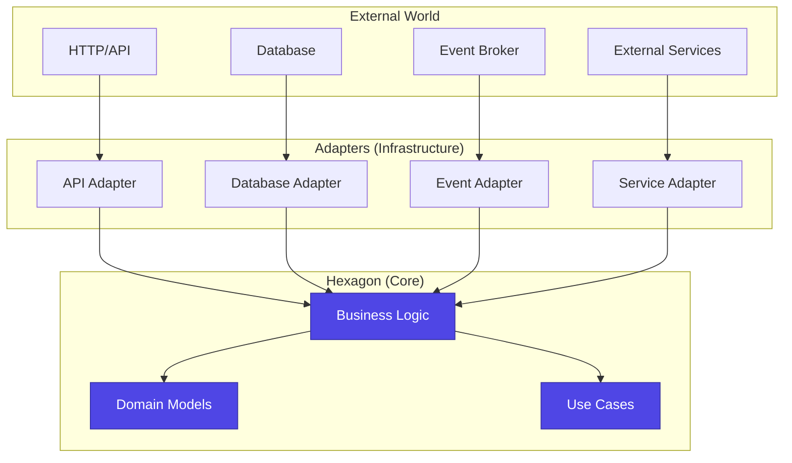

# Hexagonal Architecture (Ports and Adapters)

Hexagonal Architecture, also known as Ports and Adapters, is the internal structure pattern used within each Tuturuuu microservice to achieve **technology independence**, **testability**, and **maintainability**.

## Core Concept

The hexagon represents your application's core business logic. **Ports** are interfaces that define how the outside world can interact with your application, and **Adapters** are implementations that connect external technologies to these ports.



## Layer Structure in Tuturuuu

### 1. Domain Layer (Core Business Logic)

**Location:** `apps/*/src/domain/`

**Responsibilities:**
- Pure business logic and rules
- Domain models (entities, value objects)
- Domain services (complex business operations)
- Domain events

**Characteristics:**
- No dependencies on external libraries
- No knowledge of databases, APIs, or frameworks
- Fully unit-testable without infrastructure

**Example:**

```typescript
// apps/web/src/domain/models/workspace.ts
export class Workspace {
  private constructor(
    public readonly id: string,
    public readonly ownerId: string,
    private _name: string,
    private _isActive: boolean,
    private _plan: WorkspacePlan,
    public readonly createdAt: Date,
    private _updatedAt: Date
  ) {}

  static create(ownerId: string, name: string, plan: WorkspacePlan): Workspace {
    // Business rules
    this.validateName(name);

    return new Workspace(
      generateId(),
      ownerId,
      name,
      true,
      plan,
      new Date(),
      new Date()
    );
  }

  rename(newName: string): void {
    Workspace.validateName(newName);
    this._name = newName;
    this._updatedAt = new Date();
  }

  upgrade(newPlan: WorkspacePlan): void {
    if (newPlan.tier <= this._plan.tier) {
      throw new DomainError('Can only upgrade to higher tier');
    }
    this._plan = newPlan;
    this._updatedAt = new Date();
  }

  deactivate(): void {
    if (!this._isActive) {
      throw new DomainError('Workspace already inactive');
    }
    this._isActive = false;
    this._updatedAt = new Date();
  }

  private static validateName(name: string): void {
    if (name.length < 3 || name.length > 50) {
      throw new DomainError('Workspace name must be 3-50 characters');
    }
    if (!/^[a-zA-Z0-9\s-]+$/.test(name)) {
      throw new DomainError('Workspace name contains invalid characters');
    }
  }

  // Getters only - no setters (encapsulation)
  get name() { return this._name; }
  get isActive() { return this._isActive; }
  get plan() { return this._plan; }
  get updatedAt() { return this._updatedAt; }
}
```

### 2. Application Layer (Use Cases / Orchestration)

**Location:** `apps/*/src/application/`

**Responsibilities:**
- Orchestrate domain objects
- Implement use cases (business workflows)
- Transaction management
- Call infrastructure services via ports

**Example:**

```typescript
// apps/web/src/application/use-cases/create-workspace.ts
export interface WorkspaceRepository {
  save(workspace: Workspace): Promise<void>;
  findById(id: string): Promise<Workspace | null>;
  findByOwnerId(ownerId: string): Promise<Workspace[]>;
}

export interface EventPublisher {
  publish(event: DomainEvent): Promise<void>;
}

export class CreateWorkspaceUseCase {
  constructor(
    private readonly repository: WorkspaceRepository,  // PORT
    private readonly eventPublisher: EventPublisher     // PORT
  ) {}

  async execute(command: CreateWorkspaceCommand): Promise<Workspace> {
    // 1. Business logic (domain)
    const workspace = Workspace.create(
      command.ownerId,
      command.name,
      command.plan
    );

    // 2. Persist (via port)
    await this.repository.save(workspace);

    // 3. Publish event (via port)
    await this.eventPublisher.publish(
      new WorkspaceCreatedEvent(workspace.id, workspace.ownerId)
    );

    return workspace;
  }
}
```

### 3. Infrastructure Layer (Adapters)

**Location:** `apps/*/src/infrastructure/`

**Responsibilities:**
- Implement ports defined by application/domain
- Handle technology-specific details
- Database access, API calls, event publishing

**Example:**

```typescript
// apps/web/src/infrastructure/repositories/supabase-workspace-repository.ts
import { WorkspaceRepository } from '@/application/use-cases/create-workspace';

export class SupabaseWorkspaceRepository implements WorkspaceRepository {
  constructor(private readonly supabase: SupabaseClient) {}

  async save(workspace: Workspace): Promise<void> {
    const data = this.toDatabaseModel(workspace);

    await this.supabase
      .from('workspaces')
      .upsert(data);
  }

  async findById(id: string): Promise<Workspace | null> {
    const { data } = await this.supabase
      .from('workspaces')
      .select('*')
      .eq('id', id)
      .single();

    return data ? this.toDomainModel(data) : null;
  }

  async findByOwnerId(ownerId: string): Promise<Workspace[]> {
    const { data } = await this.supabase
      .from('workspaces')
      .select('*')
      .eq('owner_id', ownerId);

    return (data || []).map(row => this.toDomainModel(row));
  }

  private toDomainModel(data: any): Workspace {
    // Map database row to domain model
    return new Workspace(
      data.id,
      data.owner_id,
      data.name,
      data.is_active,
      new WorkspacePlan(data.plan_tier, data.plan_features),
      new Date(data.created_at),
      new Date(data.updated_at)
    );
  }

  private toDatabaseModel(workspace: Workspace): any {
    // Map domain model to database row
    return {
      id: workspace.id,
      owner_id: workspace.ownerId,
      name: workspace.name,
      is_active: workspace.isActive,
      plan_tier: workspace.plan.tier,
      plan_features: workspace.plan.features,
      created_at: workspace.createdAt.toISOString(),
      updated_at: workspace.updatedAt.toISOString()
    };
  }
}
```

### 4. Presentation Layer (API / UI)

**Location:** `apps/*/src/app/api/` or `apps/*/src/app/`

**Responsibilities:**
- HTTP request/response handling
- Input validation (DTOs)
- Authentication/authorization
- Call application use cases

**Example:**

```typescript
// apps/web/src/app/api/workspaces/create/route.ts
import { CreateWorkspaceUseCase } from '@/application/use-cases/create-workspace';

const CreateWorkspaceRequestSchema = z.object({
  name: z.string().min(3).max(50),
  plan: z.enum(['free', 'pro', 'enterprise'])
});

export async function POST(request: Request) {
  // 1. Authentication
  const session = await getSession();
  if (!session) {
    return Response.json({ error: 'Unauthorized' }, { status: 401 });
  }

  // 2. Validation
  const body = await request.json();
  const validation = CreateWorkspaceRequestSchema.safeParse(body);

  if (!validation.success) {
    return Response.json(
      { error: validation.error.errors },
      { status: 400 }
    );
  }

  // 3. Execute use case
  const useCase = new CreateWorkspaceUseCase(
    new SupabaseWorkspaceRepository(createClient()),
    new TriggerEventPublisher()
  );

  try {
    const workspace = await useCase.execute({
      ownerId: session.userId,
      name: validation.data.name,
      plan: new WorkspacePlan(validation.data.plan)
    });

    // 4. Response (DTO)
    return Response.json({
      id: workspace.id,
      name: workspace.name,
      ownerId: workspace.ownerId,
      plan: workspace.plan.tier,
      createdAt: workspace.createdAt.toISOString()
    }, { status: 201 });
  } catch (error) {
    if (error instanceof DomainError) {
      return Response.json({ error: error.message }, { status: 400 });
    }
    return Response.json({ error: 'Internal error' }, { status: 500 });
  }
}
```

## Key Benefits

### 1. Technology Independence

The core business logic has **zero knowledge** of the technologies used. We can swap Supabase for Prisma, Drizzle, or even MongoDB without touching business logic.

**Example migration:**

```typescript
// OLD: Supabase adapter
class SupabaseWorkspaceRepository implements WorkspaceRepository { /* ... */ }

// NEW: Drizzle adapter (same interface)
class DrizzleWorkspaceRepository implements WorkspaceRepository {
  constructor(private readonly db: DrizzleDB) {}

  async save(workspace: Workspace): Promise<void> {
    await this.db
      .insert(workspaces)
      .values(this.toDatabaseModel(workspace));
  }

  // Same interface, different implementation
}

// Business logic unchanged!
```

### 2. Testability

Domain logic can be tested **without any infrastructure**:

```typescript
// tests/domain/workspace.test.ts
describe('Workspace', () => {
  it('enforces name length rules', () => {
    expect(() => {
      Workspace.create('user-1', 'ab', FreePlan);
    }).toThrow('Workspace name must be 3-50 characters');
  });

  it('prevents downgrade', () => {
    const workspace = Workspace.create('user-1', 'Test', ProPlan);

    expect(() => {
      workspace.upgrade(FreePlan);
    }).toThrow('Can only upgrade to higher tier');
  });
});
// No database, no HTTP, no network - millisecond tests
```

Application layer with mocks:

```typescript
// tests/application/create-workspace.test.ts
class InMemoryWorkspaceRepository implements WorkspaceRepository {
  private workspaces = new Map<string, Workspace>();

  async save(workspace: Workspace): Promise<void> {
    this.workspaces.set(workspace.id, workspace);
  }

  async findById(id: string): Promise<Workspace | null> {
    return this.workspaces.get(id) || null;
  }
}

describe('CreateWorkspaceUseCase', () => {
  it('creates workspace and publishes event', async () => {
    const repository = new InMemoryWorkspaceRepository();
    const eventPublisher = new InMemoryEventPublisher();
    const useCase = new CreateWorkspaceUseCase(repository, eventPublisher);

    const workspace = await useCase.execute({
      ownerId: 'user-1',
      name: 'Test Workspace',
      plan: FreePlan
    });

    expect(workspace.name).toBe('Test Workspace');
    expect(eventPublisher.events).toHaveLength(1);
    expect(eventPublisher.events[0]).toBeInstanceOf(WorkspaceCreatedEvent);
  });
});
```

### 3. Maintainability

**Clear boundaries** make it obvious where code belongs:
- Business rules → Domain layer
- Workflows → Application layer
- Technology details → Infrastructure layer
- HTTP handling → Presentation layer

## Ports (Interfaces)

Ports are **contracts** defined by the application/domain:

```typescript
// Inbound ports (driving - from outside to core)
export interface CreateWorkspaceCommand {
  ownerId: string;
  name: string;
  plan: WorkspacePlan;
}

// Outbound ports (driven - from core to outside)
export interface WorkspaceRepository {
  save(workspace: Workspace): Promise<void>;
  findById(id: string): Promise<Workspace | null>;
  findByOwnerId(ownerId: string): Promise<Workspace[]>;
  delete(id: string): Promise<void>;
}

export interface EventPublisher {
  publish(event: DomainEvent): Promise<void>;
}

export interface EmailService {
  sendWorkspaceInvitation(email: string, workspaceId: string): Promise<void>;
}
```

## Adapters (Implementations)

Adapters **implement** the ports:

```typescript
// Repository adapter
export class SupabaseWorkspaceRepository implements WorkspaceRepository { /* ... */ }

// Event publisher adapter
export class TriggerEventPublisher implements EventPublisher {
  async publish(event: DomainEvent): Promise<void> {
    await trigger.event({
      name: event.name,
      payload: event.payload
    });
  }
}

// Email service adapter
export class ResendEmailService implements EmailService {
  async sendWorkspaceInvitation(email: string, workspaceId: string): Promise<void> {
    await resend.emails.send({
      to: email,
      subject: 'Workspace Invitation',
      html: renderTemplate('invitation', { workspaceId })
    });
  }
}
```

## Dependency Injection

Wire adapters to use cases:

```typescript
// apps/web/src/lib/container.ts
export function createWorkspaceUseCase(): CreateWorkspaceUseCase {
  return new CreateWorkspaceUseCase(
    new SupabaseWorkspaceRepository(createClient()),
    new TriggerEventPublisher()
  );
}

// Usage in API route
const useCase = createWorkspaceUseCase();
const result = await useCase.execute(command);
```

## Directory Structure Example

```
apps/web/src/
├── domain/                          # Core (no dependencies)
│   ├── models/
│   │   ├── workspace.ts             # Domain entities
│   │   └── workspace-plan.ts
│   ├── services/
│   │   └── workspace-service.ts     # Domain logic
│   └── events/
│       └── workspace-created.ts     # Domain events
├── application/                     # Use cases (depends on domain)
│   └── use-cases/
│       ├── create-workspace.ts      # Defines ports
│       ├── update-workspace.ts
│       └── delete-workspace.ts
├── infrastructure/                  # Adapters (implements ports)
│   ├── repositories/
│   │   └── supabase-workspace-repository.ts
│   ├── events/
│   │   └── trigger-event-publisher.ts
│   └── email/
│       └── resend-email-service.ts
└── app/                             # Presentation
    └── api/workspaces/
        ├── create/route.ts          # HTTP adapter
        └── [id]/route.ts
```

## C4 Component Diagram Explanations

The C4 model provides a structured way to visualize software architecture at different levels of abstraction. At the Component level, we focus on the major structural building blocks and their interactions within a system.

### Backend – Hexagonal Architecture (C4 Component Diagram)

The Payment Microservice adopts a Hexagonal Architecture to enforce strict separation of concerns, improve testability, and enable flexible integration with external systems.

**Inbound Flow (Outside → Core):**

Incoming requests enter the system through **Inbound Adapters** such as REST controllers and Kafka consumers, which convert incoming **Inbound DTOs** into internal representations and delegate execution to **Application Services**. These services coordinate the primary business flows and act as the main entry point to the domain layer.

**Core Domain Layer:**

The **Domain Layer** contains the core business logic through **Domain Services** and **Domain Models**, which represent the essential rules and constraints of the payment domain. Domain logic remains completely isolated from external frameworks and is unaware of transport, persistence, or other infrastructure concerns.

**Outbound Flow (Core → Outside):**

When external communication or persistence is required, the Application Services call **Outbound Ports**, whose interfaces define what the domain requires from the outside world. Corresponding **Outbound Adapters** implement these ports by integrating with external dependencies such as the Payment Database, Redis caches, Kafka event producers, and the Stripe API.

**Infrastructure and Cross-Cutting Concerns:**

Configuration components such as Kafka and Redis configs are placed in the **Infrastructure Layer**, while cross-cutting concerns such as filters and security packages operate at the service edge.

**Dependency Flow:**

This structure ensures a **one-way dependency flow**—from adapters toward the centre—so the domain remains stable, framework-independent, and highly testable. Commands, results, and mappers exist in the implementation but are intentionally omitted at the component level to keep the C4 diagram high-level and focused on architectural boundaries rather than internal Java classes.

### Frontend – Headless UI React Architecture (C4 Component Diagram)

The frontend is structured using a **Headless UI + React Architecture**, separating rendering logic from state and behavioural logic to maintain scalability and reusability.

**Presentation Layer:**

Each **Page** acts as a top-level container that orchestrates data loading and renders multiple UI components. Visual components such as **ProductTable**, **ProductCard**, and the **Search & Filter Panel** remain purely presentational, while all stateful or behavioural logic is delegated to dedicated **Hooks**. These hooks encapsulate actions such as fetching data, handling events, or executing mutations, thereby keeping the UI simple and predictable.

**Communication Layer:**

All external communication flows through **Service** components, which call typed **HTTP client utilities** responsible for interacting with backend API endpoints. Shared logic such as constant management and fetcher utilities is abstracted into reusable modules, ensuring consistency across the application.

**Shared Component Library:**

Reusable UI building blocks are grouped into a **shared component library**, supporting composability and reducing duplication.

**Layer Separation:**

This architecture clearly separates **Presentation → Logic → Communication** layers, enabling maintainable state management, easier testability, and seamless integration with backend microservices. Since the diagram operates at C4 Component Level, it intentionally excludes internal React implementation details (such as local state, props, or context) and instead focuses on component roles, interactions, and the flow of data through the system.

**Key Principles:**

1. **Separation of Concerns**: UI components are purely presentational; hooks handle state and behavior
2. **Reusability**: Shared components and utilities reduce code duplication
3. **Testability**: Clear boundaries enable isolated testing of presentation, logic, and communication layers
4. **Type Safety**: Typed HTTP clients ensure contract adherence between frontend and backend

## Related Documentation

- [Architectural Decisions](/platform/architecture/system-design/architectural-decisions) - Why we chose hexagonal architecture
- [Encapsulation Patterns](/platform/architecture/system-design/encapsulation-patterns) - Layer boundaries
- [Data Fetching](/platform/architecture/data-fetching) - Integration with React
