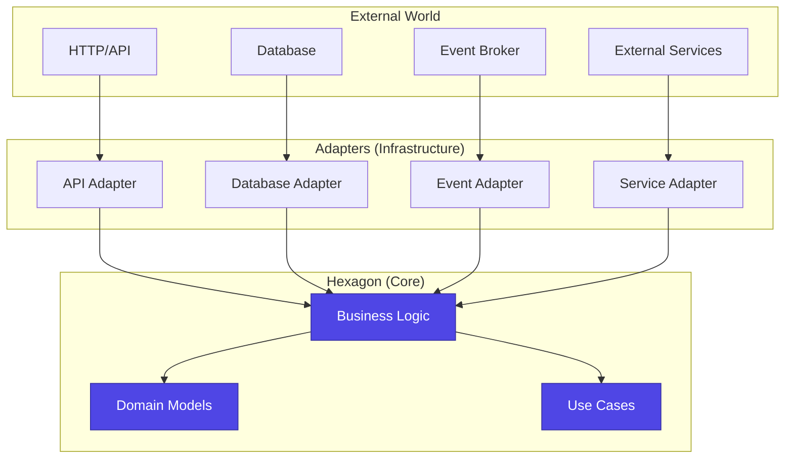

# Hexagonal Architecture (Ports and Adapters)

Hexagonal Architecture, also known as Ports and Adapters, is a design pattern
for achieving **technology independence**, **testability**, and
**maintainability** by isolating core business logic from the technologies that
surround it.

<Note>
This page is an **educational pattern guide**, not a description of Tuturuuu's
current directory layout. The Tuturuuu apps (`apps/web`, `apps/finance`) are
conventional Next.js App Router apps organized by `app/`, `components/`, `lib/`,
and `utils/` — they do **not** use formal `domain/`, `application/`, and
`infrastructure/` layers. The code samples below are illustrative; their file
paths are aspirational and do not exist in the repo. Where Tuturuuu genuinely
borrows an idea from this pattern, the text says so explicitly.
</Note>

<Note>
**Architecture is moving.** Tuturuuu is migrating the legacy Next.js
`apps/web` runtime (port `7803`) to TanStack Start (`apps/tanstack-web`) plus a
dedicated Rust backend (`apps/backend`, port `7820`). The emerging backend is
the Rust service, not a TypeScript "microservice." See
[TanStack Start And Rust Migration](/platform/architecture/tanstack-rust-migration)
for the canonical target. Treat the patterns below as portable design ideas, not
a permanent structural mandate.
</Note>

## Core Concept

The hexagon represents your application's core business logic. **Ports** are interfaces that define how the outside world can interact with your application, and **Adapters** are implementations that connect external technologies to these ports.


```mermaid
graph TB
    subgraph "External World"
        A[HTTP/API]
        B[Database]
        C[Event Broker]
        D[External Services]
    end

    subgraph "Adapters (Infrastructure)"
        E[API Adapter]
        F[Database Adapter]
        G[Event Adapter]
        H[Service Adapter]
    end

    subgraph "Hexagon (Core)"
        I[Business Logic]
        J[Domain Models]
        K[Use Cases]
    end

    A --> E
    B --> F
    C --> G
    D --> H
    E --> I
    F --> I
    G --> I
    H --> I
    I --> J
    I --> K

    style I fill:#4f46e5,stroke:#3730a3,color:#fff
    style J fill:#4f46e5,stroke:#3730a3,color:#fff
    style K fill:#4f46e5,stroke:#3730a3,color:#fff
```

## How Tuturuuu Actually Structures Apps

Before the conceptual layers below, here is the real layout you will find in the
codebase today. The Next.js apps are organized by concern, not by hexagonal
layer:

```
apps/web/src/
├── app/          # Next.js App Router routes + /api/v1 REST handlers (presentation)
├── components/   # React components (presentation)
├── features/     # Feature-scoped UI and logic
├── hooks/        # Client hooks (TanStack Query, etc.)
├── lib/          # Cross-cutting helpers and clients
├── utils/        # Pure utilities
├── constants/    # Static config
└── trpc/         # Minimal tRPC stub (health-check only — not the product data path)
```

Product data flows through shared helpers in `packages/internal-api` and the
REST `/api/v1` routes — **not** through tRPC, which in `apps/web/src/trpc` is
only a `healthCheck` stub today. Cross-app concerns live in `packages/*`
(`packages/supabase`, `packages/payment`, `packages/trigger`,
`packages/internal-api`, `packages/ui`, ...), which is where most "swap the
adapter" flexibility actually lives in practice.

The sections that follow describe the **idealized hexagonal layers** as a
learning model. Read them for the concepts; do not expect to find these exact
directories in the repo.

## The Idealized Layers (Conceptual)

### 1. Domain Layer (Core Business Logic)

**Conceptual location:** `domain/` (illustrative — not a real directory in Tuturuuu)

**Responsibilities:**
- Pure business logic and rules
- Domain models (entities, value objects)
- Domain services (complex business operations)
- Domain events

**Characteristics:**
- No dependencies on external libraries
- No knowledge of databases, APIs, or frameworks
- Fully unit-testable without infrastructure

**Example (illustrative — this file does not exist in the repo):**

```typescript
// Illustrative: domain/models/workspace.ts
export class Workspace {
  private constructor(
    public readonly id: string,
    public readonly ownerId: string,
    private _name: string,
    private _isActive: boolean,
    private _plan: WorkspacePlan,
    public readonly createdAt: Date,
    private _updatedAt: Date
  ) {}

  static create(ownerId: string, name: string, plan: WorkspacePlan): Workspace {
    // Business rules
    this.validateName(name);

    return new Workspace(
      generateId(),
      ownerId,
      name,
      true,
      plan,
      new Date(),
      new Date()
    );
  }

  rename(newName: string): void {
    Workspace.validateName(newName);
    this._name = newName;
    this._updatedAt = new Date();
  }

  upgrade(newPlan: WorkspacePlan): void {
    if (newPlan.tier <= this._plan.tier) {
      throw new DomainError('Can only upgrade to higher tier');
    }
    this._plan = newPlan;
    this._updatedAt = new Date();
  }

  deactivate(): void {
    if (!this._isActive) {
      throw new DomainError('Workspace already inactive');
    }
    this._isActive = false;
    this._updatedAt = new Date();
  }

  private static validateName(name: string): void {
    if (name.length < 3 || name.length > 50) {
      throw new DomainError('Workspace name must be 3-50 characters');
    }
    if (!/^[a-zA-Z0-9\s-]+$/.test(name)) {
      throw new DomainError('Workspace name contains invalid characters');
    }
  }

  // Getters only - no setters (encapsulation)
  get name() { return this._name; }
  get isActive() { return this._isActive; }
  get plan() { return this._plan; }
  get updatedAt() { return this._updatedAt; }
}
```

### 2. Application Layer (Use Cases / Orchestration)

**Conceptual location:** `application/` (illustrative — not a real directory in Tuturuuu)

**Responsibilities:**
- Orchestrate domain objects
- Implement use cases (business workflows)
- Transaction management
- Call infrastructure services via ports

**Example (illustrative):**

```typescript
// Illustrative: application/use-cases/create-workspace.ts
export interface WorkspaceRepository {
  save(workspace: Workspace): Promise<void>;
  findById(id: string): Promise<Workspace | null>;
  findByOwnerId(ownerId: string): Promise<Workspace[]>;
}

export interface EventPublisher {
  publish(event: DomainEvent): Promise<void>;
}

export class CreateWorkspaceUseCase {
  constructor(
    private readonly repository: WorkspaceRepository,  // PORT
    private readonly eventPublisher: EventPublisher     // PORT
  ) {}

  async execute(command: CreateWorkspaceCommand): Promise<Workspace> {
    // 1. Business logic (domain)
    const workspace = Workspace.create(
      command.ownerId,
      command.name,
      command.plan
    );

    // 2. Persist (via port)
    await this.repository.save(workspace);

    // 3. Publish event (via port)
    await this.eventPublisher.publish(
      new WorkspaceCreatedEvent(workspace.id, workspace.ownerId)
    );

    return workspace;
  }
}
```

### 3. Infrastructure Layer (Adapters)

**Conceptual location:** `infrastructure/` (illustrative — not a real directory in Tuturuuu)

**Responsibilities:**
- Implement ports defined by application/domain
- Handle technology-specific details
- Database access, API calls, event publishing

**Example (illustrative):**

```typescript
// Illustrative: infrastructure/repositories/supabase-workspace-repository.ts
import { WorkspaceRepository } from '@/application/use-cases/create-workspace';

export class SupabaseWorkspaceRepository implements WorkspaceRepository {
  constructor(private readonly supabase: SupabaseClient) {}

  async save(workspace: Workspace): Promise<void> {
    const data = this.toDatabaseModel(workspace);

    await this.supabase
      .from('workspaces')
      .upsert(data);
  }

  async findById(id: string): Promise<Workspace | null> {
    const { data } = await this.supabase
      .from('workspaces')
      .select('*')
      .eq('id', id)
      .single();

    return data ? this.toDomainModel(data) : null;
  }

  async findByOwnerId(ownerId: string): Promise<Workspace[]> {
    const { data } = await this.supabase
      .from('workspaces')
      .select('*')
      .eq('owner_id', ownerId);

    return (data || []).map(row => this.toDomainModel(row));
  }

  private toDomainModel(data: any): Workspace {
    // Map database row to domain model
    return new Workspace(
      data.id,
      data.owner_id,
      data.name,
      data.is_active,
      new WorkspacePlan(data.plan_tier, data.plan_features),
      new Date(data.created_at),
      new Date(data.updated_at)
    );
  }

  private toDatabaseModel(workspace: Workspace): any {
    // Map domain model to database row
    return {
      id: workspace.id,
      owner_id: workspace.ownerId,
      name: workspace.name,
      is_active: workspace.isActive,
      plan_tier: workspace.plan.tier,
      plan_features: workspace.plan.features,
      created_at: workspace.createdAt.toISOString(),
      updated_at: workspace.updatedAt.toISOString()
    };
  }
}
```

### 4. Presentation Layer (API / UI)

**Real location:** `apps/web/src/app/api/v1/` (REST handlers) or `apps/web/src/app/`
(routes/pages). This is the one layer that maps cleanly onto Tuturuuu's actual
structure.

**Responsibilities:**
- HTTP request/response handling
- Input validation (DTOs)
- Authentication/authorization
- Call application use cases

In real Tuturuuu code, a route handler does its own validation, gets an
**awaited** Supabase client (`createClient()` from `@tuturuuu/supabase/next/server`
is async), checks auth via `supabase.auth.getUser()`, and then calls a helper.
The example below keeps the use-case indirection for teaching purposes:

**Example (illustrative use-case wiring; Supabase client usage is real):**

```typescript
// Illustrative: apps/web/src/app/api/v1/workspaces/create/route.ts
import { createClient } from '@tuturuuu/supabase/next/server';
import { CreateWorkspaceUseCase } from '@/application/use-cases/create-workspace';

const CreateWorkspaceRequestSchema = z.object({
  name: z.string().min(3).max(50),
  plan: z.enum(['free', 'pro', 'enterprise'])
});

export async function POST(request: Request) {
  // 1. Authentication — createClient() is async; await it
  const supabase = await createClient();
  const {
    data: { user },
  } = await supabase.auth.getUser();
  if (!user) {
    return Response.json({ error: 'Unauthorized' }, { status: 401 });
  }

  // 2. Validation
  const body = await request.json();
  const validation = CreateWorkspaceRequestSchema.safeParse(body);

  if (!validation.success) {
    return Response.json(
      { error: validation.error.issues },
      { status: 400 }
    );
  }

  // 3. Execute use case
  const useCase = new CreateWorkspaceUseCase(
    new SupabaseWorkspaceRepository(supabase),
    new TriggerWorkspaceEventPublisher()
  );

  try {
    const workspace = await useCase.execute({
      ownerId: user.id,
      name: validation.data.name,
      plan: new WorkspacePlan(validation.data.plan)
    });

    // 4. Response (DTO)
    return Response.json({
      id: workspace.id,
      name: workspace.name,
      ownerId: workspace.ownerId,
      plan: workspace.plan.tier,
      createdAt: workspace.createdAt.toISOString()
    }, { status: 201 });
  } catch (error) {
    if (error instanceof DomainError) {
      return Response.json({ error: error.message }, { status: 400 });
    }
    return Response.json({ error: 'Internal error' }, { status: 500 });
  }
}
```

## Key Benefits

### 1. Technology Independence

The core business logic has **zero knowledge** of the technologies used. We can swap Supabase for Prisma, Drizzle, or even MongoDB without touching business logic.

**Example migration:**

```typescript
// OLD: Supabase adapter
class SupabaseWorkspaceRepository implements WorkspaceRepository { /* ... */ }

// NEW: Drizzle adapter (same interface)
class DrizzleWorkspaceRepository implements WorkspaceRepository {
  constructor(private readonly db: DrizzleDB) {}

  async save(workspace: Workspace): Promise<void> {
    await this.db
      .insert(workspaces)
      .values(this.toDatabaseModel(workspace));
  }

  // Same interface, different implementation
}

// Business logic unchanged!
```

### 2. Testability

Domain logic can be tested **without any infrastructure**:

```typescript
// tests/domain/workspace.test.ts
describe('Workspace', () => {
  it('enforces name length rules', () => {
    expect(() => {
      Workspace.create('user-1', 'ab', FreePlan);
    }).toThrow('Workspace name must be 3-50 characters');
  });

  it('prevents downgrade', () => {
    const workspace = Workspace.create('user-1', 'Test', ProPlan);

    expect(() => {
      workspace.upgrade(FreePlan);
    }).toThrow('Can only upgrade to higher tier');
  });
});
// No database, no HTTP, no network - millisecond tests
```

Application layer with mocks:

```typescript
// tests/application/create-workspace.test.ts
class InMemoryWorkspaceRepository implements WorkspaceRepository {
  private workspaces = new Map<string, Workspace>();

  async save(workspace: Workspace): Promise<void> {
    this.workspaces.set(workspace.id, workspace);
  }

  async findById(id: string): Promise<Workspace | null> {
    return this.workspaces.get(id) || null;
  }
}

describe('CreateWorkspaceUseCase', () => {
  it('creates workspace and publishes event', async () => {
    const repository = new InMemoryWorkspaceRepository();
    const eventPublisher = new InMemoryEventPublisher();
    const useCase = new CreateWorkspaceUseCase(repository, eventPublisher);

    const workspace = await useCase.execute({
      ownerId: 'user-1',
      name: 'Test Workspace',
      plan: FreePlan
    });

    expect(workspace.name).toBe('Test Workspace');
    expect(eventPublisher.events).toHaveLength(1);
    expect(eventPublisher.events[0]).toBeInstanceOf(WorkspaceCreatedEvent);
  });
});
```

### 3. Maintainability

**Clear boundaries** make it obvious where code belongs:
- Business rules → Domain layer
- Workflows → Application layer
- Technology details → Infrastructure layer
- HTTP handling → Presentation layer

## Ports (Interfaces)

Ports are **contracts** defined by the application/domain:

```typescript
// Inbound ports (driving - from outside to core)
export interface CreateWorkspaceCommand {
  ownerId: string;
  name: string;
  plan: WorkspacePlan;
}

// Outbound ports (driven - from core to outside)
export interface WorkspaceRepository {
  save(workspace: Workspace): Promise<void>;
  findById(id: string): Promise<Workspace | null>;
  findByOwnerId(ownerId: string): Promise<Workspace[]>;
  delete(id: string): Promise<void>;
}

export interface EventPublisher {
  publish(event: DomainEvent): Promise<void>;
}

export interface EmailService {
  sendWorkspaceInvitation(email: string, workspaceId: string): Promise<void>;
}
```

## Adapters (Implementations)

Adapters **implement** the ports:

```typescript
// Repository adapter
export class SupabaseWorkspaceRepository implements WorkspaceRepository { /* ... */ }

// Event publisher adapter.
// Tuturuuu uses Trigger.dev v4 (@trigger.dev/sdk ^4.x). There is no
// `trigger.event(...)` / `eventTrigger` API — background work is modeled as
// tasks defined with `task({ id, run })` (see packages/trigger/src) and
// invoked with `.trigger(payload)`.
import { type DomainEvent } from '@/domain/events';
import { task } from '@trigger.dev/sdk/v3';

// A real Trigger.dev v4 task lives in packages/trigger/src, e.g.:
export const workspaceCreatedTask = task({
  id: 'workspace-created',
  run: async (payload: { workspaceId: string; ownerId: string }) => {
    // ...side effects: notifications, projections, etc.
    return { ok: true };
  },
});

// The adapter just enqueues the task — keeping the core ignorant of Trigger.dev.
export class TriggerWorkspaceEventPublisher implements EventPublisher {
  async publish(event: DomainEvent): Promise<void> {
    await workspaceCreatedTask.trigger({
      workspaceId: event.payload.workspaceId,
      ownerId: event.payload.ownerId,
    });
  }
}

// Email service adapter.
// Tuturuuu sends transactional email through packages/transactional and
// packages/email-service rather than a raw provider SDK in app code; the body
// here is illustrative of how any provider would sit behind the port.
export class TransactionalEmailService implements EmailService {
  async sendWorkspaceInvitation(email: string, workspaceId: string): Promise<void> {
    await sendInvitationEmail({ to: email, workspaceId });
  }
}
```

## Dependency Injection

Wire adapters to use cases. Note that `createClient()` is async, so the factory
must be async too:

```typescript
// Illustrative: lib/container.ts (no such DI container exists in Tuturuuu today)
import { createClient } from '@tuturuuu/supabase/next/server';

export async function createWorkspaceUseCase(): Promise<CreateWorkspaceUseCase> {
  const supabase = await createClient();
  return new CreateWorkspaceUseCase(
    new SupabaseWorkspaceRepository(supabase),
    new TriggerWorkspaceEventPublisher()
  );
}

// Usage in API route
const useCase = await createWorkspaceUseCase();
const result = await useCase.execute(command);
```

<Note>
Tuturuuu does **not** ship a formal DI container. Route handlers and
`packages/internal-api` helpers wire their dependencies directly. The factory
above shows the pattern conceptually.
</Note>

## Directory Structure Example (Illustrative)

The tree below shows what a **fully layered** hexagonal app could look like. It
is a teaching illustration — **Tuturuuu does not use this layout.** For the
actual structure, see [How Tuturuuu Actually Structures Apps](#how-tuturuuu-actually-structures-apps)
above.

```
src/                                 # Illustrative hexagonal layout (NOT the real apps/web layout)
├── domain/                          # Core (no dependencies)
│   ├── models/
│   │   ├── workspace.ts             # Domain entities
│   │   └── workspace-plan.ts
│   ├── services/
│   │   └── workspace-service.ts     # Domain logic
│   └── events/
│       └── workspace-created.ts     # Domain events
├── application/                     # Use cases (depends on domain)
│   └── use-cases/
│       ├── create-workspace.ts      # Defines ports
│       ├── update-workspace.ts
│       └── delete-workspace.ts
├── infrastructure/                  # Adapters (implements ports)
│   ├── repositories/
│   │   └── supabase-workspace-repository.ts
│   ├── events/
│   │   └── trigger-workspace-publisher.ts
│   └── email/
│       └── transactional-email-service.ts
└── app/                             # Presentation
    └── api/v1/workspaces/
        ├── create/route.ts          # HTTP adapter
        └── [id]/route.ts
```

## C4 Component Diagram Explanations

The C4 model provides a structured way to visualize software architecture at different levels of abstraction. At the Component level, we focus on the major structural building blocks and their interactions within a system.

### Backend – Applying Ports and Adapters to Payments

<Note>
The original version of this section described a Java/Kafka/Redis/Stripe payment
microservice. **None of that exists in Tuturuuu.** Payments are handled by
`packages/payment`, which currently has a single provider integration: **Polar**
(`packages/payment/src/polar`, with `checkout/`, `client.ts`, `server.ts`, and
Next.js helpers under `next/`). There is no Kafka, no Redis, no Stripe SDK, and
no Java. The dedicated backend is the **Rust** service in `apps/backend`
(route modules such as `inventory.rs`, `aurora.rs`, `nova.rs`,
`onboarding_progress.rs`), not a JVM microservice.
</Note>

The ports-and-adapters *idea* still maps cleanly onto how `packages/payment` is
organized, even though the package does not enforce formal layers:

**Inbound (Outside → Core):**

Requests enter through HTTP route handlers (in `apps/web` `/api/v1` today, and
increasingly in `apps/backend` Rust routes) and provider webhooks. These
translate transport payloads into typed inputs and call payment helpers — the
"inbound adapter" role.

**Core (Business Rules):**

Subscription tier logic, entitlement checks, and checkout orchestration are the
domain concern. Keeping these decisions independent of the provider is the goal:
the rest of the platform asks "what tier is this workspace?" without caring that
Polar answers it.

**Outbound (Core → Outside):**

The **Polar provider** in `packages/payment/src/polar` is the outbound adapter
to the payment processor. Persistence flows through the shared Supabase project
(`packages/supabase`), not a dedicated payment database. If Tuturuuu added a
second processor, it would implement the same client/checkout contract behind
the existing interface — which is exactly the substitutability hexagonal
architecture is designed to give you.

**Why the pattern still helps here:**

Even without formal `domain/`/`application/`/`infrastructure/` directories,
isolating the provider behind `packages/payment` keeps the swap surface small.
That is the practical, real-world takeaway from this pattern in Tuturuuu — a
clean seam around an external dependency, not a strict layered file tree.

### Frontend – Headless UI React Architecture (C4 Component Diagram)

The frontend separates rendering from state and behavioural logic to maintain
scalability and reusability. This part of the description **does** broadly match
Tuturuuu's real conventions (Server Components by default, client hooks for
interactivity, shared UI in `packages/ui`).

**Presentation Layer:**

Each **route/page** acts as a top-level container that orchestrates data loading
and renders UI components. Visual components stay purely presentational, while
stateful or behavioural logic is delegated to **hooks** (`apps/web/src/hooks`,
typically TanStack Query for fetching and mutations). Per the platform rules,
data fetching is **not** done in `useEffect`.

**Communication Layer:**

Client-side data access flows through **TanStack Query** hooks, and app API
access is routed through the shared **`packages/internal-api`** helpers rather
than raw client-side `fetch` against app endpoints. Backend calls target the
REST `/api/v1` routes today and, increasingly, the Rust `apps/backend` service.

**Shared Component Library:**

Reusable UI building blocks live in **`packages/ui`** (imported via
`@tuturuuu/ui/*`), with shared icons in **`packages/icons`** (`@tuturuuu/icons`),
supporting composability and reducing duplication across apps.

**Layer Separation:**

This architecture clearly separates **Presentation → Logic → Communication** layers, enabling maintainable state management, easier testability, and clean integration with backend APIs (Tuturuuu's `/api/v1` routes and the emerging Rust `apps/backend`). Since the diagram operates at C4 Component Level, it intentionally excludes internal React implementation details (such as local state, props, or context) and instead focuses on component roles, interactions, and the flow of data through the system.

**Key Principles:**

1. **Separation of Concerns**: UI components are purely presentational; hooks handle state and behavior
2. **Reusability**: Shared components and utilities reduce code duplication
3. **Testability**: Clear boundaries enable isolated testing of presentation, logic, and communication layers
4. **Type Safety**: Typed HTTP clients ensure contract adherence between frontend and backend

## Related Documentation

- [Architectural Decisions](/platform/architecture/system-design/architectural-decisions) - Why we chose hexagonal architecture
- [Encapsulation Patterns](/platform/architecture/system-design/encapsulation-patterns) - Layer boundaries
- [Data Fetching](/platform/architecture/data-fetching) - Integration with React
