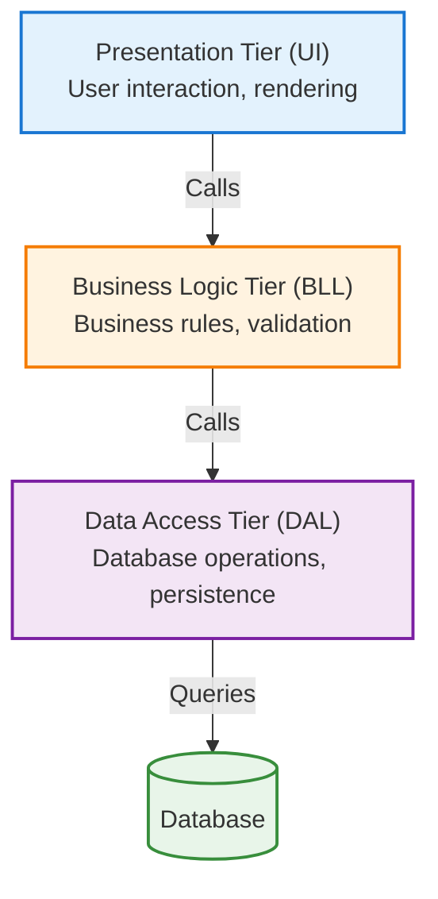
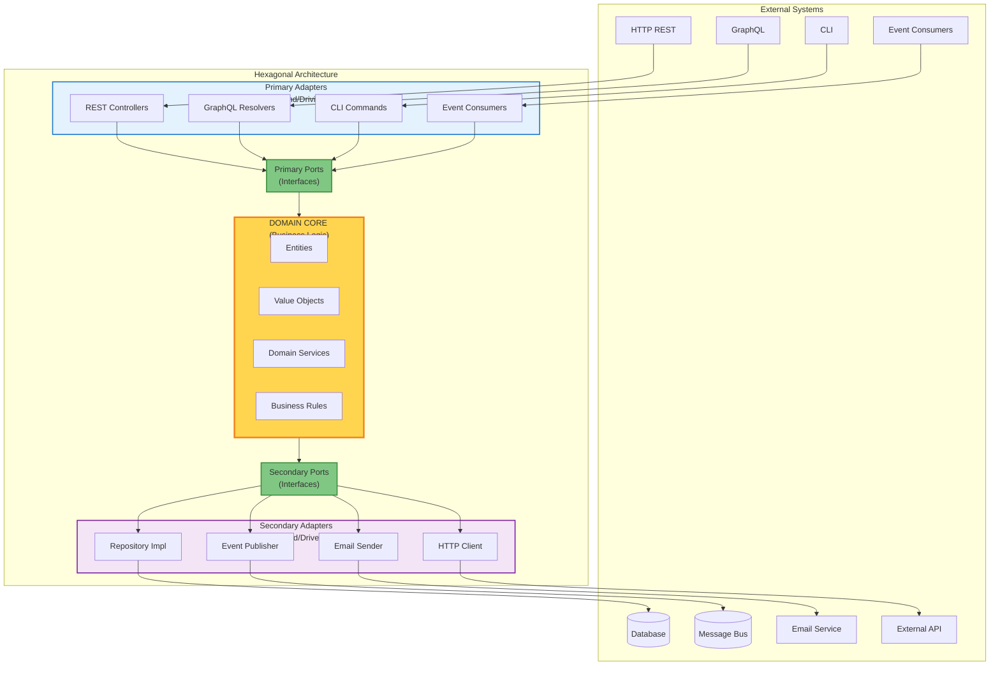
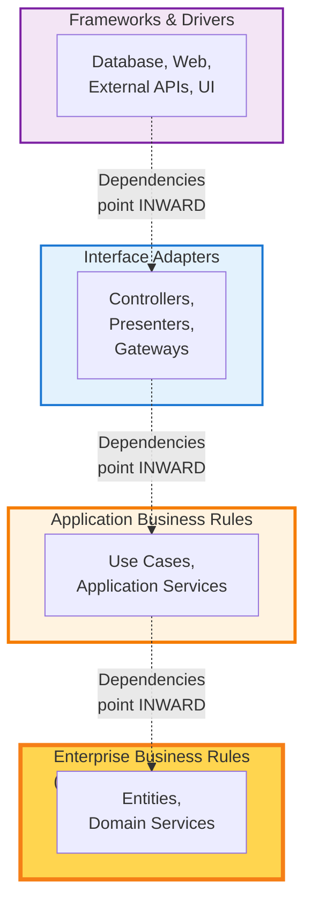
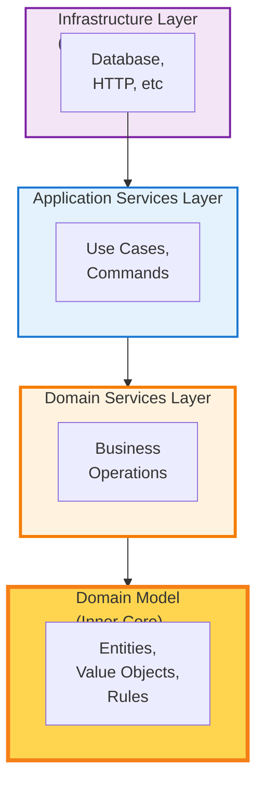
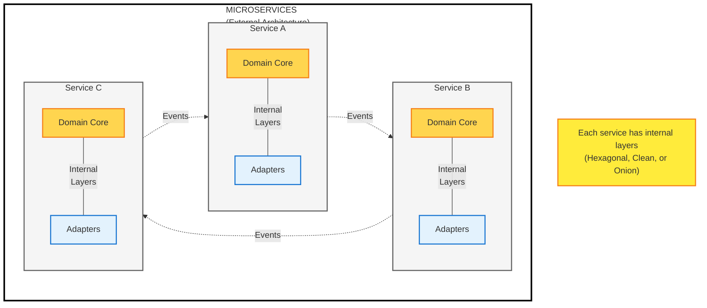
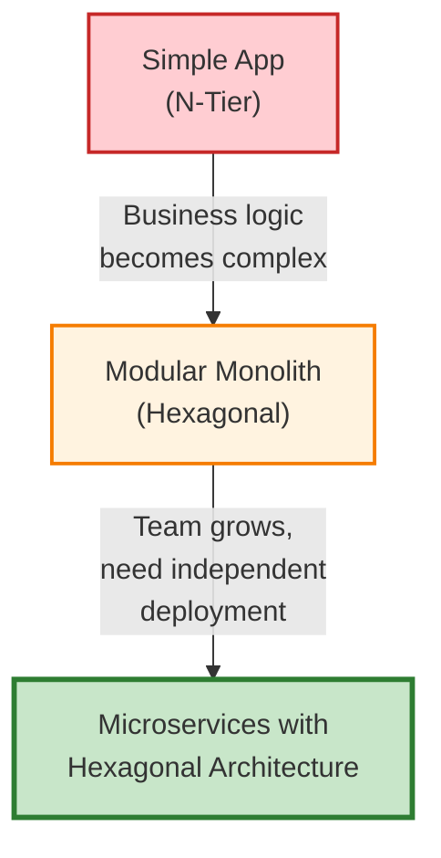

Understanding how to structure code within services is critical for maintainability and testability. This document compares traditional N-Tier architecture with modern layer-based patterns, and explains how layering works within microservices.

<Note>
**Key Insight**: Layering is an **internal** concern (how code is organized within a service), while microservices is an **external** concern (how services are distributed). These patterns are complementary, not mutually exclusive.
</Note>

## Architectural Layering Patterns Compared

### 1. Traditional N-Tier Architecture

#### What Is N-Tier Architecture?

N-Tier (also called "N-Layer") is a traditional architectural pattern that organizes code into horizontal layers, each responsible for a specific technical concern. The most common form is 3-tier architecture:



#### Characteristics of N-Tier

**Dependencies Flow Downward:**
- Presentation → Business Logic → Data Access → Database
- Each layer can only call the layer directly below it
- Upper layers depend on concrete implementations in lower layers

**Example (Traditional N-Tier):**

```typescript
// Presentation Layer
export async function GET(request: Request) {
  const workspaceService = new WorkspaceService();
  const workspaces = await workspaceService.getWorkspaces();

  return Response.json(workspaces);
}

// Business Logic Layer
export class WorkspaceService {
  async getWorkspaces() {
    // Business logic mixed with data access
    const dal = new WorkspaceDAL();
    const workspaces = await dal.findAll();

    // Validation happens here
    return workspaces.filter(w => w.isActive);
  }
}

// Data Access Layer
export class WorkspaceDAL {
  async findAll() {
    // Direct database coupling
    const { data } = await supabase
      .from('workspaces')
      .select('*');

    return data;
  }
}
```

#### Problems with Traditional N-Tier

1. **Tight Coupling to Infrastructure**
   - Business logic depends directly on data access layer
   - Changing databases requires modifying business logic
   - Hard to test business rules without a database

2. **Leaky Abstractions**
   - Database concerns leak into business logic (SQL, ORM entities)
   - Business logic becomes aware of persistence details
   - Domain models often have database annotations

3. **Circular Dependencies**
   - Business layer creates data access objects
   - Data access returns domain models
   - Creates tight coupling between layers

4. **Technology Lock-In**
   - Business logic married to specific ORM or database
   - Difficult to swap technologies
   - Framework dependencies throughout codebase

**Example of the Problem:**

```typescript
// Business logic layer - TIGHTLY COUPLED to database
export class WorkspaceService {
  async createWorkspace(name: string, ownerId: string) {
    // PROBLEM: Business logic knows about Supabase
    const { data, error } = await supabase
      .from('workspaces')
      .insert({ name, owner_id: ownerId })
      .select()
      .single();

    if (error) throw error;

    // PROBLEM: Business validation after database insert
    if (data.name.length < 3) {
      // Too late - already in database!
      await supabase.from('workspaces').delete().eq('id', data.id);
      throw new Error('Name too short');
    }

    return data;
  }
}
```

---

### 2. Modern Layer-Based Architectures

Layer-based architectures (Hexagonal, Clean, Onion) solve N-Tier's problems by inverting dependencies and organizing around business domains rather than technical layers.

#### Hexagonal Architecture (Ports & Adapters)



**Key Principles:**

1. **Dependency Inversion**: Domain defines interfaces (ports), infrastructure implements them (adapters)
2. **Domain Core is Pure**: No infrastructure dependencies, no framework code
3. **Testability**: Domain can be tested in isolation with test doubles
4. **Technology Agnostic**: Infrastructure can be swapped without changing business logic

**Example (Hexagonal Architecture):**

```typescript
// ===== DOMAIN CORE (Pure Business Logic) =====

// Domain Entity - No infrastructure dependencies
export class Workspace {
  private constructor(
    public readonly id: string,
    private _name: string,
    private _ownerId: string,
    private _isActive: boolean,
    public readonly createdAt: Date
  ) {}

  static create(name: string, ownerId: string): Workspace {
    // Business rule: Name must be 3-50 characters
    if (name.length < 3 || name.length > 50) {
      throw new DomainError('Workspace name must be 3-50 characters');
    }

    return new Workspace(
      generateId(),
      name,
      ownerId,
      true,
      new Date()
    );
  }

  rename(newName: string): void {
    if (newName.length < 3 || newName.length > 50) {
      throw new DomainError('Workspace name must be 3-50 characters');
    }
    this._name = newName;
  }

  archive(): void {
    if (!this._isActive) {
      throw new DomainError('Workspace is already archived');
    }
    this._isActive = false;
  }

  get name(): string { return this._name; }
  get ownerId(): string { return this._ownerId; }
  get isActive(): boolean { return this._isActive; }
}

// Secondary Port - Interface defined by domain
export interface WorkspaceRepository {
  findById(id: string): Promise<Workspace | null>;
  findByOwnerId(ownerId: string): Promise<Workspace[]>;
  save(workspace: Workspace): Promise<void>;
  delete(id: string): Promise<void>;
}

// Domain Service - Pure business logic
export class WorkspaceService {
  constructor(
    private readonly repository: WorkspaceRepository  // Depends on interface
  ) {}

  async createWorkspace(name: string, ownerId: string): Promise<Workspace> {
    // Business validation happens BEFORE persistence
    const workspace = Workspace.create(name, ownerId);

    await this.repository.save(workspace);

    return workspace;
  }

  async archiveWorkspace(id: string): Promise<void> {
    const workspace = await this.repository.findById(id);
    if (!workspace) {
      throw new DomainError('Workspace not found');
    }

    // Domain method encapsulates business rule
    workspace.archive();

    await this.repository.save(workspace);
  }
}

// ===== INFRASTRUCTURE (Adapters) =====

// Secondary Adapter - Implements domain interface
export class SupabaseWorkspaceRepository implements WorkspaceRepository {
  constructor(private readonly supabase: SupabaseClient) {}

  async findById(id: string): Promise<Workspace | null> {
    const { data } = await this.supabase
      .from('workspaces')
      .select('*')
      .eq('id', id)
      .single();

    return data ? this.toDomain(data) : null;
  }

  async save(workspace: Workspace): Promise<void> {
    await this.supabase
      .from('workspaces')
      .upsert(this.toDatabase(workspace));
  }

  // Mapping between database schema and domain model
  private toDomain(row: any): Workspace {
    return new Workspace(
      row.id,
      row.name,
      row.owner_id,
      row.is_active,
      new Date(row.created_at)
    );
  }

  private toDatabase(workspace: Workspace): any {
    return {
      id: workspace.id,
      name: workspace.name,
      owner_id: workspace.ownerId,
      is_active: workspace.isActive,
      created_at: workspace.createdAt.toISOString()
    };
  }
}

// Primary Adapter - API endpoint
export async function POST(request: Request) {
  const body = await request.json();

  // Dependency injection - provide implementation
  const repository = new SupabaseWorkspaceRepository(createClient());
  const service = new WorkspaceService(repository);

  const workspace = await service.createWorkspace(
    body.name,
    body.ownerId
  );

  return Response.json({ workspace });
}
```

#### Benefits of Hexagonal Architecture

✅ **Domain Logic is Pure and Testable**
```typescript
// Test without any infrastructure
describe('Workspace', () => {
  it('enforces name length business rule', () => {
    expect(() => {
      Workspace.create('ab', 'owner-123');  // Too short
    }).toThrow('Workspace name must be 3-50 characters');
  });

  it('prevents archiving already archived workspace', () => {
    const workspace = Workspace.create('Test', 'owner-123');
    workspace.archive();

    expect(() => workspace.archive()).toThrow('Workspace is already archived');
  });
});
```

✅ **Technology Can Be Swapped Easily**
```typescript
// Switch from Supabase to Drizzle - domain unchanged
const repository = new DrizzleWorkspaceRepository(db);
const service = new WorkspaceService(repository);
// All business logic works identically
```

✅ **Fast, Reliable Tests**
```typescript
// In-memory test double - runs in milliseconds
class InMemoryWorkspaceRepository implements WorkspaceRepository {
  private workspaces = new Map<string, Workspace>();

  async findById(id: string) {
    return this.workspaces.get(id) || null;
  }

  async save(workspace: Workspace) {
    this.workspaces.set(workspace.id, workspace);
  }
}

// Test runs instantly, no database needed
const repo = new InMemoryWorkspaceRepository();
const service = new WorkspaceService(repo);
await service.createWorkspace('Test', 'owner-123');
```

---

### 3. Clean Architecture

Clean Architecture (by Robert C. Martin) is similar to Hexagonal but emphasizes concentric circles of dependencies.



**Key Rule**: Dependencies can only point inward. Inner circles know nothing about outer circles.

**Example Structure:**

```typescript
// ===== INNERMOST: Enterprise Business Rules =====
// packages/types/src/domain/workspace.ts
export class Workspace {
  // Pure domain entity - no dependencies
}

// ===== APPLICATION LAYER: Use Cases =====
// apps/web/src/application/use-cases/create-workspace.ts
export class CreateWorkspaceUseCase {
  constructor(
    private readonly repository: WorkspaceRepository,
    private readonly eventPublisher: EventPublisher
  ) {}

  async execute(command: CreateWorkspaceCommand): Promise<Workspace> {
    // Orchestrates domain entities and infrastructure
    const workspace = Workspace.create(command.name, command.ownerId);
    await this.repository.save(workspace);
    await this.eventPublisher.publish(new WorkspaceCreatedEvent(workspace));
    return workspace;
  }
}

// ===== INTERFACE ADAPTERS: Controllers =====
// apps/web/src/app/api/workspaces/create/route.ts
export async function POST(request: Request) {
  const useCase = new CreateWorkspaceUseCase(repository, eventPublisher);
  const workspace = await useCase.execute(command);
  return Response.json(toDTO(workspace));
}

// ===== OUTERMOST: Frameworks & Drivers =====
// Infrastructure implementations (Supabase, Trigger.dev, etc.)
```

---

### 4. Onion Architecture

Onion Architecture is similar to Clean but visualizes layers as concentric circles with explicit layer names.



All three patterns (Hexagonal, Clean, Onion) share the same core principle: **Dependency Inversion** to keep business logic pure and independent.

---

## Layering Within Microservices

### Microservices ≠ No Layering

**Common Misconception**: "Microservices replace layering."

**Reality**: Microservices is an **external** architectural pattern (how services are distributed across the network). Layering is an **internal** pattern (how code is organized within each service).



### Best Practice: Hexagonal Architecture Within Microservices

In Tuturuuu, each microservice (app) uses **Hexagonal Architecture internally**:

```typescript
// apps/web/ (Microservice for main platform)
apps/web/src/
├── domain/                    # Domain Core (Pure business logic)
│   ├── models/
│   │   └── workspace.ts       # Entities, Value Objects
│   └── services/
│       └── workspace-service.ts
├── application/               # Application Layer (Use Cases)
│   └── use-cases/
│       └── create-workspace.ts
├── infrastructure/            # Infrastructure (Adapters)
│   ├── repositories/
│   │   └── supabase-workspace-repository.ts
│   └── events/
│       └── trigger-event-publisher.ts
└── app/                       # Presentation (API Endpoints)
    └── api/workspaces/create/route.ts

// apps/finance/ (Separate microservice for finance domain)
apps/finance/src/
├── domain/                    # Finance-specific domain
│   ├── models/
│   │   └── transaction.ts
│   └── services/
│       └── transaction-service.ts
├── application/
│   └── use-cases/
│       └── process-payment.ts
├── infrastructure/
│   ├── repositories/
│   │   └── supabase-transaction-repository.ts
│   └── gateways/
│       └── payment-gateway.ts
└── app/
    └── api/transactions/route.ts
```

**Benefits of This Approach:**

1. **Service Isolation**: Each microservice is independently deployable
2. **Internal Quality**: Each service maintains clean internal architecture
3. **Technology Freedom**: Each service can use different infrastructure
4. **Testability**: Domain logic in each service is pure and testable
5. **Maintainability**: Clear structure within each service

---

## Comparison Matrix

| Aspect | N-Tier | Hexagonal/Clean/Onion | Microservices |
|--------|--------|----------------------|---------------|
| **Scope** | Internal organization | Internal organization | External distribution |
| **Dependencies** | Downward (UI→BLL→DAL) | Inward (Infrastructure→Domain) | Service-to-service via events |
| **Coupling** | Tight (layers depend on concrete implementations) | Loose (depends on interfaces) | Very loose (event-driven) |
| **Testability** | Hard (requires database) | Easy (pure domain logic) | Moderate (contract testing) |
| **Technology Flexibility** | Low (framework lock-in) | High (swappable adapters) | Very high (per-service choice) |
| **Deployment Unit** | Entire application | Entire application | Individual service |
| **Scalability** | All-or-nothing | All-or-nothing | Granular per service |
| **Complexity** | Low | Moderate | High |
| **Best For** | Simple CRUD apps | Complex business logic | Distributed systems, large teams |

---

## When to Use Each Pattern

### Use N-Tier When:
- ✅ Building simple CRUD applications
- ✅ Team is unfamiliar with DDD/Hexagonal concepts
- ✅ Rapid prototyping with acceptable technical debt
- ✅ Application will remain small (&lt;10k LOC)

### Use Hexagonal/Clean/Onion When:
- ✅ Complex business logic requires protection
- ✅ Long-term maintainability is critical
- ✅ Need to swap infrastructure components
- ✅ High test coverage is required
- ✅ Domain experts are involved in development

### Use Microservices When:
- ✅ Multiple teams working on different domains
- ✅ Need independent deployment and scaling
- ✅ Different parts of system have different technology needs
- ✅ Can handle distributed system complexity
- ✅ Have DevOps maturity for service orchestration

### Tuturuuu's Choice: Hexagonal Within Microservices

We combine both patterns to get the best of both worlds:
- **Microservices** for organizational agility and independent deployment
- **Hexagonal Architecture** within services for clean, testable code

---

## Evolution Path

Many systems evolve through these patterns:



**Tuturuuu started with Step 3** to avoid future rewrites and support rapid, safe evolution.

---

## Anti-Patterns to Avoid

### ❌ Hexagonal Architecture Without Discipline

```typescript
// BAD: "Hexagonal" in name only
export class WorkspaceService {
  constructor(private readonly repository: WorkspaceRepository) {}

  async createWorkspace(name: string, ownerId: string) {
    // WRONG: Direct Supabase usage bypasses repository
    const { data } = await supabase.from('workspaces').insert({ name, owner_id: ownerId });
    return data;
  }
}
// This defeats the purpose of Hexagonal Architecture
```

### ❌ Distributed Monolith

```typescript
// BAD: Microservices with tight coupling
// Service A
export async function createWorkspace(data: CreateWorkspaceData) {
  const workspace = await db.insert(data);

  // WRONG: Synchronous HTTP call to Service B
  await fetch('http://service-b/setup', {
    method: 'POST',
    body: JSON.stringify({ workspaceId: workspace.id })
  });

  return workspace;
}
// This is a distributed monolith, not microservices
```

### ❌ No Layering in Microservices

```typescript
// BAD: API route with all logic mixed together
export async function POST(request: Request) {
  const body = await request.json();

  // Validation
  if (body.name.length < 3) return Response.json({ error: 'Too short' }, { status: 400 });

  // Database
  const { data } = await supabase.from('workspaces').insert(body);

  // Events
  await trigger.event({ name: 'workspace.created', payload: data });

  return Response.json(data);
}
// No separation of concerns, hard to test, hard to maintain
```

---

## Tuturuuu's Implementation

### Project Structure Reflects Layering + Microservices

```
platform/
├── apps/                          # Microservices (External)
│   ├── web/                       # Main platform service
│   │   └── src/
│   │       ├── domain/           # Hexagonal layers (Internal)
│   │       ├── application/
│   │       ├── infrastructure/
│   │       └── app/
│   ├── finance/                   # Finance service
│   │   └── src/
│   │       ├── domain/           # Hexagonal layers (Internal)
│   │       ├── application/
│   │       ├── infrastructure/
│   │       └── app/
│   └── calendar/                  # Calendar service
│       └── src/
│           ├── domain/           # Hexagonal layers (Internal)
│           ├── application/
│           ├── infrastructure/
│           └── app/
└── packages/                      # Shared libraries
    ├── types/                     # Shared domain types
    ├── ui/                        # Shared UI components
    └── supabase/                  # Shared database client
```

### Code Example: Complete Flow

```typescript
// ===== DOMAIN LAYER (Pure Business Logic) =====
// apps/web/src/domain/models/workspace.ts
export class Workspace {
  static create(name: string, ownerId: string): Workspace {
    if (name.length < 3) throw new DomainError('Name too short');
    return new Workspace(generateId(), name, ownerId, true, new Date());
  }
}

// apps/web/src/domain/interfaces/workspace-repository.ts
export interface WorkspaceRepository {
  save(workspace: Workspace): Promise<void>;
}

// ===== APPLICATION LAYER (Use Cases) =====
// apps/web/src/application/use-cases/create-workspace.ts
export class CreateWorkspaceUseCase {
  constructor(
    private readonly repository: WorkspaceRepository,
    private readonly eventPublisher: EventPublisher
  ) {}

  async execute(command: CreateWorkspaceCommand): Promise<Workspace> {
    const workspace = Workspace.create(command.name, command.ownerId);
    await this.repository.save(workspace);
    await this.eventPublisher.publish(new WorkspaceCreatedEvent(workspace));
    return workspace;
  }
}

// ===== INFRASTRUCTURE LAYER (Adapters) =====
// apps/web/src/infrastructure/repositories/supabase-workspace-repository.ts
export class SupabaseWorkspaceRepository implements WorkspaceRepository {
  async save(workspace: Workspace): Promise<void> {
    await this.supabase.from('workspaces').upsert(this.toDatabase(workspace));
  }
}

// ===== PRESENTATION LAYER (API) =====
// apps/web/src/app/api/workspaces/create/route.ts
export async function POST(request: Request) {
  const body = await request.json();

  const useCase = new CreateWorkspaceUseCase(
    new SupabaseWorkspaceRepository(createClient()),
    new TriggerEventPublisher(trigger)
  );

  const workspace = await useCase.execute({
    name: body.name,
    ownerId: session.userId
  });

  return Response.json({ workspace });
}
```

Each layer has a clear responsibility, dependencies point inward, and the system is both testable and maintainable.

---

## Related Documentation

- [Hexagonal Architecture](/platform/architecture/system-design/hexagonal-architecture) - Detailed ports and adapters implementation
- [Microservices Patterns](/platform/architecture/system-design/microservices-patterns) - Service boundaries and communication
- [Architectural Decisions](/platform/architecture/system-design/architectural-decisions) - Why we chose this architecture
- [Quality Attributes](/platform/architecture/system-design/quality-attributes) - Maintainability and testability benefits
- [Encapsulation Patterns](/platform/architecture/system-design/encapsulation-patterns) - Preventing unwanted coupling
