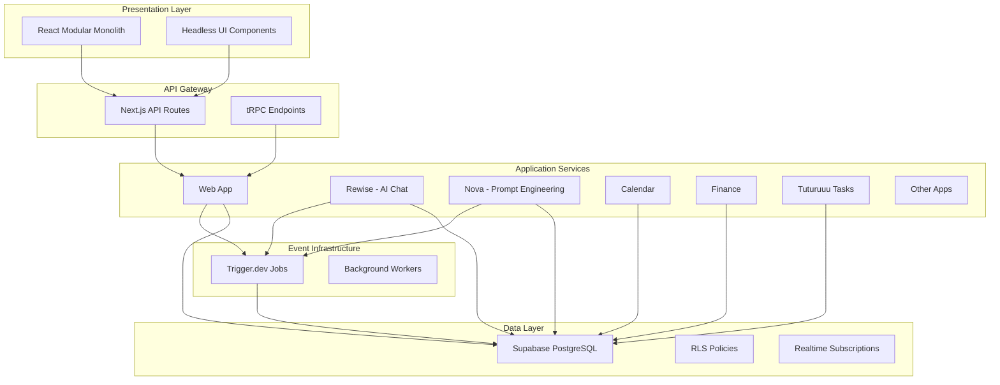

Tuturuuu's architecture is built on a foundation of proven design patterns and principles that prioritize **extensibility**, **resilience**, **scalability**, and **maintainability**. This section provides a comprehensive guide to the system's architectural decisions and implementation patterns.

## Architectural Philosophy

Our architectural approach is guided by several core principles:

1. **Loose Coupling, High Cohesion**: Services and components are independently deployable with well-defined boundaries
2. **Evolutionary Design**: The system can adapt to changing requirements without extensive rewrites
3. **Resilience by Default**: Failures are isolated and don't cascade across the system
4. **Developer Experience First**: Architecture choices prioritize maintainability and developer productivity
5. **Pragmatic Trade-offs**: We make conscious decisions about complexity vs. simplicity based on actual needs

## Architectural Layers

## Core Architectural Patterns

### 1. Event-Driven Architecture (EDA)

Asynchronous, event-based communication for core business workflows using Trigger.dev.

**When to use:**
- Background processing (email sending, data transformations)
- Long-running operations that shouldn't block user requests
- Cross-service coordination that benefits from decoupling

**Read more:** [Event-Driven Architecture](/platform/architecture/system-design/event-driven-architecture)

### 2. Hexagonal Architecture (Ports & Adapters)

Clean separation between business logic and infrastructure concerns within each service.

**When to use:**
- Complex business logic that needs protection from technology changes
- Services requiring high testability
- When multiple adapters might be needed (REST + tRPC + GraphQL)

**Read more:** [Hexagonal Architecture](/platform/architecture/system-design/hexagonal-architecture)

### 3. Microservices in a Monorepo

Logical service boundaries with shared tooling and dependencies via Turborepo.

**When to use:**
- Independent teams working on different features
- Services with different scaling needs
- Features that benefit from technological flexibility

**Read more:** [Microservices Patterns](/platform/architecture/system-design/microservices-patterns)

### 4. React Modular Monolith

Organized frontend with clear module boundaries and headless UI patterns.

**When to use:**
- Complex UIs with shared component libraries
- Multiple client types (web, mobile) sharing logic
- Teams that value fast iteration over distributed deployments

**Related:** [Data Fetching](/platform/architecture/data-fetching)

## Decision Matrix

| Requirement | Recommended Pattern | Alternative | Trade-off |
|-------------|---------------------|-------------|-----------|
| Background job processing | Event-Driven (Trigger.dev) | Synchronous API | Complexity vs. Resilience |
| User-facing API | tRPC + Next.js API Routes | GraphQL | Type safety vs. Flexibility |
| Business logic isolation | Hexagonal Architecture | Traditional Layers | Testability vs. Simplicity |
| Service boundaries | Monorepo Microservices | Polyrepo | DX vs. Independence |
| Frontend state | React Query + Jotai | Redux | Simplicity vs. Predictability |
| Data access | Supabase RLS | Application-level auth | Security vs. Performance |

## Key Design Documents

### Foundational Decisions
- [Architectural Decisions](/platform/architecture/system-design/architectural-decisions) - Why we chose microservices, EDA, hexagonal architecture, and React patterns

### Pattern Deep Dives
- [Event-Driven Architecture](/platform/architecture/system-design/event-driven-architecture) - Advantages, drawbacks, and implementation
- [Extensibility, Resilience & Scalability](/platform/architecture/system-design/extensibility-resilience-scalability) - 15 reasons these properties are prioritized
- [Encapsulation Patterns](/platform/architecture/system-design/encapsulation-patterns) - Preventing unwanted coupling

### Implementation Guides
- [Hexagonal Architecture](/platform/architecture/system-design/hexagonal-architecture) - Ports, adapters, and layering
- [Microservices Patterns](/platform/architecture/system-design/microservices-patterns) - Service boundaries and communication

## Integration with Existing Docs

This system design documentation complements our existing architecture guides:

- **[Routing](/platform/architecture/routing)**: Workspace-scoped routing implementation
- **[Data Fetching](/platform/architecture/data-fetching)**: RSC, Server Actions, React Query patterns
- **[Authentication](/platform/architecture/authentication)**: Supabase Auth integration
- **[Authorization](/platform/architecture/authorization)**: RLS and permission system
- **[tRPC](/platform/architecture/trpc)**: Type-safe API layer
- **[API Routes](/platform/architecture/api-routes)**: REST endpoint patterns

## Quality Attributes

Our architecture explicitly optimizes for:

1. **Extensibility**: New features can be added with minimal changes to existing code
2. **Resilience**: Failures are isolated and the system degrades gracefully
3. **Scalability**: Services can scale independently based on demand
4. **Maintainability**: Code is organized, testable, and understandable
5. **Developer Experience**: Fast feedback loops and productive workflows

Each of these attributes is explored in depth in the linked documents above.

## Getting Started

For developers new to the codebase:

1. Start with [Architectural Decisions](/platform/architecture/system-design/architectural-decisions) to understand the "why"
2. Review [Microservices Patterns](/platform/architecture/system-design/microservices-patterns) to understand service boundaries
3. Explore [Hexagonal Architecture](/platform/architecture/system-design/hexagonal-architecture) for code organization within services
4. Read [Event-Driven Architecture](/platform/architecture/system-design/event-driven-architecture) for async communication patterns

For implementing new features:

1. Determine service boundary (which app in `apps/`?)
2. Apply hexagonal architecture within the service
3. Use events (Trigger.dev) for background work
4. Follow data fetching patterns for frontend integration
5. Ensure proper encapsulation and testing

## Architecture Evolution

This architecture is not static. As the platform grows, we continuously evaluate:

- When to extract shared logic into new packages
- When to split apps into smaller services
- When to introduce new communication patterns
- When to adopt new technologies

All architectural changes are documented and follow the principles outlined in [AGENTS.md](https://github.com/tutur3u/platform/blob/main/AGENTS.md).
