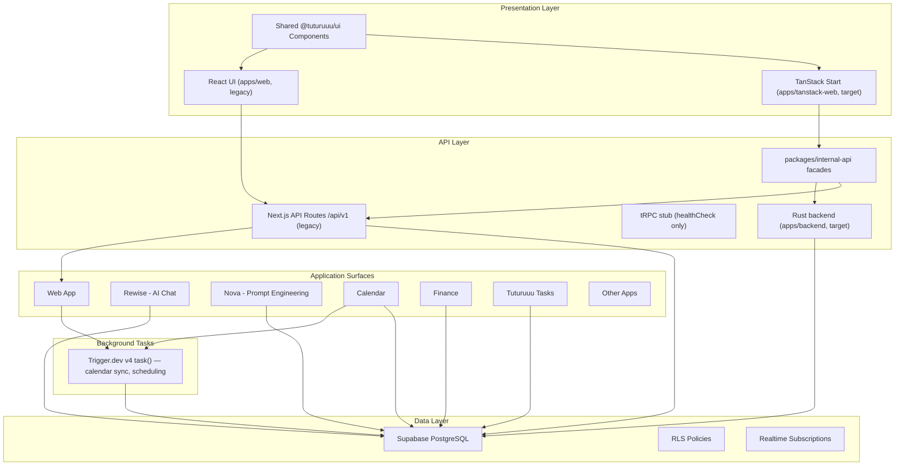

Tuturuuu's architecture is built on a foundation of proven design patterns and principles that prioritize **extensibility**, **resilience**, **scalability**, and **maintainability**. This section provides a comprehensive guide to the system's architectural decisions and implementation patterns.

<Note>
  Several pages in this bucket describe patterns as general design guidance, not
  as fully-adopted Tuturuuu implementations. The platform apps are conventional
  Next.js App Router apps (`apps/web`) plus a TanStack Start frontend
  (`apps/tanstack-web`) and a Rust backend (`apps/backend`) that share one
  Supabase project. There is no hexagonal layering, event-store, or inter-service
  event bus in the codebase today. Where a pattern below is conceptual rather
  than implemented, treat it as a "when you would reach for this" guide and trust
  the cited source files over the prose.
</Note>

<Warning>
  **Active migration.** `apps/web` (Next.js, port `7803`) is being superseded by
  `apps/tanstack-web` (TanStack Start) plus `apps/backend` (Rust API, port
  `7820`). Patterns described here as "Next.js + tRPC" reflect the legacy
  `apps/web` runtime. See
  [TanStack Start And Rust Migration](/platform/architecture/tanstack-rust-migration)
  for the route-ownership contract and target architecture.
</Warning>

## Architectural Philosophy

Our architectural approach is guided by several core principles:

1. **Loose Coupling, High Cohesion**: Services and components are independently deployable with well-defined boundaries
2. **Evolutionary Design**: The system can adapt to changing requirements without extensive rewrites
3. **Resilience by Default**: Failures are isolated and don't cascade across the system
4. **Developer Experience First**: Architecture choices prioritize maintainability and developer productivity
5. **Pragmatic Trade-offs**: We make conscious decisions about complexity vs. simplicity based on actual needs

## Architectural Layers


```mermaid
graph TB
    subgraph "Presentation Layer"
        A["React UI (apps/web, legacy)"]
        A2["TanStack Start (apps/tanstack-web, target)"]
        B[Shared @tuturuuu/ui Components]
    end

    subgraph "API Layer"
        C["Next.js API Routes /api/v1 (legacy)"]
        D["tRPC stub (healthCheck only)"]
        R["Rust backend (apps/backend, target)"]
        IA["packages/internal-api facades"]
    end

    subgraph "Application Surfaces"
        E[Web App]
        F[Rewise - AI Chat]
        G[Nova - Prompt Engineering]
        H[Calendar]
        I[Finance]
        J[Tuturuuu Tasks]
        K[Other Apps]
    end

    subgraph "Background Tasks"
        L["Trigger.dev v4 task() — calendar sync, scheduling"]
    end

    subgraph "Data Layer"
        N[Supabase PostgreSQL]
        O[RLS Policies]
        P[Realtime Subscriptions]
    end

    A --> C
    A2 --> IA
    B --> A
    B --> A2
    IA --> R
    IA --> C
    C --> E
    R --> N
    E --> L
    F --> N
    G --> N
    H --> L
    H --> N
    I --> N
    J --> N
    C --> N
    L --> N
```

<Info>
  The `tRPC` node is intentionally small: `apps/web/src/trpc` is a stub that
  exports only a `healthCheck` `baseProcedure` with a hardcoded context. Real
  product data flows through `packages/internal-api` helpers calling REST
  `/api/v1` routes (legacy `apps/web`) or the Rust backend (`apps/backend`). A
  guard (`check-tanstack-api-access`) forbids direct `/trpc`, `/api`, and
  `/internal` calls from `apps/tanstack-web/src`.
</Info>

## Core Architectural Patterns

### 1. Background And Scheduled Tasks (Trigger.dev)

Asynchronous, long-running work runs as Trigger.dev v4 `task()` definitions in
`packages/trigger`. Today this is scoped to a handful of concrete jobs —
Google Calendar full/incremental sync and the unified habit/task scheduler —
not a general cross-service event bus.

```ts
// packages/trigger/src/unified-schedule.ts (Trigger.dev v4 task API)
import { task } from '@trigger.dev/sdk/v3';

export const unifiedScheduleTask = task({
  id: 'unified-schedule-task',
  queue: { concurrencyLimit: 5 },
  run: async (payload: { ws_id: string; windowDays?: number }) => {
    // ...scheduling work for one workspace
  },
});
```

<Note>
  The `@trigger.dev/sdk` is on v4 (`^4.4.5`). The v4 `task()` API is imported
  from `@trigger.dev/sdk/v3` (the path is unchanged across the v3→v4 SDK). The
  older v2 patterns (`client.defineJob`, `eventTrigger`, `io.runTask`,
  `io.sendEvent`) are not used in this repo.
</Note>

**When to use:**
- Background processing that shouldn't block user requests
- Long-running operations (calendar full sync, batch scheduling)
- Scheduled/recurring work coordinated through Trigger.dev queues and concurrency limits

**Read more:** [Event-Driven Architecture](/platform/architecture/system-design/event-driven-architecture)

### 2. Hexagonal Architecture (Ports & Adapters)

Clean separation between business logic and infrastructure concerns within a
service.

<Note>
  Tuturuuu apps do not implement full hexagonal layering: there are no
  `domain/`, `application/`, or `infrastructure/` directories in `apps/web`.
  The closest real boundary is `packages/internal-api` (a typed facade in front
  of REST/backend endpoints) and the Rust backend's per-domain route modules in
  `apps/backend/src` (for example `inventory`, `changelog`, `aurora`). Treat
  this section as guidance for where a port/adapter seam is worth introducing,
  not a description of an existing layered structure.
</Note>

**When to use:**
- Complex business logic that needs protection from technology changes
- Services requiring high testability
- When multiple adapters might be needed (REST + tRPC + GraphQL)

**Read more:** [Hexagonal Architecture](/platform/architecture/system-design/hexagonal-architecture)

### 3. Microservices in a Monorepo

Logical service boundaries with shared tooling and dependencies via Turborepo.

**When to use:**
- Independent teams working on different features
- Services with different scaling needs
- Features that benefit from technological flexibility

**Read more:** [Microservices Patterns](/platform/architecture/system-design/microservices-patterns)

### 4. Shared UI With Per-App Frontends

Organized frontend with a shared `@tuturuuu/ui` component library consumed by
each app. The legacy `apps/web` is a Next.js App Router app (Server Components
by default); the target `apps/tanstack-web` is a TanStack Start app. Both pull
from the same shared packages.

<Note>
  This was previously framed as a single "React Modular Monolith." In practice
  the frontend is split across distinct apps (`apps/web`, `apps/tanstack-web`,
  the Flutter `apps/mobile`) sharing packages, and the web frontend is mid-
  migration from Next.js to TanStack Start.
</Note>

**When to use:**
- Complex UIs with shared component libraries
- Multiple client types (web, mobile) sharing logic
- Teams that value fast iteration over distributed deployments

**Related:** [Data Fetching](/platform/architecture/data-fetching)

## Decision Matrix

| Requirement | Recommended Pattern | Alternative | Trade-off |
|-------------|---------------------|-------------|-----------|
| Background / scheduled job processing | Trigger.dev v4 `task()` | Synchronous API | Complexity vs. Resilience |
| User-facing API (target) | Rust backend (`apps/backend`) via `packages/internal-api` | Direct REST | Centralization vs. Effort |
| User-facing API (legacy) | Next.js API Routes (`/api/v1`) in `apps/web` | tRPC | Existing surface vs. migration |
| Shared/typed API access | `packages/internal-api` facades | Scattered raw `fetch` | Encapsulation vs. Directness |
| Service boundaries | Monorepo apps + shared packages | Polyrepo | DX vs. Independence |
| Frontend state | TanStack Query + Jotai | Redux | Simplicity vs. Predictability |
| Data access | Supabase RLS | Application-level auth | Security vs. Performance |

<Note>
  tRPC is **not** the user-facing API layer in Tuturuuu. The `apps/web/src/trpc`
  module is a stub (`healthCheck` only). Use `packages/internal-api` helpers in
  front of the Rust backend (`apps/backend`, target) or legacy `apps/web`
  `/api/v1` routes.
</Note>

## Key Design Documents

### Foundational Decisions
- [Architectural Decisions](/platform/architecture/system-design/architectural-decisions) - Why we chose microservices, EDA, hexagonal architecture, and React patterns

### Pattern Deep Dives
- [Event-Driven Architecture](/platform/architecture/system-design/event-driven-architecture) - Advantages, drawbacks, and implementation
- [Extensibility, Resilience & Scalability](/platform/architecture/system-design/extensibility-resilience-scalability) - 15 reasons these properties are prioritized
- [Encapsulation Patterns](/platform/architecture/system-design/encapsulation-patterns) - Preventing unwanted coupling

### Implementation Guides
- [Hexagonal Architecture](/platform/architecture/system-design/hexagonal-architecture) - Ports, adapters, and layering
- [Microservices Patterns](/platform/architecture/system-design/microservices-patterns) - Service boundaries and communication

## Integration with Existing Docs

This system design documentation complements our existing architecture guides:

- **[Routing](/platform/architecture/routing)**: Workspace-scoped routing implementation
- **[Data Fetching](/platform/architecture/data-fetching)**: RSC, Server Actions, TanStack Query patterns
- **[Authentication](/platform/architecture/authentication)**: Supabase Auth integration
- **[Authorization](/platform/architecture/authorization)**: RLS and permission system
- **[tRPC](/platform/architecture/trpc)**: Type-safe API layer (currently a stub; not the product API path)
- **[API Routes](/platform/architecture/api-routes)**: REST endpoint patterns (legacy `apps/web` `/api/v1`)
- **[TanStack Start And Rust Migration](/platform/architecture/tanstack-rust-migration)**: Target frontend/backend split and route-ownership contract

<Note>
  The Routing, Data Fetching, tRPC, and API Routes guides above describe the
  legacy `apps/web` runtime. For the target architecture, the equivalent path is
  TanStack Start loaders/server functions plus Rust backend endpoints fronted by
  `packages/internal-api`.
</Note>

## Quality Attributes

Our architecture explicitly optimizes for:

1. **Extensibility**: New features can be added with minimal changes to existing code
2. **Resilience**: Failures are isolated and the system degrades gracefully
3. **Scalability**: Services can scale independently based on demand
4. **Maintainability**: Code is organized, testable, and understandable
5. **Developer Experience**: Fast feedback loops and productive workflows

Each of these attributes is explored in depth in the linked documents above.

## Getting Started

For developers new to the codebase:

1. Start with [Architectural Decisions](/platform/architecture/system-design/architectural-decisions) to understand the "why"
2. Review [Microservices Patterns](/platform/architecture/system-design/microservices-patterns) to understand service boundaries
3. Explore [Hexagonal Architecture](/platform/architecture/system-design/hexagonal-architecture) for code organization within services
4. Read [Event-Driven Architecture](/platform/architecture/system-design/event-driven-architecture) for async communication patterns

For implementing new features:

1. Determine which app the work belongs to (`apps/web`, `apps/tanstack-web`, `apps/backend`, `apps/mobile`)
2. Route shared/typed API access through `packages/internal-api` rather than scattered raw `fetch`
3. Use Trigger.dev v4 `task()` definitions in `packages/trigger` for background/scheduled work
4. Follow data fetching patterns (TanStack Query; no `useEffect` fetching) for frontend integration
5. Keep boundaries clean and add tests; for new TanStack frontend ports, check the migration contract and the `check-tanstack-api-access` guard

## Architecture Evolution

This architecture is not static. The most significant in-flight change is the
migration of the web frontend from Next.js (`apps/web`) to TanStack Start
(`apps/tanstack-web`) plus a dedicated Rust backend (`apps/backend`), tracked
route-by-route in
[TanStack Start And Rust Migration](/platform/architecture/tanstack-rust-migration).
As the platform grows, we continuously evaluate:

- When to extract shared logic into new packages
- When to move product API surface from legacy `apps/web` routes to the Rust backend
- When to introduce new communication patterns
- When to adopt new technologies

All architectural changes are documented and follow the principles outlined in [AGENTS.md](https://github.com/tutur3u/platform/blob/main/AGENTS.md).
