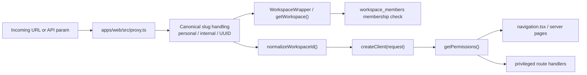

This page documents the actual workspace and permission model used by `apps/web` today.

It focuses on the implementation that page components, route handlers, and the internal API helpers actually consume:

- `packages/utils/src/workspace-helper.ts`
- `packages/ui/src/components/ui/custom/workspace-wrapper.tsx`
- `apps/web/src/proxy.ts`
- `packages/utils/src/permissions.tsx`
- `apps/web/src/lib/api-middleware.ts`

## Mental Model

There are four layers, and most bugs come from mixing them together:

1. **Workspace identity**
   `personal`, `internal`, and UUIDs all describe the same underlying `workspaces.id` shape, but only UUIDs are stored in the database.
2. **Membership**
   `workspace_members` answers "is this signed-in user allowed inside this workspace at all?"
3. **Effective permissions**
   `workspace_role_members`, `workspace_role_permissions`, `workspace_default_permissions`, and creator fallback answer "what may this member do?"
4. **Surface enforcement**
   Pages, navigation, and API routes decide whether to hide, redirect, 403, or allow the action.

## Workspace Vocabulary

| Concept | Source of truth | What it means in `apps/web` |
|---|---|---|
| Workspace | `workspaces` | A top-level collaboration boundary and the scope for most product data. |
| Personal workspace | `workspaces.personal = true` | A one-user workspace that is canonicalized to the `personal` URL slug. |
| Root workspace | `ROOT_WORKSPACE_ID` | The internal/system workspace, canonicalized to the `internal` URL slug. |
| Membership | `workspace_members` | Grants baseline access to a workspace. |
| Workspace role | `workspace_roles` | A named collection of enabled permission bits for one workspace. |
| Role assignment | `workspace_role_members` | Links a user to one or more workspace roles. |
| Default permissions | `workspace_default_permissions` | Workspace-wide permissions every member receives. |
| API key | `workspace_api_keys` | Workspace-bound SDK credential that reuses the same permission IDs. |

## Membership Is Not The Same Thing As A Workspace User Record

`apps/web` uses two different "user-ish" concepts:

- `workspace_members`
  This is the access-control boundary. Most auth checks read this table.
- `workspace_users`
  This is domain data used by product features such as user management, attendance, reports, and directory-style views.

Do not treat `workspace_users` as evidence that a signed-in platform user has workspace access. In the web app, access checks consistently use `workspace_members`.

## Canonical Workspace Identifiers

The web app accepts three route forms:

- a raw workspace UUID
- `personal`
- `internal`

The database only stores UUID workspace IDs. The slugs are convenience identifiers used at the edge and in page params.

### Resolution Rules

- `personal` resolves to the signed-in user's personal workspace UUID.
- `internal` resolves to `ROOT_WORKSPACE_ID`.
- a personal workspace UUID in the URL is redirected back to `/personal/...`.
- the root workspace UUID in the URL is redirected back to `/internal/...`.

This canonicalization happens before most page rendering so the browser settles on stable, human-friendly URLs.

## How Proxy Routing Works

`apps/web/src/proxy.ts` is the entry point for workspace-aware URL normalization.

The proxy is responsible for:

- locale-aware path parsing
- redirecting root visits to the user's default workspace
- rewriting raw root UUIDs to `internal`
- rewriting personal workspace UUIDs to `personal`
- preserving auth cookies while issuing those redirects

It also uses `getUserDefaultWorkspace()` from `packages/utils/src/user-helper.ts` to decide where an authenticated user lands when they hit `/`.

### Default Workspace Behavior

The default workspace is stored in `user_private_details.default_workspace_id`.

When the stored default workspace is missing or no longer accessible, the helper falls back to the user's personal workspace.

That fallback is used both for root-path redirect behavior and for other flows that need a stable "start workspace" concept.

## Server-Page Workspace Resolution

For server-rendered pages under `apps/web/src/app/[locale]/(dashboard)/[wsId]/...`, the normal entry point is `WorkspaceWrapper`.

`WorkspaceWrapper` delegates to `getWorkspace(wsId)`, which:

1. validates that the incoming identifier is a supported direct lookup form
2. authenticates the current user
3. resolves `personal` / `internal` into a concrete workspace ID
4. queries `workspaces` joined through `workspace_members!inner(user_id)`
5. returns the workspace plus:
   - `joined`
   - `tier`
   - normalized `workspace.id`

If that lookup fails, the wrapper calls `notFound()`.

### Important Consequence

Page components that use `WorkspaceWrapper` already know:

- the user is authenticated
- the user is a member of the workspace
- the child callback receives the canonical UUID as `wsId`

That does **not** mean the user has feature-level permissions. Fine-grained authorization still needs `getPermissions()`.

## Route-Handler Workspace Resolution

API routes cannot depend on `WorkspaceWrapper`, so they use `normalizeWorkspaceId()`.

`normalizeWorkspaceId()`:

- accepts the route param
- optionally accepts a request-scoped Supabase client
- preserves mobile/Bearer-token auth by using `createClient(request)` when needed
- returns the canonical workspace UUID
- throws when `personal` is requested but no authenticated personal workspace exists

Use it whenever a route param may contain `personal` or `internal` but the query must operate on concrete workspace IDs.

## Effective Permission Evaluation

The main evaluator is `getPermissions({ wsId, request? })` in `packages/utils/src/workspace-helper.ts`.

Its behavior is the key thing to understand.

### Inputs

- authenticated current user
- workspace identifier from the page or route

### Data sources

- `workspace_role_members`
- `workspace_roles`
- `workspace_role_permissions`
- `workspace_default_permissions`
- `workspaces.creator_id`

### Evaluation algorithm

1. Authenticate the current user.
2. Normalize the workspace ID.
3. Load role-derived permissions for the current user in that workspace.
4. Load workspace-wide default permissions.
5. Load the workspace creator ID.
6. If the user is the creator, return the full permission catalog from `packages/utils/src/permissions.tsx`.
7. Otherwise return the deduplicated union of role-derived and default permissions.
8. If the user is not the creator and the union is empty, return `null`.

### Why creator fallback matters

A newly created workspace may exist before any roles or defaults are configured.

The creator fallback prevents the creator from locking themselves out. The dashboard permission-setup banner exists because everyone else would otherwise have no effective permissions until defaults or roles are configured.

## `workspace_members.role` Is Not The Current Permission Source

This is the most important corrective note for anyone reading older docs or legacy schema assumptions.

`apps/web` permission checks do **not** currently derive access from `workspace_members.role`.

Modern permission evaluation reads:

- role memberships from `workspace_role_members`
- permission definitions from `workspace_role_permissions`
- workspace-wide defaults from `workspace_default_permissions`

If you document or implement new authorization behavior against `workspace_members.role`, you will diverge from the real app behavior.

## Permission Catalog

The permission catalog is defined in `packages/utils/src/permissions.tsx`.

The catalog is grouped for UI presentation and creator fallback. The main groups currently cover:

- workspace administration
- AI
- calendar
- projects
- documents
- time tracking
- drive
- users
- user groups
- leads
- inventory
- finance
- workforce
- transactions
- invoices

When the current workspace is the root workspace, an additional infrastructure group is available.

### `admin` semantics

`admin` is just another permission ID in the catalog, but `containsPermission()` treats it as a full bypass:

- creator => all permissions
- `admin` => all permissions
- explicit permission match => specific permission granted

That means `admin` is a permission bit, not a separate role engine.

## Where Permissions Affect The UI

### Navigation

`apps/web/src/app/[locale]/(dashboard)/[wsId]/navigation.tsx` is the broadest consumer of `getPermissions()`.

It uses `withoutPermission(...)` to:

- disable whole sidebar sections
- disable specific children under a section
- expose root-only capabilities only when the current user also has root-workspace permissions
- combine permissions with workspace secrets and product-tier checks

This is why a missing permission often appears first as a disabled nav item, not as a late 403 from the clicked page.

### Settings pages

Workspace settings pages usually follow this pattern:

1. resolve the workspace with `WorkspaceWrapper`
2. call `getPermissions({ wsId })`
3. redirect away or `notFound()` if the required permission is missing

Examples:

- members page requires `manage_workspace_members`
- roles page requires `manage_workspace_roles`
- settings page checks `manage_workspace_settings` and `manage_workspace_security`

### Members UI

The members settings surfaces use `workspace_members_and_invites` so joined members and pending invites can be shown together.

The enhanced members route also merges:

- role memberships
- enabled role permissions
- default permissions
- creator flag
- privacy-related workspace secrets like `HIDE_MEMBER_EMAIL` and `HIDE_MEMBER_NAME`

That is why the members page can show a permission breakdown per person without recomputing everything in the browser.

## Where Permissions Affect API Routes

There are two broad families in `apps/web`.

### Session-authenticated browser/mobile routes

These routes use:

- `createClient(request)` or `withSessionAuth(...)` for authentication
- `normalizeWorkspaceId()` for canonical workspace lookup
- `getPermissions()` when a privileged capability is involved

Examples:

- `apps/web/src/app/api/workspaces/[wsId]/route.ts`
- `apps/web/src/app/api/workspaces/[wsId]/members/route.ts`
- many `apps/web/src/app/api/.../workspaces/[wsId]/...` handlers

### Workspace API key routes

SDK-facing routes use `withApiAuth(...)` from `apps/web/src/lib/api-middleware.ts`.

The middleware:

1. extracts the API key from `Authorization`
2. validates it against `workspace_api_keys`
3. loads role-derived and default permissions for that key
4. enforces rate limits and IP bans
5. rejects requests whose `[wsId]` does not match the API key's bound workspace

That keeps the permission vocabulary identical between browser/session access and API-key access.

## Split Between Session Client And Admin Client

A recurring pattern in the helpers is:

- authenticate with the request-scoped or cookie-scoped Supabase client
- then read supporting tables with an admin client when richer joins or privileged reads are needed

Examples:

- `getPermissions()` authenticates with a normal client but reads role/default data through an admin client.
- `getWorkspace()` authenticates first, then may use an admin client for the workspace fetch when requested.

This is intentional. It preserves the caller identity while still allowing the app to assemble permission state that would be awkward to fetch purely through RLS-limited joins.

## Special Workspace Rules

### Personal workspaces

Personal workspaces are special in several places:

- canonical URL slug is always `personal`
- roles management is effectively bypassed in the UI
- invitations are blocked
- manual deletion is blocked
- many workspace settings pages simplify or redirect for personal mode

### Root/internal workspace

The root workspace is the internal control plane.

Common patterns:

- canonical URL slug is `internal`
- extra infrastructure permissions exist only here
- some features compare target-workspace permissions with root-workspace permissions
- root membership is often treated as the gate for platform-wide admin tooling

## Current Enforcement Patterns In The Codebase

Today the codebase uses a mix of patterns:

- newer surfaces centralize on `WorkspaceWrapper`, `normalizeWorkspaceId()`, and `getPermissions()`
- internal API client helpers call web routes instead of letting client components query arbitrary tables directly
- some older routes still hand-query role/default permission tables instead of calling `getPermissions()`
- some routes still rely mostly on membership + RLS and do not add a second explicit permission layer

That means the architecture is clear, but the implementation is still partly transitional. When adding new routes, prefer the shared helpers instead of reimplementing the joins manually.

## Recommended Developer Pattern

For a new workspace-scoped server page:

1. Use `WorkspaceWrapper`.
2. Use the normalized `wsId` from the wrapper callback for all DB reads.
3. Call `getPermissions({ wsId })` before rendering privileged content.
4. Gate or redirect from `containsPermission(...)` / `withoutPermission(...)`.

For a new workspace-scoped API route:

1. Authenticate with `createClient(request)` or `withSessionAuth(...)`.
2. Normalize the route param with `normalizeWorkspaceId(...)`.
3. Verify membership when needed.
4. Call `getPermissions({ wsId, request })` for privileged behavior.
5. Use `packages/internal-api` on the client instead of ad hoc browser `fetch()` contracts when the route is meant to be reused.

For a new SDK/API-key route:

1. Wrap the handler with `withApiAuth(...)`.
2. Require specific permission IDs in the middleware options when possible.
3. Reject workspace mismatches instead of trying to remap the requested workspace.

## Quick Reference

| Problem | Helper to reach for |
|---|---|
| Resolve `personal` or `internal` in a route param | `normalizeWorkspaceId()` |
| Validate page access and get canonical `wsId` | `WorkspaceWrapper` |
| Load a workspace only if the signed-in user belongs to it | `getWorkspace()` |
| Compute fine-grained effective permissions | `getPermissions()` |
| Redirect the root URL to the user's preferred workspace | `getUserDefaultWorkspace()` via `apps/web/src/proxy.ts` |
| Protect session-auth API routes | `withSessionAuth(...)` |
| Protect workspace API-key routes | `withApiAuth(...)` |

## Practical Rules To Keep In Mind

- A member can exist without any effective permissions.
- The creator always has the full catalog, even if no roles/defaults exist yet.
- `admin` is a permission bit that grants universal access through the helper.
- `workspace_users` is not the access-control table.
- Browser URLs prefer `personal` and `internal`, but DB queries should use canonical UUIDs.
- New privileged routes should reuse the shared helpers instead of reimplementing role/default joins.
