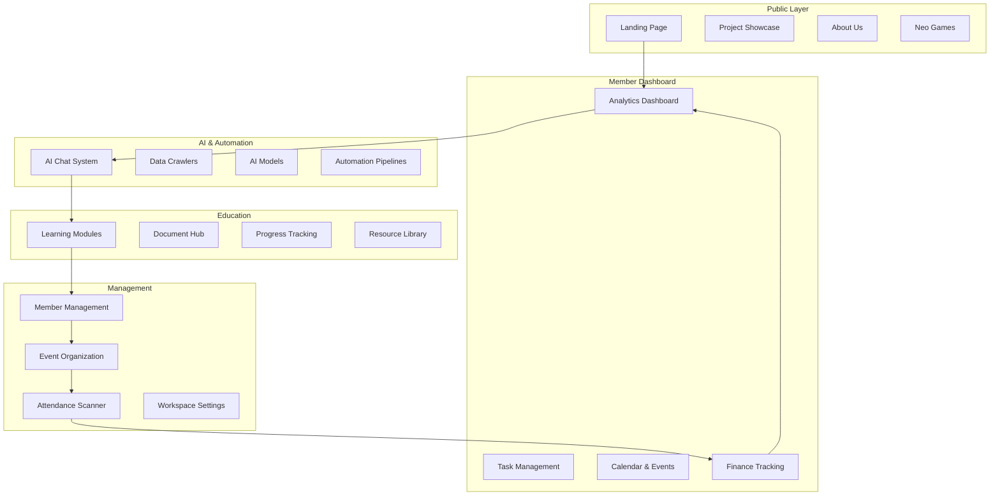

The NCT Hub platform serves as the central digital ecosystem for RMIT Neo Culture Tech, combining club management, AI-powered tools, educational resources, and project tracking into a unified experience. This platform supports both public visitors exploring our club and core team members managing operations.

## Platform Architecture

NCT Hub is built on a modern tech stack including Next.js, TypeScript, Supabase, and Turborepo, providing a scalable foundation for our growing community needs.

## Core Platform Features

### 🏢 **Club Management**

- **Member Management** – Complete user profiles, roles, and permissions system
- **Event Organization** – Meet Together scheduling and coordination tools
- **Student Scanner** – QR code-based attendance tracking for events
- **Project Showcase** – Public portfolio of club projects and achievements

### **AI & Automation**

- **AI Chat System** – Intelligent assistants for various tasks
- **Data Crawlers** – Automated content collection and processing
- **Model Management** – AI model deployment and monitoring
- **Pipeline Automation** – Workflow automation for repetitive tasks

### **Education & Learning**

- **Educational Modules** – Structured learning content and courses
- **Document Management** – Centralized document storage and sharing
- **Reading Lists** – Curated educational resources
- **Progress Tracking** – Monitor learning achievements and milestones

### **Analytics & Finance**

- **Dashboard Analytics** – Comprehensive club performance metrics
- **Financial Tracking** – Budget management and expense monitoring
- **Price Prediction** – AI-powered forecasting tools
- **Advanced Analytics** – Machine learning insights and reporting

### **Interactive Features**

- **Neo Chess** – Multiplayer chess game with AI opponents
- **Neo Crush** – Real-time multiplayer puzzle game
- **Time Tracking** – Productivity and project time management
- **Calendar Integration** – Schedule management and coordination

## How It All Fits Together

## Key Integrations

- **Supabase** – Database, authentication, and real-time features
- **GitHub** – Project repositories and version control
- **Vercel** – Deployment and hosting infrastructure
- **External APIs** – Google Calendar, email services, and more

## Next Steps

1. Explore the [Dashboard Features](/platform/features/command-center-dashboard) to understand the analytics system
2. Review [AI Integration](/platform/ai/structured-data) for automated workflows
3. Check out [Component Library](/platform/components/index) for UI patterns
4. Learn about [Workspace Routing](/platform/workspace-routing) for navigation

Ready to dive deeper? Explore our [Development Guide](/development) or check out our [Project Showcase](/projects).
