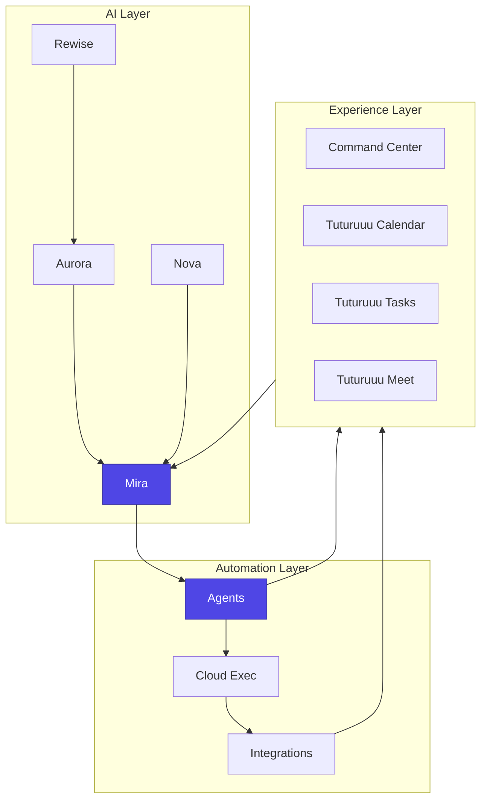

# Tuturuuu Platform Overview

The Tuturuuu platform combines proactive AI, unified applications, and automation tooling to help every visionary move from ambition to execution. Use this section to understand how each layer works and where to dive deeper.

## Explore the Platform

- **Experience Apps** – See how Tuturuuu Calendar, Tuturuuu Tasks, Tuturuuu Meet, and the Command Center Dashboard deliver daily flow. Start with the [Command Center Dashboard](/platform/features/command-center-dashboard).
- **AI & Automation** – Learn how Mira (our Jarvis), Aurora, Nova, and Rewise power intelligent workflows in the [AI Overview](/platform/ai/structured-data).
- **Shared Components** – Reuse building blocks from the [Component Library](/platform/components/overview).
- **Personalization** – Tailor the workspace using [Themes](/platform/personalization/themes) and [Language settings](/platform/personalization/language).

## How It All Fits Together

## Next Steps

1. Walk through the [Platform Features](/platform/features/command-center-dashboard) to see how the GTD-aligned dashboard works.
2. Review the [AI Structured Data guide](/platform/ai/structured-data) to understand how we interact with models.
3. Explore [Component docs](/platform/components/overview) when you need reusable UI patterns.

Looking for development workflows? Jump to the [Build](/build/overview) section. Ready to level up your skills? Explore [Learn](/learn/overview).
