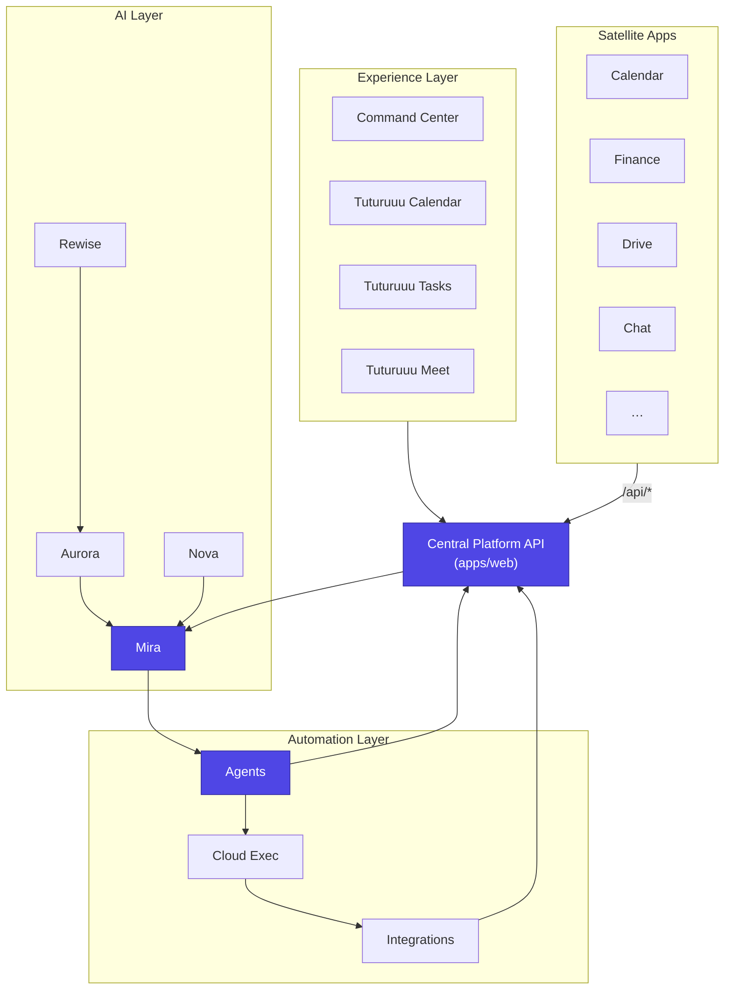

# Tuturuuu Platform Overview

The Tuturuuu platform combines proactive AI, unified applications, and automation tooling to help every visionary move from ambition to execution. Use this section to understand how each layer works and where to dive deeper.

<Note>
  Tuturuuu is mid-migration. The Next.js `apps/web` platform (port 7803) is being
  replaced by `apps/tanstack-web` (TanStack Start) plus a dedicated Rust
  `apps/backend` API. Most docs still describe the live `apps/web` shape, which
  remains valid today. See the
  [TanStack Start and Rust migration](/platform/architecture/tanstack-rust-migration)
  for the runtime contract and what moves where.
</Note>

## Explore the Platform

- **Applications** – Tuturuuu ships as a catalog of standalone web apps that each run on their own host while routing `/api/*` back to the central `apps/web` platform. Browse the [Applications catalog](/platform/applications/calendar) covering [Calendar](/platform/applications/calendar), [Finance](/platform/applications/finance), [Drive](/platform/applications/drive), [Chat](/platform/applications/chat), [CMS](/platform/applications/cms), [Inventory](/platform/applications/inventory), [Storefront](/platform/applications/storefront), and the [Apps gateway](/platform/applications/apps).
- **Experience Apps** – See how Tuturuuu Calendar, Tuturuuu Tasks, Tuturuuu Meet, and the Command Center Dashboard deliver daily flow. Start with the [Command Center Dashboard](/platform/features/command-center-dashboard).
- **AI & Automation** – Learn how Mira (our Jarvis), Aurora, Nova, and Rewise power intelligent workflows in the [AI Overview](/platform/ai/structured-data).
- **Shared Components** – Reuse building blocks from the [Component Library](/platform/components/overview).
- **Personalization** – Tailor the workspace using [Themes](/platform/personalization/themes) and [Language settings](/platform/personalization/language).

## Satellite Apps And Central API Ownership

Beyond the experience surfaces, Tuturuuu is organized as a fleet of
**satellite apps** under `apps/` — `calendar`, `finance`, `drive`, `chat`,
`cms`, `inventory`, `storefront`, and more. Each runs as its own standalone host
on its own canonical domain, but none owns its own backend: a fallback rewrite
forwards every unmatched `/api/*` request to the central `apps/web` platform, so
the main app remains the single source of truth for API routes, auth, and data
access while each satellite owns only its UI and route shell.

The [Apps gateway](/platform/applications/apps) (`apps.tuturuuu.com`) sits in
front of the routable apps as a launcher and redirect layer — it surfaces app
cards and redirects to each app's canonical domain rather than reverse-proxying
them.

## How It All Fits Together

```mermaid
graph TB
    subgraph Apps["Satellite Apps"]
        Cal["Calendar"]
        Fin["Finance"]
        Drive["Drive"]
        Chat["Chat"]
        More["…"]
    end

    subgraph Experience["Experience Layer"]
        CC["Command Center"]
        TuPlan["Tuturuuu Calendar"]
        TuDo["Tuturuuu Tasks"]
        TuMeet["Tuturuuu Meet"]
    end

    Core["Central Platform API<br/>(apps/web)"]

    subgraph AI["AI Layer"]
        Mira["Mira"]
        Aurora["Aurora"]
        Nova["Nova"]
        Rewise["Rewise"]
    end

    subgraph Auto["Automation Layer"]
        Agents["Agents"]
        Cloud["Cloud Exec"]
        Int["Integrations"]
    end

    Apps -->|/api/*| Core
    Experience --> Core
    Core --> Mira
    Mira --> Agents
    Agents --> Core
    Aurora --> Mira
    Nova --> Mira
    Rewise --> Aurora
    Agents --> Cloud
    Cloud --> Int
    Int --> Core

    style Mira fill:#4f46e5,stroke:#3730a3,color:#fff
    style Agents fill:#4f46e5,stroke:#3730a3,color:#fff
    style Core fill:#4f46e5,stroke:#3730a3,color:#fff
```

<Note>
  The AI- and automation-layer model above (Mira/Aurora/Nova/Rewise) is the
  conceptual organizing picture. In the running platform these flow through the
  central `apps/web` API alongside the satellite apps; the migration to
  `apps/tanstack-web` plus the Rust `apps/backend` is reshaping where this API
  boundary lives.
</Note>

## Next Steps

1. Walk through the [Platform Features](/platform/features/command-center-dashboard) to see how the GTD-aligned dashboard works.
2. Review the [AI Structured Data guide](/platform/ai/structured-data) to understand how we interact with models.
3. Explore [Component docs](/platform/components/overview) when you need reusable UI patterns.

Looking for development workflows? Jump to the [Build](/build/overview) section. Ready to level up your skills? Explore [Learn](/learn/overview).
